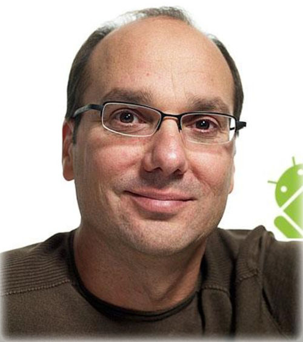
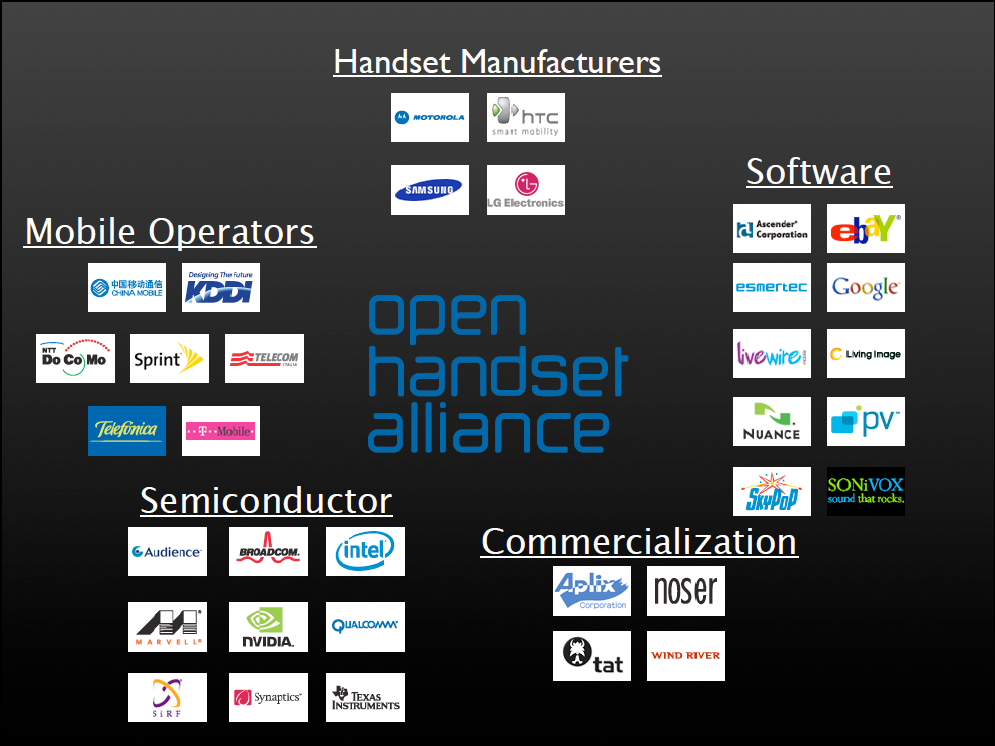
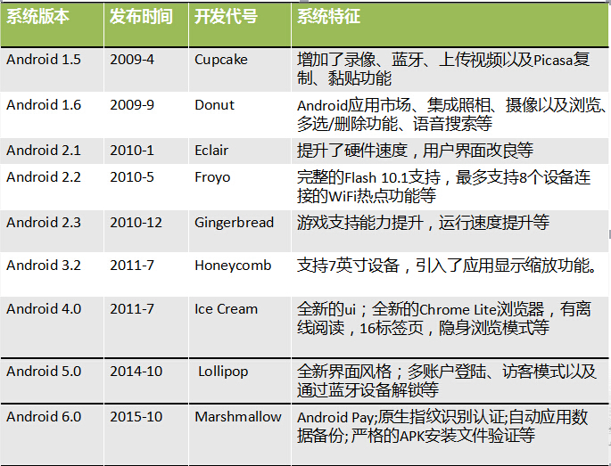

# Android的发展与历史
---
**Android系统的产生**
* 安迪鲁宾是一位硅谷著名的极客，他曾先后在苹果、General Magic、WebTV等公司工作，2000年参与创办了Danger公司。该公司生产的Hiptop(T-Mobile Sidekick)智能手机具备上网、全键盘和照相功能，2003年曾在美国风行一时。
    离开Danger之后，安迪鲁宾创办了新的公司，致力于研发手机操作系统。因为Linus Torvalds把自己写的操作系统称为Linux，安迪鲁宾的名字是Andrew（Andy为Andrew 的昵称），再加上他本身是个机器人迷，所以新公司取名叫做Android。

* 2005年7月，成立仅22个月的Android公司被急于开拓无线互联网业务的Google收购，安迪鲁宾也随 Android加入了Google,继续领导手机操作系统的开发。也就是从这个时候起，业界就开始盛传Google（Google）公司将进军移动通信市场，并推出自主品牌的移动终端产品。更有人将其与苹果公司刚刚推出的iPhone相提并论，取名为“Gphone”，而网络上关于Gphone的各种猜想图片也是满天飞。
* 在沸沸扬扬传了两年多，经过无数次的媒体报道和猜测之后，2007年11月5日Google终于公布了答案，令人意外地是并没有出现传说中的Google Phone或GPhone。Google宣布与其他33家手机制造商(包含摩托罗拉、宏达电、三星、LG)、手机芯片供货商、软硬件供货商、电信运营商(包括中国移动)联合组成开放手机联盟(Open Handset Alliance)，发布了名为Android 的开放手机软硬件平台。
* 2008年9月23日，Google与美国电信运营商T-Mobile联合在纽约正式发布第一款Google手机——T-Mobile G1。该款手机由HTC制造，内部研发代号为Dream（中文含义：梦想），是世界上第一部搭载Android操作系统的手机。

**开放手机联盟(Open Handset Alliance)**
* 开放手机联盟，Open Handset Alliance：是美国Google 公司与2007 年11 月5 日宣布组建的一个全球性的联盟组织。
* 联盟将会支持Google 发布的Android 手机操作系统或者应用软件，共同开发名为Android 的开放源代码的移动系统。
* 开放手机联盟包括手机制造商、手机芯片厂商和移动运营商几类。目前，联盟成员数量已经达到了43 家。

**Android平台架构及特性**

  Android采用分层的架构。从架构图看Android分为四个层，从高层到低层分别是应用程序层、应用程序框架层、系统运行库层和linux核心层。蓝色的代表java程序，黄色的代码为运行JAVA程序而实现的虚拟机，绿色部分为C/C++语言编写的程序库，红色的代码内核(linux内核+drvier)。

（这张图需要更换）
* **应用程序层**
*Android会同一系列核心应用程序包一起发布，该应用程序包包括email客户端，SMS短消息程序，日历，地图，浏览器，联系人管理程序等。所有的应用程序都是使用JAVA语言编写的。*
* **应用程序框架**
*开发人员也可以完全访问核心应用程序所使用的API框架。该应用程序的架构设计简化了组件的重用；任何一个应用程序都可以发布它的功能块并且任何其它的应用程序都可以使用其所发布的功能块（不过得遵循框架的安全性限制）。同样，该应用程序重用机制也使用户可以方便的替换程序组件。隐藏在每个应用后面的是一系列的服务和系统, 其中包括：*
 
* 
 *丰富而又可扩展的视图（Views），可以用来构建应用程序， 它包括列表（lists），网格（grids），文本框（text boxes），按钮（buttons）， 甚至可嵌入的web浏览器。* 

* 
*内容提供器（Content Providers）使得应用程序可以访问另一个应用程序的数据（如联系人数据库）， 或者共享它们自己的数据。*

* 
*资源管理器（Resource Manager）提供 非代码资源的访问，如本地字符串，图形，和布局文件（ layout files ）。*

* 
*通知管理器 （Notification Manager） 使得应用程序可以在状态栏中显示自定义的提示信息。*

* 
*活动管理器（ Activity Manager） 用来管理应用程序生命周期并提供常用的导航回退功能。*
* **函数库**

* 
*Bionic系统 C 库 - 一个从 BSD 继承来的标准 C 系统函数库（ libc ）， 它是专门为基于 embedded linux 的设备定制的。*

* 
*媒体库 - 基于 PacketVideo OpenCORE；该库支持多种常用的音频、视频格式回放和录制，同时支持静态图像文件。编码格式包括MPEG4, H.264, MP3, AAC, AMR, JPG, PNG 。*

* 
*Surface Manager - 对显示子系统的管理，并且为多个应用程序提 供了2D和3D图层的无缝融合。*

* 
*Webkit,LibWebCore -一个最新的web浏览器引擎用，支持Android浏览器和一个可嵌入的web视图。鼎鼎大名的 Apple Safari背后的引擎就是Webkit。*

* 
*SGL - 底层的2D图形引擎。*

* 
*3D libraries- 基于OpenGL ES 1.0 APIs实现；该库可以使用硬件 3D加速（如果可用）或者使用高度优化的3D软加速。*
* 
*FreeType -图（bitmap）和矢量（vector）字体显示。*

* 
*SQLite - 一个对于所有应用程序可用，功能强劲的轻型关系型数据库引擎。*
* **Android运行时**
*Android运行时由两部分组成：Android核心库集和ART。其中核心库集提供了Java语言核心库所能使用的绝大部分功能，而虚拟机则负责运行Android应用程序。Android5.0以前的Android运行时由Davlik虚拟机和Android核心库集组成，但由于Davlik虚拟机采用了一种被称为JIT（Just-in-time）的解释器进行动态编译并执行，因此导致Android app运行时比较慢；而ART模式则是在用户安装App时进行预编译（Ahead-of-time，简称AOT），这样使程序在运行时可以减少动态编开销，从而提什运行效率。反过来，ART也会占用更多的存储空间，应用安装和系统启动时间会延长不少。*
* **Linux内核**
*Android 的核心系统服务依赖于 Linux 2.6 内核，如安全性，内存管理，进程管理， 网络协议栈和驱动模型。*

**Android优势**
* 源代码完全开放，便于开发人员更清楚的把握实现细节，便于提高开发人员的技术水平，有利于开发出更具差异性的应用。
* 采用了对有限内存、电池和CPU优化过的虚拟机Dalvik，Android 的运行速度比想象的要快很多。
* 运营商（中国移动等）的大力支持，产业链条的热捧。
* 良好的盈利模式，产业链条的各方：运营商、制造商、独立软件生产商都可以获得不错的利益。将移动终端的评价标准从硬件向软件转变，极大的激发了软件开发者的热情。
* Android 的源代码遵循Apache v2软件许可，而不是通常的GPL v2许可,有利于商业开发。具有强大的Linux 社区的支持。

**Android平台版本的演化发展**

Android平台更新速度非常惊人，这给应用开发带来了很大的麻烦，也给硬件厂商带来很多不便。

**Android市场份额**

目前Android已经成为一个重要的手机操作系统。当前市场上常见的手机操作系统有如下这些：
* iOS:Apple公司的手机、平板操作系统，市场占有率极高。
* Windows Phone：Microsoft公司的手机操作系统，2014年发布的最新版本为Windows Phone 8.1，但局势依然不够明朗，前途依然堪忧。
* BlackBerry:即将被淘汰。
* Symbian:已经彻底被淘汰，彻底退出历史舞台

目前Android系统的市场占有率已经远超iOS,而Windows Phone作为Microsoft公司最后的赌注，自然也是全力以赴，希望至少能与iOS、Android三足鼎立，但目前局势似乎并不乐观。无论从哪个角度看，Android已经成为最主流的手机操作系统。怡发布搭载Android系统的手机厂商包括：三星、HTC、索尼爱立信、LG等；国内厂商如华为、联想、中兴、小米等也都开始发布搭载Android系统的手机。

