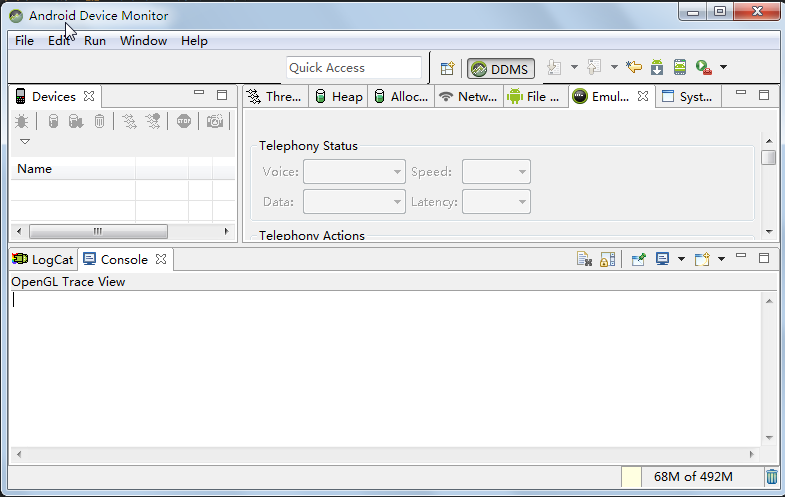

# Android常用工具的用法

---
###使用Android模拟器（Emulator）
* Android模拟器就是一个运行在电脑上的“虚拟手机”。在Android SDK 和AVD管理器中选择指定的AVD设备，然后单击Start按钮就是启动模拟器来运行Android系统。
* 在Android SDK安装目录的tools子目录下有一个emulator.exe（另外还有emulator-arm.exe、emulator-mips.exe、mulator-x86.exe）,它们都是Android模拟器。
* [创建新的AVD](chapter1/section2)
* 可以使用第三方模拟器：Genymotion。
###使用Monitor进行调试
* DDMS 的全称是Dalvik Debug Monitor Service，它为我们提供例如：为测试设备截屏，针对特定的进程查看正在运行的线程以及堆信息、Logcat、广播状态信息、模拟电话呼叫、接收 SMS、虚拟地理坐标等等

* 在Android Studio中启动DDMS:点击菜单栏Tools->Android->Android Device Monitor

 ####设备面板
  Monitor窗口左上角的面板，会列出当前所有运行的手机（包括真机和模拟器），并列出各手机内的所有进程信息。如果需要查看指定手机或指定进程信息，则应先在面板内选中指定手机或进程。
 ####信息输出面板
  该面板位于Monitor窗口的下方，相当于传统Java应用控制台，因此非常重要。
 ####线程跟踪面板
 该面板可用于查看指定进程内所有正在执行的线程状态。如果需要让该面板显示指定进程内线程的状态，则应保证下面两步：1.在设备面板上选中需要查看的进程；2.在设备面板上单击“Update Threads”按钮。
 ####Heap内存跟踪面板
 查看指定进程内堆内存的分配和回收信息。如果需要让该面板显示指定进程内Heap的回收和分配状态，则应保证下面两步：1.在设备面板上选中需要查看的进程；2.在设备面板上单击“Update Heap”按钮。
 ####模拟器控制面板
 通过这个面板的一些功能可以非常容易的使测试终端模拟真实手机所具备的一些交互功能，比如：接听电话，根据选项模拟各种不同网络情况，模拟接受 SMS消息和发送虚拟地址坐标用于测试GPS功能等。
 ####文件管理器面板
 查看Android设备所包含的文件，也可用于将Android设备的文件导出到电脑上。
 
 实际上，Android Studio 已经将Monitor集成进来。
 
 

###Android Debug Bridge(ADB)的用法
Android Debug Bridge（ADB）是一个功能非常强大的工具，位于Android SDK安装目录的platform-tools子目录下，既可完成电脑与模拟器文件的相互复制，也可安装APK，甚至直接切换到Android系统中执行Linux命令。功能举例：
* 查看当前运行的模拟器 adb –devices
* 电脑与模拟器文件相互复制 
adb push d:/abc.txt /sdcard    adb pull /sdcard/xyz.txt d:/
* 启动模拟器的shell窗口 adb shell
* 安装、卸载APK程序
 * adb install [-r] [-s] <file>   -r表示重新安装该apk包，-s表示将apk安装到SD卡
 * adb uninstall [-k] <package> -k表示只删除应用程序，保留数据和缓存目录

###使用mksdcard管理虚拟SD卡
在创建AVD设备时可创建一个虚拟SD卡，实际上还可通过mksdcard命令来单独创建一个虚拟存储卡，语法格式：
* mksdcard [-l label] <size> <file>，size指定虚拟SD卡大小，file指定虚拟SD卡的文件镜像，例mksdcard 64M D:\avds\.android\avd\abc.avd\sdcard.img

