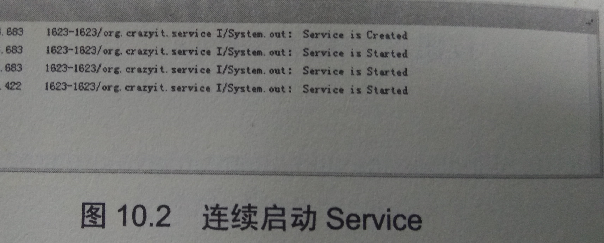
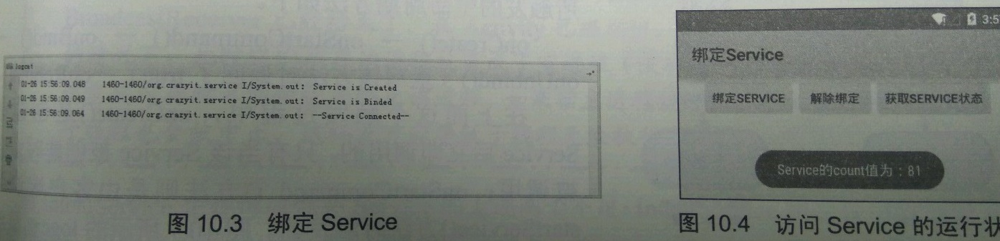
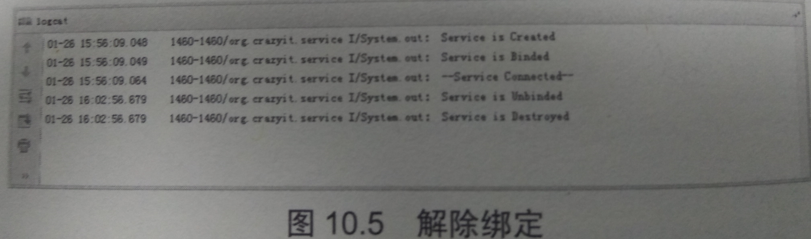
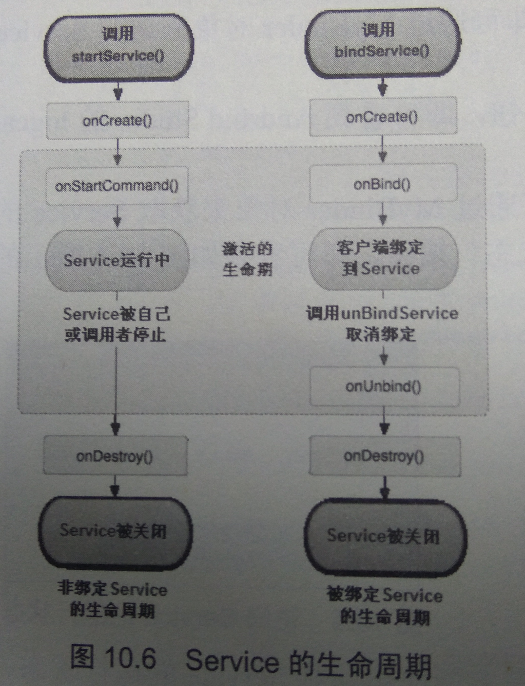
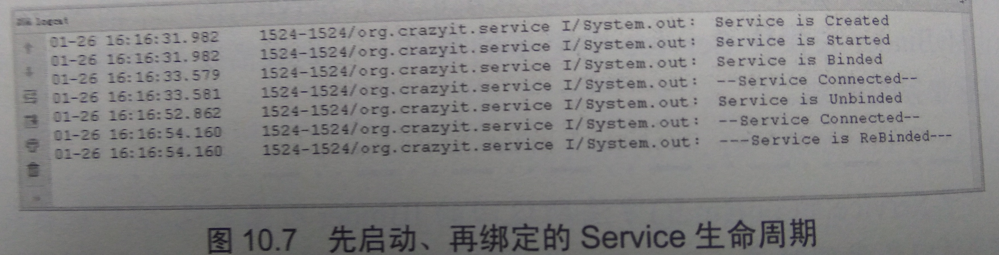

# 10.1 Service简介
　　Service组件也是可执行的程序，它也有自己的生命周期。创建、配置Service与创建、配置Activity的过程基本相似，下面介绍Android Service的开发。
## 10.1.1 创建、配置Service
　　就像开发Activity需要两个步骤：①开发Activity子类；②在AndroidManifest.xml文件中配置Activity。开发Service也需要两个步骤。  
　　1. 定义一个继承Service的子类。  
　　2. 在AndroidManifest.xml文件中配置该Service。  
　　Service与Activity还有一点相似之处，他们都是从Context派生出来的，因此他们都可调用Context里定义的如getResource()、getContextResolver()等方法。  
　　与Activity相似的是，Service中定义了一系列生命周期方法，如下所示。  

* IBinder onBind(intent intent):该方法是Service子类必须实现的方法。该方法返回一个Ibinder对象，应用程序可通过该对象与Service组件通信。
* void onCreate():当该Service第一次被创建后将立即回调该方法。
* void onDestroy():当该Service被关闭值钱将会回调该方法。
* void onStartCommand():该方法的早期版本是void onStart(intent Intent,int startld),每次客户端调用startService(Intent)方法启动该Service时都会回调该方法.
* boolean onUnbind(Intent intent):当该Service上绑定的所有客户端都断开连接时将会回调该方法.  
下面的类定义了第一个Service组件. 
程序清单 :`codes\10\10.1\FirstService\src\org\crazyit\service\FirstService.java` 
 
```java
package org.crazyit.service;
import android.app.Service;
import android.content.Intent;
import android.os.IBinder;

public class FirstService extends Service
{
	// 必须实现的方法
	@Override
	public IBinder onBind(Intent arg0)
	{
		return null;
	}
	// Service被创建时回调该方法
	@Override
	public void onCreate()
	{
		super.onCreate();
		System.out.println("Service is Created");
	}
	// Service被启动时回调该方法
	@Override
	public int onStartCommand(Intent intent, int flags, int startId)
	{
		System.out.println("Service is Started");
		return START_STICKY;
	}
	// Service被关闭之前回调
	@Override
	public void onDestroy()
	{
		super.onDestroy();
		System.out.println("Service is Destroyed");
	}
}
```
上面这个Service什么也没干——它只是重写了Service组件的onCreat()、onStartCommand()、onDestroy()、onbind()等方法，重写这些方法时只是简单地输出了一条字符串。
> 虽然这个Service什么都没干，但时间上它是Service组件的框架，如果希望Service组件做某些事情，那么只要在onCreate()或onstartCommand()方法中定义相关业务即可。  

　　定义了上面的Service之后，接下来需要在AndroidManifest.xml文件中配置该Service，配置Service使用<service.../>元素。与配置Activity相似的是，配置Service时也可为<service.../>元素配置<intent-filter.../>子元素，用于说明该Service可被哪些Intent启动。  
　　在AndroidManifest.xml文件中增加如下配置片段来配置该Service：  
  
``` xml
<!--配置一个Service组件-->
<service android:name=".FirstService">
    <intent-filter>
        <!--为该Service组件的intent-filter配置action -->
        <action android:name="org.crazyit.service.FIRST_SERVICE"/>
    </intent-filter>
</service> 
``` 
　　从上面的配置片段不难看出，配置Service与配置Activity的差别并不大，只是配置Service使用<service.../>元素，而且无须指定android：label属性——因为Service没有界面，总是位于后台运行，为该Service指定标签没有太大的意义。  
　　当该Service开发完成之后，接下来就可在程序中运行该Service了，Android系统中运行Service有如下两种方式。  

* 通过Context的startService()方法：通过该方法启用Service，访问者与Service之间没有关联，即使访问者退出了，Service仍然运行。
* 通过Context的bindService()方法：使用该方法启用Service，访问者与Service绑定在了一起，访问者一旦退出，Service也就终止。  
下面先示范的第一种方式运行Service。 
 
## 10.1.2 启动和停止Service
　　下面的程序使用Activity作为Service的访问者，该Activity的界面中包含两个按钮，一个按钮用于启动Service，一个按钮用与于关闭Service。  
　　该ACtivity的代码如下。
　　　　程序清单：`codes\10\10.1\FirstService\src\org\crazyit\service\StartServiceTest.java ` 
```java
public class StartServiceTest extends Activity
{
	Button start, stop;
	@Override
	public void onCreate(Bundle savedInstanceState)
	{
		super.onCreate(savedInstanceState);
		setContentView(R.layout.main);
		// 获取程序界面中的start、stop两个按钮
		start = (Button) findViewById(R.id.start);
		stop = (Button) findViewById(R.id.stop);
		// 创建启动Service的Intent
		final Intent intent = new Intent(this , FirstService.class);
		start.setOnClickListener(new OnClickListener()
		{
			@Override
			public void onClick(View arg0)
			{
				// 启动指定Service
				startService(intent);    //标号1
			}
		});
		stop.setOnClickListener(new OnClickListener()
		{
			@Override
			public void onClick(View arg0)
			{
				// 停止指定Service
				stopService(intent);   //标号2
			}
		});
	}
}
```
　　从上面程序的标号代码不难看出，启动、关闭Service十分简单，调用Context里定义startService()、stopService()方法即可启动、关闭Service。  
　　运行该程序，通过程序界面先启动Service、在关闭Service将可以在DDMS的logCat面板看到如图10.1所示的输出。  

 　　如果在不关闭Service的情况下，连续三次单击“启动Service”按钮，程序将会连续三次启动Service，此时DDMS的logCat面板可看到如图10.2所示的输出。  

　　从图10.2可以看出，每当Service被创建时会回调onCreate方法，每次Service被启动时都会回调onStart方法，——多次启动一个已有的Service组件将不会再回调onCreate方法，但每次启动时都会回调onStartCommand()方法。  
## 10.1.3 绑定本地Service并与之通信
　　当程序通过startService()和stopService()启动、关闭Service时，Service与访问者之间基本上不存在太多的关联，因此Service和访问者之间也无法进行通信、数据交换。  
　　如果Service和访问者之间需要进行方法调用或数据交换，则应该使用bindService()和unbindService()方法启动、关闭Service。  
　　Context的bindService()方法的完整方法签名为：bindService(Intent Service,ServiceConnection conn,int flags),该方法的三个参数的解释如下。  

* service :该参数通过Intent指定要启动的Service。
* conn：该参数是一个ServiceConnection对象，该对象用于监听访问者与Service之间的连接轻卡un个。当访问者与Service之间连接成功时将回调该ServiceConnection对象的onServiceConnected(ComponentName name ,Ibinder Service)方法；当Service所在的宿主进程由于异常终止或由于其他原因终止，导致该Service与访问者之间断开连接时回调该ServiceConnection对象的onServiceDisconnected(ComponentName name)方法。  
> 注意：当调用者主动通过unBindService()方法断开与Service的连接时，ServiceConnnection对象的onServiceDisconnected(ComponentName name) 方法并不会被调用。  

* flags：指定绑定时是否自动创建Service（如果Service还未创建）。该参数可指定为0（不自动穿件）或BIND_AUTO_CREATE（自动创建）。  


　　注意到ServiceConnection对象的onServiceDisconnected方法中有一个IBinder对象，该对象即可实现被绑定Service之间的通信。  
　　当开发S而vice类时，该Service类必须提供一个IBinder onBind(Intent intent) 方法，在绑定本地Service的情况下，onBind(Intent intent)方法返回的IBinder Service方法的Service参数，这样就可通过该IBinder对象与Service进行通信。  
　　实际上开发通常会采用继承Binder（IBinder的实现类）的方法实现自己的IBinder对象。  
下面的程序示范了如何在Activity中绑定本地Service，并获取Service的运行状态。该程序的Service类需要“真正”实现onBind()方法，并让该方法返回一个有效的IBinder对象，该Service类的代码如下。  
　　　　程序清单：codes\10]10.1\BindService\src\org\crazyit\service\BinService.java  


```java
public class BindService extends Service
{
	private int count;
	private boolean quit;
	// 定义onBinder方法所返回的对象
	private MyBinder binder = new MyBinder();
	// 通过继承Binder来实现IBinder类
	public class MyBinder extends Binder  // ①
	{
		public int getCount()
		{
			// 获取Service的运行状态：count
			return count;
		}
	}
	// 必须实现的方法，绑定该Service时回调该方法
	@Override
	public IBinder onBind(Intent intent)    			//标记1
	{
		System.out.println("Service is Binded");		//标记2
		// 返回IBinder对象
		return binder;								//标记3
	}
	// Service被创建时回调该方法
	@Override
	public void onCreate()
	{
		super.onCreate();
		System.out.println("Service is Created");
		// 启动一条线程，动态地修改count状态值
		new Thread()
		{
			@Override
			public void run()
			{
				while (!quit)
				{
					try
					{
						Thread.sleep(1000);
					}
					catch (InterruptedException e)
					{
					}
					count++;
				}
			}
		}.start();
	}
	// Service被断开连接时回调该方法
	@Override
	public boolean onUnbind(Intent intent)
	{
		System.out.println("Service is Unbinded");
		return true;
	}
	// Service被关闭之前回调该方法
	@Override
	public void onDestroy()
	{
		super.onDestroy();
		this.quit = true;
		System.out.println("Service is Destroyed");
	}
}
```
　　上面Service类的标记代码实现了onBind()方法，该方法返回了一个可访问该Service状态数据（count值）的IBinder对象，该对象将被传给Service的访问者。  
　　上面程序的①号代码通过继承IBinder类实现了一个IBinder对象，这个MyBinder类是Service的内部类，这对于绑定本地Service并与之通信的场景是一种常见的情形。　　
  接下来定义一个Activity来绑定该Service，并在该Activity中通过MyBinder对象访问Service的内部状态。该Activity的界面上包含三个按钮，第一个按钮用于绑定Service，第二个按钮用于解除绑定；第三个按钮则用于获取Service的运行状态。该Activity的代码如下。  
　　　　程序清单：codes\10\10.1\BindService\src\org\crazyit\service\BindService\BindServiceTect.java  
```java
 public class BindServiceTest extends Activity
{
	Button bind, unbind, getServiceStatus;
	// 保持所启动的Service的IBinder对象
	BindService.MyBinder binder;
	// 定义一个ServiceConnection对象
	private ServiceConnection conn = new ServiceConnection()
	{
		// 当该Activity与Service连接成功时回调该方法
		@Override
		public void onServiceConnected(ComponentName name
				, IBinder service)
		{
			System.out.println("--Service Connected--");
			// 获取Service的onBind方法所返回的MyBinder对象
			binder = (BindService.MyBinder) service;  // ①
		}
		// 当该Activity与Service断开连接时回调该方法
		@Override
		public void onServiceDisconnected(ComponentName name)
		{
			System.out.println("--Service Disconnected--");
		}
	};
	@Override
	public void onCreate(Bundle savedInstanceState)
	{
		super.onCreate(savedInstanceState);
		setContentView(R.layout.main);
		// 获取程序界面中的start、stop、getServiceStatus按钮
		bind = (Button) findViewById(R.id.bind);
		unbind = (Button) findViewById(R.id.unbind);
		getServiceStatus = (Button) findViewById(R.id.getServiceStatus);
		// 创建启动Service的Intent
		final Intent intent = new Intent(this, BindService.class);
		bind.setOnClickListener(new OnClickListener()
		{
			@Override
			public void onClick(View source)
			{
				// 绑定指定Service
				bindService(intent, conn, Service.BIND_AUTO_CREATE);
			}
		});
		unbind.setOnClickListener(new OnClickListener()
		{
			@Override
			public void onClick(View source)
			{
				// 解除绑定Service
				unbindService(conn);
			}
		});
		getServiceStatus.setOnClickListener(new OnClickListener()
		{
			@Override
			public void onClick(View source)
			{
				// 获取、并显示Service的count值
				Toast.makeText(MainActivity.this,
						"Service的count值为：" + binder.getCount(),
						Toast.LENGTH_SHORT).show();  // ②
			}
		});
	}
}
```
　　上面的程序中①号代码用于在该Activity与Service连接成功时获取Service的onBind()方法所返回的MyBinder对象；程序的②号代码即可通过MyBinder对象来访问Service的运行状态了。  
  　　运行该程序，单击程序界面中“绑定Servcice”按钮，即可看到DDMS的logCat有如图10.3所示的输出。  

 　　在该Activity中绑定该Service之后，该Activity还可通过MyBinder对象来获取Service的运行状态，如果用户单击程序界面上的“获取Service状态”按钮即可看到如图10.4所示的输出。  
　　从10.4所示的输出可以看到，该Activity可以非常方便地访问到Service的运行状态。虽然本程序只是一个简单的示例，该Activity只是访问了Service 的一个简答count值，但实际上完全让MyBinder去操作Service中更多的数据——到底需要访问Service的多少数据，完全取决于实际业务的需要。  
> 提示： 对于Service的onBind()方法所返回的IBinder对象来说，它可被当成该Service组件所返回的代理对象，Service允许客户端通过该IBinder对象来访问Service内部的数据，这样即可实现客户端与Service之间的通信。  
　　如果我们单击程序界面的“解除绑定”按钮，即可在DDMS的logCat中看到如图10.5所示的输出。  


 　　正如10.5所示，当程序调用unbindService()方法解除对某个Service的绑定时，系统会先回调该Service的onUnbind()方法，然后再回调onDestroy()方法。  
　　与多次调用StartService()方法启动Service不同的是，多次调用bindService()方法并不会执行重复绑定。对于前一个示例程序，用户每单击“启动Service”按钮一次，系统就会回调Service的onStartCommand()方法一次;对于这个示例程序，不管用户的单击“绑定Service”多少次，系统只会回调Service的onBind()方法一次。
##10.1.4 Service 的生命周期
　　通过前面两个示例，读者应该已经大致明白Service的生命周期了。随着应用程序启动Service方式的不同，Service的生命周期也略有差异。  
　　如果应用程序通过startService()方法来启动Service，Service的生命周期如图10.6左边所示。  
　　如果应用程序通过bindService()方法来启动Service，Service的生命周期如图10.6右边所示。  

　　Service生命周期还有一种特殊的情形，如果Service已由某个客户端通过startService()方法启动了，接下来其他客户端再调用bindService()方法来绑定该Service后，再调用unbindService()方法解除绑定，最后又调用了bindService()方法再次绑定到Service，这个过程所触发的生命周期方法如下。  
　　onCreate()->onStartCommand()->onBind()->onUnbind() [重写该方法时返回了 true] ->onRebind()  
   在上面这个触发过程中，onCreate()是创建该Service后立即调用的，只有当该Service被创建时才会被调用；onStartCommand()方法则由客户端调用startService()方法时触发的。图10.7的logCat显示了上面的生命周期的输出。


> 注意： 在图10.7所示的输出中，可以看到Service的onRebind()方法被回调了。如果希望该方法被回调，除了需要该Service是由Activity的startService()方法启动之外，还需要Service子类重写onUnbind()方法时返回true。  

　　在图10.7所示的输出效果中，并没有发现Service回调onDestroy()方法，这是因为该Service并不是由Activity通过bindService()方法来启动的(该Service事先已由Activity通过startService()方法启动了)，因此当Activity调用unBindService()方法取消与该Service的绑定时，该Service也不会终止。  
　　由此可见，当Activity调用bindService()绑定一个已启动的Service时，系统只是把Service内部IBinder对象传给Activity，并不会把该Service生命周期完全“绑定”到该Activity，因为当Activity调用unBindService()方法取消与该Service的绑定时，也只是切断该Activity与Service之间的关联，并不能停止该Service组件。
##10.1.5 使用IntentService
　　IntentService是Service的子类，因此它不是普通的Service，它比普通Service增加了额外的功能。  
　　先看Service本身存在的两个问题：  

* Service不会专门启动一条单独的进程，Service与它所在应用位于同一进程中。  
* Service也不是专门一条新的进程，因此不应该在Service中直接处理耗时的任务。  
> 提示：如果开发者需要在Service处理耗时任务，建议在Service中另外启动一条新线程处理该耗时任务。就像前面BindService中看到的，程序在BindService中的onCreate()方法中启动了一条新线程来处理耗时任务。可能有读者感到疑惑：直接在其他程序组件中启动子线程来处理耗时任务不行吗？这种方式也不可靠，由于Activity可能会被用户退出。

　　BroadcastReceiver的生命周期本身就很短。可能出现的情况是：在子线程还没有结束的情况下，Activity已经被用户退出了，或者BroadcastReceiver已经结束了。在Activity已经退出，BroadcastReceiver已经结束的情况下，此时它们所在的进程就变成了空进程（没有任何活动组件的进程），系统需要每寸时可能会有限终止该进程。如果宿主进程被终止，那么该进程内的所有子进程也会被终止，这样就可能导致子线程无法执行完成。  


　　而IntentService正好可以弥补Service的上述两个不足：IntentService将会使用队列来管理请求Intent,每当客户端代码通过Intent请求启动IntentService时，IntentService会将该Intent加入队列中，然后开启一条新的worker线程来处理该Intent。对于异步的startService()请求，IntentService会按次序依次处理队列中的Intent，该线程保证同一时刻只处理一个Intent.由于IntentService使用新的worker线程处理Intent请求，因此IntentService不会阻塞主进程，所以IntentService自己就可以处理耗时任务。  
　　归纳起来，IntentService具有如下特征：  

* IntentService会创建单独的worker来处理onHandleIntent()方法实现的代码，因此开发者无须处理多线程问题。
* 当所有请求处理完成后，IntentService会自动停止，因此开发者无须调用stopSelf()方法来停止该Service。
* 为Service的onBind()方法提供了默认实现，默认实现的onBind()方法返回null。
* 为Service的onStartCommand()方法提供了默认实现，该实现会将请求Intent添加到队列中。

　　从上面的介绍可以看出，扩展IntentService实现Service无须重写onBind()、onStartCommand()方法，只要重写onHandleIntent()方法即可。  
　　下面的示例中的界面中包含了两个按钮，两个按钮分别启动普通Service和IntentService，两个Service都需要处理耗时任务。该程序的界面布局代码很简单，主程序Activity代码如下。  
　　　　程序清单： codes\10\10.1\IntentServiceTest\src\org\crazyit\service\IntentServiceTest.java  
```java	
public class IntentServiceTest extends Activity
{
	@Override
	public void onCreate(Bundle savedInstanceState)
	{
		super.onCreate(savedInstanceState);
		setContentView(R.layout.main);
	}
	public void startService(View source)
	{
		// 创建需要启动的Service的Intent
		Intent intent = new Intent(this, MyService.class);  //标记1
		// 启动Service
		startService(intent);
	}
	public void startIntentService(View source)
	{
		// 创建需要启动的IntentService的Intent
		Intent intent = new Intent(this, MyIntentService.class);   //标记2
		// 启动IntentService
		startService(intent);
	}
}
```
　　上面Activity的两个时间处理方法中分别启动MyService和MyIntentService，其中MyService是继承Service的子类，而MyIntentService则是继承IntentService的子类。  
　　下面是MyService类的代码。  
　　　　程序清单：codes\10\10.1\IntentServiceTest\src\org\crazyit\service\MyService.java
```java
public class MyService extends Service
{
	@Override
	public IBinder onBind(Intent intent)
	{
		return null;
	}
	@Override
	public int onStartCommand(Intent intent, int flags, int startId)
	{
		// 该方法内执行耗时任务可能导致ANR（Application Not Responding）异常
		long endTime = System.currentTimeMillis() + 20 * 1000;
		System.out.println("onStart");
		while (System.currentTimeMillis() < endTime)
		{
			synchronized (this)
			{
				try
				{
					wait(endTime - System.currentTimeMillis());
				}
				catch (Exception e)
				{
				}
			}
		}
		System.out.println("---耗时任务执行完成---");
		return START_STICKY;
	}
}
```
 　上面MyService在onStartCommand()方法中使用线程暂停的方式来模拟了耗时任务，该线程暂停了20秒，相当于该耗时任务需要执行20秒。由于普通Service的执行会阻塞主线程，因此启动该线程将会导致程序出现ANR异常。  
　　下面是MyIntentService类的代码。
　　　　程序清单：codes\10\10.1\IntentServiceTest\src\org\crazyit\service\MyIntentService.java
```java
public class MyIntentService extends IntentService
{
	public MyIntentService()
	{
		super("MyIntentService");
	}
	// IntentService会使用单独的线程来执行该方法的代码
	@Override
	protected void onHandleIntent(Intent intent)
	{
		// 该方法内可以执行任何耗时任务，比如下载文件等，此处只是让线程暂停20秒
		long endTime = System.currentTimeMillis() + 20 * 1000;
		System.out.println("onStartCommand");
		while (System.currentTimeMillis() < endTime)
		{
			synchronized (this)
			{
				try
				{
					wait(endTime - System.currentTimeMillis());
				}
				catch (Exception e)
				{
				}
			}
		}
		System.out.println("---耗时任务执行完成---");
	}
}
```
 　　从上面的代码可以看出，MyIntentService继承了IntentService，并不需要实现onBind()、onStartCommand()方法，只要实现onHandleIntent()方法即可，在该方法中即可定义该Service需要完成的任务。本示例的onHandleIntent()方法也用线程暂停的方式来模拟了耗时任务，线程同样暂停了20秒。但由于IntentService会使用单独的线程来完成耗时任务，因此启动MyIntentService不会阻塞前台线程。  
　　运行该实例，如果单击界面上的“启动普通Service”按钮，将会激发startService()方法，该方法将会启动MyService去执行耗时任务，此时将会导致程序UI线程被阻塞，而且由于阻塞时间太长，因此程序将会看到如图10.8所示的ANR异常。  
　　相反，如果调用“启动IntentService”来启动MyIntentService，虽然MyIntentService也需要执行耗时任务，但由于MyIntentService会使用单独的worker线程，因此MyIntentService不会阻塞前台的UI线程，因此程序界面不会失去响应。
