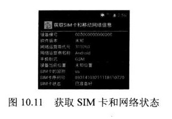
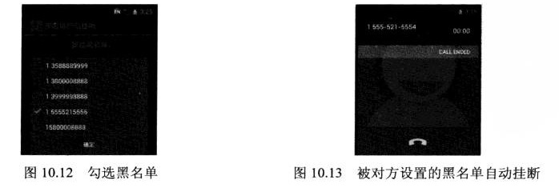

# 10.3电话管理器（TelephonyManager）
　　TelephonyManager是一个管理手机通话状态，电话网络信息的服务类，该类提供了大量的getXxx()方法来获取电话网络的相关信息。  

　　在程序中获取TelephonyManager十分简单，只要调用如下代码即可：  
`TelephonyManager tManager=
(TelephonyManager)getSystemService(Context.TELEPHONY_SERVICE)`
　　接下来就可以通过TelephonyManager获取相关信息或者进行相关操作了。

### 实例：获取网络和SIM卡信息
　　通过TelephonyManager提供的系列方法即可获取手机网络，SIM卡的相关信息，该程序使用了一个ListView来显示网路和SIM卡的相关信息。
　　改程序代码如下。
　　　　**程序清单：codes\10\10.3\TelephonyStatus\src\org\crazyit\manager\TelephonyStatus.java**

```java
public class TelephonyManager extends Activity
{
	ListView showView;
	// 声明代表状态名的数组
	String[] statusNames;
	// 声明代表手机状态的集合
	ArrayList<String> statusValues = new ArrayList<>();
	@Override
	public void onCreate(Bundle savedInstanceState)
	{
		super.onCreate(savedInstanceState);
		setContentView(R.layout.main);
		// 获取系统的TelephonyManager对象
		TelephonyManager tManager = (TelephonyManager)
			getSystemService(Context.TELEPHONY_SERVICE);
		// 获取各种状态名称的数组
		statusNames = getResources().getStringArray(R.array.statusNames);
		// 获取代表SIM卡状态的数组
		String[] simState = getResources()
				.getStringArray(R.array.simState);
		// 获取代表电话网络类型的数组
		String[] phoneType = getResources().getStringArray(
				R.array.phoneType);
		// 获取设备编号
		statusValues.add(tManager.getDeviceId());
		// 获取系统平台的版本
		statusValues.add(tManager.getDeviceSoftwareVersion()
				!= null ? tManager.getDeviceSoftwareVersion() : "未知");
		// 获取网络运营商代号
		statusValues.add(tManager.getNetworkOperator());
		// 获取网络运营商名称
		statusValues.add(tManager.getNetworkOperatorName());
		// 获取手机网络类型
		statusValues.add(phoneType[tManager.getPhoneType()]);
		// 获取设备所在位置
		statusValues.add(tManager.getCellLocation() != null ? tManager
				.getCellLocation().toString() : "未知位置");
		// 获取SIM卡的国别
		statusValues.add(tManager.getSimCountryIso());
		// 获取SIM卡序列号
		statusValues.add(tManager.getSimSerialNumber());
		// 获取SIM卡状态
		statusValues.add(simState[tManager.getSimState()]);
		// 获得ListView对象
		showView = (ListView) findViewById(R.id.show);
		ArrayList<Map<String, String>> status = new ArrayList<>();
		// 遍历statusValues集合，将statusNames、statusValues
		// 的数据封装到List<Map<String , String>>集合中
		for (int i = 0; i < statusValues.size(); i++)
		{
			HashMap<String, String> map = new HashMap<>();
			map.put("name", statusNames[i]);
			map.put("value", statusValues.get(i));
			status.add(map);
		}
		// 使用SimpleAdapter封装List数据
		SimpleAdapter adapter = new SimpleAdapter(this, status,
			R.layout.line, new String[] { "name", "value" }
			, new int[] { R.id.name, R.id.value });
		// 为ListView设置Adapter
		showView.setAdapter(adapter);
	}
}
```

　　运行该程序，可以看到程序有如图10.11所示的输出。

　　TelephonyManager除了提供系列的getXxx()方法来获取网络状态和SIM卡信息之外，还提供了一个listen（PhoneStateListener listener，int events）方法来监听通话状态。下面通过该方法来监听手机来电信息。
### 实例：监听手机来电
　　下面的程序监听TelephonyManager的通话状态来监听手机的所有来电,改程序代码如下。
　　　　**程序清单：codes\10\10.3\MonitorPhone\src\org\crazyit\manager\MonitorPhone.java**

```java
public class MonitorPhone extends Activity
{
	TelephonyManager tManager;
	@Override
	public void onCreate(Bundle savedInstanceState)
	{
		super.onCreate(savedInstanceState);
		setContentView(R.layout.main);
		// 取得TelephonyManager对象
		tManager = (TelephonyManager)    //标记
				getSystemService(Context.TELEPHONY_SERVICE);
		// 创建一个通话状态监听器
		PhoneStateListener listener = new PhoneStateListener()
		{
			@Override
			public void onCallStateChanged(int state, String number)
			{
				switch (state)
				{
					// 无任何状态
					case TelephonyManager.CALL_STATE_IDLE:
						break;
					case TelephonyManager.CALL_STATE_OFFHOOK:
						break;
					// 来电铃响时
					case TelephonyManager.CALL_STATE_RINGING:
						OutputStream os = null;
						try   //标记
						{
							os = openFileOutput("phoneList", MODE_APPEND);
						}
						catch (FileNotFoundException e)
						{
							e.printStackTrace();
						}
						PrintStream ps = new PrintStream(os);
						// 将来电号码记录到文件中
						ps.println(new Date() + " 来电：" + number);
						ps.close();
						break;
					default:
						break;
				}
				super.onCallStateChanged(state, number);
			}
		};
		// 监听电话通话状态的改变
		tManager.listen(listener, PhoneStateListener.LISTEN_CALL_STATE);
	}
}
```
　　上面的程序中首先创建了一个PhoneStateListener，它是一个通话状态监听器，该监听器可用于对TelephonyManager进行监听。当手机来电铃响时，程序将会把来电号码记录到文件中，如上面的标记代码所示。

　　运行上面的程序，在保证改程序运行的状态下，启动领一个模拟器呼叫该电话。接下来就可以在DDMS的File Explorer面板的data\data\org.crazyit.manager\files目录下看到一个phoneList文件，将该文件导出到计算机上，查看该文件内容即可看到如下内容：
  Sun Nov 11 15：19：38 GMT 2012 来电：15555215556

　　从上面文件内容可以看出，改程序记录了来自领一个模拟器的电话呼入。

　　如果我们把这段代码放在后台执行的Service中运行，并且设置Service组件随着系统开机自动运行，那么这种监听就可以“神不知鬼不觉”了。本章后面会介绍如何让Service随系统开机自动运行。

　　需要指出的是，由于该程序需要获取手机的童话状态，因此必须在AndroidManifest.xml文件中增加如下配置代码：
```xml
<!--授予该应用读取通话状态的权限-->
<uses-permission android:name="androidpermission.READ_PHONE_STATE"/>
```

### 实例：黑名单来电自动挂断
　　本实例允许用户动态加载手机通信录中的电话号码，勾选某些号码作为黑名单，一旦将某些号码设为黑名单，当该号码呼入时，系统会自动挂断该号码。

　　与前一个实例相似的是，程序同样也是监听TelephonyManager的童话状态来实现该功能，当系统检测到电话呼入时，立即判断该号码是否在黑名单中，如果该号码在黑名单中立即挂断该号码即可。

　　不幸的是，Android没有对外公开挂断电话的API，如果需要挂断电话，必须使用AIDL与电话管理Service进行通信，并调用服务中的API实现结束通话。

　　为了调用远程的AIDL Service，开发者需要将Android源代码中如下两个文件复制到项目的相应位置：

* com.androiod.internal.telephony包下的ITelephony.aidl。
* Android.telephony包下的NeighboringCellnfo.aidl。

　　开发者需要在项目中建立对应的包，然后将这两个文件复制到响应的包下。一旦将这两个*.aidl文件复制到项目的src目录ud相应的包下，ADT会在根目录下自动生成ITelephony.java源文件。

　　接下来就可以在程序中调用ITelephony的endCall方法来挂断电话了。

　　本程序还调用了系统联系人的ContentProvider来获取系统联系人信息，获取系统联系人信息之后，程序提供了一个带复选框的列表供用户勾选黑名单。

　　该程序的界面很简单，只是提供了一个按钮让用户打开列表对话框来勾选黑名单，故不再给出界面布局文件。该程序代码如下。
　　　　**程序清单：codes\10\10.3\BlockList\src\org\crazyit\manager\BlockMain.java**

```java
public class BlockMain extends Activity
{
	// 记录黑名单的List
	ArrayList<String> blockList = new ArrayList<>();
	TelephonyManager tManager;
	// 监听通话状态的监听器
	CustomPhoneCallListener cpListener;
	public class CustomPhoneCallListener extends PhoneStateListener
	{
		@Override
		public void onCallStateChanged(int state, String number)
		{
			switch (state)
			{
				case TelephonyManager.CALL_STATE_IDLE:
					break;
				case TelephonyManager.CALL_STATE_OFFHOOK:
					break;
				// 当电话呼入时
				case TelephonyManager.CALL_STATE_RINGING:
					// 如果该号码属于黑名单
					if (isBlock(number))
					{
						try
						{
							Method method = Class.forName(
									"android.os.ServiceManager")
									.getMethod("getService"
											, String.class);
							// 获取远程TELEPHONY_SERVICE的IBinder对象的代理
							IBinder binder = (IBinder) method.invoke(null,
									new Object[] { TELEPHONY_SERVICE });
							// 将IBinder对象的代理转换为ITelephony对象
							ITelephony telephony = ITelephony.Stub
									.asInterface(binder);
							// 挂断电话
							telephony.endCall();
						}
						catch (Exception e)
						{
							e.printStackTrace();
						}
					}
					break;
			}
			super.onCallStateChanged(state, number);
		}
	}
	@Override
	public void onCreate(Bundle savedInstanceState)
	{
		super.onCreate(savedInstanceState);
		setContentView(R.layout.main);
		// 获取系统的TelephonyManager管理器
		tManager = (TelephonyManager)
				getSystemService(TELEPHONY_SERVICE);
		cpListener = new CustomPhoneCallListener();
		// 通过TelephonyManager监听通话状态的改变
		tManager.listen(cpListener
				, PhoneStateListener.LISTEN_CALL_STATE);
		// 获取程序的按钮，并为它的单击事件绑定监听器
		findViewById(R.id.managerBlock).setOnClickListener(
				new OnClickListener()
				{
					@Override
					public void onClick(View v)
					{
						// 查询联系人的电话号码
						final Cursor cursor = getContentResolver()
								.query(ContactsContract.CommonDataKinds
										.Phone.CONTENT_URI,	null, null, null, null);
						BaseAdapter adapter = new BaseAdapter()
						{
							@Override
							public int getCount()
							{
								return cursor.getCount();
							}
							@Override
							public Object getItem(int position)
							{
								return position;
							}
							@Override
							public long getItemId(int position)
							{
								return position;
							}
							@Override
							public View getView(int position,
												View convertView, ViewGroup parent)
							{
								cursor.moveToPosition(position);
								CheckBox rb = new CheckBox(MainActivity.this);
								// 获取联系人的电话号码，并去掉中间的中画线
								String number = cursor
										.getString(cursor.getColumnIndex(
												ContactsContract.CommonDataKinds
														.Phone.NUMBER))
										.replace("-", "");
								rb.setText(number);
								// 如果该号码已经被加入黑名单，默认勾选该号码
								if (isBlock(number))
								{
									rb.setChecked(true);
								}
								return rb;
							}
						};
						// 加载list.xml布局文件对应的View
						View selectView = getLayoutInflater().inflate(
								R.layout.list, null);
						// 获取selectView中的名为list的ListView组件
						final ListView listView = (ListView) selectView
								.findViewById(R.id.list);
						listView.setAdapter(adapter);
						new AlertDialog.Builder(MainActivity.this)
								.setView(selectView)
								.setPositiveButton("确定",
										new DialogInterface.OnClickListener()
										{
											@Override
											public void onClick(
													DialogInterface dialog, int which)
											{
												// 清空blockList集合
												blockList.clear();
												// 遍历listView组件的每个列表项
												for (int i = 0; i < listView
														.getCount(); i++)
												{
													CheckBox checkBox = (CheckBox)
															listView.getChildAt(i);
													// 如果该列表项被勾选
													if (checkBox.isChecked())
													{
														// 添加该列表项的电话号码
														blockList.add(checkBox
																.getText().toString());
													}
												}
												System.out.println(blockList);
											}
										}).show();
					}
				});
	}
	// 判断某个电话号码是否在黑名单之内
	public boolean isBlock(String phone)
	{
		for (String s1 : blockList)
		{
			if (s1.equals(phone))
			{
				return true;
			}
		}
		return false;
	}
}
```
　　当有电话呼入时，如果呼入号码在黑名单内，程序就会自动挂断该电话。程序中还提供了一个对话框让用户勾选黑名单。运行该程序，单击“管理黑名单”按钮，系统打开如图10.12所示的对话框。

　　图10.12所示对话框中将15555215556号码勾选成黑名单号码，这个号码是另一台模拟器开始呼入后立即显示如图10.13所示的界面。


 　　这个程序已经是一个非常实用的应用了，如果用户不希望接通某个号码的来电，只要把此人的号码添加到黑名单中即可。当然，这个程序还可以进行如下三点改进：
* 程序可通过后台运行的Service来监听号码，并设置该Service随系统开机自动运行
* 程序应该把黑名单写入文件中，这样即使手机关机、程序退出，黑名单信息依然不会丢失。
* 程序还应更改提供一个输入框，让用户自行输入需要屏蔽的电话号码。这样该程序不进可以屏蔽系统联系人的号码，也可以屏蔽任何想屏蔽的号码。

　　这三点都很容易实现，相信读者有能力改进并实现这些功能。

　　需要指出的是，由于改程序需要手机的通话状态并需要控制手机通话状态，还需要读取联系人信息，因此必须在AndroidManifest.xml文件中增加如下权限配置代码：
```xml
<!--授予该应用控制童话的权限-->
<uses-permission android:name="android.permission.CALL_PHONE"/>
<!--授予该应用读取童话状态的权限-->
<uses-permission android:name="android.permission.READ_PHONE_STATE"/>
<!--授予读取联系人ContentProvider的权限-->
<uses-permission android:name="android.permission.READ_PHONE_CONTACTS"/>
```