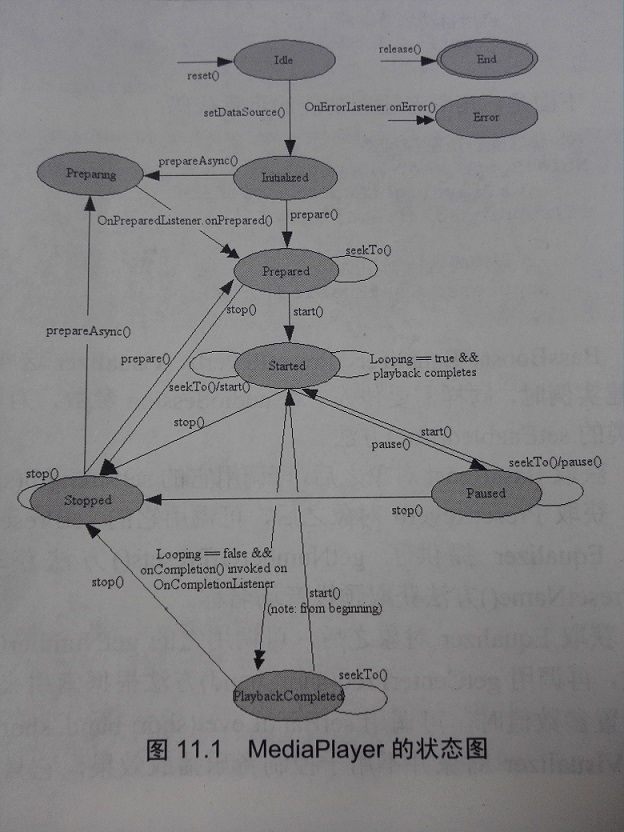
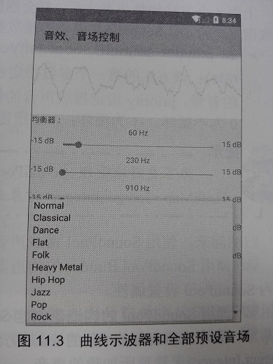
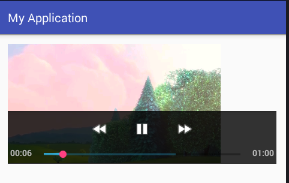

# 11.1音频与视频的播放

前面已经提及如何使用MediaPlayer播放音频的例子，使用MediaPlayer播放音频十分简单，当程序控制MediaPlayer对象装载音频完成之后，程序可以调用MediaPlayer的如下三个方法进行播放控制。

- `start()`: 开始或恢复播放。
- `stop()`: 停止播放。
- `pause()`: 暂停播放。

　　为了让MediaPlayer来装载指定音频文件，MediaPlayer提供了如下简单的静态方法。

- `static MediaPlayer create(Context context,Uri uri)`： 从指定Uri来装载音频文件，并返回新创建的MediaPlayer对象。
- `static MediaPlayer create(Context context,int resid)`： 从resid资源ID对应的资源文件中装载音频文件，并返回新创建的MediaPlayer对象。

　　上面两个方法用起来非常方便，但这两个方法每次都会返回新创建的MediaPlayer对象，如果程序需要使用MediaPlayer循环播放多个音频文件，使用MediaPlayer的静态`create()`方法就不太合适了，此时可通过MediaPlayer的`setDataSourse()`方法来装载指定的音频文件。

- `setDataSource(String path)`: 指定装载path路径所代表的文件。
- `setDataSource(FileDescriptor fd,long offset,long length)`: 指定装载fd所代表的文件中从offset开始、长度为length的文件内容。
- `setDataSource(FileDescriptor fd)`: 指定装载fd所代表的文件。
- `setDataSource(Context context,Uri uri)`: 指定装载uri所代表的文件。

　　执行上面所示的`setDataSource()`方法之后，MediaPlayer并未真正去装载那些音频文件，还需要调用MediaPlayer的`prepare()`方法去准备音频，所谓“准备”，就是让MediaPlayer真正去装载音频文件。
　　因此使用已有的MediaPlayer对象装载“下一首”歌曲的代码模板为：

```java
	try
	{
		mPlayer.reset();
		//装载下一首歌曲
		mPlayer.setDataSource("/mnt/sdcard/next.mp3);
		//准备声音
		mPlayer.prepare();
		//播放
		mPlayer.start();
	}
	catch (IOException e)
	{
	e.printStackTrace();
	}
```

　　除此之外，MediaPlayer还提供了一些绑定事件监听器的方法，用于监听MediaPlayer播放过程中所发生的特定事件。绑定事件监听器的方法如下。

- `setOnCompletionListener(MediaPlayer.OnCompletionListener listener)`: 为MediaPlayer的播放完成事件绑定事件监听器。
- `setOnErrorListener(MediaPlayer.OnErrorListener listener)`: 为MediaPlayer的播放错误事件绑定事件监听器。
- `setOnPreparedListener(MediaPlayer.OnPreparedListener listener)`: 当MediaPlayer调用`prepare()`方法时触发该监听器。
- `setOnSeekCompleteListener(MediaPlayer.OnSeekCompleteListener listener)`: 当MediaPlayer调用`seek()`方法时触发该监听器。

因此可以再创建一个MediaPlayer对象之后，通过为该MediaPlayer绑定监听器来监听相应的事件。例如如下代码：

```java
	//为MediaPlayer的播放完成事件绑定事件监听器
	mPlayer.setOnErrorListener(new OnErrorListener)()
	{
		@Override
		onError(MediaPlayer mp,int what,int extra)
		{
			//针对错误进行相应的处理
			...
		}
	}
```

　　下面简单归纳一下使用MediaPlayer播放不同来源的来源文件。

#### 1.播放应用的资源文件

　　播放应用的资源文件需要两步即可。

1. 调用MediaPlayer的`create(Context context，int resid)`方法装载指定的资源文件。
2. 调用MediaPlayer的`start()`、`pause()`、`stop()`等方法控制播放即可。
   　　例如如下代码：

```java
	MediaPlayer mPlayer = MediaPlayer.create(this,R.raw.song);
	mPlayer.start();
```

> 提示：
> 　　音频资源文件一般放在Android应用的/res/raw目录下

#### 2.播放应用的原始资源文件

　　播放应用的资源文件按如下步骤执行。

- 调用Context的`getAssets()`方法获取应用的AssetManager。
- 调用AssetManager对象的`openFd(String name)`方法打开指定的原始资源，该方法返回一个AssetFileDescriptor对象。
- 调用AssetFileDescriptor的`getFileDescriptor()`、`getStartOffset()`和`getLength()`方法来获取音频文件的FileDescriptor、开始位置、长度等。
- 创建MediaPlayer对象（或利用已有的MediaPlayer对象），并调用MediaPlayer对象的`setDataSource(FileDescriptor fd，long offset，long length)`方法来装载音频资源。
- 调用MediaPlayer对象的`prepare()`方法准备音频。
- 调用MediaPlayer的`start()`、`pause()`、`stop()`等方法控制播放即可。

> 注意
> 　　虽然MediaPlayer提供了`setDataSource(FileDescriptor fd)`方法来装载指定的音频资源，但实际使用时这个方法似乎有问题：不管程序调用`openFd(String name)`方法时指定打开哪个原始资源，MediaPlayer将总是播放第一个原始音频资源。

例如如下代码片段：

```java
	AssetManager am = getAssets();
	//打开指定音乐文件
	AssetFileDescriptor afd = am.openFd(music);
	MediaPlayer mPlayer = new MediaPlayer();
	//使用MediaPlayer装载指定的声音文件
	mPlayer.setDataSource(afd.getFileDescriptor()
		'afd.getStartOffset()
		'afd.getLength());
	//准备声音
	mPlayer.prepare();
	//播放
	mPlayer.start();
```

#### 3.播放外部存储器上的音频文件

　　播放外部存储器上的音频文件按如下步骤执行。

1. 创建MediaPlayer对象（或利用已有的MediaPlayer对象），并调用MediaPlayer对象的`setDataSource(String path)`方法装载指定的音频文件。
2. 调用MediaPlayer对象的`prepare()`方法准备音频。
3. 调用MediaPlayer的`start()`、`pause()`、`stop()`等方法控制播放即可。

　　例如如下代码：

```java
	MediaPlayer mPlayer = new MediaPlayer();
	//使用MediaPlayer装载指定的声音文件
	mPlayer.setDataSource("/mnt/sdcard/mysong.mp3);
	//准备声音
	mPlayer.prepare();
	//播放
	mPlayer.start();
```

#### 4.播放来自网络的音频文件

　　播放来自网络的音频文件有两种方式：①直接使用MediaPlayer的静态`create(Context context,Uri uri方法)`；②调用MediaPlayer的`setDataSource(Context context,Uri uri)`方法装载指定Uri对应的音频文件。
　　以第二种方式播放来自网络的音频文件的步骤如下。

1. 根据网络下的音频文件所在的位置创建Uri对象。
2. 创建MediaPlayer对象（或利用已有的MediaPlayer对象），并调用MediaPlayer对象的`setDataSource(Context context,Uri uri)`方法装载Uri对应的音频文件。
3. 调用MediaPlayer对象的`prepare()`方法准备音频。
4. 调用MediaPlayer的`start()`、`pause()`、`stop()`等方法控制播放即可。
   　　例如如下代码片段：

```java
	Uri uri=Uri.parse("http://www.crazyit.org/abc.mp3");
	MediaPlayer mPlayer = new MediaPlayer();
	//使用MediaPlayer根据Uri来装载指定的声音文件
	mPlayer.setDataSource(this,uri);
	//准备声音
	mPlayer.prepare();
	//播放
	mPlayer.start();
```

　　MediaPlayer除了调用`prepare()`方法来准备声音之外，还可以调用`prepareAsync()`来准备声音。`prepareAsync()`于普通`prepare()`方法的区别在于，`prepareAsync()`是异步的，它不会阻塞当前的UI线程。
　　归纳起来，MediaPlayer的状态图如图11.1所示。
　　由于前面已经提供了大量使用MediaPlayer播放声音的例子，故此处不再介绍使用MediaPlayer的简单方法。
　　

### 11.1.2 音乐特效控制

　　Android可以控制播放音乐时的均衡器、重低音、音场及显示音乐波形等，这些都是靠AudioEffect及其子类来完成的，它包含如下常用子类。

- AcousticEchoCanceler: 取消回声控制器。
- AutomaticGainControl: 自动增益控制器。
- NoiseSuppressor： 噪音压制控制器。
- BassBoost： 重低音控制器。
- Equalizer： 均衡控制器。
- PresetReverb： 预设音场控制器。
- Visualizer： 示波器。

　　上面的子类中前三个子类的用法很简单，只要调用它们的静态`create()`方法创建相应的实例，然后调用他们的`isAvailable()`方法判断是否可用，再调用`setEnabled(boolean enabled)`方法启用相应效果即可。
　　下面是启用取消回声功能的示意代码：

```java
	//获取取消回声控制器
	AcousticEchoCancel canceler = AcousticEchoCanceler.create(0,mPlayer.getAudioSessionId());
	if(canceler.isAvailable())
	{
		//启用取消回声控制器
		canceler.setEnabled(true);
	}
```

　　下面是启用自动增益功能的示意代码：

```java
	//获取自动增益控制器
	AutomaticGainControl ctrl=AutomaticGainControl.create(0,mPlayer.getAudioSessionId());
	if(ctrl.isAvailable())
	{
		//启用自动增益功能
		ctrl.setEnabled(true);
	}
```

　　下面是启用噪音压制功能的示意代码：

```java
	//获取噪音压制控制器
	NoiseSuppressor suppressor = NoiseSuppressor.create(0,mPlayer.getAudioSessionId());
	if(suppressor.isAvailable())
	{
		//启用噪音压制功能
		suppressor.setEnabled(true);
	}
```

　　BassBoost、Equalizer、PresetReverb、Visualizer这4个类，都需要调用构造器来创建实例。创建实例时，同样需要传入一个audioSession参数，为了启用它们，同样需要调用AudioEffect基类的`setEnabled(true)`方法。
　　获取BassBoost对象之后，可调用它的`setStrength(short strength)`方法来设置重低音的强度。
　　获取PresetReverb对象之后，可调用它的`setPreset(short preset)`方法设置使用预设置的音场。Epualizer提供了`getNumberOfPresets()`方法获取系统所有预设的音场，并提供了`getPresetName()`方法获取预设音场名称。
　　获取Epualizer对象后，可调用它的`getNumberOfBands()`方法获取该均衡器支持的总频率数，再调用`getCenterFreq(short band)`方法根据索引来获取频率。当用户想为某个频率的均衡器设置参数值时，可调用`setBandLevel(short band,short level)`方法进行设置。
　　Visualizer对象并不用于控制音乐播放效果，它只是显示音乐的播放波形。为了实时显示该示波器的数据，需要为该组件设置一个OnDataCaptureListener监听器，该监听器将负责更新波形显示组件的界面。
　　下面用一个实例来示范上面4个特效类的用法。

### 实例：音乐的示波器、均衡、重低音和音场

------

　　本实例无须界面布局文件，使用一个LinearLayout容器来盛装一个示波器View组件，该示波器View组件将负责绘制Visualizer传过来的数据；LinearLayout添加多个SeekBar来控制Equalizer支持的所有频率的均衡值；LinearLayout还添加一个SeekBar来控制重低音的强度；LinearLayout还添加一个Spinner让用户选择预设音场。
下面是该实例的Activity代码。

##### 程序清单：codes\11\11.1\MediaPlayerTest\app\src\main\java\org\crazyit\media\MainActivity.java

```java
	package org.crazyit.media;
	
	import java.util.ArrayList;
	import java.util.List;
	
	import android.app.Activity;
	import android.content.Context;
	import android.graphics.Canvas;
	import android.graphics.Color;
	import android.graphics.Paint;
	import android.graphics.Paint.Style;
	import android.graphics.Rect;
	import android.media.AudioManager;
	import android.media.MediaPlayer;
	import android.media.audiofx.BassBoost;
	import android.media.audiofx.Equalizer;
	import android.media.audiofx.PresetReverb;
	import android.media.audiofx.Visualizer;
	import android.os.Bundle;
	import android.view.Gravity;
	import android.view.MotionEvent;
	import android.view.View;
	import android.view.ViewGroup;
	import android.widget.AdapterView;
	import android.widget.ArrayAdapter;
	import android.widget.LinearLayout;
	import android.widget.SeekBar;
	import android.widget.Spinner;
	import android.widget.TextView;
	
	public class MainActivity extends Activity
	{
		// 定义播放声音的MediaPlayer
		private MediaPlayer mPlayer;
		// 定义系统的示波器
		private Visualizer mVisualizer;
		// 定义系统的均衡器
		private Equalizer mEqualizer;
		// 定义系统的重低音控制器
		private BassBoost mBass;
		// 定义系统的预设音场控制器
		private PresetReverb mPresetReverb;
		private LinearLayout layout;
		private List<Short> reverbNames = new ArrayList<Short>();
		private List<String> reverbVals = new ArrayList<String>();
		@Override
		public void onCreate(Bundle savedInstanceState)
		{
			super.onCreate(savedInstanceState);
			// 设置控制音乐声音
			setVolumeControlStream(AudioManager.STREAM_MUSIC);
			layout = new LinearLayout(this);
			layout.setOrientation(LinearLayout.VERTICAL);
			setContentView(layout);
			// 创建MediaPlayer对象
			mPlayer = MediaPlayer.create(this, R.raw.beautiful);
			// 初始化示波器
			setupVisualizer();
			// 初始化均衡控制器
			setupEqualizer();
			// 初始化重低音控制器
			setupBassBoost();
			// 初始化预设音场控制器
			setupPresetReverb();
			// 开发播放音乐
			mPlayer.start();
		}
		private void setupVisualizer()
		{
			// 创建MyVisualizerView组件，用于显示波形图
			final MyVisualizerView mVisualizerView =
					new MyVisualizerView(this);
			mVisualizerView.setLayoutParams(new ViewGroup.LayoutParams(
					ViewGroup.LayoutParams.MATCH_PARENT,
					(int) (120f * getResources().getDisplayMetrics().density)));
			// 将MyVisualizerView组件添加到layout容器中
			layout.addView(mVisualizerView);
			// 以MediaPlayer的AudioSessionId创建Visualizer
			// 相当于设置Visualizer负责显示该MediaPlayer的音频数据
			mVisualizer = new Visualizer(mPlayer.getAudioSessionId());
			mVisualizer.setCaptureSize(Visualizer.getCaptureSizeRange()[1]);
			// 为mVisualizer设置监听器
			mVisualizer.setDataCaptureListener(
					new Visualizer.OnDataCaptureListener()
					{
						@Override
						public void onFftDataCapture(Visualizer visualizer,
													 byte[] fft, int samplingRate)
						{
						}
						@Override
						public void onWaveFormDataCapture(Visualizer visualizer,
														  byte[] waveform, int samplingRate)
						{
							// 用waveform波形数据更新mVisualizerView组件
							mVisualizerView.updateVisualizer(waveform);
						}
					}, Visualizer.getMaxCaptureRate() / 2, true, false);
			mVisualizer.setEnabled(true);
		}
		// 初始化均衡控制器的方法
		private void setupEqualizer()
		{
			// 以MediaPlayer的AudioSessionId创建Equalizer
			// 相当于设置Equalizer负责控制该MediaPlayer
			mEqualizer = new Equalizer(0, mPlayer.getAudioSessionId());
			// 启用均衡控制效果
			mEqualizer.setEnabled(true);
			TextView eqTitle = new TextView(this);
			eqTitle.setText("均衡器：");
			layout.addView(eqTitle);
			// 获取均衡控制器支持最小值和最大值
			final short minEQLevel = mEqualizer.getBandLevelRange()[0];
			short maxEQLevel = mEqualizer.getBandLevelRange()[1];
			// 获取均衡控制器支持的所有频率
			short brands = mEqualizer.getNumberOfBands();
			for (short i = 0; i < brands; i++)
			{
				TextView eqTextView = new TextView(this);
				// 创建一个TextView，用于显示频率
				eqTextView.setLayoutParams(new ViewGroup.LayoutParams(
						ViewGroup.LayoutParams.MATCH_PARENT,
						ViewGroup.LayoutParams.WRAP_CONTENT));
				eqTextView.setGravity(Gravity.CENTER_HORIZONTAL);
				// 设置该均衡控制器的频率
				eqTextView.setText((mEqualizer.getCenterFreq(i) / 1000)
						+ " Hz");
				layout.addView(eqTextView);
				// 创建一个水平排列组件的LinearLayout
				LinearLayout tmpLayout = new LinearLayout(this);
				tmpLayout.setOrientation(LinearLayout.HORIZONTAL);
				// 创建显示均衡控制器最小值的TextView
				TextView minDbTextView = new TextView(this);
				minDbTextView.setLayoutParams(new ViewGroup.LayoutParams(
						ViewGroup.LayoutParams.WRAP_CONTENT,
						ViewGroup.LayoutParams.WRAP_CONTENT));
				// 显示均衡控制器的最小值
				minDbTextView.setText((minEQLevel / 100) + " dB");
				// 创建显示均衡控制器最大值的TextView
				TextView maxDbTextView = new TextView(this);
				maxDbTextView.setLayoutParams(new ViewGroup.LayoutParams(
						ViewGroup.LayoutParams.WRAP_CONTENT,
						ViewGroup.LayoutParams.WRAP_CONTENT));
				// 显示均衡控制器的最大值
				maxDbTextView.setText((maxEQLevel / 100) + " dB");
				LinearLayout.LayoutParams layoutParams = new
						LinearLayout.LayoutParams(
						ViewGroup.LayoutParams.MATCH_PARENT,
						ViewGroup.LayoutParams.WRAP_CONTENT);
				layoutParams.weight = 1;
				// 定义SeekBar作为调整工具
				SeekBar bar = new SeekBar(this);
				bar.setLayoutParams(layoutParams);
				bar.setMax(maxEQLevel - minEQLevel);
				bar.setProgress(mEqualizer.getBandLevel(i));
				final short brand = i;
				// 为SeekBar的拖动事件设置事件监听器
				bar.setOnSeekBarChangeListener(new SeekBar
						.OnSeekBarChangeListener()
				{
					@Override
					public void onProgressChanged(SeekBar seekBar,
												  int progress, boolean fromUser)
					{
						// 设置该频率的均衡值
						mEqualizer.setBandLevel(brand,
								(short) (progress + minEQLevel));
					}
					@Override
					public void onStartTrackingTouch(SeekBar seekBar)
					{
					}
					@Override
					public void onStopTrackingTouch(SeekBar seekBar)
					{
					}
				});
				// 使用水平排列组件的LinearLayout“盛装”三个组件
				tmpLayout.addView(minDbTextView);
				tmpLayout.addView(bar);
				tmpLayout.addView(maxDbTextView);
				// 将水平排列组件的LinearLayout添加到myLayout容器中
				layout.addView(tmpLayout);
			}
		}
		// 初始化重低音控制器
		private void setupBassBoost()
		{
			// 以MediaPlayer的AudioSessionId创建BassBoost
			// 相当于设置BassBoost负责控制该MediaPlayer
			mBass = new BassBoost(0, mPlayer.getAudioSessionId());
			// 设置启用重低音效果
			mBass.setEnabled(true);
			TextView bbTitle = new TextView(this);
			bbTitle.setText("重低音：");
			layout.addView(bbTitle);
			// 使用SeekBar作为重低音的调整工具
			SeekBar bar = new SeekBar(this);
			// 重低音的范围为0～1000
			bar.setMax(1000);
			bar.setProgress(0);
			// 为SeekBar的拖动事件设置事件监听器
			bar.setOnSeekBarChangeListener(new SeekBar
					.OnSeekBarChangeListener()
			{
				@Override
				public void onProgressChanged(SeekBar seekBar
						, int progress, boolean fromUser)
				{
					// 设置重低音的强度
					mBass.setStrength((short) progress);
				}
				@Override
				public void onStartTrackingTouch(SeekBar seekBar)
				{
				}
				@Override
				public void onStopTrackingTouch(SeekBar seekBar)
				{
				}
			});
			layout.addView(bar);
		}
		// 初始化预设音场控制器
		private void setupPresetReverb()
		{
			// 以MediaPlayer的AudioSessionId创建PresetReverb
			// 相当于设置PresetReverb负责控制该MediaPlayer
			mPresetReverb = new PresetReverb(0,
					mPlayer.getAudioSessionId());
			// 设置启用预设音场控制
			mPresetReverb.setEnabled(true);
			TextView prTitle = new TextView(this);
			prTitle.setText("音场");
			layout.addView(prTitle);
			// 获取系统支持的所有预设音场
			for (short i = 0; i < mEqualizer.getNumberOfPresets(); i++)
			{
				reverbNames.add(i);
				reverbVals.add(mEqualizer.getPresetName(i));
			}
			// 使用Spinner作为音场选择工具
			Spinner sp = new Spinner(this);
			sp.setAdapter(new ArrayAdapter<String>(MainActivity.this,
					android.R.layout.simple_spinner_item, reverbVals));
			// 为Spinner的列表项选中事件设置监听器
			sp.setOnItemSelectedListener(new Spinner
					.OnItemSelectedListener()
			{
				@Override
				public void onItemSelected(AdapterView<?> arg0
						, View arg1, int arg2, long arg3)
				{
					// 设定音场
					mPresetReverb.setPreset(reverbNames.get(arg2));
				}
				@Override
				public void onNothingSelected(AdapterView<?> arg0)
				{
				}
			});
			layout.addView(sp);
		}
		@Override
		protected void onPause()
		{
			super.onPause();
			if (isFinishing() && mPlayer != null)
			{
				// 释放所有对象
				mVisualizer.release();
				mEqualizer.release();
				mPresetReverb.release();
				mBass.release();
				mPlayer.release();
				mPlayer = null;
			}
		}
		private static class MyVisualizerView extends View
		{
			// bytes数组保存了波形抽样点的值
			private byte[] bytes;
			private float[] points;
			private Paint paint = new Paint();
			private Rect rect = new Rect();
			private byte type = 0;
			public MyVisualizerView(Context context)
			{
				super(context);
				bytes = null;
				// 设置画笔的属性
				paint.setStrokeWidth(1f);
				paint.setAntiAlias(true);
				paint.setColor(Color.GREEN);
				paint.setStyle(Style.FILL);
			}
			public void updateVisualizer(byte[] ftt)
			{
				bytes = ftt;
				// 通知该组件重绘自己
				invalidate();
			}
	
			@Override
			public boolean onTouchEvent(MotionEvent me)
			{
				// 当用户触碰该组件时，切换波形类型
				if(me.getAction() != MotionEvent.ACTION_DOWN)
				{
					return false;
				}
				type ++;
				if(type >= 3)
				{
					type = 0;
				}
				return true;
			}
			@Override
			protected void onDraw(Canvas canvas)
			{
				super.onDraw(canvas);
				if (bytes == null)
				{
					return;
				}
				// 绘制白色背景（主要为了印刷时好看）
				canvas.drawColor(Color.WHITE);
				// 使用rect对象记录该组件的宽度和高度
				rect.set(0,0,getWidth(),getHeight());
				switch(type)
				{
					// -------绘制块状的波形图-------
					case 0:
						for (int i = 0; i < bytes.length - 1; i++)
						{
							float left = getWidth() * i / (bytes.length - 1);
							// 根据波形值计算该矩形的高度
							float top = rect.height()-(byte)(bytes[i+1]+128)
									* rect.height() / 128;
							float right = left + 1;
							float bottom = rect.height();
							canvas.drawRect(left, top, right, bottom, paint);
						}
						break;
					// -------绘制柱状的波形图（每隔18个抽样点绘制一个矩形）-------
					case 1:
						for (int i = 0; i < bytes.length - 1; i += 18)
						{
							float left = rect.width()*i/(bytes.length - 1);
							// 根据波形值计算该矩形的高度
							float top = rect.height()-(byte)(bytes[i+1]+128)
									* rect.height() / 128;
							float right = left + 6;
							float bottom = rect.height();
							canvas.drawRect(left, top, right, bottom, paint);
						}
						break;
					// -------绘制曲线波形图-------
					case 2:
						// 如果point数组还未初始化
						if (points == null || points.length < bytes.length * 4)
						{
							points = new float[bytes.length * 4];
						}
						for (int i = 0; i < bytes.length - 1; i++)
						{
							// 计算第i个点的x坐标
							points[i * 4] = rect.width()*i/(bytes.length - 1);
							// 根据bytes[i]的值（波形点的值）计算第i个点的y坐标
							points[i * 4 + 1] = (rect.height() / 2)
									+ ((byte) (bytes[i] + 128)) * 128
									/ (rect.height() / 2);
							// 计算第i+1个点的x坐标
							points[i * 4 + 2] = rect.width() * (i + 1)
									/ (bytes.length - 1);
							// 根据bytes[i+1]的值（波形点的值）计算第i+1个点的y坐标
							points[i * 4 + 3] = (rect.height() / 2)
									+ ((byte) (bytes[i + 1] + 128)) * 128
									/ (rect.height() / 2);
						}
						// 绘制波形曲线
						canvas.drawLines(points, paint);
						break;
				}
			}
		}
	}
```

　　上面的程序中定义了4个方法： `setupVisualizer()`、`setupEqualizer()`、`setupBassBoost()`和`setupPresetReverb()`，这四个方法分别创建Visualizer、Equalizer、BassBoost和PresetReverb对象，并调用它们的方法控制音乐特效。
　　上面的实例中包含了一个MyVisualizerView内部类，该内部类会根据Visualizer传过来的数据动态绘制波形效果。本例提供了三种波形： 块状波形、柱状波形和曲线波形————当用户单击MyVisualizerView组件时将会切换波形。
　　运行该实例，可以看到如图11.2所示的效果。
　　如果用户单击该程序界面最上方的示波器组件，该组件将会切换一种波形显示。单击下方的音场，将可以看到系统支持的所有预设音场，如图11.3所示。
　　　　　

### 11.1.3 使用SoundPool播放音效

　　如果应用程序经常需要播放密集、短促的音效，这时还用MediaPlayer就显得有些不合适了。MediaPlayer存在如下缺点：

- 资源占用量较高，延迟时间较长。
- 不支持多个音频同时播放。

　　除了前面介绍的使用MediaPlayer播放音频之外，Android还提供了SoundPool来播放音效，SoundPool使用音效池的概念来管理多个短促的音效，例如它可以开始就加载20个音效，以后在程序中按音效的ID进行播放。
　　SoundPool主要用于播放一些较短的声音片段，与MediaPlayer相比，SoundPool的优势在于CPU资源占用量低和反应延迟小。另外，SoundPool还支持自行设置声音的品质、音量、播放比率等参数
　　Android系统SoundPool提供了一个Builder内部类，该内部类专门用于创建SoundPool。

> 提示
> 　　从Android5.0开始，SoundPool的构造器被设为过时了，因此推荐使用SoundPool.Builder来创建SoundPool对象。

　　一旦得到了SoundPool对象之后，接下来就可调用SoundPool的多个重载的`load()`方法来加载声音了。SoundPool提供了如下4个`load()`方法。

- `int load(Context context,int resld,int priority)`: 从resld所对应的的资源加载声音。
- `int load(FileDescriptor fd,long offset,long length,int priority)`: 加载fd所对应的的文件中从offset开始、长度为length的声音。
- `int load(AssetFileDescriptor afd,int priority)`: 从afd所对应的的文件中加载声音。
- `int load(String path,int priority)`: 从path对应的文件去加载声音。

　　上面四个方法中都有一个priority参数，该参数目前还没有任何作用，Android建议将该参数设为1，保持和未来的兼容性。
　　上面4个方法加载声音之后，都会返回该声音的ID，以后程序就可以通过该声音的ID来播放指定声音了。SoundPool提供的播放指定声音的方法如下。

- `int play(int soundID,float leftVolume,float rightVolume,int priority,int loop,float rate)`: 该方法的第一个参数指定播放哪个声音；leftVolume、rightVolume指定左、右的音量；priority指定播放声音的优先级，数值越大，优先级越高；loop指定是否循环，0为不循环，-1为循环；rate指定播放的比率，数值可从0.5到2，1为正常比率。

> 提示：
> 　　为了更好地管理SoundPool所加载的每个声音的ID，程序一般会使用一个``HashMap<Integer,Integer>``对象来管理声音。

　　归纳起来，使用SoundPool播放声音的步骤如下。

1. 调用SoundPool.Builder的构造器创建SoundPool.Builder对象，并可通过该Builder对象为SoundPool设置属性。
2. 调用SoundPool的构造器创建SoundPool对象。
3. 调用SoundPool对象的`load()`方法从指定资源、文件中加载声音。最好使用``HashMap<Integer,Integer>``来管理所加载的声音。
4. 调用SoundPool的`play()`方法播放声音。

　　下面的程序示范了如何使用SoundPool来播放音效。该程序提供了三个按钮，分别用于播放不同的声音。该程序的界面十分简单，故此处不再给出界面布局代码。程序代码如下。

##### 程序清单:codes\11\11.1\SoundPoolTest\src\main\java\org\crazyit\media\MainActivity.java

```java
	package org.crazyit.media;
	
	import android.app.Activity;
	import android.media.AudioAttributes;
	import android.media.AudioManager;
	import android.media.AudioTrack;
	import android.media.SoundPool;
	import android.media.SoundPool.Builder;
	import android.os.Bundle;
	import android.view.View;
	import android.view.View.OnClickListener;
	import android.widget.Button;
	
	import java.util.HashMap;
	
	
	public class MainActivity extends Activity implements OnClickListener
	{
		Button bomb, shot, arrow;
		// 定义一个SoundPool
		SoundPool soundPool;
		HashMap<Integer, Integer> soundMap = new HashMap<>();
		@Override
		public void onCreate(Bundle savedInstanceState)
		{
			super.onCreate(savedInstanceState);
			setContentView(R.layout.main);
			bomb = (Button) findViewById(R.id.bomb);
			shot = (Button) findViewById(R.id.shot);
			arrow = (Button) findViewById(R.id.arrow);
			AudioAttributes attr = new AudioAttributes.Builder()
				.setUsage(AudioAttributes.USAGE_GAME) // 设置音效使用场景
				// 设置音效的类型
				.setContentType(AudioAttributes.CONTENT_TYPE_MUSIC)
				.build();
			soundPool = new SoundPool.Builder()
				.setAudioAttributes(attr) // 设置音效池的属性
				.setMaxStreams(10) // 设置最多可容纳10个音频流，
				.build();  // ①
			// load方法加载指定音频文件，并返回所加载的音频ID
			// 此处使用HashMap来管理这些音频流
			soundMap.put(1, soundPool.load(this, R.raw.bomb, 1));  // ②
			soundMap.put(2, soundPool.load(this, R.raw.shot, 1));
			soundMap.put(3, soundPool.load(this, R.raw.arrow, 1));
			bomb.setOnClickListener(this);
			shot.setOnClickListener(this);
			arrow.setOnClickListener(this);
		}
		// 重写OnClickListener监听器接口的方法
		@Override
		public void onClick(View source)
		{
			// 判断哪个按钮被单击
			switch (source.getId())
			{
				case R.id.bomb:
					soundPool.play(soundMap.get(1), 1, 1, 0, 0, 1);  // ③
					break;
				case R.id.shot:
					soundPool.play(soundMap.get(2), 1, 1, 0, 0, 1);
					break;
				case R.id.arrow:
					soundPool.play(soundMap.get(3), 1, 1, 0, 0, 1);
					break;
			}
		}
	}
```

　　上面程序中的①号粗体字代码用于创建SoundPool对象；②号粗体字代码用于使用SoundPool加载多个不同的声音；③号粗体字代码则用于根据声音ID来播放指定声音。这就是使用SoundPool播放声音的标准过程。
　　实际使用SoundPool播放声音时有如下几点需要注意： SoundPool虽然可以一次性加载多个声音，但由于内存限制，因此应该避免使用SoundPool来播放歌曲或者做游戏背景音乐，只有那些短促、密集的声音才考虑使用SoundPool进行播放。
　　虽然SoundPool比MediaPlayer的效率好，但也不是绝对不存在延迟问题，尤其在那些性能不太好的手机中，SoundPool的延迟问题会更严重。

## 11.1.4 使用VideoView播放视频

​	为了在Android应用中播放视频，Android提供了VideoView组件，它就是一个位于android.widget包下的组件，它的作用与ImageView类似，只是ImageView用于显示图片，而VideoView用于播放视频。

使用VideoView播放视频的步骤：

1. 在界面布局文件中定义VideoView组件，或在程序中创建VideoView组件。

2. 调用VideoView的如下两个方法来加载指定的视频。

   ​	setVidePath(String path)：加载path文件代表的视频。

   ​	setVideoURI(Uri uri)：加载uri所对应的视频。

3. 调用VideoView的start()、stop()、psuse()方法来控制视频的播放

​       实际上与VideoView一起结合使用的还有一个MediaController类，它的作用是提供一个友好的图形控制界面，通过该控制界面来控制视频的播放。

​	下面的程序示范了如何使用VideoView来播放视频。该程序提供了一个简单的界面，界面布局代码如下。

```
<?xml version="1.0" encoding="utf-8"?>
<LinearLayout xmlns:android="http://schemas.android.com/apk/res/android"
	android:orientation="vertical"
	android:layout_width="match_parent"
	android:layout_height="match_parent">
	<!-- 定义VideoView播放视频 -->
	<VideoView
		android:id="@+id/video"
		android:layout_width="match_parent"
		android:layout_height="match_parent" />
</LinearLayout>
```

​	上面的界面布局中定义了一个VideoView组件，接下来就可以在程序中使用该组件来播放视频了。播放视频时还结合了MediaController来控制视频的播放，该程序代码如下。

```
public class MainActivity extends Activity
{
	VideoView videoView;
	MediaController mController;
	@Override
	public void onCreate(Bundle savedInstanceState)
	{
		super.onCreate(savedInstanceState);
		getWindow().setFormat(PixelFormat.TRANSLUCENT);
		setContentView(R.layout.main);
		// 获取界面上VideoView组件
		videoView = (VideoView) findViewById(R.id.video);
		// 创建MediaController对象
		mController = new MediaController(this);
		File video = new File("/mnt/sdcard/movie.mp4");
		if(video.exists())
		{
			videoView.setVideoPath(video.getAbsolutePath());  // ①
			// 设置videoView与mController建立关联
			videoView.setMediaController(mController);  // ②
			// 设置mController与videoView建立关联
			mController.setMediaPlayer(videoView);  // ③
			// 让VideoView获取焦点
			videoView.requestFocus();
		}
	}
}
```

​	由于该程序需要读取SD卡上的视频文件，因此还需要在AndroidManifest.xml文件中增加如下代码片段:

```
<!-- 授予该程序读取外部存储器的权限 -->
	<uses-permission android:name="android.permission.READ_EXTERNAL_STORAGE"/>
```

​	运行该程序，在保证/mnt/sdcard/movie.mp4视频文件存在的前提下，将可以看到如下图所示。



​	图中的快进键、暂停键、后退键以及播放进度条就是由MediaController所提供的。

**提示：运行该程序可能会遇到一些问题，如果读者使用了一些非标准的MP4、3GP文件，那么该应用程序将无法播放，因此建议读者自行使用手机录制一段兼容各种手机的标准的MP4、3GP视频文件。**

## 11.1.5 使用MediaPlayer和SurfaceView播放视频

​	使用VideoView播放视频简单、方便，但有些早期的开发这还是更喜欢使用MediaPlayer来播放视频，但由于MediaPlayer主要用于播放音频，因此它没有提供图像输出界面，此时就需要借助于SurfaceView来显示MediaPlayer播放的图像输出。

使用MediaPlayer播放视频的步骤如下。

1. 创建MediaPlyer的对象，并让他加载指定的视频文件。
2. 在界面布局文件中定义SurfaceView组件，或在程序中创建SurfaceView组件。并为SurfaceView的SurfaceHolder添加Callback监听器。
3. 调用MediaPlayer对象的setDisplay(Surfaceolder sh)将所播放的视频图像输出到指定的SurfaceView组件。
4. 调用MediaPlayer对象的start()、stop()、和pause()方法控制视频的播放。

​       下面的程序使用了MediaPlayer和SurfaceView来播放视频，并为该程序提供了三个按钮来控制视频的播放、暂停和停止。该程序的界面布局比较简单，故此处不再给出界面布局文件。该程序的代码如下。

```
public class MainActivity extends Activity
	implements OnClickListener
{
	SurfaceView surfaceView;
	ImageButton play, pause, stop;
	MediaPlayer mPlayer;
	// 记录当前视频的播放位置
	int position;
	@Override
	public void onCreate(Bundle savedInstanceState)
	{
		super.onCreate(savedInstanceState);
		setContentView(R.layout.main);
		// 获取界面中的三个按钮
		play = (ImageButton) findViewById(R.id.play);
		pause = (ImageButton) findViewById(R.id.pause);
		stop = (ImageButton) findViewById(R.id.stop);
		// 为三个按钮的单击事件绑定事件监听器
		play.setOnClickListener(this);
		pause.setOnClickListener(this);
		stop.setOnClickListener(this);
		// 创建MediaPlayer
		mPlayer = new MediaPlayer();
		surfaceView = (SurfaceView) this.findViewById(R.id.surfaceView);
		// 设置播放时打开屏幕
		surfaceView.getHolder().setKeepScreenOn(true);
		surfaceView.getHolder().addCallback(new SurfaceListener());
	}
	@Override
	public void onClick(View source)
	{
		try
		{
			switch (source.getId())
			{
				// 播放按钮被单击
				case R.id.play:
					play();
					break;
				// 暂停按钮被单击
				case R.id.pause:
					if (mPlayer.isPlaying())
					{
						mPlayer.pause();
					}
					else
					{
						mPlayer.start();
					}
					break;
				// 停止按钮被单击
				case R.id.stop:
					if (mPlayer.isPlaying()) mPlayer.stop();
					break;
			}
		}
		catch (Exception e)
		{
			e.printStackTrace();
		}
	}
	private void play() throws IOException
	{
		mPlayer.reset();
		mPlayer.setAudioStreamType(AudioManager.STREAM_MUSIC);
		// 设置需要播放的视频
		mPlayer.setDataSource("/mnt/sdcard/movie.3gp");
		// 把视频画面输出到SurfaceView
		mPlayer.setDisplay(surfaceView.getHolder());  // ①
		mPlayer.prepare();
		// 获取窗口管理器
		WindowManager wManager = getWindowManager();
		DisplayMetrics metrics = new DisplayMetrics();
		// 获取屏幕大小
		wManager.getDefaultDisplay().getMetrics(metrics);
		// 设置视频保持纵横比缩放到占满整个屏幕
		surfaceView.setLayoutParams(new LayoutParams(metrics.widthPixels
				, mPlayer.getVideoHeight() * metrics.widthPixels
				/ mPlayer.getVideoWidth()));
		mPlayer.start();
	}
	private class SurfaceListener implements SurfaceHolder.Callback
	{
		@Override
		public void surfaceChanged(SurfaceHolder holder, int format,
								   int width, int height)
		{
		}
		@Override
		public void surfaceCreated(SurfaceHolder holder)
		{
			if (position > 0)
			{
				try
				{
					// 开始播放
					play();
					// 并直接从指定位置开始播放
					mPlayer.seekTo(position);
					position = 0;
				}
				catch (Exception e)
				{
					e.printStackTrace();
				}
			}
		}
		@Override
		public void surfaceDestroyed(SurfaceHolder holder)
		{
		}
	}
	// 当其他Activity被打开时，暂停播放
	@Override
	protected void onPause()
	{
		if (mPlayer.isPlaying())
		{
			// 保存当前的播放位置
			position = mPlayer.getCurrentPosition();
			mPlayer.stop();
		}
		super.onPause();
	}
	@Override
	protected void onDestroy()
	{
		// 停止播放
		if (mPlayer.isPlaying()) mPlayer.stop();
		// 释放资源
		mPlayer.release();
		super.onDestroy();
	}
}
```

​	改程序同样需要访问SD卡上的视频文件，因此也需要在AndroidManifest.xml文件中增加如下配置：

```
<!-- 授予该程序读取外部存储器的权限 -->
	<uses-permission android:name="android.permission.READ_EXTERNAL_STORAGE"/>
```

​	运行上面的程序，将可以看到如图所示的播放界面。


​	从上面的开发过程不难看出，使用MediaPlayer播放视频要复杂一些，而且需要自己开发控制按钮来控制视频播放，因此一般推荐使用VideoView来播放视频。