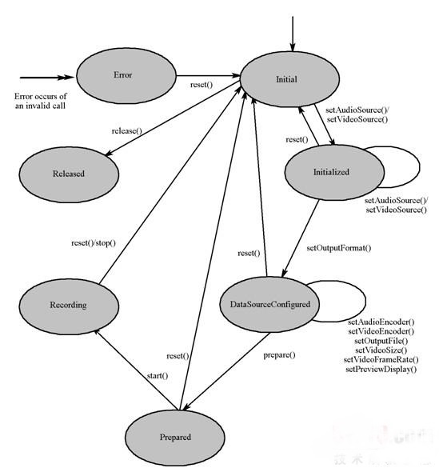

# 11.2使用MediaRecorder录制音频

​	手机一般都提供了麦克风硬件，而Android系统就可以利用该硬件来录制音频了。

​	为了在Android应用中录制音频，Android提供了MediaRecorder类，使用MediaRecorder录制音频的过程如下：

1. 创建MediaRecorder对象。
2. 调用MediaRecorder对象的setAudioSource()方法设置声音来源，一般传入MediaRecorder.AudioSource.MIC参数指定录制来自麦克风的声音。
3. 调用MediaRecorder对象的setOutputFormat()设置所录制的音频文件的格式。
4. 调用MediaRecorder对象的setAudioEncoder()、setAudioEncodingBitRate(int  bitRate)、setAudioSamplingRate(int  samplingRate)设置所录制的声音的编码格式、编码位率、采样率等，这些参数将可以控制所录制的声音的品质、文件的大小。一般来说，声音品质越好，声音文件越大。
5. 调用MediaRecorder的setOutputFile(String  path)方法设置录制的音频文件的保存位置。
6. 调用MediaRecorder的prepare()方法准备录制。
7. 调用MediaRecorder对象的start()方法开始录制。
8. 录制完成，调用MediaRecorder对象的stop()方法停止录制，并调用release()方法释放资源。

**注意：步骤3、4两个步骤千万不能搞反，否则程序将会抛出IllegalStateException异常。**

下图显示了MediaRecorder的状态图。



## 实例：录制音乐

​	本实例程序示范了如何使用MediaRecorder来录制声音。该程序的界面布局很简单，只提供了两个简单的按钮来控制录音开始、停止，故此处不再给出界面布局文件。程序代码如下。

```
public class MainActivity extends Activity
		implements OnClickListener
{
	// 定义界面上的两个按钮
	ImageButton record, stop;
	// 系统的音频文件
	File soundFile;
	MediaRecorder mRecorder;
	@Override
	public void onCreate(Bundle savedInstanceState)
	{
		super.onCreate(savedInstanceState);
		setContentView(R.layout.main);
		// 获取程序界面中的两个按钮
		record = (ImageButton) findViewById(R.id.record);
		stop = (ImageButton) findViewById(R.id.stop);
		// 为两个按钮的单击事件绑定监听器
		record.setOnClickListener(this);
		stop.setOnClickListener(this);
	}
	@Override
	public void onDestroy()
	{
		super.onDestroy();
		if (soundFile != null && soundFile.exists())
		{
			// 停止录音
			mRecorder.stop();
			// 释放资源
			mRecorder.release();
			mRecorder = null;
		}
	}
	@Override
	public void onClick(View source)
	{
		switch (source.getId())
		{
			// 单击录音按钮
			case R.id.record:
				if (!Environment.getExternalStorageState().equals(
						android.os.Environment.MEDIA_MOUNTED))
				{
					Toast.makeText(MainActivity.this, "SD卡不存在，请插入SD卡！",
							Toast.LENGTH_SHORT).show();
					return;
				}
				try
				{
					// 创建保存录音的音频文件
					soundFile = new File(Environment
							.getExternalStorageDirectory().getCanonicalFile()
							+ "/sound.amr");
					mRecorder = new MediaRecorder();
					// 设置录音的声音来源
					mRecorder.setAudioSource(MediaRecorder
							.AudioSource.MIC);
					// 设置录制的声音的输出格式（必须在设置声音编码格式之前设置）
					mRecorder.setOutputFormat(MediaRecorder
							.OutputFormat.THREE_GPP);
					// 设置声音编码的格式
					mRecorder.setAudioEncoder(MediaRecorder
							.AudioEncoder.AMR_NB);
					mRecorder.setOutputFile(soundFile.getAbsolutePath());
					mRecorder.prepare();
					// 开始录音
					mRecorder.start();  // ①
				}
				catch (Exception e)
				{
					e.printStackTrace();
				}
				break;
			// 单击停止按钮
			case R.id.stop:
				if (soundFile != null && soundFile.exists())
				{
					// 停止录音
					mRecorder.stop();  // ②
					// 释放资源
					mRecorder.release();  // ③
					mRecorder = null;
				}
				break;
		}
	}
}
```

​	运行该程序，将看到如图所示的界面。


​	单击图中第一个按钮开始录音，单击第二个按钮则可结束录音。录音完成后可以看到/mnt/sdcard目录下生成一个sound.amr文件,这就是刚刚录制的音频文件——Android模拟器将会直接使用宿主电脑上的麦克风，因此如果读者的电脑上有麦克风，那么该程序即可正常录制声音。

​	上面的程序需要使用系统的麦克风进行录音，因此需要向该程序授予录音的权限。除此之外，还需要授予该程序向外部存储设备写入数据的权限，也就是在AndroidManifest.xml文件中增加如下配置：

```
<!-- 授予该程序录制声音的权限 -->
	<uses-permission android:name="android.permission.RECORD_AUDIO" />
	<!-- 授予该程序向外部存储器写入数据的权限 -->
	<uses-permission android:name="android.permission.WRITE_EXTERNAL_STORAGE" />
```

**注意：Android官方API已经指出，最新版的MediaRecorder目前不能在模拟器上运行，必须在真机上运行，因此读者需要在真机上测试该应用**