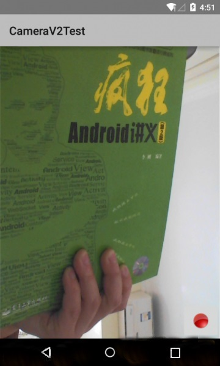
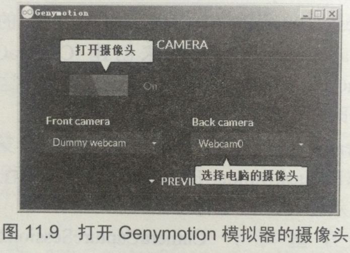
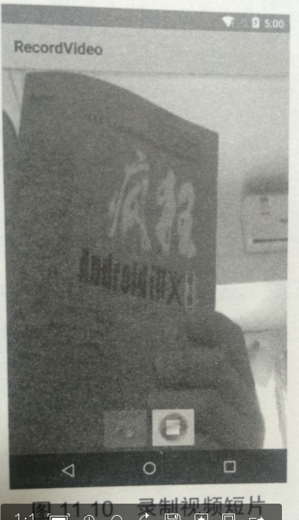

# 11.3控制摄像头拍照
  　　现在的手机一般都会提供相机功能，有些相机的镜头甚至支持1000万以上像素，有些甚至支持光学变焦，这些手机已经变成了专业数码相机。为了充分利用手机上的相机功能，Android应用可以控制拍照和录制视频。
## 11.3.1　 使用Android 5.0的Camera v2拍照
　　Android 5.0对拍照API进行了全新的设计，新增了全新设计的Camera v2 API，这些API不仅大幅提高了Android系统拍照的功能，还能支持RAW照片输出，甚至允许程序调整相机的对焦模式、曝光模式、快门等。

　　Android 5.0的Camera v2主要涉及如下API。

　　Ø CameraManager：摄像头管理器。这是一个全新的系统管理器，专门用于检测系统摄像头、打开系统摄像头。除此之外，调用CameraManager的getCameraCharacteristics(String)方法即可获取指定摄像头的相关特性。

　　Ø CameraCharacteristics：摄像头特性。该对象通过CameraManager来获取，用于描述特定摄像头所支持的各种特性。

　　Ø CameraDevice：代表系统摄像头。该类的功能类似于早期的Camera类。

　　Ø CameraCaptureSession：这是一个非常重要的API，当程序需要预览、拍照时，都需要先通过该类的实例创建Session。而且不管预览还是拍照，也都是由该对象的方法进行控制的，其中控制预览的方法为setRepeatingRequest()；控制拍照的方法为capture()。
为了监听CameraCaptureSession的创建过程，以及监听CameraCaptureSession的拍照过程，Camera v2 API为CameraCaptureSession提供了StateCallback、CaptureCallback等内部类。

　　Ø CameraRequest和CameraRequest.Builder：当程序调用setRepeatingRequest()方法进行预览时，或调用capture()方法进行拍照时，都需要传入CameraRequest参数。CameraRequest代表了一次捕获请求，用于描述捕获图片的各种参数设置，比如对焦模式、曝光模式……总之，程序需要对照片所做的各种控制，都通过CameraRequest参数进行设置。CameraRequest.Builder则负责生成CameraRequest对象。
　　

理解了上面API的功能和作用之后，接下来即可使用Camera v2 API来控制摄像头拍照了。控制拍照的步骤大致如下。

1. 调用CameraManager的openCamera(String cameraId, CameraDevice.StateCallback callback, Handler handler)方法打开指定摄像头。该方法的第一个参数代表要打开的摄像头ID；第二个参数用于监听摄像头的状态；第三个参数代表执行callback的Handler，如果程序希望直接在当前线程中执行callback，则可将handler参数设为null。

2. 当摄像头被打开之后，程序即可获取CameraDevice—即根据摄像头ID获取了指定摄像头设备，然后调用CameraDevice的createCaptureSession(List<Surface> outputs, CameraCaptureSession. StateCallback callback，Handler handler)方法来创建CameraCaptureSession。该方法的第一个参数是一个List集合，封装了所有需要从该摄像头获取图片的Surface，第二个参数用于监听CameraCaptureSession的创建过程；第三个参数代表执行callback的Handler，如果程序希望直接在当前线程中执行callback，则可将handler参数设为null。

3. 不管预览还是拍照，程序都调用CameraDevice的createCaptureRequest(int templateType)方法创建CaptureRequest.Builder，该方法支持TEMPLATE_PREVIEW（预览）、TEMPLATE_RECORD（拍摄视频）、TEMPLATE_STILL_CAPTURE（拍照）等参数。
4. 通过第3步所调用方法返回的CaptureRequest.Builder设置拍照的各种参数，比如对焦模式、曝光模式等。
5. 调用CaptureRequest.Builder的build()方法即可得到CaptureRequest对象，接下来程序可通过CameraCaptureSession的setRepeatingRequest()方法开始预览，或调用capture()方法拍照。

**实例：拍照时自动对焦**

　　下面的实例示范了使用Camera v2来进行拍照、当用户按下拍照键时，该应用会自动对焦，当对焦成功时拍下照片。该程序的界面中只提供了一个TextureView来显示预览取景，十分简单。该自定义TextureVie类的代码如下。

	public class AutoFitTextureView extends TextureView
	{
		private int mRatioWidth = 0;
		private int mRatioHeight = 0;
	
		public AutoFitTextureView(Context context, AttributeSet attrs)
		{
			super(context, attrs);
		}
	
		public void setAspectRatio(int width, int height)
		{
			mRatioWidth = width;
			mRatioHeight = height;
			requestLayout();
		}
	
		@Override
		protected void onMeasure(int widthMeasureSpec, int heightMeasureSpec)
		{
			super.onMeasure(widthMeasureSpec, heightMeasureSpec);
			int width = MeasureSpec.getSize(widthMeasureSpec);
			int height = MeasureSpec.getSize(heightMeasureSpec);
			if (0 == mRatioWidth || 0 == mRatioHeight)
			{
				setMeasuredDimension(width, height);
			}
			else
			{
				if (width < height * mRatioWidth / mRatioHeight)
				{
					setMeasuredDimension(width, width * mRatioHeight / mRatioWidth);
				}
				else
				{
					setMeasuredDimension(height * mRatioWidth / mRatioHeight, height);
				}
			}
		}
	}
　　接下来的MainActivity将会使用CameraManager来打开CameraDevice,并通过CameraDevice创建CameraCaptureSession,然后即可通过CameraCaptureSession进行预览或拍照了。该Activity的代码如下。
	public class MainActivity extends Activity implements View.OnClickListener
	{
		private static final SparseIntArray ORIENTATIONS = new SparseIntArray();
	
		static
		{
			ORIENTATIONS.append(Surface.ROTATION_0, 90);
			ORIENTATIONS.append(Surface.ROTATION_90, 0);
			ORIENTATIONS.append(Surface.ROTATION_180, 270);
			ORIENTATIONS.append(Surface.ROTATION_270, 180);
		}
	
		private AutoFitTextureView textureView;
		// 摄像头ID（通常0代表后置摄像头，1代表前置摄像头）
		private String mCameraId = "0";
		// 定义代表摄像头的成员变量
		private CameraDevice cameraDevice;
		// 预览尺寸
		private Size previewSize;
		private CaptureRequest.Builder previewRequestBuilder;
		// 定义用于预览照片的捕获请求
		private CaptureRequest previewRequest;
		// 定义CameraCaptureSession成员变量
		private CameraCaptureSession captureSession;
		private ImageReader imageReader;
		private final TextureView.SurfaceTextureListener mSurfaceTextureListener
				= new TextureView.SurfaceTextureListener()
		{
			@Override
			public void onSurfaceTextureAvailable(SurfaceTexture texture
				, int width, int height)
			{
				// 当TextureView可用时，打开摄像头
				openCamera(width, height);
			}
	
			@Override
			public void onSurfaceTextureSizeChanged(SurfaceTexture texture
				, int width, int height){ }
	
			@Override
			public boolean onSurfaceTextureDestroyed(SurfaceTexture texture)
			{
				return true;
			}
	
			@Override
			public void onSurfaceTextureUpdated(SurfaceTexture texture){}
		};
		private final CameraDevice.StateCallback stateCallback = new CameraDevice.StateCallback()
		{
			//  摄像头被打开时激发该方法
			@Override
			public void onOpened(CameraDevice cameraDevice)
			{
				MainActivity.this.cameraDevice = cameraDevice;
				// 开始预览
				createCameraPreviewSession();  // ②
			}
			// 摄像头断开连接时激发该方法
			@Override
			public void onDisconnected(CameraDevice cameraDevice)
			{
				cameraDevice.close();
				MainActivity.this.cameraDevice = null;
			}
			// 打开摄像头出现错误时激发该方法
			@Override
			public void onError(CameraDevice cameraDevice, int error)
			{
				cameraDevice.close();
				MainActivity.this.cameraDevice = null;
				MainActivity.this.finish();
			}
		};
	
		@Override
		protected void onCreate(Bundle savedInstanceState)
		{
			super.onCreate(savedInstanceState);
			setContentView(R.layout.main);
			textureView = (AutoFitTextureView) findViewById(R.id.texture);
			// 为该组件设置监听器
			textureView.setSurfaceTextureListener(mSurfaceTextureListener);
			findViewById(R.id.capture).setOnClickListener(this);
		}
	
		@Override
		public void onClick(View view)
		{
			captureStillPicture();
		}
	
		private void captureStillPicture()
		{
			try
			{
				if (cameraDevice == null)
				{
					return;
				}
				// 创建作为拍照的CaptureRequest.Builder
				final CaptureRequest.Builder captureRequestBuilder =
						cameraDevice.createCaptureRequest(CameraDevice.TEMPLATE_STILL_CAPTURE);
				// 将imageReader的surface作为CaptureRequest.Builder的目标
				captureRequestBuilder.addTarget(imageReader.getSurface());
				// 设置自动对焦模式
				captureRequestBuilder.set(CaptureRequest.CONTROL_AF_MODE,
						CaptureRequest.CONTROL_AF_MODE_CONTINUOUS_PICTURE);
				// 设置自动曝光模式
				captureRequestBuilder.set(CaptureRequest.CONTROL_AE_MODE,
						CaptureRequest.CONTROL_AE_MODE_ON_AUTO_FLASH);
				// 获取设备方向
				int rotation = getWindowManager().getDefaultDisplay().getRotation();
				// 根据设备方向计算设置照片的方向
				captureRequestBuilder.set(CaptureRequest.JPEG_ORIENTATION
						, ORIENTATIONS.get(rotation));
				// 停止连续取景
				captureSession.stopRepeating();
				// 捕获静态图像
				captureSession.capture(captureRequestBuilder.build()
					, new CameraCaptureSession.CaptureCallback()  // ⑤
				{
					// 拍照完成时激发该方法
					@Override
					public void onCaptureCompleted(CameraCaptureSession session
							, CaptureRequest request, TotalCaptureResult result)
					{
						try
						{
							// 重设自动对焦模式
							previewRequestBuilder.set(CaptureRequest.CONTROL_AF_TRIGGER,
									CameraMetadata.CONTROL_AF_TRIGGER_CANCEL);
							// 设置自动曝光模式
							previewRequestBuilder.set(CaptureRequest.CONTROL_AE_MODE,
									CaptureRequest.CONTROL_AE_MODE_ON_AUTO_FLASH);
							// 打开连续取景模式
							captureSession.setRepeatingRequest(previewRequest, null,
									null);
						}
						catch (CameraAccessException e)
						{
							e.printStackTrace();
						}
					}
				}, null);
			}
			catch (CameraAccessException e)
			{
				e.printStackTrace();
			}
		}
	
		// 打开摄像头
		private void openCamera(int width, int height)
		{
			setUpCameraOutputs(width, height);
			CameraManager manager = (CameraManager) getSystemService(Context.CAMERA_SERVICE);
			try
			{
				// 打开摄像头
				manager.openCamera(mCameraId, stateCallback, null); // ①
			}
			catch (CameraAccessException e)
			{
				e.printStackTrace();
			}
		}
	
		private void createCameraPreviewSession()
		{
			try
			{
				SurfaceTexture texture = textureView.getSurfaceTexture();
				texture.setDefaultBufferSize(previewSize.getWidth(), previewSize.getHeight());
				Surface surface = new Surface(texture);
				// 创建作为预览的CaptureRequest.Builder
				previewRequestBuilder = cameraDevice
					.createCaptureRequest(CameraDevice.TEMPLATE_PREVIEW);
				// 将textureView的surface作为CaptureRequest.Builder的目标
				previewRequestBuilder.addTarget(new Surface(texture));
				// 创建CameraCaptureSession，该对象负责管理处理预览请求和拍照请求
				cameraDevice.createCaptureSession(Arrays.asList(surface
					, imageReader.getSurface()), new CameraCaptureSession.StateCallback() // ③
					{
						@Override
						public void onConfigured(CameraCaptureSession cameraCaptureSession)
						{
							// 如果摄像头为null，直接结束方法
							if (null == cameraDevice)
							{
								return;
							}
	
							// 当摄像头已经准备好时，开始显示预览
							captureSession = cameraCaptureSession;
							try
							{
								// 设置自动对焦模式
								previewRequestBuilder.set(CaptureRequest.CONTROL_AF_MODE,
										CaptureRequest.CONTROL_AF_MODE_CONTINUOUS_PICTURE);
								// 设置自动曝光模式
								previewRequestBuilder.set(CaptureRequest.CONTROL_AE_MODE,
										CaptureRequest.CONTROL_AE_MODE_ON_AUTO_FLASH);
								// 开始显示相机预览
								previewRequest = previewRequestBuilder.build();
								// 设置预览时连续捕获图像数据
								captureSession.setRepeatingRequest(previewRequest,
										null, null);  // ④
							}
							catch (CameraAccessException e)
							{
								e.printStackTrace();
							}
						}
	
						@Override
						public void onConfigureFailed(CameraCaptureSession cameraCaptureSession)
						{
							Toast.makeText(MainActivity.this, "配置失败！"
									, Toast.LENGTH_SHORT).show();
						}
					}, null
				);
			}
			catch (CameraAccessException e)
			{
				e.printStackTrace();
			}
		}
	
		private void setUpCameraOutputs(int width, int height)
		{
			CameraManager manager = (CameraManager) getSystemService(Context.CAMERA_SERVICE);
			try
			{
				// 获取指定摄像头的特性
				CameraCharacteristics characteristics
						= manager.getCameraCharacteristics(mCameraId);
				// 获取摄像头支持的配置属性
				StreamConfigurationMap map = characteristics.get(
						CameraCharacteristics.SCALER_STREAM_CONFIGURATION_MAP);
	
				// 获取摄像头支持的最大尺寸
				Size largest = Collections.max(
						Arrays.asList(map.getOutputSizes(ImageFormat.JPEG)),
						new CompareSizesByArea());
				// 创建一个ImageReader对象，用于获取摄像头的图像数据
				imageReader = ImageReader.newInstance(largest.getWidth(), largest.getHeight(),
						ImageFormat.JPEG, 2);
				imageReader.setOnImageAvailableListener(
						new ImageReader.OnImageAvailableListener()
						{
							// 当照片数据可用时激发该方法
							@Override
							public void onImageAvailable(ImageReader reader)
							{
								// 获取捕获的照片数据
								Image image = reader.acquireNextImage();
								ByteBuffer buffer = image.getPlanes()[0].getBuffer();
								byte[] bytes = new byte[buffer.remaining()];
								// 使用IO流将照片写入指定文件
								File file = new File(getExternalFilesDir(null), "pic.jpg");
								buffer.get(bytes);
								try (
									FileOutputStream output = new FileOutputStream(file))
								{
									output.write(bytes);
									Toast.makeText(MainActivity.this, "保存: "
										+ file, Toast.LENGTH_SHORT).show();
								}
								catch (Exception e)
								{
									e.printStackTrace();
								}
								finally
								{
									image.close();
								}
							}
						}, null);
	
				// 获取最佳的预览尺寸
				previewSize = chooseOptimalSize(map.getOutputSizes(
					SurfaceTexture.class), width, height, largest);
				// 根据选中的预览尺寸来调整预览组件（TextureView的）的长宽比
				int orientation = getResources().getConfiguration().orientation;
				if (orientation == Configuration.ORIENTATION_LANDSCAPE)
				{
					textureView.setAspectRatio(
							previewSize.getWidth(), previewSize.getHeight());
				}
				else
				{
					textureView.setAspectRatio(
							previewSize.getHeight(), previewSize.getWidth());
				}
			}
			catch (CameraAccessException e)
			{
				e.printStackTrace();
			}
			catch (NullPointerException e)
			{
				System.out.println("出现错误。");
			}
		}
	
		private static Size chooseOptimalSize(Size[] choices
			, int width, int height, Size aspectRatio)
		{
			// 收集摄像头支持的打过预览Surface的分辨率
			List<Size> bigEnough = new ArrayList<>();
			int w = aspectRatio.getWidth();
			int h = aspectRatio.getHeight();
			for (Size option : choices)
			{
				if (option.getHeight() == option.getWidth() * h / w &&
						option.getWidth() >= width && option.getHeight() >= height)
				{
					bigEnough.add(option);
				}
			}
			// 如果找到多个预览尺寸，获取其中面积最小的。
			if (bigEnough.size() > 0)
			{
				return Collections.min(bigEnough, new CompareSizesByArea());
			}
			else
			{
				System.out.println("找不到合适的预览尺寸！！！");
				return choices[0];
			}
		}
	
		// 为Size定义一个比较器Comparator
		static class CompareSizesByArea implements Comparator<Size>
		{
			@Override
			public int compare(Size lhs, Size rhs)
			{
				// 强转为long保证不会发生溢出
				return Long.signum((long) lhs.getWidth() * lhs.getHeight() -
						(long) rhs.getWidth() * rhs.getHeight());
			}
		}
	}
　　上面程序中的①号粗体字代码用于打开系统摄像头，openCamera()方法的第一个参数代表请求打开的摄像头ID，此处传入的摄像头ID为"0"，这代表打开设备后置摄像头；如果需要打开设备指定摄像头（比如前置摄像头），可以在调用openCamera()方法时传入相应的摄像头ID。

**提示：**	

　　CameraManager提供了getCameraIdList()方法来获取设备的摄像头列表，还提供了getCameraCharacteristics(String cameraId)方法来获取指定摄像头的特性。例如如下代码：

		// 获取设备上摄像头列表
		String[] ids = CameraManager.getCameraIdList();
		// 创建一个空的CameraInfo对象，用于获取摄像头信息
		Camera.CameraInfo cameraInfo = new Camera.CameraInfo();
		for ( String id : ids)
		{
		    CameraCharacteristics cc = getCameraCharacteristics(id);
		    // 接下来的代码就可以通过cc来获取该摄像头的特性了
		    ...
		}

　　上面程序中的①号粗体字代码打开后置摄像头时传入了一个stateCallback参数，该参数代表的对象可检测摄像头的状态改变，当摄像头的状态发生改变时，程序将会自动回调该对象的相应方法。该程序的关键是重写了stateCallback的onOpened(CameraDevice cameraDevice)方法—当摄像头被打开时将会自动激发该方法，通过该方法的参数即可让程序获取被打开的摄像头设备。除此之外，程序在onOpened()方法的②号粗体字代码处调用createCameraPreviewSession()方法创建了CameraCaptureSession，并开始预览取景。

　　createCameraPreviewSession()方法中的③号粗体字代码调用了CameraDevice的createCaptureSession()方法来创建CameraCaptureSession，调用该方法时也传入了一个CameraCaptureSession.StateCallback参数，这样即可保证当CameraCaptureSession被创建成功之后立即开始预览。

　　createCameraPreviewSession()方法的第一行粗体字代码将texture组件添加为previewRequestBuilder的target，这意味着程序通过previewRequestBuilder获取的图像数据将会被显示在texture组件上。

　　程序重写了CameraCaptureSession.StateCallback的onConfigured()方法—当CameraCaptureSession创建成功时将会自动回调该方法，该方法先通过previewRequestBuilder设置了预览参数，然后调用CameraCaptureSession对象的setRepeatingRequest()方法开始预览。

　　当单击程序界面上的拍照按钮时，程序将会激发该Activity的captureStillPicture()方法。该方法的实现逻辑同样很简单：程序先创建一个CaptureRequest.Builder对象，该方法中第一行粗体字代码将ImageReader添加成CaptureRequest.Builder的target—这意味着当程序拍照时，图像数据将会被传给此ImageReader。接下来程序通过CaptureRequest.Builder设置了拍照参数，然后通过⑤号粗体字代码调用CameraCaptureSession的capture()方法拍照即可，调用该方法时也传入了CaptureCallback参数，这样可以保证拍照完成之后会重新开始预览。

　　注意：该应用打开摄像头、创建CameraCaptureSession、预览、拍照时都没有传入Handler参数，这意味着程序直接在主线程中完成相应的Callback任务，这样可能导致程序响应变慢。对于实际的应用，我们建议传入Handler参数，这样即可让Handler使用新线程来执行Callback任务，这样才可提高应用的响应速度。

　　由于该程序需要使用手机的摄像头，因此还需要在AndroidManifest.xml文件中增加如下配置：

		<!-- 授予该程序使用摄像头的权限 -->
		<uses-permission android:name="android.permission.CAMERA" />
　　在Genymotion模拟器上运行该程序可能看到如图1所示的预览界面—这是因为Genymotion模拟器可以使用宿主电脑上的摄像头作为相机摄像头。

　　为了让模拟器能显示图11.8所示的预览界面，建议读者启用Genymotion模拟器的摄像头支持：单击Genymotion模拟器右边的摄像头图标，即可看到如图11.9所示的对话框。按该图上标出的提示即可打开Genymotion模拟器的摄像头支持。

　　运行该程序，按下右下角的“拍照”键，程序将会把拍得的照片保存下来，界面上也会显示该照片的存储目录。

　　　　　　　　　　　图11.8　预览界面

## 11.3.2 录制视频短片
　　MediaRecorder除了可用于录制音频之外，还可用于录制视频，使用MediaRecorder录制视频与录制音频的步骤基本相同。只是录制视频时不仅需要采集声音，还需要采集图像。为了让MediaRecorder录制时采集图像，应该在调用setAudioSource(int  audio_source)方法时再调用setVideoSource(int  video_source)方法来设置图像来源。

　　除此之外，还需要在调用setOutputFormat()设置输出文件格式之后进行如下步骤：

1. 调用MediaRecorder对象的setVideoEncoder()、setVideoEncodingBitRate(int  bitRate)、setVideoFrameRate()设置所录制的视频的编码格式、编码位率、每秒多少帧等，这些参数将可以控制所录制的视频的品质、文件的大小。一般来说，视频品质越好，视频文件越大。

2. 调用MediaRecorder的setPreviewDisplay(SurfaceView  sv)方法设置使用哪个SurfaceView来显示视频预览。

**实例：录制生活短片**	

　　本实例示范了如何录制视频。该程序的界面中提供了两个按钮用于控制开始、结束录制。除此之外，程序界面中还提供了一个SurfaceView来显示视频预览。该程序的界面布局如下：

	<?xml version="1.0" encoding="utf-8"?>
	<RelativeLayout
		xmlns:android="http://schemas.android.com/apk/res/android"
		android:orientation="vertical"
		android:layout_width="match_parent"
		android:layout_height="match_parent">
		<!-- 显示视频预览的SurfaceView -->
		<SurfaceView
			android:id="@+id/sView"
			android:layout_width="match_parent"
			android:layout_height="match_parent" />
		<LinearLayout
			android:orientation="horizontal"
			android:layout_width="wrap_content"
			android:layout_height="wrap_content"
			android:gravity="center_horizontal"
			android:layout_alignParentBottom="true"
			android:layout_centerHorizontal="true">
			<ImageButton
				android:id="@+id/record"
				android:layout_width="wrap_content"
				android:layout_height="wrap_content"
				android:src="@drawable/record" />
			<ImageButton
				android:id="@+id/stop"
				android:layout_width="wrap_content"
				android:layout_height="wrap_content"
				android:src="@drawable/stop" />
		</LinearLayout>
	</RelativeLayout>

　　提供了上面所示的界面布局文件之后，接下来就可以在程序中使用MediaRecorder来录制视频了。录制视频与录制音频的步骤基本相似，只是需要额外设置视频的图像来源、视频格式等。除此之外，还需要设置使用SurfaceView显示视频预览。录制视频的程序代码如下。

    public class MainActivity extends Activity
            implements OnClickListener
    {
        // 程序中的两个按钮
        ImageButton record , stop;
        // 系统的视频文件
        File videoFile ;
        MediaRecorder mRecorder;
        // 显示视频预览的SurfaceView
        SurfaceView sView;
        // 记录是否正在进行录制
        private boolean isRecording = false;
        @Override
        public void onCreate(Bundle savedInstanceState)
        {
            super.onCreate(savedInstanceState);
            setContentView(R.layout.main);
            // 获取程序界面中的两个按钮
            record = (ImageButton) findViewById(R.id.record);
            stop = (ImageButton) findViewById(R.id.stop);
            // 让stop按钮不可用
            stop.setEnabled(false);
            // 为两个按钮的单击事件绑定监听器
            record.setOnClickListener(this);
            stop.setOnClickListener(this);
            // 获取程序界面中的SurfaceView
            sView = (SurfaceView) this.findViewById(R.id.sView);
            // 设置分辨率
            sView.getHolder().setFixedSize(320, 280);
            // 设置该组件让屏幕不会自动关闭
            sView.getHolder().setKeepScreenOn(true);
        }
        @Override
        public void onClick(View source)
        {
            switch (source.getId())
            {
                // 单击录制按钮
                case R.id.record:
                    if (!Environment.getExternalStorageState().equals(
                            android.os.Environment.MEDIA_MOUNTED))
                    {
                        Toast.makeText(MainActivity.this
                                , "SD卡不存在，请插入SD卡！"
                                , Toast.LENGTH_SHORT).show();
                        return;
                    }
                    try
                    {
                        // 创建保存录制视频的视频文件
                        videoFile = new File(Environment
                                .getExternalStorageDirectory()
                                .getCanonicalFile() + "/myvideo.mp4");
                        // 创建MediaPlayer对象
                        mRecorder = new MediaRecorder();
                        mRecorder.reset();
                        // 设置从麦克风采集声音
                        mRecorder.setAudioSource(MediaRecorder
                                .AudioSource.MIC);
                        // 设置从摄像头采集图像
                        mRecorder.setVideoSource(MediaRecorder
                                .VideoSource.CAMERA);
                        // 设置视频文件的输出格式
                        // 必须在设置声音编码格式、图像编码格式之前设置
                        mRecorder.setOutputFormat(MediaRecorder
                                .OutputFormat.MPEG_4);
                        // 设置声音编码的格式
                        mRecorder.setAudioEncoder(MediaRecorder
                                .AudioEncoder.DEFAULT);
                        // 设置图像编码的格式
                        mRecorder.setVideoEncoder(MediaRecorder
                                .VideoEncoder.MPEG_4_SP);
                        mRecorder.setVideoSize(320, 280);
                        // 每秒 4帧
                        mRecorder.setVideoFrameRate(4);
                        mRecorder.setOutputFile(videoFile.getAbsolutePath());
                        // 指定使用SurfaceView来预览视频
                        mRecorder.setPreviewDisplay(sView
                                .getHolder().getSurface());  // ①
                        mRecorder.prepare();
                        // 开始录制
                        mRecorder.start();
                        System.out.println("---recording---");
                        // 让record按钮不可用
                        record.setEnabled(false);
                        // 让stop按钮可用
                        stop.setEnabled(true);
                        isRecording = true;
                    }
                    catch (Exception e)
                    {
                        e.printStackTrace();
                    }
                    break;
                // 单击停止按钮
                case R.id.stop:
                    // 如果正在进行录制
                    if (isRecording)
                    {
                        // 停止录制
                        mRecorder.stop();
                        // 释放资源
                        mRecorder.release();
                        mRecorder = null;
                        // 让record按钮可用
                        record.setEnabled(true);
                        // 让stop按钮不可用
                        stop.setEnabled(false);
                    }
                    break;
            }
        }
    }

　　上面程序中的粗体字代码设置了视频所采集的图像来源，以及视频的压缩格式、视频分辨率等属性，程序的①号粗体字代码则用于设置使用指定的SurfaceView显示指定视频预览。

　　运行该程序需要使用麦克风录制声音，则需要使用摄像头采集图像，这些都需要授予相应的权限;不仅如此，由于录制视频时视频文件增大的较快，可能需要使用外部存储器，因此需要对应用程序授予相应的权限，也就是需要在AndroidManifest.xml文件中增加如下授权配置：

	<!-- 授予该程序录制声音的权限 -->
	<uses-permission android:name="android.permission.RECORD_AUDIO"/>
	<!-- 授予该程序使用摄像头的权限 -->
	<uses-permission android:name="android.permission.CAMERA"/>
	<uses-permission android:name="android.permission.MOUNT_UNMOUNT_FILESYSTEMS"/>
	<!-- 授予使用外部存储器的权限 -->
	<uses-permission android:name="android.permission.WRITE_EXTERNAL_STORAGE"/>

　　当在Genymotion模拟器上运行该程序时，由于Genymotion模拟器可以直接使用宿主电脑上的摄像头作为相机摄像头，因此在该模拟器上运行该程序可以看到如图11.10所示的界面。

