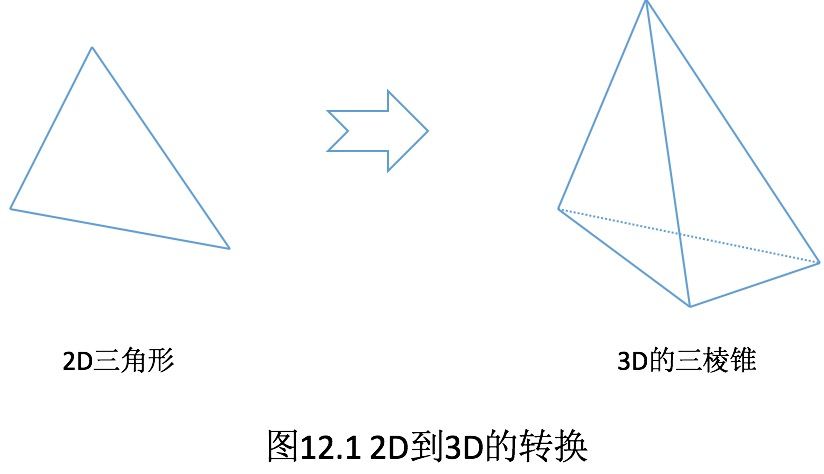
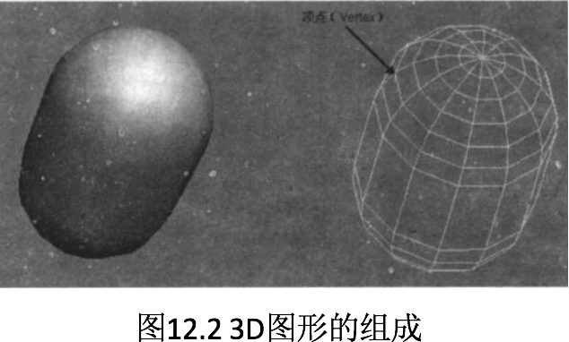
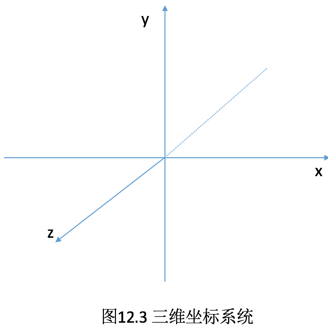
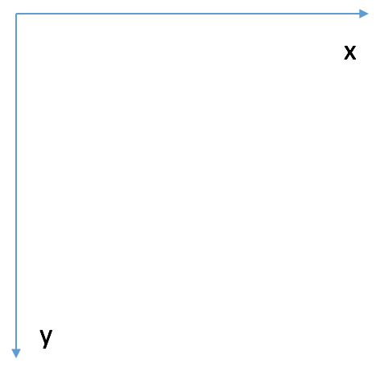

# 12.1 3D图形与3D开发的基本知识

##书上的基本内容

    现在的互联网上，虽然还有一些2D游戏存在，但3D游戏已经逐渐成为主流。毕竟3D游戏具有更逼真的界面，能带给玩家更好的用户体验，就目前的技术来看，开发3D界面的各种技术已经成熟，为开发3D界面、3D游戏提供了基础。

    初学者可能会把3D开发想象得十分复杂。当然，3D游戏开发肯定要比2D游戏开发更加复杂，毕竟开发3D界面需要的数据更多。
    在结束3D图形开发之前，先从2D图形开发入手。
    先来看如何定义一个2D的三角形。对于2D的三角形来说，它只需要三个点，而且这三个点位于同一个平面上，因此程序只要为每个点指定X，Y两个坐标值即可。
    接下来看如何定义一个3D的三棱锥。一个三棱锥需要4个点，而且这4个点都不是位于同一个平面上，因此程序需要为每个点指定X、Y、Z三个坐标值。
    
    
 

    从图12.1可以看出，3D图形需要处理的数据比2D图形要多得多。
    从图12.1看到的只是最简单的2D图形---三角形和最简单的3D图形---三棱锥，但在实际应用中，应用程序需要呈现出来的2D图形可能由许多曲线组成；类似地，应用程序需要呈现的3D图形也可能是由许多曲面组成的。
    前面介绍2D绘图时，介绍了开啊随手画图的程序，当程序希望在2D界面上绘制一条任意的曲线时，如果把这条曲线放大了来看（放得足够大），用户将会发现这条曲线其实是由许多足够段直线连接起来的。
    对于一个3D图形来说，即使用户眼中看到的是一个“圆滑曲面”的3D图形，实际上他也依然是由多个足够小的平面组成的，图12.2所示就是从3d max里接取出来的一个3D图形。
    正如图12.2所示，左边是用户希望看到的3D图形，但这个3D图形并不是程序员希望控制的，实际上程序员要控制的是右边的“网格图”，为了实现这个3D图形，程序员需要定义两方面的数据。
   
*  3D图形的每个顶点（Vertex）的位置，每个顶点的位置都需要X、Y、Z三个坐标值。
*  3D图形每个面由哪些点组成。
  
  
 
    当程序给出了上面两方面的数据之后，接下来就可通知3D绘制接口来绘制这个3D图形了---就像绘制2D图形一样，程序员需要做的就是给2D图形中各顶点的坐标。
    为了定义3D图形每个顶点的位置，程序员需要给出X、Y、Z三个坐标值。为此，我们先要简单介绍一下Android的3D支持的三维坐标系统。
    Android的3D坐标系统与2D坐标系统完全不同，图12.3显示了Android的三维坐标系统。
    从图12.3可以看出，在Android的三维坐标系统中，坐标原点位于中央，X轴从左向右延伸，原点左边的值为负数，右边为正数；Y轴从下向上延伸，原点下边的值为负数，上边为正数；Z轴从屏幕里面向外面延伸，屏幕里面为负数，外面为正数。
    了解了这个三维坐标，我们就可以根据该三维坐标系统来定义3D图形的每个顶点的位置了。
    
##扩展

* 安卓手机屏幕的坐标原点在屏幕的左上角，其坐标系如下(即二维坐标):

   

##OpenGL ES图形绘制元素

###3D图形基本元素

* 顶点：顶点通常放在一个顶点数组中，为了提高性能，通常将这些数组放在Buffer类中
* OpenGL ES提供一个称为“管道Pipeline”的机制将它们传给OpenGL ES库，这个管道定义了一些“开关”来控制OpenGL ES支持的某些功能，缺省情况这些功能是关闭的，如果需要使用OpenGL ES的这些功能，需要明确告知“管道”打开所需功能
* 边定义为两个顶点之间的线段在OpenGL中，通常无需直接定义一个边，而是通过顶点定义一个面，从而由面定义了其所对应的三条边。可以通过修改边的两个顶点来更改一条边
* 面指一个三角形，由三个顶点和三条边构成，对一个面所做的变化影响到连接面的所有顶点、面和多边形
* 多边形由多个面（三角形）拼接而成，在3D空间中，多边形不一定在同一个平面上

###3D图形渲染（Render）-几何图形基本类型

* GL_POINTS绘制独立的
* GL_LINE_STRIP绘制一系列线段
* GL_LINE_LOOP同GL_LINE_STRIP，但是线段首尾相连，构成一个封闭曲线
* GL_LINES顶点两两连接
* GL_TRIANGLES三个顶点构成一个三角形，组成多个三角形
* GL_TRIANGLES_STRIP每相邻三个顶点组成一个三角形,由一系列三角形组成
* GL_TRIANGLES_FAN以一个点为所有三角形公共顶点，组成一系列相邻三角形

###3D图形变换

* 3D图形的变换可以是游戏角色做一些动作，在OpenGL ES中有三个基本的变换函数，glRotatef()、glTranslatef()和glScalef()

* OpenGL ES中有两套矩阵，都是4*4的GLFloat矩阵，一个是modelview matrix，主要用来对虚拟的3D世界进行变换，我们对虚拟世界的物体进行旋转、转移或尺寸变化，都需要操作这个矩阵

* OpenGL ES中的另一个矩阵用来创建根据设定的视口对世界坐标进行描述的二维表示，这个矩阵称为projection matrix，大部分时间内，我们不需要接触这个矩阵

* 在任何时刻这两个矩阵只能有一个是激活的，任何与矩阵相关的调用只影响激活矩阵，当调用glLoadIdentity()时，激活矩阵设置为单元矩阵，其他三个调用则创建一个转移、尺度变换和旋转矩阵，并将创建的矩阵乘以激活矩阵，并将激活矩阵替换为矩阵乘法得到的结果

###3D图形颜色

* Flat coloring(单色)：glColorf()该方法通知OpenGL使用单一的颜色来进行渲染，指定单一颜色的行为，缺省的red、green、blue为1，代表白色

* Smooth coloring(平滑颜色过度):当为每个点定义一个颜色时，OpenGL自动为不同顶点颜色之间生成中间过度颜色（渐变色）

* 三角面（Mesh）：Mesh是构成空间形体的基本元素，四面体、椎体、圆柱体都是由Mes所构成，甚至球体也是由无数的Mesh所构成

    
 
 
