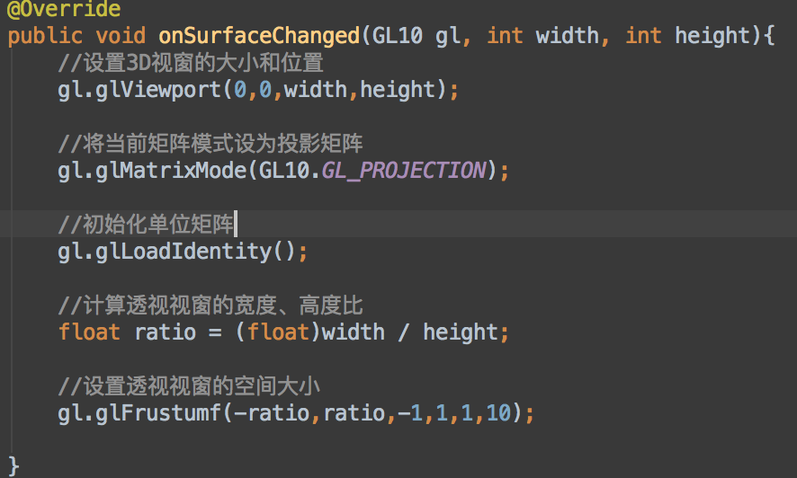
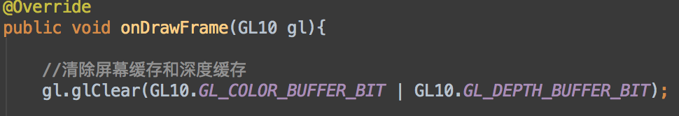
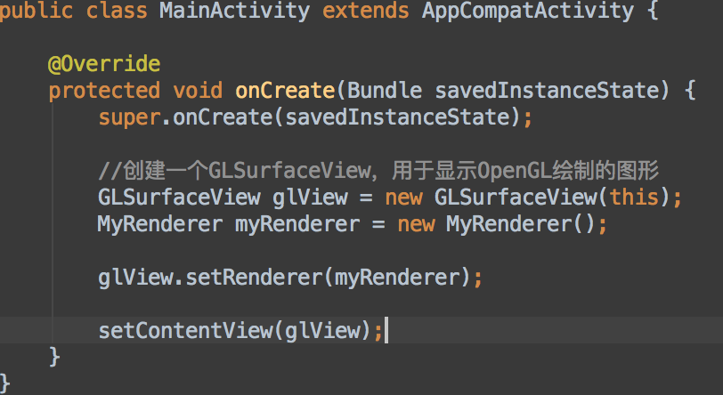
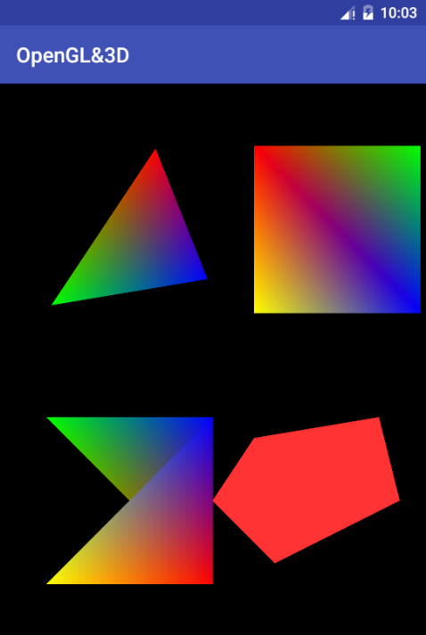
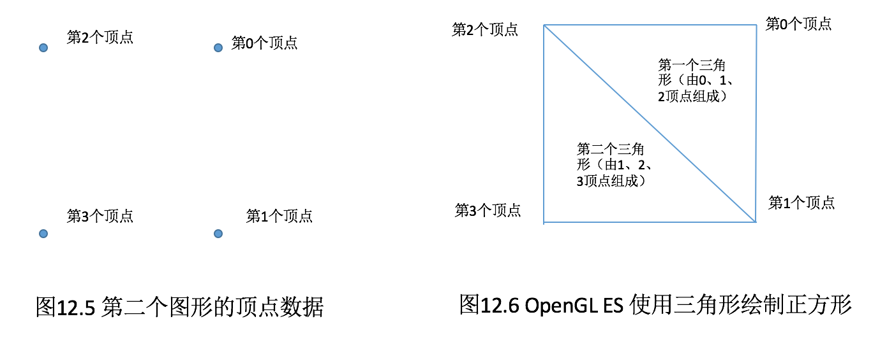
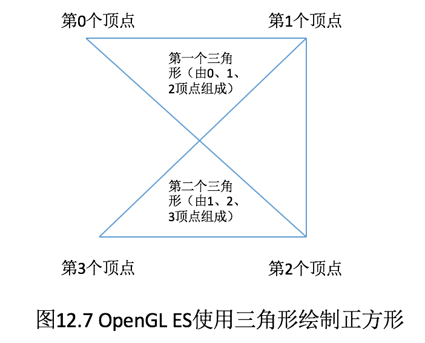
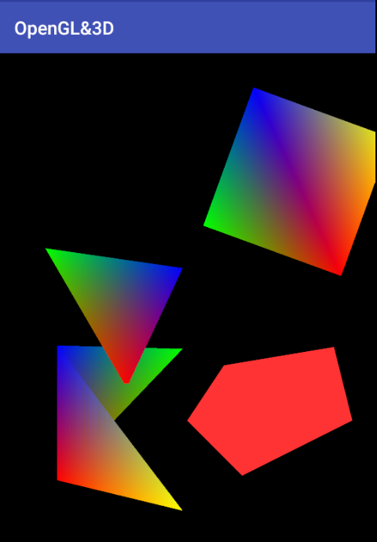

# 12.3 绘制2D图形

##12.3.1 在Android应用中使用OpenGL ES
	Anroid为OpenGL ES支持提供了GLSurfaceCiew组件，这个组件用于显示3D图形。GLSurfaceView本身并不提供绘制3D图形的功能，而是由GLSurfaceView.Renderer来完成SurfaceView中3D图形的绘制。

归纳起来，在Android中使用OpenGL ES需要三个步骤。
	
	1. 创建GLSurfaceView组件，使用Activity来显示GLSurfaceView组件
	
	2. 为GLSurfaceView组件创建GLSurfaceView.Renderer实例，实现GLSurfaceView.Renderer类时需要实现该接口里的三个方法。
	
	* abstract void onDrawFrame(GL10 gl): Renderer对象调用该方法绘制GLSurfaceView的当前帧。
	* abstract void onSurfaceChanged(GL10 gl,int width,int height): 当GLSurfaceView的大小改变时回调该方法。
	* abstract void onSurfaceCreated(GL10 gl,EGLConfig config): 当GLSurfaceView被创建时回调该方法
	
	3. 调用GLSurfaceView组件的setRenderer()方法指定Renderer对象，该Renderer对象将会完成GLSurfaceView里3D图形的绘制
	
从上面的介绍不难看出，实际上绘制3D图形的难点不是如何使用GLSurfaceView组件，而是如何实现Renderer
类。实现Renderer类时需要实现三个方法，这三个方法都有一个GL10形参，它就代表了OpenGL ES的“绘制画笔”，读者可以把它想象成Swing 2D绘图中的Graphics，也可以想象成Android 2D绘图中的Canvas组件---但我们希望Renderer绘制3D图形时，实际上是调用GL10的方法来进行绘制的。

---
当SurfaceView被创建时，系统会回调Renderer对象的onSurfaceCreated（）方法，该方法可以对OpenGL ES执行一些无须任何改变的初始化。例如如下初始化代码：


GL10就是OpenGL ES的绘图接口，虽然这里看到的是一个GL10，但实际上它也是GLES31的实例，读者可通过gl instance of GL11判断它是否为GL11接口的实例。

上面的方法中用到了GL10的一些初始化方法，关于这些方法的说明如下：


* glDisable(int cap):用于禁用OpenGL ES某个方面的特性。该方法中第一行代码用于关闭抗抖动，这样可以提高性能。

* glHint(int target,int mode):用于对OpenGL ES某方面进行修正。

* glClearColor(float red,float green,float blue,float alpha):用于设置OpenGL ES“清屏”所用的颜色，4个参数分别设置为红、绿、蓝、透明度值---0为最小值，1为最大值。例如设置gl.glClearColor(0,0,0,0),就是用黑色“清屏”。

* glShadeModel(int mode):用于设置OpenGL ES的阴影模式。此处设为阴影平滑模式。
* glEnable(int cap):该方法与glDisable(int cap)相对，用于启用OpenGL ES某方面的特性，此处用于启动OpenGL ES的深度测试。所谓深度测试，就是让OpenGL ES负责跟踪每个物体在Z轴上的深度，这样就可以避免后面的物体挡住前面的物体。

---
当SurfaceView组件的大小发生改变时，系统会回调Renderer对象的onSurfaceChanged()方法，因此该方法通常用于初始化3D场景。例如如下初始化代码：


上面的方法中用到了GL10的一些初始化方法，关于这些方法说明如下。

* glViewport(int x,int y,int width, int height):用于设置3D视窗的位置与大小，其中前两个参数指定该视窗的位置；后两个参数指定该视窗的宽、高。

* glMatrixMode(int mode):用于设置视图的矩阵模型。通常可接受GL10.GL_PROJECTION、GL10.GL_MODELVIEW两个常量值。当调用gl.glMatriMode(GL10.GL_PROJECTION)后，指定将屏幕设为透视图（要想看到逼真的三维物体，这是必要的),这意味着越远的东西看起来越小；当调用gl.glMatrxiMode(GL10.GL_MODELVIEW)后，即将当前矩阵模式设为模型视图矩阵，这意味着任何新的变换都会影响该矩阵中的所有物体。

* glLoadIdentity():相当于reset()方法，用于初始化单位矩阵。

* glFrustumf(float left,float right,float bottom,float top,float zNear,float zFar):用于设置透视投影的空间大小。前两个参数用于设置X轴上的最小坐标值、最大坐标值；中间两个参数用于设置Y轴上的最小坐标值、最大坐标值；后两个参数用于设置Z轴上所能绘制的场景深度的最小值、最大值。

例如我们调用如下代码：

```gl.glFrustumf(-0.8,0.8,-1,1,1,10);
```

这意味着如果有一个二维矩形，它的4个顶点的坐标分别为（-0.8，1）、（0.8，1）、（0.8，-1）、（-0.8，-1），这个矩形将会占满整个视窗。

    前面已经指出，三维坐标系统与二维坐标系统并不相同，二维坐标系统上的坐标值通常就直接使用系统的像素的数量；但三维坐标系统的坐标值则取决于glFrustumf()方法的设置，当我们调用gl.glFrustumf(-0.8,0.8,-1,1,1,10)方法时，意味着该三维坐标系统的X轴最左边的坐标值为-0.8，最右边的坐标值为0.8;Y轴最上面的坐标值为1.0,最下面的坐标值为-1.0。
       
---
GLSurfaceView上的所有3D图形都是由Renderer的onDrawFrame(GL10 gl)方法绘制出来的，重写该方法时就要把所有的3D图形都绘制出来，该方法通常以如下形式开始:


接下来在onDrawFrame()方法中就可以调用GL10的方法开始绘制了。下面会介绍GL10所提供的常见的绘制方法。

##12.3.2 绘制平面上的多边形

前面已经说过，计算机里面的3D图形其实是由许多个平面组成的。所谓“绘制3D图形”，其实就是通过多个平面图形形成的，下面先从绘制平面图形开始。

调用GL10图形绘制2D图形的步骤如下。

1. 调用GL10的glEnableClientState(GL10.GL_VERTEX_ARRAY)方法启用顶点坐标数组

2. 调用GL10的glEnableClientState(GL10.GL_COLOR_ARRAY)方法启用顶点颜色数组

3. 调用GL10的glVertexPointer(int size,int type,int stride,Buffer pointer)方法设置顶点的位置数据。这个方法中pointer参数用于指定顶点坐标值，但这里并未使用三维数组来指定每个顶点的X、Y、Z坐标值，pointer依然是一个一维数组，其格式为（x1,y1,z1,x2,y2,z2,x3,y3,z3,...,xn,yn,zn)；也就是该数组里将会包含3N个数值，每3个值指定一个顶点的X、Y、Z坐标值。第一个参数size指定多少个元素指定一个顶点的位置，该size参数通常总是3；type参数指定顶点坐标值的类型，如果顶点坐标值float类型，则指定为GL10.GL_FLOAT；如果顶点坐标值为整数，则指定为GL10.GL_FIXED。

4. 调用GL10的glColorPointer(int size,int type,int stride,Buffer pointer)方法设置顶点的颜色数据。这个方法中pointer参数用于指定顶点的颜色值，pointer依然是一个一维数组，其格式为（r1,g1,b1,r2,g2,b2,...,rn,gn,bn）;也就是该数组里将会包含4N个数值，每4个值指定一个顶点的红、绿、蓝和透明度的值。第一个参数size指定多少个元素制定一个顶点位置，该size参数通常总是4；type参数指定顶点颜色值的类型，如果顶点颜色值的类型为float类型，则指定为GL10.GL_FLOAT;如果顶点颜色值为整数，则指定为GL10.GL_FIXED。

5. 调用GL10的glDrawArrays(int mode,int first,int count)方法绘制平面。该方法的第一个参数指定绘制图形类型，第二参数指定从哪个顶点开始绘制，第三个参数指定总共绘制的顶点数量。

6. 绘制完成后，调用GL10的glFinish()方法结束绘制，并调用glDisableClientState(int)方法来停用顶点坐标数据、顶点颜色数据。

掌握上的步骤后之后，接下来通过实例程序来绘制几个简单的图形。

先为该程序提供一个Renderer实现类，该实现类的代码如下：

```
public class MyRenderer implements GLSurfaceView.Renderer {

    float[] triangleData = new float[]{
            0.1f,0.6f,0.0f,//上顶点
            -0.3f,0.0f,0.0f,//左顶点
            0.3f,0.1f,0.0f//右顶点
    };

    int[] triangleColor = new int[]{
            65535,0,0,0,//红色
            0,65535,0,0,//绿色
            0,0,65535,0,//蓝色
    };

    float[] rectData = new float[]{
            0.4f,0.4f,0.0f,//右上顶点
            0.4f,-0.4f,0.0f,//右下顶点
            -0.4f,0.4f,0.0f,//左上顶点
            -0.4f,-0.4f,0.0f//左下顶点
    };

    int[] rectColor = new int[]{
            0,65535,0,0,//绿色
            0,0,65535,0,//蓝色
            65535,0,0,0,//红色
            65535,65535,0,0//黄色
    };

    float[] rectData2 = new float[]{
            -0.4f,0.4f,0.0f,//左上顶点
            0.4f,0.4f,0.0f,//右上顶点
            0.4f,-0.4f,0.0f,//右下顶点
            -0.4f,-0.4f,0.0f,//左下顶点
    };

    float[] pentacle = new float[]{
            0.4f,0.4f,0.0f,
            -0.2f,0.3f,0.0f,
            0.5f,0.0f,0.0f,
            -0.4f,0.0f,0.0f,
            -0.1f,-0.3f,0.0f
    };

    FloatBuffer triangleDataBuffer;
    IntBuffer triangleColorBuffer;

    FloatBuffer rectDataBuffer;
    IntBuffer rectColorBuffer;

    FloatBuffer rectData2Buffer;
    FloatBuffer pentacleBuffer;

    private float rotate;

    public MyRenderer(){
        triangleDataBuffer = floatBufferUtil(triangleData);
        triangleColorBuffer = intBufferUtil(triangleColor);

        rectDataBuffer = floatBufferUtil(rectData);
        rectColorBuffer = intBufferUtil(rectColor);

        rectData2Buffer = floatBufferUtil(rectData2);
        pentacleBuffer = floatBufferUtil(pentacle);
    }

    private IntBuffer intBufferUtil(int[] arr){
        IntBuffer mBuffer;
        ByteBuffer qbb = ByteBuffer.allocateDirect(arr.length * 4);

        qbb.order(ByteOrder.nativeOrder());
        mBuffer = qbb.asIntBuffer();
        mBuffer.put(arr);
        mBuffer.position(0);

        return mBuffer;
    }

    private FloatBuffer floatBufferUtil(float[] arr){
        FloatBuffer mBuffer;

        ByteBuffer qbb = ByteBuffer.allocateDirect(arr.length * 8);

        qbb.order(ByteOrder.nativeOrder());
        mBuffer = qbb.asFloatBuffer();
        mBuffer.put(arr);
        mBuffer.position(0);
        return mBuffer;
    }

    @Override
    public void onSurfaceCreated(GL10 gl, EGLConfig config){
        //关闭抗抖动
        gl.glDisable(GL10.GL_DITHER);

        //设置系统对透视进行修正
        gl.glHint(GL10.GL_PERSPECTIVE_CORRECTION_HINT, GL10.GL_FASTEST);
        gl.glClearColor(0,0,0,0);

        //设置阴影平滑模式
        gl.glShadeModel(GL10.GL_SMOOTH);

        //启用深度测试
        gl.glEnable(GL10.GL_DEPTH_TEST);

        //设定深度测试类型
        gl.glDepthFunc(GL10.GL_LEQUAL);
    }


    @Override
    public void onSurfaceChanged(GL10 gl, int width, int height){
        //设置3D视窗的大小和位置
        gl.glViewport(0,0,width,height);

        //将当前矩阵模式设为投影矩阵
        gl.glMatrixMode(GL10.GL_PROJECTION);

        //初始化单位矩阵
        gl.glLoadIdentity();

        //计算透视视窗的宽度、高度比
        float ratio = (float)width / height;

        //设置透视视窗的空间大小
        gl.glFrustumf(-ratio,ratio,-1,1,1,10);

    }

    @Override
    public void onDrawFrame(GL10 gl){

        //清除屏幕缓存和深度缓存
        gl.glClear(GL10.GL_COLOR_BUFFER_BIT | GL10.GL_DEPTH_BUFFER_BIT);

        //启用顶点坐标数据
        gl.glEnableClientState(GL10.GL_VERTEX_ARRAY);

        //启用顶点颜色数据
        gl.glEnableClientState(GL10.GL_COLOR_ARRAY);

        //设置当前矩阵堆栈为模型堆栈
        gl.glMatrixMode(GL10.GL_MODELVIEW);

        //----------------------绘制第一个图形----------------------

        //重置当前的模型视图矩阵
        gl.glLoadIdentity();
        gl.glTranslatef(-0.32f,0.35f,-1.2f);//1

        gl.glRotatef(rotate,0.1f,0.0f,0.0f);

        //设置顶点的位置数据
        gl.glVertexPointer(3,GL10.GL_FLOAT, 0, triangleDataBuffer);
        //设置顶点的颜色数据
        gl.glColorPointer(4,GL10.GL_FIXED,0,triangleColorBuffer);
        //根据顶点数据绘制平面图形
        gl.glDrawArrays(GL10.GL_TRIANGLES,0,3);

        //----------------------绘制第二个图形----------------------

        //重置当前的模型视图矩阵
        gl.glLoadIdentity();
        gl.glTranslatef(0.6f,0.8f,-1.5f);
        gl.glRotatef(rotate,0.0f,0.0f,0.1f);

        //设置顶点的位置数据
        gl.glVertexPointer(3,GL10.GL_FLOAT,0,rectDataBuffer);
        gl.glColorPointer(4,GL10.GL_FIXED,0,rectColorBuffer);
        gl.glDrawArrays(GL10.GL_TRIANGLE_STRIP,0,4);

        //----------------------绘制第三个图形----------------------
        gl.glLoadIdentity();
        gl.glTranslatef(-0.4f,-0.5f,-1.5f);
        gl.glRotatef(rotate,0.0f,0.1f,0.0f);

        gl.glVertexPointer(3,GL10.GL_FLOAT,0,rectData2Buffer);
        gl.glDrawArrays(GL10.GL_TRIANGLE_STRIP,0,4);

        //----------------------绘制第四个图形----------------------
        gl.glLoadIdentity();
        gl.glTranslatef(0.4f,-0.5f,-1.5f);
        gl.glColor4f(1.0f,0.2f,0.2f,0.0f);//2
        gl.glDisableClientState(GL10.GL_COLOR_ARRAY);
        gl.glVertexPointer(3,GL10.GL_FLOAT,0,pentacleBuffer);
        gl.glDrawArrays(GL10.GL_TRIANGLE_STRIP,0,5);
        //绘制结束
        gl.glFinish();
        gl.glDisableClientState(GL10.GL_VERTEX_ARRAY);

        ++rotate;
    }

}
```
在本书的第一版中，为了将int[]数组转换为OpenGL ES所需的IntBuffer，只要调用IntBuffer的wrap()方法进行包装即可，但现在Anroid平台的要求更加严格，要求该Buffer必须是**native Buffer**（因此使用ByteBuffer的allocateDirect()方法进行创建），并且**该Buffer必须是排序的**（因此调用了ByteBuffer的order方法进行排序）。

上面程序中的粗体代码就是使用GL10绘制图形的关键代码，加载顶点坐标数据，加载顶点颜色数据；调用GL10的glDrawArrays()方法绘制即可。由于加载顶点位置数据、顶点颜色数据时都需要Buffer对象，因此程序在MyRenderer类的构造器中，把这些顶点位置数据、顶点颜色数据都包装成了相应的FloatBuffer，IntBuffer。

上面的程序中1号代码调用了GL10的glTranslate(-0.32f,0.35f,-1.0f)方法，这个glTranslate(）方法的作用就类似于Android 2D绘图中的Matrix的setTranslate(float dx,float dy)方法，它们都用于移动绘图中心，区别只是2D绘图中Matrix的setTranslate方法只要指定在X、Y轴上的移动距离，而GL10的glTranslate()方法需要指定在X、Y、Z轴上的移动距离，在绘制图形之前，先调用GL10的glTranslate(float,float,float)方法即可保证把图形绘制子指定的中心点。

上面的程序中2号代码还调用了glColor4f(1.0f,0.2f,0.2f,0.0f)方法设置使用纯色填充。设置使用纯色填充时需要禁用顶点颜色数组，如2号代码后的一行代码。

在Activity中定义一个GLSurfaceView，并使用上面的Renderer进行绘制，程序如下。



运行上面的程序，可以看到如图所示的输出。



很多读者会对上图所示的图形感到奇怪：第二个图形（右上角的正方形）和第三个图形（左下角的图形）都有完全相同的4个坐标点，只是定义4个坐标点的顺序略有不同，为何绘制的图形存在这么大的区别呢?

再来看GL10提供的glDrawArrays(int mode,int first,int count)方法，该方法的第一个参数指定绘制模式，可指定为如下两个值。

    1. GL10.GL_TRIANGLES:绘制三角形
    2. GL10.GL_TRIANGLES_STRIP:用多个三角形来绘制多边形。
   
  ---
    前面介绍OpenGL与OpenGL ES的区别时已经指出，OpenGL ES剔除了OpenGL中的四边形（GL_ QUADS）、多
    边形（GL_POLYGONS）支持，也就是OpenGL ES只能绘制三角形组成3D图形。
    
   
当调用glDrawArrays()方法时，如果将mode参数指定为GL10.GL_TRIANGLES，则绘制简单的三角形；如果将
mode参数指定为GL10.GL_TRIANGLE_STRIP，那么系统将会沿着给出的顶点数据来绘制三角形。

对于上面程序中的第二个图形，程序给出4个顶点的顺序，如果图12.5所示。


当制定了glDrawArrays(int mode,int first,int count)方法的第一个参数为GL10.GL_TRIANGLE_STRIP时，系统总会从first顶点开始，每三个顶点绘制一个三角形。例如调用代码：gl.glDrawArrays(GL10.GL_TRIANGLE_STRIP,0,4);,这意味着将会绘制两个三角形，分别由0、1、2三个顶点组成的三角和由1、2、3三个顶点组成的三角形。因此，对于第二个图形而言，gl.glDrawArrays(GL10.GL_TRIANGLE_STRIP,0,4)；所绘制的图形如图12.6所示。

---

对于第三个图形而言，虽然它的4个顶点的位置与第二个图形顶点的位置完全相同，但由于4个顶点的顺序有所不同，所以它也是绘制两个三角形（由0、1、2顶点组成第一个三角形和由1、2、3顶点组成第二个三角形），如图12.7所示（浅色边界为第二个三角形的边界）。




如图12.7所示的图形就与上面程序所绘制的第三个图形相同了。

讲到这里，可能有读者对3D开发感到害怕了---现在还是只绘制几个简单的图形，程序员不仅要给出图形每个顶点的位置信息，还要按指定顺序来排列这些顶点，这样太复杂了吧！不要担心，现在所使用的glDrawArrays()方法是有点复杂，实际上3D图形中每个顶点的坐标值不需要由程序员计算、给出；顶点的排列顺序也无须由程序员排列。

     可以想象，如果3D场景中每个物体的所有顶点都由程序员来计算、定义，那么几乎是不可想象的----如果让我们定义一个怪兽的头部，需要多少个顶点？每个顶点的位置到底应该在哪里？把一个程序员算到死都有可能!这时候通常会借助于3d max、 Maya等三位建模工具，当我们把一个怪兽头部的模型建立出来后，这个物体的所有顶点坐标值及顶点的排列顺序都可以导出来。OpenGL可以直接导入这些三维建模工具所建立的模型。
     
     
##12.3.3 旋转

GL10提供了一个glRotate(float angle,float x, float y, float z)方法，用于控制旋转。该方法中angle控制旋转角度；而x、y、z参数则共同决定了旋转轴的方向。


本质上，glRotate(float angle,float x,float y,float z)方法的作用与glTranslate(float x, float y, float z)方法相似，只是glTranslatef(float x, float y, float z)方法控制图形中心移动；而glRotatef(float angle, float x, float y, float z)方法控制图形沿着指定旋转轴转动指定角度。

因此只要在调用glTranslatef()方法控制图形移动后，再调用glRotatef()控制图形旋转即可，如果希望看到指定图形不断旋转，则只要在onDrawFrame(GL10 gl)方法中不断增加旋转角度即可。

下面是该程序所用的Renderer实现类。
```
package com.example.opengl3d;

import android.opengl.GLSurfaceView;

import java.nio.ByteBuffer;
import java.nio.ByteOrder;
import java.nio.FloatBuffer;
import java.nio.IntBuffer;

import javax.microedition.khronos.egl.EGLConfig;
import javax.microedition.khronos.opengles.GL10;

/**
 * Created by chanjun2016 on 16/11/11.
 */
public class MyRenderer implements GLSurfaceView.Renderer {

    float[] triangleData = new float[]{
            0.1f,0.6f,0.0f,//上顶点
            -0.3f,0.0f,0.0f,//左顶点
            0.3f,0.1f,0.0f//右顶点
    };

    int[] triangleColor = new int[]{
            65535,0,0,0,//红色
            0,65535,0,0,//绿色
            0,0,65535,0,//蓝色
    };

    float[] rectData = new float[]{
            0.4f,0.4f,0.0f,//右上顶点
            0.4f,-0.4f,0.0f,//右下顶点
            -0.4f,0.4f,0.0f,//左上顶点
            -0.4f,-0.4f,0.0f//左下顶点
    };

    int[] rectColor = new int[]{
            0,65535,0,0,//绿色
            0,0,65535,0,//蓝色
            65535,0,0,0,//红色
            65535,65535,0,0//黄色
    };

    float[] rectData2 = new float[]{
            -0.4f,0.4f,0.0f,//左上顶点
            0.4f,0.4f,0.0f,//右上顶点
            0.4f,-0.4f,0.0f,//右下顶点
            -0.4f,-0.4f,0.0f,//左下顶点
    };

    float[] pentacle = new float[]{
            0.4f,0.4f,0.0f,
            -0.2f,0.3f,0.0f,
            0.5f,0.0f,0.0f,
            -0.4f,0.0f,0.0f,
            -0.1f,-0.3f,0.0f
    };

    FloatBuffer triangleDataBuffer;
    IntBuffer triangleColorBuffer;

    FloatBuffer rectDataBuffer;
    IntBuffer rectColorBuffer;

    FloatBuffer rectData2Buffer;
    FloatBuffer pentacleBuffer;

    private float rotate;

    public MyRenderer(){
        triangleDataBuffer = floatBufferUtil(triangleData);
        triangleColorBuffer = intBufferUtil(triangleColor);

        rectDataBuffer = floatBufferUtil(rectData);
        rectColorBuffer = intBufferUtil(rectColor);

        rectData2Buffer = floatBufferUtil(rectData2);
        pentacleBuffer = floatBufferUtil(pentacle);
    }

    private IntBuffer intBufferUtil(int[] arr){
        IntBuffer mBuffer;
        ByteBuffer qbb = ByteBuffer.allocateDirect(arr.length * 4);

        qbb.order(ByteOrder.nativeOrder());
        mBuffer = qbb.asIntBuffer();
        mBuffer.put(arr);
        mBuffer.position(0);

        return mBuffer;
    }

    private FloatBuffer floatBufferUtil(float[] arr){
        FloatBuffer mBuffer;

        ByteBuffer qbb = ByteBuffer.allocateDirect(arr.length * 8);

        qbb.order(ByteOrder.nativeOrder());
        mBuffer = qbb.asFloatBuffer();
        mBuffer.put(arr);
        mBuffer.position(0);
        return mBuffer;
    }

    @Override
    public void onSurfaceCreated(GL10 gl, EGLConfig config){
        //关闭抗抖动
        gl.glDisable(GL10.GL_DITHER);

        //设置系统对透视进行修正
        gl.glHint(GL10.GL_PERSPECTIVE_CORRECTION_HINT, GL10.GL_FASTEST);
        gl.glClearColor(0,0,0,0);

        //设置阴影平滑模式
        gl.glShadeModel(GL10.GL_SMOOTH);

        //启用深度测试
        gl.glEnable(GL10.GL_DEPTH_TEST);

        //设定深度测试类型
        gl.glDepthFunc(GL10.GL_LEQUAL);
    }


    @Override
    public void onSurfaceChanged(GL10 gl, int width, int height){
        //设置3D视窗的大小和位置
        gl.glViewport(0,0,width,height);

        //将当前矩阵模式设为投影矩阵
        gl.glMatrixMode(GL10.GL_PROJECTION);

        //初始化单位矩阵
        gl.glLoadIdentity();

        //计算透视视窗的宽度、高度比
        float ratio = (float)width / height;

        //设置透视视窗的空间大小
        gl.glFrustumf(-ratio,ratio,-1,1,1,10);

    }

    @Override
    public void onDrawFrame(GL10 gl){

        //清除屏幕缓存和深度缓存
        gl.glClear(GL10.GL_COLOR_BUFFER_BIT | GL10.GL_DEPTH_BUFFER_BIT);

        //启用顶点坐标数据
        gl.glEnableClientState(GL10.GL_VERTEX_ARRAY);

        //启用顶点颜色数据
        gl.glEnableClientState(GL10.GL_COLOR_ARRAY);

        //设置当前矩阵堆栈为模型堆栈
        gl.glMatrixMode(GL10.GL_MODELVIEW);

        //----------------------绘制第一个图形----------------------

        //重置当前的模型视图矩阵
        gl.glLoadIdentity();
        gl.glTranslatef(-0.32f,0.35f,-1.2f);

        gl.glRotatef(rotate,0.1f,0.0f,0.0f);

        //设置顶点的位置数据
        gl.glVertexPointer(3,GL10.GL_FLOAT, 0, triangleDataBuffer);
        //设置顶点的颜色数据
        gl.glColorPointer(4,GL10.GL_FIXED,0,triangleColorBuffer);
        //根据顶点数据绘制平面图形
        gl.glDrawArrays(GL10.GL_TRIANGLES,0,3);

        //----------------------绘制第二个图形----------------------

        //重置当前的模型视图矩阵
        gl.glLoadIdentity();
        gl.glTranslatef(0.6f,0.8f,-1.5f);
        gl.glRotatef(rotate,0.0f,0.0f,0.1f);

        //设置顶点的位置数据
        gl.glVertexPointer(3,GL10.GL_FLOAT,0,rectDataBuffer);
        gl.glColorPointer(4,GL10.GL_FIXED,0,rectColorBuffer);
        gl.glDrawArrays(GL10.GL_TRIANGLE_STRIP,0,4);

        //----------------------绘制第三个图形----------------------
        gl.glLoadIdentity();
        gl.glTranslatef(-0.4f,-0.5f,-1.5f);
        gl.glRotatef(rotate,0.0f,0.1f,0.0f);

        gl.glVertexPointer(3,GL10.GL_FLOAT,0,rectData2Buffer);
        gl.glDrawArrays(GL10.GL_TRIANGLE_STRIP,0,4);

        //----------------------绘制第四个图形----------------------
        gl.glLoadIdentity();
        gl.glTranslatef(0.4f,-0.5f,-1.5f);
        gl.glColor4f(1.0f,0.2f,0.2f,0.0f);
        gl.glDisableClientState(GL10.GL_COLOR_ARRAY);
        gl.glVertexPointer(3,GL10.GL_FLOAT,0,pentacleBuffer);
        gl.glDrawArrays(GL10.GL_TRIANGLE_STRIP,0,5);
        //绘制结束
        gl.glFinish();
        gl.glDisableClientState(GL10.GL_VERTEX_ARRAY);

        ++rotate;
    }

}
```

上面程序中的粗体代码定义了一个rotate变量，该变量用于控制程序中两个图形的旋转角度，其中第二个图形沿着Z轴旋转，第三个图形则沿着Y轴旋转。运行该程序，将可以看到第二个图形、第三个图形不断旋转的效果，如图12.8所指示。



掌握了使用OpenGL ES通过三角形绘制平面图形之后，接下来就可以调用OpenGL ES来绘制3D图形了---绘制3D图形需要定义更多的顶点数据，而且需要更好地控制哪些顶点需要组成三角形。


