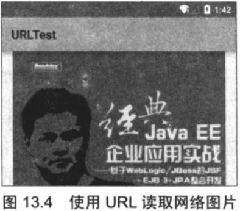
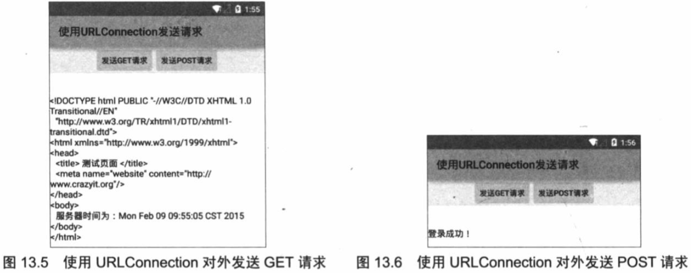

# 13.2使用URL访问网络资源

URL（Uniform Resource Locator）对象代表统一资源定位器，它是指互联网“资源”的指针。资源可以是简单的文件或目录，也可以是对更复杂的对象的引用，例如对数据库或搜索引擎的查询。通常情况而言，URL可以由协议名、主机、端口和资源组成。
> 即满足如下格式：protocol://host:port/resourceName
> 
> 例如如下的URL地址：http://www.crazyit.org/index.php

URL提供了多个构造器用于创建URL对象，一旦获得了URL对象之后，可以调用如下常用方法来访问URL对应的资源。
> String getFile（）：获取此URL的资源名。
> 
> String getHost（）：获取此URL的主机名。
> 
> String getPath（）：获取此URL的路径地址。
> 
> int getPort（）：获取此URL的端口号。
> 
> String getProtocol（）：获取此URL的协议名称。
> 
> String getQuery（）：获取此URL的查询字符串部分。
> 
> URLConnection openConnection（）：返回一个URLConnection对象，它表示到URL所引用的远程对象的连接。

## 13.2.1使用URL读取网络资源
URL对象中前面几个方法都非常容易理解，而该对象提供的openStream（）可以读取该URL资源的InputStream，通过该方法可以非常方便地读取远程资源。

下面的程序示范如何通过URL类读取远程资源。

```
public class MainActivity extends Activity
{
	ImageView show;
	// 代表从网络下载得到的图片
	Bitmap bitmap;
	Handler handler = new Handler()
	{
		@Override
		public void handleMessage(Message msg)
		{
			if(msg.what == 0x123)
			{
				// 使用ImageView显示该图片
				show.setImageBitmap(bitmap);
			}
		}
	};
	@Override
	public void onCreate(Bundle savedInstanceState)
	{
		super.onCreate(savedInstanceState);
		setContentView(R.layout.main);
		show = (ImageView) findViewById(R.id.show);
		new Thread()
		{
			public void run()
			{
				try
				{
					// 定义一个URL对象
					URL url = new URL("http://www.crazyit.org/"
							+ "attachments/month_1008/20100812_7763e970f"
							+ "822325bfb019ELQVym8tW3A.png");
					// 打开该URL对应的资源的输入流
					InputStream is = url.openStream();
					// 从InputStream中解析出图片
					bitmap = BitmapFactory.decodeStream(is);
					// 发送消息、通知UI组件显示该图片
					handler.sendEmptyMessage(0x123);
					is.close();
					// 再次打开URL对应的资源的输入流
					is = url.openStream();
					// 打开手机文件对应的输出流
					OutputStream os = openFileOutput("crazyit.png"
						, MODE_PRIVATE);
					byte[] buff = new byte[1024];
					int hasRead = 0;
					// 将URL对应的资源下载到本地
					while((hasRead = is.read(buff)) > 0)
					{
						os.write(buff, 0 , hasRead);
					}
					is.close();
					os.close();
				}
				catch (Exception e)
				{
					e.printStackTrace();
				}
			}
		}.start();
	}
}
```

上面的程序两次调用了URL对象的openStream（）方法打开URL对应的资源的输入流，程序第一次使用BitmapFactory的decodeStream（InputStream）方法来解析该输入流中的图片；第二次则使用IO将输入流中的图片下载到本地。

该程序同样需要访问互联网，因此需要授予该程序访问网络的权限，也就是需要在AndroidMainfest.xml文件中增加如下授权代码：

```
<!-- 授权访问网络 -->
<uses-permission android:name="android.permission.INTERNET"/>
```

运行该程序将可以看到如图13.4所示的输出。


如图13.4所显示的图片就是程序中URL对象所对应的图片，运行该程序不仅可以显示该URL对象所显示的图片，而且还会在手机文件系统的/data/data/org.crazyit.net/files/目录下生成crazyit.png图片，该图片就是通过URL从网络上下载的图片。

## 13.2.2使用URLConnection提交请求

URL的openConnection（）方法将返回一个URLConnection对象，该对象表示应用程序和URL之间的通信连接。程序可以通过URLConnection实例向该URL发送请求，读取URL引用的资料。

通常创建一个和URL的连接，并发送请求、读取此URL引用的资源需要如下几个步骤。
> 1.通过调用URL对象openConnection（）方法来创建URLConnection对象。
> 
> 2.设置URLConnection的参数和普通请求属性。
> 
> 3.如果只是发送GET方式请求，使用connect方法建立和远程资源之间的实际连接即可；如果需要发送POST方式的请求，需要获取URLConnection实例对应的输出流来发送请求参数。
> 
> 4.远程资源变为可用，程序可以访问远程资源的头字段，或通过输入流读取远程的数据。

在建立和远程资源的实际连接之前，程序可以用过如下方法来设置请求头字段。
> setAllowUserInteraction：设置该URLConnection的allowUserInteraction请求头字段的值。
> 
> setDoInput：设置该URLConnection的doInput请求头字段的值。
> 
> setDoOutput：设置该URLURLConnection的doOutput请求头字段的值。
> 
> setIfModifiedSince：设置该URLConnection的ifModifiedSince请求头字段的值。
> 
> setUseCaches：设置该URLConnection的useCaches请求头字段的值。除此之外，还可以使用如下方法来设置或增加通用的头字段。
> 
> setRequestPtoperty（String key，String value）：设置该URLConnection的key请求头字段的值为value，如以下代码所示：conn.setRequestProperty("accept","* / *")
> 
> addRequestProperty（String key，String value）：为该URLConnection的key请求头字段增加value值，该方法并不会覆盖原请求头字段的值，而是将新值追加到请求头字段中。当远程资源可用之后，程序可以使用以下方法来访问头字段和内容。
> 
> Object getContent（）：获取该URLConnection的内容。
> 
> String getHeaderField（String name）：获取指定响应头字段的值。
> 
> getInputStream（）：返回该URLConnection对应的输入流，用于获取URLConnection响应的内容。
> 
> getOutputStream（）：返回该URLConnection对应的输出流，用于向URLConnection发送请求参数。

getHeaderField（）方法用于根据响应头字段来返回对应的值。而某些头字段由于经常需要访问，所以Java提供了一下方法来访问特定响应头字段的值。
> getContentEncoding（）：获取content-encoding响应头字段的值。
> 
> getContentLength（）：获取content-length响应头字段的值。
> 
> getContentType（）：获取content-type响应头字段的值。
> 
> getDate（）：获取date响应头字段的值。
> 
> getExpiration（）：获取expires响应头字段的值。
> 
> getLastModified（）：获取last-modified响应头字段的值。

下面的程序示范了如何向Web站点发送GET请求、POST请求，并从Web站点取得响应。该程序中用到一个发送GET、POST请求的工具类，该工具类的代码如下。

```
public class GetPostUtil
{
	/**
	 * 向指定URL发送GET方法的请求
	 * @param url 发送请求的URL
	 * @param params 请求参数，请求参数应该是name1=value1&name2=value2的形式。
	 * @return URL所代表远程资源的响应
	 */
	public static String sendGet(String url, String params)
	{
		String result = "";
		BufferedReader in = null;
		try
		{
			String urlName = url + "?" + params;
			URL realUrl = new URL(urlName);
			// 打开和URL之间的连接
			URLConnection conn = realUrl.openConnection();
			// 设置通用的请求属性
			conn.setRequestProperty("accept", "*/*");
			conn.setRequestProperty("connection", "Keep-Alive");
			conn.setRequestProperty("user-agent",
					"Mozilla/4.0 (compatible; MSIE 6.0; Windows NT 5.1; SV1)");
			// 建立实际的连接
			conn.connect();  // ①
			// 获取所有响应头字段
			Map<String, List<String>> map = conn.getHeaderFields();
			// 遍历所有的响应头字段
			for (String key : map.keySet())
			{
				System.out.println(key + "--->" + map.get(key));
			}
			// 定义BufferedReader输入流来读取URL的响应
			in = new BufferedReader(
					new InputStreamReader(conn.getInputStream()));
			String line;
			while ((line = in.readLine()) != null)
			{
				result += "\n" + line;
			}
		}
		catch (Exception e)
		{
			System.out.println("发送GET请求出现异常！" + e);
			e.printStackTrace();
		}
		// 使用finally块来关闭输入流
		finally
		{
			try
			{
				if (in != null)
				{
					in.close();
				}
			}
			catch (IOException ex)
			{
				ex.printStackTrace();
			}
		}
		return result;
	}
	/**
	 * 向指定URL发送POST方法的请求
	 * @param url 发送请求的URL
	 * @param params 请求参数，请求参数应该是name1=value1&name2=value2的形式。
	 * @return URL所代表远程资源的响应
	 */
	public static String sendPost(String url, String params)
	{
		PrintWriter out = null;
		BufferedReader in = null;
		String result = "";
		try
		{
			URL realUrl = new URL(url);
			// 打开和URL之间的连接
			URLConnection conn = realUrl.openConnection();
			// 设置通用的请求属性
			conn.setRequestProperty("accept", "*/*");
			conn.setRequestProperty("connection", "Keep-Alive");
			conn.setRequestProperty("user-agent",
					"Mozilla/4.0 (compatible; MSIE 6.0; Windows NT 5.1; SV1)");
			// 发送POST请求必须设置如下两行
			conn.setDoOutput(true);
			conn.setDoInput(true);
			// 获取URLConnection对象对应的输出流
			out = new PrintWriter(conn.getOutputStream());
			// 发送请求参数
			out.print(params);  // ②
			// flush输出流的缓冲
			out.flush();
			// 定义BufferedReader输入流来读取URL的响应
			in = new BufferedReader(
					new InputStreamReader(conn.getInputStream()));
			String line;
			while ((line = in.readLine()) != null)
			{
				result += "\n" + line;
			}
		}
		catch (Exception e)
		{
			System.out.println("发送POST请求出现异常！" + e);
			e.printStackTrace();
		}
		// 使用finally块来关闭输出流、输入流
		finally
		{
			try
			{
				if (out != null)
				{
					out.close();
				}
				if (in != null)
				{
					in.close();
				}
			}
			catch (IOException ex)
			{
				ex.printStackTrace();
			}
		}
		return result;
	}
}
```

从上面的程序可以看出，如果需要发送GET请求，只要URLConnection的connect（）方法去建立市级的连接即可，如以上程序中①号粗体字代码所示。如果需要发送POST请求，则需要获取URLConnection的OutputStream，然后再向网络中输出请求参数，如以上程序中②号粗体字代码所示。

提供了上面发送GET请求、POST请求的工具类之后，接下来就可以在Activity类中通过该工具类来发送请求了。该程序的界面中包含两个按钮，一个按钮用于发送GET请求，一个按钮用于发送POST请求。程序还提供了一个EditText来显示远程服务器的响应。该程序的界面布局很简单，故此处不再给出界面布局文件。该程序的Activity代码如下。

```
public class MainActivity extends Activity
{
	Button get , post;
	TextView show;
	// 代表服务器响应的字符串
	String response;
	Handler handler = new Handler()
	{
		@Override
		public void handleMessage(Message msg)
		{
			if(msg.what == 0x123)
			{
				// 设置show组件显示服务器响应
				show.setText(response);
			}
		}
	};
	@Override
	public void onCreate(Bundle savedInstanceState)
	{
		super.onCreate(savedInstanceState);
		setContentView(R.layout.main);
		get = (Button) findViewById(R.id.get);
		post = (Button) findViewById(R.id.post);
		show = (TextView)findViewById(R.id.show);
		get.setOnClickListener(new OnClickListener()
		{
			@Override
			public void onClick(View v)
			{
				new Thread()
				{
					@Override
					public void run()
					{
						response = GetPostUtil.sendGet(
								"http://192.168.1.88:8888/abc/a.jsp"
								, null);
						// 发送消息通知UI线程更新UI组件
						handler.sendEmptyMessage(0x123);
					}
				}.start();
			}
		});
		post.setOnClickListener(new OnClickListener()
		{
			@Override
			public void onClick(View v)
			{
				new Thread()
				{
					@Override
					public void run()
					{
						response = GetPostUtil.sendPost(
								"http://192.168.1.88:8888/abc/login.jsp"
								, "name=crazyit.org&pass=leegang");
					}
				}.start();
				// 发送消息通知UI线程更新UI组件
				handler.sendEmptyMessage(0x123);
			}
		});
	}
}
```

上面程序中的两行粗体字代码分别用于发送GET请求、POST请求，该程序锁发送的GET请求、POST请求都是向本地局域网内http://192.168.1.88:8888/abc应用下的两个页面发送的，这个应用实际上是部署在笔者本机上的Web应用。

在Web服务器中成功部署abc应用之后，运行上面的Android应用，单击”发送GET请求“按钮，将可以看到如图13.5所示的输出。

如果单击”发送POST请求“按钮，程序将会向abc应用下的login.jsp页面发送请求，并提交name=crazyit.org&pass=leegang请求参数，此时可以看到如图13.6所示的输出。


从上面的介绍可以发现，借助于URLConnection类的帮助，应用程序可以非常方便地与指定站点交换信息，包括发送GET请求、POST请求，并获取网站的响应等。

