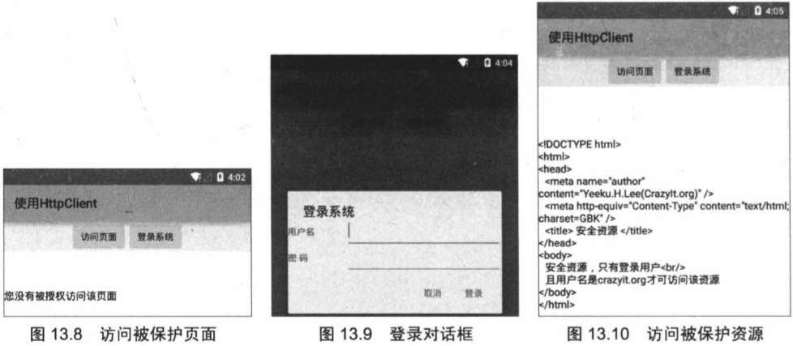

# 13.3使用HTTP访问网络

前面介绍了URLConnection可以非常方便地与指定站点交换信息，URLConnection还有一个子类：HttpURLConnection，HttpURLConnection在URLConnection的基础上做了进一步改进，增加了一些用于操作HTTP资源的便捷方法。

## 13.3.1使用HttpURLConnection

HttpURLConnection继承了URLConnection，因此也可用于向指定网站发送GET请求、POST请求。它在URLConnection的基础上提供了如下便捷的方法。
> int getResponseCode（）：获取服务器的响应代码。
> 
> String getResponseMessage（）：获取服务器的响应消息。
> 
> String getRequestMethod（）：获取发送请求的方法。
> 
> void setRequestMethod（String method）：设置发送请求的方法。

下面通过一个应用实例来示范使用HttpURLConnection实现多线程下载。
### **实例：多线程下载**
使用多线程下载文件可以更快地完成文件的下载，因为客户端启动多条线程进行下载就意味着服务器也需要为客户端提供相应的服务。假设服务器同事最多服务100个用户，在服务器中一条线程对用一个用户，100条线程在计算机内并发执行，也就是由CPU划分时间片轮流执行，如果A应用使用了99条线程下载文件，那么相当于占用了99个用户的资源，自然就拥有了较快的下载速度。

为了实现多线程下载，程序可按如下步骤进行。
> 1.创建URL对象。
> 
> 2.获取指定URL对象所指向资源的大小（由getContentLength（）方法实现），此处用到了HttpURLConnection类。
> 
> 3.在本地磁盘上创建一个与网络资源相同大小的空文件。
> 
> 4.计算每条线程应该下载网络资源的哪个部分（从哪个字节开始，到哪个字节结束）。
> 
> 5.一次创建、启动多条线程来下载网络资源的额指定部分。

```
public class DownUtil
{
	// 定义下载资源的路径
	private String path;
	// 指定所下载的文件的保存位置
	private String targetFile;
	// 定义需要使用多少线程下载资源
	private int threadNum;
	// 定义下载的线程对象
	private DownThread[] threads;
	// 定义下载的文件的总大小
	private int fileSize;
	public DownUtil(String path, String targetFile, int threadNum)
	{
		this.path = path;
		this.threadNum = threadNum;
		// 初始化threads数组
		threads = new DownThread[threadNum];
		this.targetFile = targetFile;
	}
	public void download() throws Exception
	{
		URL url = new URL(path);
		HttpURLConnection conn = (HttpURLConnection) url.openConnection();
		conn.setConnectTimeout(5 * 1000);
		conn.setRequestMethod("GET");
		conn.setRequestProperty(
				"Accept",
				"image/gif, image/jpeg, image/pjpeg, image/pjpeg, "
						+ "application/x-shockwave-flash, application/xaml+xml, "
						+ "application/vnd.ms-xpsdocument, application/x-ms-xbap, "
						+ "application/x-ms-application, application/vnd.ms-excel, "
						+ "application/vnd.ms-powerpoint, application/msword, */*");
		conn.setRequestProperty("Accept-Language", "zh-CN");
		conn.setRequestProperty("Charset", "UTF-8");
		conn.setRequestProperty("Connection", "Keep-Alive");
		// 得到文件大小
		fileSize = conn.getContentLength();
		conn.disconnect();
		int currentPartSize = fileSize / threadNum + 1;
		RandomAccessFile file = new RandomAccessFile(targetFile, "rw");
		// 设置本地文件的大小
		file.setLength(fileSize);
		file.close();
		for (int i = 0; i < threadNum; i++)
		{
			// 计算每条线程的下载的开始位置
			int startPos = i * currentPartSize;
			// 每个线程使用一个RandomAccessFile进行下载
			RandomAccessFile currentPart = new RandomAccessFile(targetFile,
					"rw");
			// 定位该线程的下载位置
			currentPart.seek(startPos);
			// 创建下载线程
			threads[i] = new DownThread(startPos, currentPartSize,
					currentPart);
			// 启动下载线程
			threads[i].start();
		}
	}
	// 获取下载的完成百分比
	public double getCompleteRate()
	{
		// 统计多条线程已经下载的总大小
		int sumSize = 0;
		for (int i = 0; i < threadNum; i++)
		{
			sumSize += threads[i].length;
		}
		// 返回已经完成的百分比
		return sumSize * 1.0 / fileSize;
	}
	private class DownThread extends Thread
	{
		// 当前线程的下载位置
		private int startPos;
		// 定义当前线程负责下载的文件大小
		private int currentPartSize;
		// 当前线程需要下载的文件块
		private RandomAccessFile currentPart;
		// 定义已经该线程已下载的字节数
		public int length;
		public DownThread(int startPos, int currentPartSize,
						  RandomAccessFile currentPart)
		{
			this.startPos = startPos;
			this.currentPartSize = currentPartSize;
			this.currentPart = currentPart;
		}
		@Override
		public void run()
		{
			try
			{
				URL url = new URL(path);
				HttpURLConnection conn = (HttpURLConnection)url
						.openConnection();
				conn.setConnectTimeout(5 * 1000);
				conn.setRequestMethod("GET");
				conn.setRequestProperty(
						"Accept",
						"image/gif, image/jpeg, image/pjpeg, image/pjpeg, "
								+ "application/x-shockwave-flash, application/xaml+xml, "
								+ "application/vnd.ms-xpsdocument, application/x-ms-xbap, "
								+ "application/x-ms-application, application/vnd.ms-excel, "
								+ "application/vnd.ms-powerpoint, application/msword, */*");
				conn.setRequestProperty("Accept-Language", "zh-CN");
				conn.setRequestProperty("Charset", "UTF-8");
				InputStream inStream = conn.getInputStream();
				// 跳过startPos个字节，表明该线程只下载自己负责的那部分文件
				skipFully(inStream, this.startPos);
//				inStream.skip(this.startPos);
				byte[] buffer = new byte[1024];
				int hasRead = 0;
				// 读取网络数据，并写入本地文件
				while (length < currentPartSize
						&& (hasRead = inStream.read(buffer)) > 0)
				{
					currentPart.write(buffer, 0, hasRead);
					// 累计该线程下载的总大小
					length += hasRead;
				}
				currentPart.close();
				inStream.close();
			}
			catch (Exception e)
			{
				e.printStackTrace();
			}
		}
	}

	// 定义一个为InputStream跳过bytes字节的方法
	public static void skipFully(InputStream in, long bytes) throws IOException
	{
		long remainning = bytes;
		long len = 0;
		while (remainning > 0)
		{
			len = in.skip(remainning);
			remainning -= len;
		}
	}
}
```

上面的DownUtil工具类中包括一个DownloadThread内部类，该内部类的run（）方法负责打开远程资源的输入流，并调用InputStream的skip（int）方法跳过指定数量的字节，这样就让该线程读取由它自己负责下载的部分了。

提供了上面的DownUtil工具类之后，接下来就可以在Activity中调用该DownUtil类来执行下载任务了。该程序界面中包含两个文本框：一个用于输入网络文件的源路径；另一个用于指定下载到本地的文件的文件名。该程序的界面比较简单，故此处不在给出界面布局代码。该程序的Activity代码如下。

```
public class MainActivity extends Activity
{
	EditText url;
	EditText target;
	Button downBn;
	ProgressBar bar;
	DownUtil downUtil;
	private int mDownStatus;
	@Override
	public void onCreate(Bundle savedInstanceState)
	{
		super.onCreate(savedInstanceState);
		setContentView(R.layout.main);
		// 获取程序界面中的三个界面控件
		url = (EditText) findViewById(R.id.url);
		target = (EditText) findViewById(R.id.target);
		downBn = (Button) findViewById(R.id.down);
		bar = (ProgressBar) findViewById(R.id.bar);
		// 创建一个Handler对象
		final Handler handler = new Handler()
		{
			@Override
			public void handleMessage(Message msg)
			{
				if (msg.what == 0x123)
				{
					bar.setProgress(mDownStatus);
				}
			}
		};
		downBn.setOnClickListener(new OnClickListener()
		{
			@Override
			public void onClick(View v)
			{
				// 初始化DownUtil对象（最后一个参数指定线程数）
				downUtil = new DownUtil(url.getText().toString(),
						target.getText().toString(), 6);
				new Thread()
				{
					@Override
					public void run()
					{
						try
						{
							// 开始下载
							downUtil.download();
						}
						catch (Exception e)
						{
							e.printStackTrace();
						}
						// 定义每秒调度获取一次系统的完成进度
						final Timer timer = new Timer();
						timer.schedule(new TimerTask()
						{
							@Override
							public void run()
							{
								// 获取下载任务的完成比例
								double completeRate = downUtil
										. getCompleteRate();
								mDownStatus = (int) (completeRate * 100);
								// 发送消息通知界面更新进度条
								handler.sendEmptyMessage(0x123);
								// 下载完全后取消任务调度
								if (mDownStatus >= 100)
								{
									timer.cancel();
								}
							}
						}, 0, 100);
					}
				}.start();
			}
		});
	}
}
```

上面的Activity不仅使用了DownUtil来控制程序下载，而且程序还启动了一个定时器，该定时器控制每隔0.1秒查询一次下载进度，并通过程序中的进度条来显示任务的下载进度。

该程序不仅需要访问网络，还需要访问系统SD卡，在SD卡中创建文件，因此必须授予该程序访问网络、访问SD卡文件的权限，也就是在AndroidMainifest.xml文件中增加如下配置：
> \<!-- 配置在SD卡中创建与删除文件权限 -->
> 
> \<uses-permission android.name=“android.permission.MOUNT\_UNMOUNT_FILESYSTEMS”/>
> 
> \<!-- 配置向SD卡写入数据权限 -->
> 
> \<uses-permission android：name=“android.permission.WRITE\_EXTERNAL_STORAGE”/>
> 
> \<!-- 授权访问网络 -->
> 
> \<uses-permission android：name=“android.permission.INTERNET”/>

运行该程序，将看到如图13.7所示的下载界面。


## 13.3.2使用Apache HttpClient

在一般情况下，如果只是需要向Web站点的某个简单页面提交请求并获取服务器响应，则完全可以使用前面所介绍的HttpURLConnection来完成。但在绝大部分情况下，Web站点的网页可能没这么简单，这些页面并不是通过一个简单的URL就可访问的，可能需要用户登录而且具有相应的权限才可访问该页面。在这种情况下，就需要设计Session、Cookie的处理了，如果打算使用HttpURLConnection来处理这些细节，当然也是可能实现的，只是处理起来难度就大了。

为了更好地处理向Web站点请求，包括Session、Cookie等细节问题，Apache开源组织提供了一个HttpClient项目，看它的名称就知道，它是一个简单的HTTP客户端（并不是浏览器），可以用于发送HTTP请求，接受HTTP响应。但不会缓存服务器的响应，不能执行HTML页面中嵌入的JavaScript代码：也不会对页面内容进行任何解析、处理。

Android已经成功地继承了HttpClient，这意味着开发人员可以直接在Android应用中使用HttpClient来提交请求、接受响应。

使用HttpClient发送请求、接收响应很简单，只要如下几步即可。
> 1.创建HttpClient对象。
> 
> 2.如果需要发送GET请求，则创建HttpGet对象；如果需要发送POST请求，则创建HttpPost对象。
> 
> 3.如果需要发送请求参数，则可调用HttpGet、HttpPost共同的setParams（HttpParams params）方法来添加请求参数；对于HttpPost对象而言，也可调用setEntity（HttpEntity entity）方法来设置请求参数。
> 
> 4.调用HttpClient对象的execute（HttpUriRequest request）方法发送请求，执行该方法返回一个HttpResponse。
> 
> 5.调用HttpResponse的getAllHeaders（）、getHeaders（String name）等方法可获取服务器的响应头；调用HttpResponse的getEntity（）方法可获取HttpEntity对象，该对象可包装了服务器的响应内容。程序可通过该对象获取服务器的响应内容。

### **实例：访问被保护资源**

下面的Android应用需要向指定页面发送请求，但该页面并不是一个简单的页面，只有当用户已经登录，而且登录用户名是crazyit.org时才可访问该页面。如果使用HttpURLConnection来访问该页面，那么需要处理的细节就复杂多了。下面将会借助于HttpClient来访问被保护页面。

访问Web应用中被保护页面，如果使用浏览器则十分简单，用户通过系统提供的登录页面登录系统，浏览器会负责维护与服务器之间的Session，如果用户登录的用户名、密码符合要求，就可以访问被保护资源了。

为了通过HttpClient来访问被保护页面，程序同样需要使用HttpClient来登录系统，只要应用程序使用同一个HttpClient发送请求，HttpClient就会自动维护与服务器之间的Session状态。也就是说，程序第一次使用HttpClient后，接下来使用HttpClient即可访问被保护页面了。

下面是该程序的代码。

```
public class MainActivity extends Activity
{
	TextView response;
	HttpClient httpClient;
	Handler handler = new Handler()
	{
		public void handleMessage(Message msg)
		{
			if(msg.what == 0x123)
			{
				// 使用response文本框显示服务器响应
				response.append(msg.obj.toString() + "\n");
			}
		}
	};
	@Override
	public void onCreate(Bundle savedInstanceState)
	{
		super.onCreate(savedInstanceState);
		setContentView(R.layout.main);
		// 创建DefaultHttpClient对象
		httpClient = new DefaultHttpClient();
		response = (TextView) findViewById(R.id.response);
	}
	public void accessSecret(View v)
	{
		response.setText("");
		new Thread()
		{
			@Override
			public void run()
			{
				// 创建一个HttpGet对象
				HttpGet get = new HttpGet(
						"http://192.168.1.88:8888/foo/secret.jsp");  // ①
				try
				{
					// 发送GET请求
					HttpResponse httpResponse = httpClient.execute(get);  // ②
					HttpEntity entity = httpResponse.getEntity();
					if (entity != null)
					{
						// 读取服务器响应
						BufferedReader br = new BufferedReader(
								new InputStreamReader(entity.getContent()));
						String line = null;

						while ((line = br.readLine()) != null)
						{
							Message msg = new Message();
							msg.what = 0x123;
							msg.obj = line;
							handler.sendMessage(msg);
						}
					}
				}
				catch (Exception e)
				{
					e.printStackTrace();
				}
			}
		}.start();
	}
	public void showLogin(View v)
	{
		// 加载登录界面
		final View loginDialog = getLayoutInflater().inflate(
				R.layout.login, null);
		// 使用对话框供用户登录系统
		new AlertDialog.Builder(MainActivity.this)
				.setTitle("登录系统")
				.setView(loginDialog)
				.setPositiveButton("登录",
						new DialogInterface.OnClickListener()
						{
							@Override
							public void onClick(DialogInterface dialog,
												int which)
							{
								// 获取用户输入的用户名、密码
								final String name = ((EditText) loginDialog
										.findViewById(R.id.name)).getText()
										.toString();
								final String pass = ((EditText) loginDialog
										.findViewById(R.id.pass)).getText()
										.toString();
								new Thread()
								{
									@Override
									public void run()
									{
										try
										{
											HttpPost post = new HttpPost("http://192.168"
													+ ".1.88:8888/foo/login.jsp");//③
											// 如果传递参数个数比较多，可以对传递的参数进行封装
											List<NameValuePair> params = new ArrayList<>();
											params.add(new BasicNameValuePair
													("name", name));
											params.add(new BasicNameValuePair
													("pass", pass));
											// 设置请求参数
											post.setEntity(new UrlEncodedFormEntity(
													params, HTTP.UTF_8));
											// 发送POST请求
											HttpResponse response = httpClient
													.execute(post);  //④
											// 如果服务器成功地返回响应
											if (response.getStatusLine()
													.getStatusCode() == 200)
											{
												String msg = EntityUtils
														.toString(response.getEntity());
												Looper.prepare();
												// 提示登录成功
												Toast.makeText(MainActivity.this,
														msg, Toast.LENGTH_SHORT).show();
												Looper.loop();
											}
										}
										catch (Exception e)
										{
											e.printStackTrace();
										}
									}
								}.start();
							}
						}).setNegativeButton("取消", null).show();
	}
}
```

上面程序中的①、②号代码先创建了一个HttpGet对象，接下来程序调用HttpClient的execute（）方法发送GET请求；程序中③、④号代码先创建了一个HttpPost对象，接下来程序调用了HttpClient的execute（）方法发送POST请求。上面的GET请求用于获取服务器上的被保护页面，POST请求用于登录系统。

运行该程序，单击“访问页面”按钮，将可以看到如图13.8的页面。

从图13.8可以看出，程序直接向指定Web应用的被保护页面secret.jsp发送请求，程序将访问被保护页面，于是看到图13.8所示的页面。单击图13.8所示页面中的“登录系统”按钮，系统将会显示如图13.9所示的登录对话框。

在图13.9所示对话框的两个输入框中分别输入“crazyit.org”、“leegang”，然后单击“登录”按钮，系统将会向Web站点的login.jsp页面发送POST请求，并将用户输入的用户名、密码作为请求参数。如果用户名、密码正确，即可看到登录成功的提示。

登录成功后，HttpClient将会自动维护与服务器之间的连接，并维护与服务器之间的Session状态，再次单击程序中的“访问页面”按钮，即可看到如图13.10所示的输出。


从图13.10可以看出，此时使用HttpClient发送GET请求即可正常访问被保护资源，这就是因为前面使用了HttpClient登录了系统，而且HttpClient可以维护与服务器之间的Session连接。

从上面的编程过程不难看出，使用Apache的HttpClient更加简单，而且它比HttpURLConnection提供了更多的功能。


