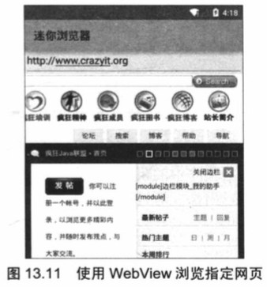
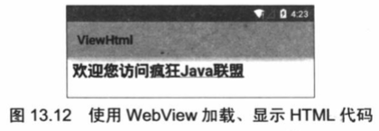
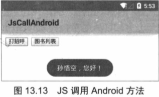
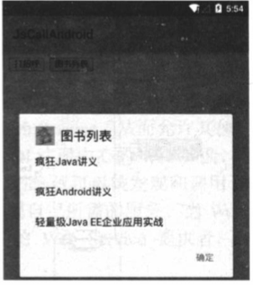

# 13.4 Android 5.0 增强的WebView
Android提供了WebView组件，从表面上看，这个组件与普通ImageView差不多，但实际上这个组件的功能要强大得多，WebView组件本身就是一个浏览器实现，Android5.0增强的WebView基于Chromium M37，直接支持WebRTC、WebAudio和WebGL。  

Chromium M37也包括对Web组件规范的原生支持，如自定义元素、阴影DOM、HTML导入和模版等，这意味着开发者可以直接在WebView中使用聚合（Polymer）和Material设计。

## 13.4.1 使用 WebView 浏览网页
WebView的用法与普通ImageView组件的用法基本相似，它提供了大量方法来执行浏览器操作，例如如下常用方法。

* void goBack():后退
* void goForward():前进
* void loadUrl(String url):加载指定URL对应的网页。
* boolean zoomIn():放大网页。
* boolean zoomOut():缩小网页。  

当然，WebView组件还包含了大量方法，具体以Android API文档为准。  

下面的程序将基于WebView来开发一个简单的浏览器。  
实例：迷你浏览器
---
该程序的界面包含两个组件：一个文本框用于接收用户输入的URL：一个WebView用于加载并显示该URL对应的页面。该程序的界面布局代码如下。

<p align = "center">
程序清单：codes\13\13.4\MiniBrower\app\src\main\res\layout\mian.xml
</p>
``` xml
<?xml version="1.0" encoding="utf-8"?>
<LinearLayout xmlns:android="http://schemas.android.com/apk/res/android"
	android:orientation="vertical"
	android:layout_width="match_parent"
	android:layout_height="match_parent">
	<EditText
		android:id="@+id/url"
		android:layout_width="match_parent"
		android:layout_height="wrap_content"
		/>
	<!-- 显示页面的WebView组件 -->
	<WebView
		android:id="@+id/show"
		android:layout_width="match_parent"
		android:layout_height="match_parent"
		/>
</LinearLayout>
```

下面程序则主要通过WebView的loadUrl(String url) 来加载、显示指定URL对应的页面。

<p align = "center">
程序清单：codes\13\13.4\MiniBrower\app\src\main\java\org\crazyit\net\MainActivity.java
</p>
```java
public class MainActivity extends Activity
{
	EditText url;
	WebView show;
	@Override
	public void onCreate(Bundle savedInstanceState)
	{
		super.onCreate(savedInstanceState);
		setContentView(R.layout.main);
		// 获取页面中文本框、WebView组件
		url = (EditText) findViewById(R.id.url);
		show = (WebView) findViewById(R.id.show);
	}
	@Override
	public boolean onKeyDown(int keyCode, KeyEvent event)
	{
		if (keyCode == KeyEvent.KEYCODE_MENU)
		{
			String urlStr = url.getText().toString();
			// 加载、并显示urlStr对应的网页
			show.loadUrl(urlStr);
			return true;
		}
		return false;
	}
}
```
上面程序中的粗体字代码是该程序的关键，程序调用WebView的loadUrl(String url)方法加载、显示该URL对应的网页——至于该WebView如何发送请求、如何解析服务器响应，这些细节对用户来说是透明的。

该应用需要访问互联网，同样需要在AndroidManifest.xml文件中增加如下的配置：
>&lt;users-permission android:name="android.permission.INTERNET"/>

运行该程序，在文本框中输入想访问的站点，并单击手机的“搜索”按钮，将可以看到如图13.11所示的输出。

正如从图13.11所看到的，使用WebView开发浏览器十分简单，如果读者愿意多花时间对该程序界面进行美化，并为程序提供前进、后退、刷新等按钮，即可开发出一个实用的浏览器来代替Android系统自带的浏览器。  



####提示

Android系统自带的浏览器其实也是基于开源的WebKit引擎实现的。

##13.4.2 使用WebView加载HTML代码

前面看到使用EditText显示HTML字符串时十分别扭，EditText不会对HTML标签进行任何解析，而是直接把所有HTML标签都显示出来——就像用普通记事本显示一样；如果应用程序想重新对HTML字符串进行解析，当成HTML页面显示，也是可以的。

WebView提供了一的loadData(String data, String mimeType, String encoding)方法，该方法可用于加载并显示HTML代码。但在实际使用过程中，笔者发现这个方法有一个小问题：当它加载包含中文的HTML内容时，WebView将会显示乱码。

好在WebView还提供了一个loadDataWithBaseURL(String baseUrl, String data, String mimeType, String encoding, String historyUrl)方法，该方法是loadData(String data, String mimeType, String encoding)方法的增强版，它不会产生乱码。关于该方法的几个参数简单说明如下。
* data:指定需要加载的HTML代码。
* mimeType:指定HTML代码的MIME类型，对于HTML代码可指定为text/html。
* encoding:指定HTML代码编码所用的字符集。比如指定为GBK。

下面的程序简单示范了如何使用WebView来加载HTML代码。
<p align = "center">
程序清单：codes\13\13.4\ViewHtml\app\src\main\java\org\crazyit\net\netMainActivity.java
</p>

```java
public class MainActivity extends Activity
{
	WebView show;
	@Override
	public void onCreate(Bundle savedInstanceState)
	{
		super.onCreate(savedInstanceState);
		setContentView(R.layout.main);
		// 获取程序中的WebView组件
		show = (WebView) findViewById(R.id.show);
		StringBuilder sb = new StringBuilder();
		// 拼接一段HTML代码
		sb.append("<html>");
		sb.append("<head>");
		sb.append("<title> 欢迎您 </title>");
		sb.append("</head>");
		sb.append("<body>");
		sb.append("<h2> 欢迎您访问<a href=\"http://www.crazyit.org\">"
				+ "疯狂Java联盟</a></h2>");
		sb.append("</body>");
		sb.append("</html>");
		// 使用简单的loadData方法会导致乱码，可能是Android API的Bug
		// show.loadData(sb.toString() , "text/html" , "utf-8");
		// 加载、并显示HTML代码
		show.loadDataWithBaseURL(null, sb.toString()
				, "text/html" , "utf-8", null);
	}
}
```

上面程序中的粗体字代码就是该程序的关键，这行代码负责加载指定的HTML页面，并将它显示出来。运行该程序，将可以看到如图13.12的输出。



##13.4.3 使用WebView中的JavaScript调用Android方法

很多时候，WebView加载的页面上是带JavaScript脚本的，比如页面上有一个按钮，用户单击按钮时将会弹出一个提示框，或打开一个列表框等。由于该按钮是HTML页面上的按钮，它只能激发一段JavaScript脚本，这就需要让JavaScript脚本来调用Android方法了。

为了让WebView中的JavaScript脚本调用Android方法，WebView提供了一个配套的WebSettings工具类，该工具类提供了大量的方法来管理WebView的选项设置，其中它的setJavaScriptEnabled(true)即可让WebView中的JavaScript脚本来调用Android方法。除此之外，addJavaScriptInterface(Object object, String name)方法，该方法负责把object对象暴露成JavaScript中的name对象。

从上面的介绍可以看出，在WebView的JavaScript中调用Android方法只要如下三个步骤。
1. 调用WebView关联的WebSettings的setJavascriptEnabled(true)启用JavaScript调用功能。
2. 调用WebView的addJavascriptInterface(Object object, String name)方法将object对象暴露给JavaScript脚本。

在JavaScript脚本中通过刚才暴露的name对象调用Android方法。
####提示

如果读者有DWR开发经验，应该很好理解Android此处的设计，DWR通过使用配置，可以让服务端的Java对象暴露给JavaScript脚本；Android则通过WebView的addJavascriptInterface()把Android应用中的对象暴露给JavaScript脚本——最后实现的效果是相同的：JavaScript脚本可以直接调用Java对象的方法。

下面的示例示范了如何在JavaScript中调用Android方法。该示例的界面布局很简单，它包含了一个普通的WebView组件，用于显示HTML页面。该示例的Activity代码如下。

<p align = "center">
程序清单：codes\13\13.4\JsCallAndroid\app\src\main\java\org\crazyit\net\MainActivity.java
</p>

```java
public class MainActivity extends Activity
{
	WebView myWebView;
	@Override
	public void onCreate(Bundle savedInstanceState)
	{
		super.onCreate(savedInstanceState);
		setContentView(R.layout.main);
		myWebView = (WebView) findViewById(R.id.webview);
		// 此处为了简化编程，使用file协议加载本地assets目录下的HTML页面
		// 如果有需要，也可使用http协议加载远程网站的HTML页面
		myWebView.loadUrl("file:///android_asset/test.html");
		// 获取WebView的设置对象
		WebSettings webSettings = myWebView.getSettings();
		// 开启JavaScript调用
		webSettings.setJavaScriptEnabled(true);
		// 将MyObject对象暴露给JavaScript脚本
		// 这样test.html页面中的JavaScript可以通过myObj来调用MyObject的方法
		myWebView.addJavascriptInterface(new MyObject(this), "myObj");
	}
}
```

上面程序中的第一行粗体字代码开启了JavaScript调用Android方法的功能，第二行粗体字代码负责将Android应用中的MyObject对象暴露给JavaScript脚本，暴露成JavaScript脚本中名为myObj的对象。

MyObject是一个自定义的Java类，开发者可以根据业务需要提供任意多的方法，本示例只为MyObject定义了两个方法。下面是MyObject类的代码。

<p align = "center">
程序清单：codes\13\13.4\JsCallAndroid\app\src\main\java\org\crazyit\net\MyObject.java
</p>
```java
public class MyObject
{
	Context mContext;
	MyObject(){}
	MyObject(Context c)
	{
		mContext = c;
	}
	// 该方法将会暴露给JavaScript脚本调用
	@JavascriptInterface
	public void showToast(String name)
	{
		Toast.makeText(mContext, name + "，您好！"
				, Toast.LENGTH_LONG).show();
	}
	// 该方法将会暴露给JavaScript脚本调用
	@JavascriptInterface
	public void showList()
	{
		// 显示一个普通的列表对话框
		new AlertDialog.Builder(mContext)
				.setTitle("图书列表")
				.setIcon(R.drawable.ic_launcher)
				.setItems(new String[]{"疯狂Java讲义"
						, "疯狂Android讲义" , "轻量级Java EE企业应用实战"} , null)
				.setPositiveButton("确定", null)
				.create()
				.show();
	}
}
```

正如上面的代码所示，MyObject中包含了两个方法——showToast()和showList()方法，且这两个方法使用了@JavascriptInterface修饰，因此这两个方法将会暴露给JavaScript脚本，从而允许JavaScript脚本通过myObj来调用这两个方法。下面是HTML页面的代码。

<p align = "center">
程序清单：codes\13\13.4\JsCallAndroid\app\src\main\assets\test.html
</p>
```html
<!DOCTYPE html>
<html>
<head>
	<meta http-equiv="Content-Type" content="text/html; charset=utf-8" />
	<title> Js调用Android </title>
</head>
<body>
<!-- 注意此处的myObj是Android暴露出来的对象 -->
<input type="button" value="打招呼" onclick="myObj.showToast('孙悟空');" />
<input type="myObj.showList();" />
</body>
</html>
```

正如上面的两行粗体字代码所示，当用户单击该页面上的两个按钮时，该页面的JavaScript脚本会通过myObj调用Android方法。运行该示例，单击第一个按钮，可以看到如图13.13所示的界面。

如果用户单击第二个按钮，该页面的JavaScript脚本将会通过myObj调用Android的showList()方法，此时将会看到如图13.14所示的对话框。






