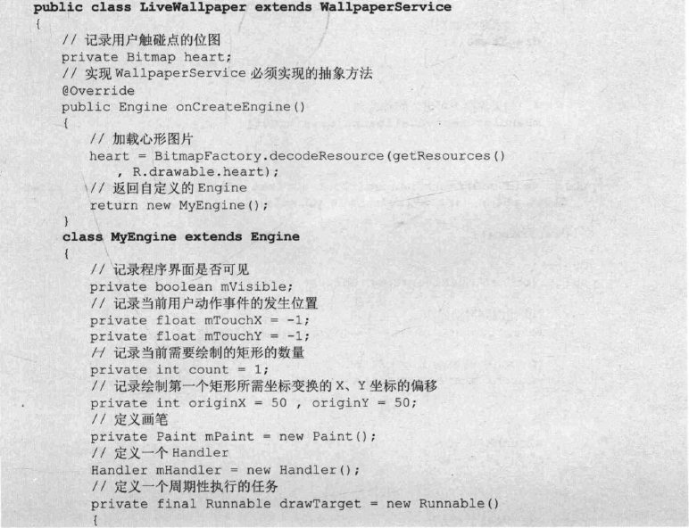
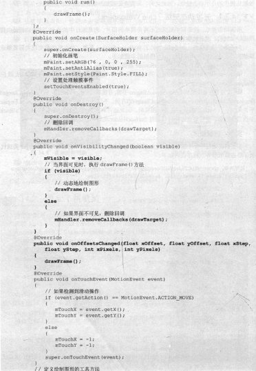
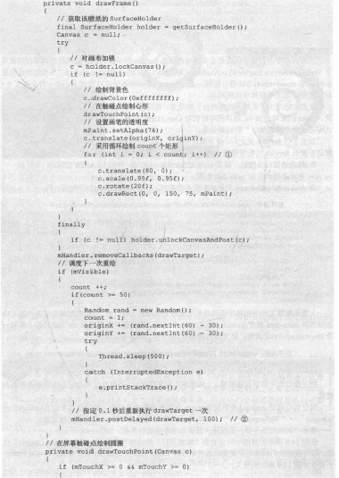
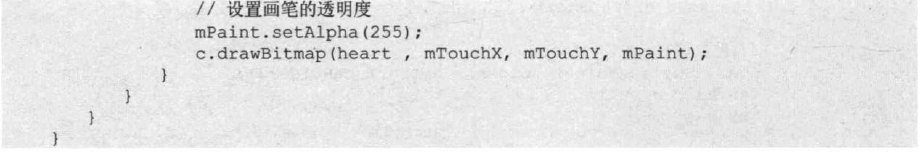
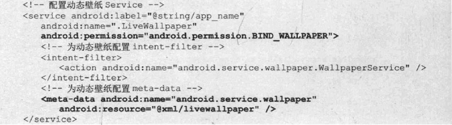
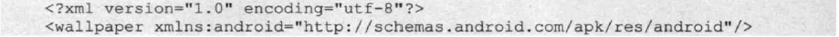

# 14.2改变手机壁纸
---
* 前面讲解系统服务时已经介绍了一个“定时更换壁纸”的应用，在哪个应用中，当用户启动相应的Service之后，该Service将会根据AlarmManager来定时改变手机壁纸。
* Android允许使用WallpaperManager来改变手机壁纸，该对象中改变手机壁纸的方法如下。

	  setBitmap(Bitmap bitmap):将壁纸设置维bitmap所代表的位图。
	  setResource(int resid):将壁纸设置为resid资源所代表的图片。
	  setStream(InputStream data):将壁纸设置为data数据所代表的图片。
* 前面介绍的这种改变手机壁纸的方式只是动态地切换不同图片作为手机壁纸，此处不再介绍调用WallpaperManager来改变手机壁纸的示例。
* 除此之外，Android系统还提供了一种动态壁纸的功能，例如用户在手机桌面上长按，系统将会显示更改壁纸的方式。
* 在Android手机屏幕下方会看到大量系统内置的壁纸，其中前面几项是普通的静态图片壁纸，后面则包含了“动态壁纸”列表项，这是Android系统默认提供的几个动态壁纸。除此之外，开发者还可以开发任意的动态壁纸。
**14.2.1 开发动态壁纸(Live Wallpapers)**
* 所谓动态壁纸，就是指手机桌面不再是简单的图片，而是运行中的动画，这个动画是由程序实时绘制的，因此被称为动态壁纸。
* 为了开发动态壁纸，Android提供了WallpaperService基类，动态壁纸的实现类需要继承该基类。在Android应用中开发动态壁纸的步骤如下。
	  1.开发一个子类继承WallpaperService基类。
	  2.继承WallpaperService基类时必须重写onCreateEngine()方法，该方法返回WallpaperService.Engine子类对象。
	  3.开发者需要实现WallpaperService.Engine子类，并重写其中的public oid onVisibilityChanged(boolean visible)、public void onOffsetsChanged()方法。不仅如此，由于WallpaperService.Engine子类才哟个了与SurfaceView相同的绘图机制，因此还可有选择性地重写SurfaceHolder.Callback中的三个方法。重写这些方法时可通过SurfaceHolder动态地绘制图形。
**实例：蜿蜒壁纸**
* 本实例通过一个不断变换的矩形在桌面上绘制动态壁纸。下面的LiveWallPaper类就代表了动态壁纸服务，程序代码如下。

* 上面程序中的粗体字代码就是实现动态壁纸Service的关键代码。这两段粗体字代码重写了WallpaperService.Engine的onVisibilityChanged()、onOffsetsChanged()方法，并指定当桌面显示时调用drawFrame()方法进行绘制，drawFrame()方法绘制完成后通过Handler对象指定0.1秒后重绘，2号粗体字代码所示。
* 上面程序为了实现“蜿蜒前行”的效果，使用循环控制绘制了count个矩形，每绘制一次，count的值将会加1；而且程序控制对Canvas进行位移、旋转两种坐标变换，通过这两种方式即可实现“蜿蜒前行”的动画效果。
* 定义了该Service类之后。接下来还需要在AndroidManifest.xml文件中配置该Service。配置动态壁纸Service与配置普通Service存在小小的区别，它需要指定如下两项。
	  指定运行动态壁纸，需要android.permission.BIND_WALLPAPER权限。
	  为动态壁纸指定meta-data配置。
* 在AndroidManifest.xml文件中配置动态壁纸，也就是需要增加如下配置片段。

* 上面的配置文件中粗体字代码就是配置动态壁纸的关键代码。上面的配置文件中指定了动态壁纸的meta-data放在@xml/livewallpaper中定义，因此程序还需要在res\xml\目录下增加一个livewallpaper.xml文件，该文件内容如下。

* 把上面的程序部署到模拟器上，该程序不能直接运行，需要按前面介绍的步骤来设置动态壁纸。
* 用户也可通过Android手机的Settings应用来设置动态壁纸，用户通过单击“Settings”->“Display”->“Wallpaper”->“Live Wallpapers”即可看到列表项。
* 单击“蜿蜒壁纸”项，系统进入预览该动态壁纸的界面。
* 在界面中可以看到“蜿蜒前行”的动画不停执行，单击“Set wallpaper”按钮，即可应用我们刚刚所开发的动态壁纸程序。再次切换到Android系统桌面，将可看到桌面上显示的效果。
* 虽然上面的程序价绍的动态壁纸只是在桌面上绘制蜿蜒前行的矩形，但是这种动态壁纸可以提供开发者在桌面上自由绘图的能力，因此到底要在系统桌面上绘制什么，完全取决于用户自己的选择。