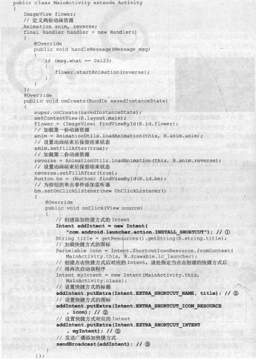
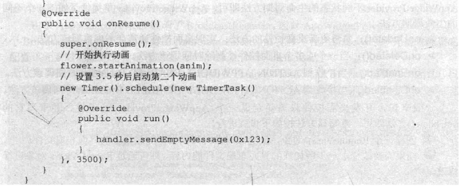

# 14.3桌面快捷方式
---
* 对于一个希望拥有更多用户的应用来说，用户桌面可以说是所有软件的必争之地，如果用户在手机桌面上建立了该软件的快捷方式，用户将会更频繁地使用该软件。因此，所有的Android程序都应该允许用户把软件的快捷方式添加到桌面上。
* 在程序中把一个软件的快捷方式添加到桌面上，只需要如下三步即可。

	  1.创建一个添加快捷方式的Intent，该Intent的Action属性值应该为com.android.launcher.action.INSTALL_SHORTCUT。
	  2.通过为该Intent添加Extra属性来设置快捷方式的标题、图标及快捷方式对应启动的程序。
	  3.调用sendBroadcast()方法发送广播即可添加快捷方式。
**实例：让程序占领桌面**
* 下面的程序是对第7章中一个动画程序的修改。该程序提供了一个按钮，用户单击该按钮即可在桌面上建立该程序的快捷方式。程序代码如下。

* 上面程序中的粗体字代码就是为程序添加快捷方式的关键代码，其中1、2、3号粗体字代码就是前面所介绍的第1~3步。
* 在程序中添加快捷方式需要相应的权限，因此别忘了在AndroidManifest.xml文件中添加如下配置片段：

* 运行该程序，并单击该程序界面中的“添加快捷键”按钮，即可在桌面上添加一个快捷方式。返回桌面，即可在桌面上看到快捷方式。
* 上面的实例把添加快捷方式的带啊放在事件处理方法中完成，这表明只有当用户单击该按钮时才会添加快捷方式——这种方式比较温和；如果开发者希望强行在用户桌面上添加快捷方式，则可以将上面添加快捷方式的代码放在onCreate()方法中——这种方式容易引起用户反感。