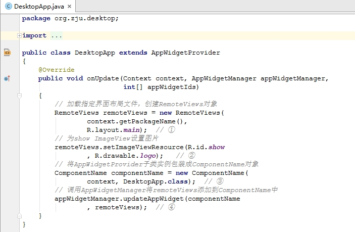
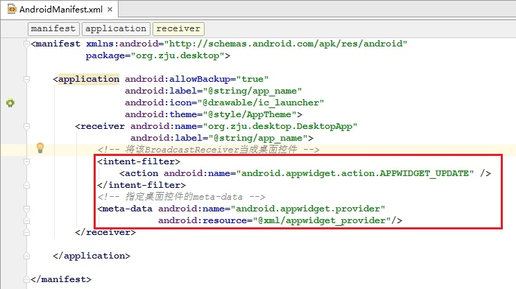
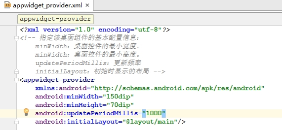

# 管理桌面小控件

---
#### 桌面控件
直接显示在Android系统桌面的小程序。开发者可以将一些用户使用十分频繁的程序，比如时钟、指南针、日历等程序做成桌面控件。

#### 开发桌面控件
继承AppWidgetProvider，并重写AppWidgetProvider不同状态的生命周期方法。  
`（一般重写onUpdate方法即可）`
> - onUpdate( )：负责更新桌面控件
> - onDeleted( )：桌面控件被删除时的回调方法
> - onEnabled( )：当接收到ACTION_APPWIDGET_ENABLED Broadcast时的回调方法
> - onDisabled( )：当接收到ACTION_APPWIDGET_DISABLED Broadcast时的回调方法

重写onUpdate( )方法的步骤
> - 创建一个RemoteViews对象，创建该对象时可以加载指定的界面布局文件
> - 若需要改变界面布局文件的内容，可通过RemoteViews对象进行修改
> - 创建一个ComponentName对象
> - 调用AppWidgetManager更新桌面控件

为了在系统中添加桌面控件，还需要在AndroidManifest.xml文件中配置intent-filter和meta-data元素。

当该桌面控件安装到Android系统上后，进入Widget列表界面，长按选择该控件即可将它添加到桌面上。
