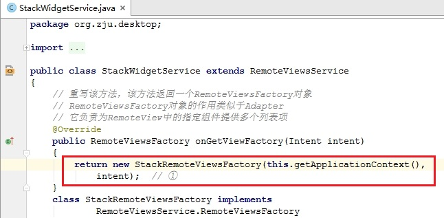
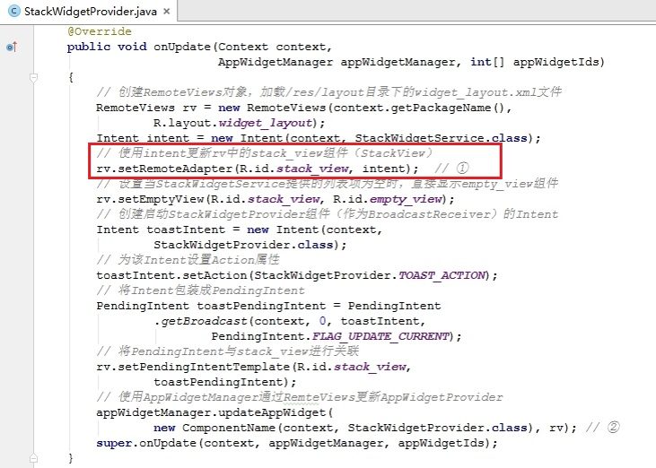
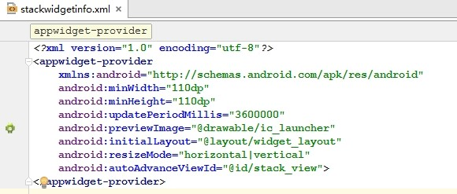

# 实时文件夹

---

所谓实时文件夹（即LiveFolder），是指用于显示ContentProvider提供的数据的桌面组件。

要创建一个实时文件夹，需要两个组件。
- 一个能够响应intent action **ACTION_CREATE_LIVE_FOLDER**的Activity，它负责创建实时文件夹；
- 一个提供实时文件夹数据项的**ContentProvider**。

然而，实时文件夹从API Level 14开始不再被支持。
> 由于实时文件夹引入数据安全性问题，因此改为使用显示数据集的桌面控件来代替实时文件夹。它提供比实时文件夹更多的特性。

#### 带数据集的桌面控件
Android为RemoteViews提供了如下方法。
>setRemoteAdapter(int viewId, Intent intent)：
>该方法可以使用Intent更新RemoteViews中viewId对应的组件。
`其中，viewId参数对应ListView、GridView、StackView和AdapterViewFlipper等组件，intent参数应该封装一个RemoteViewsService参数，为viewId对应的组件提供列表项。`

RemoteViewsService通常用于被继承，继承该基类时需要重写它的onGetViewFactory( )方法，该方法返回功能类似于Adapter的RemoteViewsFactory对象。

 > 开发带数据集的桌面控件与之前开发桌面控件的步骤基本相同，只是此时不再调用RemoteViews的setImageViewResource()或setTextViewText()，而是调用setRemoteAdapter(int viewId, Intent intent)方法。
 
 
> 另外，还需配置RomoteViewsService的权限。

