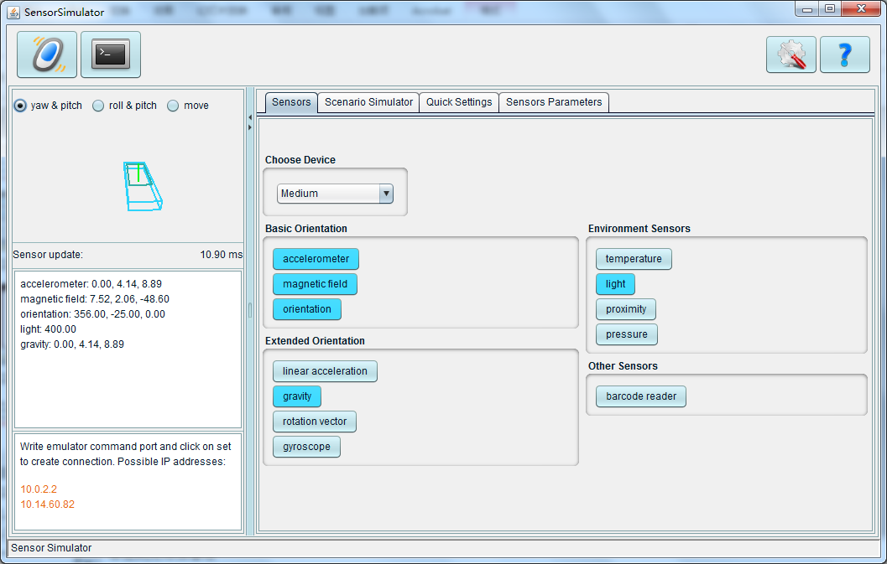

# 15.1利用Android的传感器

大多数Android设备有内置的传感器，用来测量运动，方向和各种环境条件。这些传感器能提供高精度和准确度的原始数据，如果你想监控设备三维运动或者位 置，或者你想监控设备周围的环境变化，是非常有用的。例如，游戏可能跟踪设备重力传感器的数据，来推断复杂的用户首饰和动作，例如倾斜，震动，旋转，或者 振幅。同样的，天气应用可能使用设备的温度传感器和湿度传感器的数据来计算和报告结露点，或者旅行应用可能使用磁场传感器和加速度传感器来报告一个指南针方位。


## 开发传感器的应用
### 开发步骤

* 调用Context的getSystemService(Context.SENSOR_SERVICE)方法获取SensorManager对象，SensorManager对象代表系统的传感器管理服务。

* 调用SensorManager的getDefaultSensor(int type)方法来获取制定类型的传感器。

* 一般在Activity的onResume()方法中调用SensorManager的registerListener()，为传感器注册监听器。程序通过实现监听器即可获取传感器传回来的数据。

```
  registerListener(SensorEventListener listener,Sensor sensor,int rate);

  Listener:监听传感器事件的监听器。
  Sensor:传感器对象。
  Rate:制定获取传感器数据的频率。
```


## SensorSimulator的下载和安装
### SensorSimulator


### 下载工具

下载 SensorSimulator，SensorSimulator 是一个开源免费的传感器小工具,通过该工具便可以在模拟器中调试传感器的应用。 可从 
http://code.google.com/p/openintents/wiki/SensorSimulator 网站找到该工具的下载链接 。（网页中有SensorSimulator的各项设置方法）。

### 安装工具

* 将下载好的 SensorSimulator 解压 
向模拟器安装 SensorSimulatorSettings.apk 客户端软件。 
首先在操作系统中依次选择“开始”|“运行”进入“运行”对话框，然后在“运行”对话框输入cmd 进入cmd命令行，之后通过cd 命令将当前目录导航到 SensorSimulatorSettings.apk 目录下,然后输入下列命令向模拟器安装该apk。需要注意的是，安装 apk 时，一定要保证模拟器正在运行才可以。 

* 导航到目录下输入:adb install SensorSimulatorSettings.apk , 成功安装则会提示 success 。

* 解压在PC端打开服务器端软件
  导航到目录下输入 java -jar sensorsimulator。

* Setting 客户端参数
  Launch 客户端软件在模拟器中,选择 Setting 项。填写IP--对应于服务器端的 IP (可能每次开启时候会不一样 ) 。

* Testing
  切换到 testing 页面，选择 connect 将会看见 sensor 的参数设置。通过改变服务器端的参数可以显示不同数据。

* PC 服务器端的 Sensorsimulator 在第一次连接的时候会将所有的 sensor类型都设置为disable,需设置为 enable。


## 利用SensorSimulator开发传感器应用

用SensorSimulator和用真机开发略有不同,建议用真机开发调试。

* Android应用必须通过引用JAR包形式来引用SensorSimulator的lib目录下的jar包。

* 使用SensorManagerSimulator代替了原有的SensorManager。

* 引用程序获取SensorManagerSimulator后，需要用connectSimulator()方法连接模拟器。

* 编程时，使用的Sensor、SensorEvent、SensorEventListener等不再是Android提供的类，是SensorSimulator提供的。

* 应用程序需要访问网络的权限。
在AndroidManifest.xml文件中增加如下授权代码：
```
<uses-permission android:name=“android.permission.INTERNET”>
```
