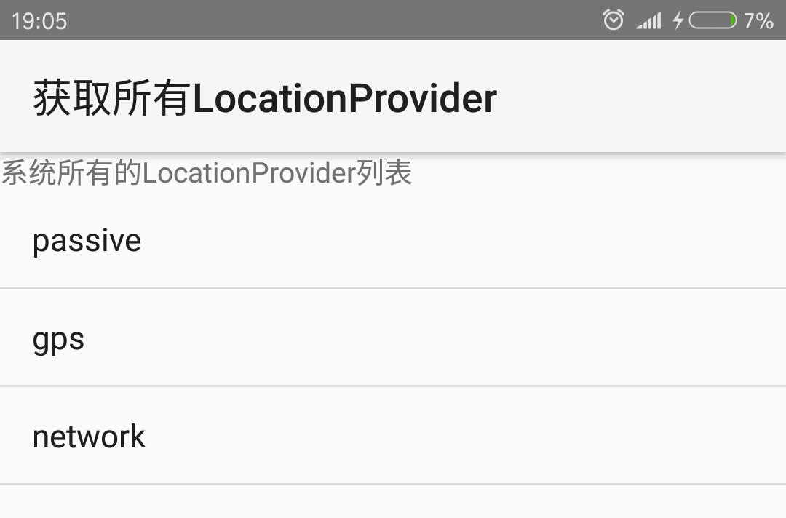

# 16.2获取LocationProvider
Android定位信息由LocationProvider对象来提供，该对象代表一个抽象的定位组件。在开始编程钱，需要先获得LocationProvider对象。
##16.2.1获取所有可用的LocationProvider

LocationManager提供了一个`getAllProviders()`方法来获取系统所有可用的LocationProvider，下面的示例程序将可以列出系统所有的LocationProvider。该程序界面很简单，界面中只提供了一个ListView来显示所有的LocationProvider即可，故不在给出界面布局代码。该程序的代码如下。

```java
public class AllProvidersTest extends Activity
{
	ListView providers;
	LocationManager lm;
	@Override
	public void onCreate(Bundle savedInstanceState)
	{
		super.onCreate(savedInstanceState);
		setContentView(R.layout.main);
		providers = (ListView) findViewById(R.id.providers);
		// 获取系统的LocationManager对象； 
		lm = (LocationManager)getSystemService(
			Context.LOCATION_SERVICE);
		//获取系统所有的LocationProvider名称
		List<String> providerNames = lm.getAllProviders();
		ArrayAdapter<String> adapter = new ArrayAdapter<String>(
			this,
			android.R.layout.simple_list_item_1,
			providerNames);
		// ListView来显示所有的LocationProvider
		providers.setAdapter(adapter);
	}
}
```
运行上面程序，可以看到如图所示的输出。


从运行结果看，当前模拟器获得的所有LocationProvider有如下三个：

* **passive**：由LocationManager.PASSIVE_PROVIDER常量表示。
* **gps**：由LocationManager.GPS_PROVIDER常量表示。代表通过GPS获取定位信息的LocationProvider对象。
* **network**：由LocationProvider.NETWORK_PROVIDER常量表示。代表通过移动通信网络获取定位信息的LocationProvider对象。
上面列出的LocationProvider中最常用的LocationProvider GPS_PROVIDER。

##16.2.2 通过名称获得指定LocationProvider
程序调用LocationManager的`getAllProviders()`方法获取所有LocationProvider时返回的是List<String>集合，集合元素为LocationProvider的名称，为了获取实际的LocationProvider对象，可借助于LocationManager的`LocationProvider getProvider（String name）`方法。
例如以下代码：
//获取基于GPS的LocationProvider。
```
LocationProvider locProvider = lm.getProvider(LocationManager.GPS_PROVIDER)
```
##16.2.3 根据Criteria获得LocationProvider
前面的程序调用LocationManager的`getAllProviders()`方法反悔了系统所有可用的Location Provider，但大部分时候，应用程序可能希望得到符合指定条件的LocationProvider，这就需要借助于LocationManager的`getBestProvider(Criteria criteria,boolean enabledOnly)`方法来获取。
上面的方法中Criteria就代表了一个“过滤”条件，该方法将只返回符合该Criteria的LocationProvider，Criteria提供如下常用的方法来设置条件。

* **setAccuracy(int  accuracy)**:设置对LocationProvider的精度要求。
* **setAltitudeRequired(boolean  altitudeRequired)**:设置要求LocationProvider能提供高度信息。
*  **setBearingRequired(boolean  bearingRequired)**:设置要求LocationProvider能提供方向信息。
*  **setCostAllowed(boolean  costAllowed)**:设置要求LocationProvider是否免费。
*  **setPowerRequired(int  level)**:设置要求LocationProvider的耗电量。
*  **setSpeedRequired(boolean  speedRequired)**:设置要求LocationProvider能提供速度信息。

下面的程序示范了如何获取系统中免费的LocationProvider，并且该LocationProvider必须能提供高度信息、速度信息等。

```
public class FreeProviderTest extends Activity {
　　ListView providers;
　　LocationManager lm;
　　@Override
　　protected void onCreate(Bundle savedInstanceState) {
　　　　super.onCreate(savedInstanceState);
　　　　setContentView(R.layout.activity_free_provider_test);
　　　　providers = (ListView) findViewById(R.id.providers);
　　　　//获取系统的LocationManager对象
　　　　lm = (LocationManager) getSystemService(Context.LOCATION_SERVICE);
　　　　//创建一个LocationProvider的过滤条件
　　　　Criteria cri = new Criteria();
　　　　//设置要求LocationProvider必须是免费的
　　　　cri.setCostAllowed(false);
　　　　//设置要求LocationProvider能提供高度信息
　　　　cri.setAltitudeRequired(true);
　　　　//设置要求LocationProvider能提供方向信息
　　　　cri.setBearingRequired(true);
　　　　//获取系统所有符合条件的LocationProvider的名称
　　　　List<String> providerNames = lm.getAllProviders();
　　　　ArrayAdapter<String> adapter = new ArrayAdapter<String>(this, 
　　　　android.R.layout.simple_list_item_1, providerNames);
　　　　//使用ListView来显示所有可用的LocationProvider
　　　　providers.setAdapter(adapter);
　　}
}
```
上面的程序中粗体字代码创建了一个Criteria对象，并通过设置了LocationProvider必须满足的条件，运行该程序，即可列出所有符合Criteria条件的LocationProvider。


