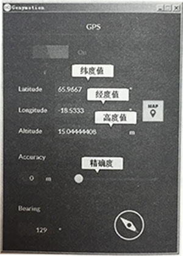
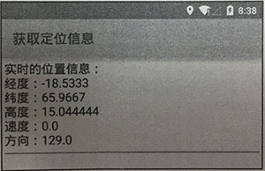

# 16.3获取定位信息

　　获取了LocationManager对象之后，接下来就可以通过制定LocationProvider必须满足的条件，运行该程序，即可列出所有符合Criteria条件的LocationProvider。

## 16.3.1 通过模拟器发送GPS信息
　　Android模拟器本身并不能作为GPS接收机，因此无法得到GPS的定位信息，但为了方编程序员测试GPS应用，Android提供的DDMS工具可以发送模拟的GPS定位信息。启动Android模拟器之后，接下来打开DDMS的Emulator Control面板即可向Android模拟器发送GPS定位信息，如图16.2所示。
<center>

图16.2 向模拟器发送定位信息 </center>

　　在图16.2所示的“Emulator Control”面板中输入精度值、纬度值，然后单击“Send”按钮即可向模拟器发送GPS定位信息。

## 16.3.2 获取定位数据
　　下面程序示范了如何通过手机实时地获取定位信息，包括用户所在的经度、纬度、高度、方向、移动速度等。该程序的界面很简单，只提供一个文本框来显示用户的定位信息即可，故此处不再给出程序界面代码。该程序代码如下。

````` java
public class MainActivity extends Activity
{
	// 定义LocationManager对象
	LocationManager locManager;
	// 定义程序界面中的EditText组件
	EditText show;
	@Override
	public void onCreate(Bundle savedInstanceState)
	{
		super.onCreate(savedInstanceState);
		setContentView(R.layout.main);
		// 获取程序界面上的EditText组件
		show = (EditText) findViewById(R.id.show);
		// 创建LocationManager对象
		locManager = (LocationManager) getSystemService
				(Context.LOCATION_SERVICE);
		// 从GPS获取最近的最近的定位信息
		Location location = locManager.getLastKnownLocation(
				LocationManager.GPS_PROVIDER);
		// 使用location来更新EditText的显示
		updateView(location);
		// 设置每3秒获取一次GPS的定位信息
		locManager.requestLocationUpdates(LocationManager.GPS_PROVIDER
				, 3000, 8, new LocationListener()  // ①
		{
			@Override
			public void onLocationChanged(Location location)
			{
				// 当GPS定位信息发生改变时，更新位置
				updateView(location);
			}
			@Override
			public void onProviderDisabled(String provider)
			{
				updateView(null);
			}
			@Override
			public void onProviderEnabled(String provider)
			{
				// 当GPS LocationProvider可用时，更新位置
				updateView(locManager
						.getLastKnownLocation(provider));
			}
			@Override
			public void onStatusChanged(String provider, int status,
										Bundle extras)
			{
			}
		});
	}
	// 更新EditText中显示的内容
	public void updateView(Location newLocation)
	{
		if (newLocation != null)
		{
			StringBuilder sb = new StringBuilder();
			sb.append("实时的位置信息：\n");
			sb.append("经度：");
			sb.append(newLocation.getLongitude());
			sb.append("\n纬度：");
			sb.append(newLocation.getLatitude());
			sb.append("\n高度：");
			sb.append(newLocation.getAltitude());
			sb.append("\n速度：");
			sb.append(newLocation.getSpeed());
			sb.append("\n方向：");
			sb.append(newLocation.getBearing());
			show.setText(sb.toString());
		}
		else
		{
			// 如果传入的Location对象为空则清空EditText
			show.setText("");
		}
	}
}
`````

　　上面的程序中`updateView`函数用于从Location中获取定位信息，包括用户的经度、纬度、高度、方向和移动速度等信息。程序中①号代码通过LocationManager设置了一个监听器，该监听器负责每隔3秒向LocationProvider请求一次定位信息，当LocationProvider可用时、不可用时或提供的定位信息发生改变时，系统会回调`updateView(Location newLocation)`来更新EditText中显示的定位信息。该程序需要有访问GPS信号的权限，因此需要在AndroidManifest.xml文件中增加如下授权代码片段：
``````xml
<!--授权获取定位信息-->
<uses-permission android:name="android.permission.ACCESS_FINE_LOCATION"/>
``````
运行该程序，然后通过DDMS的Emulator Control面板来发送GPS定位信息，即可看到该程序显示如图16.3所示的输出。
<center>

图16.3 实时获取定位信息 </center>

　　由于该程序每隔3秒就会向GPS LocationProvider获取一次定位信息，这样上面的程序界面上总可以实时显示该用户的定位信息。如果把该程序与Google Map结合，让该程序根据GPS提供的信息实时地显示用户在图上的位置，即可开发出GPS导航系统。