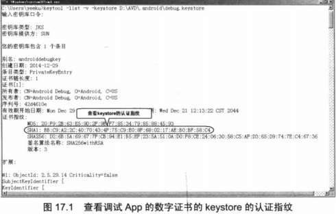
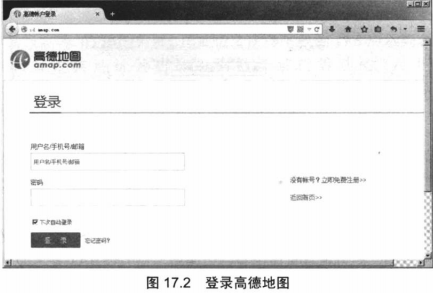
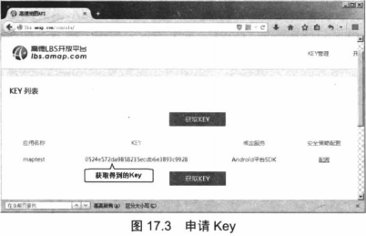
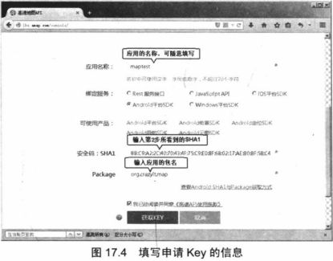
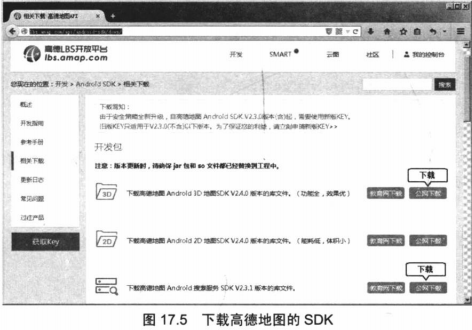
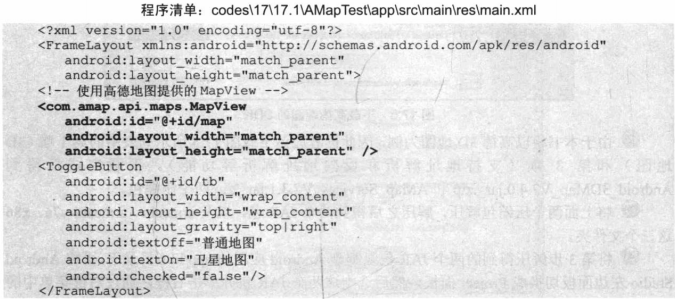
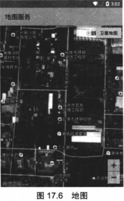

　　上一章介绍了如何使用Android的GPS来获取设备的定位信息，但这种方式得到的定位 信息只不过是一些数字的经度、纬度值，如果这些经度、纬度值不能以更形象、直观的方式显示出来，对于大部分普通用户而言，这些经度、纬度数据几乎没有任何价值

　　为了让上一章介绍的GPS信息“派上”用场，本章将会详细介绍Android调用第三方的Ｍap服务为例来介绍如何在Androi应用中嵌入高德地图。由于众所周知的某些原因，现在Google的各种服务基本上都已经被封锁了，因此本书删除了第２版中调用Google地图的相关知识，改为讲授在Android应用中调用第三方地图服务。如果把上一章获得的GPS信息与本章的Ｍap应用结合起来，就可以非常方便地开发出定位、导航等应用程序。

　　**提示：**

　　　　*如果读者依然要学习关于调用Google地图服务的相关知识，请参考本书第２版。*

##  　　17.1  调用高德Ｍap

　　国内比较常用的地图服务有高德地图服务（相对比较专业，iOS设备也采用这种地图）、百度地图服务等，不管使用哪一家的地图服务，大致的调用步骤都基本相似，读者只要熟练掌握其中一种即可。

### 　　 17.1.1　获取Ｍap　API Key

　　为了在应用程序中调用第三方Ｍap服务，必须先获取第三方Ｍap服务的API Key。此处以获取高德地图服务的API Key为例进行介绍，获取步骤如下。

　　①首先找到该App的数字证书的keystore的存储路径，此时可分为两种情况。

* 　如果是作为实际产品发布的签名App，该App的数字证书的keystore将保存在用户自定义的路径中，该自定义路径也就是第一章中图　1.42创建数字证书时所指定的存储路径。
* 　如果是作为调试阶段的调试App，该App的数字证书的keystore通常保存在ANDROID_SDK_HOME环境变量对应的路径.andriod/目录下，在该目录下可以找到一个debug.keystore文件，该文件就是调试App的数字证书的keystore的存储路径。比如笔者的ANDROID_SDK_HOME环境变量值为D:\AVD,那么对应的keystore的存储路径为D:\AVD\.andriod\debug.keystore。

　　②为了获取第三方的Ｍap服务的API Key，需要先用JDK提供的keytool工具查看keystore的认证指纹。启动命令行窗口，输入如下命令：
　　`keytool -list -v -keystore <Andriod keystore的存储位置>`

　　将上面命令中的<Andriod keystore的存储位置＞替换成App的数字证书的keystore的存储路径（如果发布Android应用，则应该使用本公司的keystore的存储路径）。

　　运行上述命令，系统将会提示“输入keystore密码”，输入Andriod模拟器的keystore的默认密码：andriod，系统将会显示该
keystore对应的认证指纹，图17.1显示了查看keystore的认证指纹的详细过程。

　　 

　　**提示：**

　　　　*如果运行keytool工具时系统提示“找不到该命令”，则说明还未在PATH环境变量中增加%JAVA_HOME%bin　路径，其中%JAVA_HOME%代表JDK的安装路径－－JDK的安装路径的bin子目录下应该包含java.exe 和keytool.exe工具。*

　　③记住图17.1所显示的SHAI对应的认证指纹，登录http://id.amap.com/ 站点，系统显示如图17.2所示的登录高德地图的页面。

　　

　　④如果读者已有高德地图的用户名、密码，那么输入用户名、密码登录即可。如果读者还没有高德地图的用户名、密码，则需要通过该页面右边的“立即免费注册”链接注册一个新的账户。

　　⑤注册完成后系统会提示用户还没有“成为开发者”，读者可通过页面中间的链接申请“成为开发者”，在申请成为开发者时，页面会提示用户输入邮箱和手机号码（请输入真实的邮箱和手机号码，因为高德会采用短信+邮箱的方式进行验证），提交请求，并通过邮件激活之后，此时就拥有了一个高德的开发者账号。

　　⑥登录http://lbs.amap.com/console/ 页面，即可看到如图17.3所示的页面。

　　

　　**提示：**

　　　　*如果读者第一次注册、登录高德地图网站，可能看不到上面列出的maptest那条记录，这条记录是本书为测试Ｍap应用所获取的Key。*

　　⑦点击“获取KEY”按钮，将显示如图17.4所示的输入页面。

　　

　　⑧在文本框中输入keytool 工具查看到的SHAI指纹，单击“获取KEY”按钮，系统返回如图17.3所示的页面，即可在该页面中看到该应用（包名＋SHAI签名即可唯一地确定一个应用）对应的API Key。

###  　　17.1.2高德地图入门

　　一旦为指定应用申请了API Key之后，接下来即可非常简单地在应用中使用高德地图了。高德地图提供了一个MapView组件，这个MapView继承了FrameLayout,因此它的本质就是一个普通的容器控件，所以开发者可以直接将该MapView添加到应用界面上。

　　MapView只是一个容器，真正为MapView提供地图支持的是AMap类,MapView可通过getMap()方法来获取它所封装的AMap对象,AMap对象提供了大量的方法来控制地图。

　　**注意：**

　　　　*前面的申请API Key时填写的应用包名是什么，那么此处新建项目的包名也必须与之相同。*

　　为了给Android应用添加高德地图支持，必须为该应用添加高德地图的SDK。添加高德地图的SDK请按如下步骤进行。

　　①登录　http://lbs.amap.com/api/android-sdk/down/站点 ,即可看到如图17.5,所示的页面。

　　

　　②由于本书将以高德3D地图为例，因此读者应该下载图17.5所示列表中的第一项（3D地图）和第３项（支持地址解析和反向地址解析等功能）。下载完成后得到Android_3DMap_V2.4.0.jar_.zip和AMap_Services_V2.3.1.jar_.zip两个压缩包。

　　③将上面两个压缩包解压，解压之后得到JAR包，以及armeabi、armeabi-v7a、x86这三个文件夹。

　　④将第３步解压得到的两个JAR包复制到Android应用的app/libs/目录下，再将Android Ｓtudio左边面板切换成Project面板，然后选中这两个JAR包并单击右键，通过右键菜单中的“Add As Library...”菜单项将这两个JAR包添加到该应用中。

　　⑤在Android应用的app/src/main/目录下新建一个jniLibs子目录，并将第3步解压得到的armeabi、armeabi-v7a、x86这三个文件夹复制到该目录下。

　　**提示：**

　　　　*实际上第４步是通过Android Ｓtudio为Ａpp 添加第三方JAR包的方法；第５步则是通过Android Ｓtudio为Ａpp添加第三方＊.so包（＊.so文件似乎是Linux平台的多态链接库文件，类似于Andriod 平台的＊.dll文件）的方法。如果读者使用的是Elipse+ADT开发平台，那就更简单了，直接将两个JAR包和armeabi、armeabi-v7a、x86这三个文件夹复制到Android应用的libs目录下即可，Elipse会自动加载它们。*

　　⑥接下来打开Android应用的AndroidManifest.xml文件，在该文件的＜application.../＞元素内添加如下<meta-data.../>子元素：

    <!-- 启用高德地图服务 -->
		<meta-data
			android:name="com.amap.api.v2.apikey"
		android:value="0524e572da9858235ecdb6e3893c9928"/>

　　千万不要直接照着书上输入，因为上面<meta-data.../>元素用于启用高德地图支持，而其中的android:value属性值应该填写前面申请得到的API Key。

７.　在Android应用的AndroidManifest.xml文件中添加如下权限：

    <uses-permission android:name="android.permission.INTERNET" />
	<uses-permission android:name="android.permission.WRITE_EXTERNAL_STORAGE" />
	<uses-permission android:name="android.permission.ACCESS_COARSE_LOCATION" />
	<uses-permission android:name="android.permission.ACCESS_NETWORK_STATE" />
	<uses-permission android:name="android.permission.ACCESS_FINE_LOCATION" />
	<uses-permission android:name="android.permission.READ_PHONE_STATE" />
	<uses-permission android:name="android.permission.CHANGE_WIFI_STATE" />
	<uses-permission android:name="android.permission.ACCESS_WIFI_STATE" />
	<uses-permission android:name="android.permission.CHANGE_CONFIGURATION" />
	<uses-permission android:name="android.permission.WRITE_SETTINGS" />
　　经过上面步骤，高德地图SDK 添加完成，剩下的事情就是使用　ＭapView组件了，而ＭapView组件与普通的Android组件的区别并不大。本应用的界面设计文件如下。

　　

　　正如从上面粗体字代码所看到的，程序使用ＭapView的方式与使用普通Android View并没有太大的区别。需要指出的是，ＭapView要求在其所在的Activity代码。

　　程序清单：codes\17\17.1\AMapTest\app\src\main\java\org\crazyit\map/MainActivity.java

    public class MainActivity extends Activity {
	private MapView mapView;
	private AMap aMap;
	@Override
	protected void onCreate(Bundle savedInstanceState) {
		super.onCreate(savedInstanceState);
		setContentView(R.layout.main);
		mapView = (MapView) findViewById(R.id.map);
		// 必须回调MapView的onCreate()方法
		mapView.onCreate(savedInstanceState);
		init();
		ToggleButton tb = (ToggleButton) findViewById(R.id.tb);
		tb.setOnCheckedChangeListener(new CompoundButton.OnCheckedChangeListener()
		{
			@Override
			public void onCheckedChanged(CompoundButton buttonView, boolean isChecked)
			{
				if(isChecked)
				{
					// 设置使用卫星地图
					aMap.setMapType(AMap.MAP_TYPE_SATELLITE);
				}
				else
				{
					// 设置使用普通地图
					aMap.setMapType(AMap.MAP_TYPE_NORMAL);
				}
			}
		});
	}
	// 初始化AMap对象
	private void init() {
		if (aMap == null) {
			aMap = mapView.getMap();
		}
	}
	@Override
	protected void onResume() {
		super.onResume();
		// 必须回调MapView的onResume()方法
		mapView.onResume();
	}
	@Override
	protected void onPause() {
		super.onPause();
		// 必须回调MapView的onPause()方法
		mapView.onPause();
	}
	@Override
	protected void onSaveInstanceState(Bundle outState) {
		super.onSaveInstanceState(outState);
		// 必须回调MapView的onSaveInstanceState()方法
		mapView.onSaveInstanceState(outState);
	}
	@Override
	protected void onDestroy() {
		super.onDestroy();
		// 必须回调MapView的onDestroy()方法
		mapView.onDestroy();
	}
    }
正如从上面粗体字代码所看到的，程序只是简单地获取了界面上的ＭapView组件，并在该Activity的声明周期方法内回调了ＭapView的声明周期方法，整个应用就完成了。本应用为了简单示范AMap的功能，程序为界面上的ToggleButton添加了事件监听器，用于切换地图的显示方式。

　　运行该程序，切换到卫星地图，即可看到如图17.6所示的地图界面。

　　