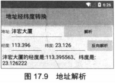
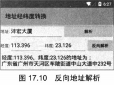

# 17.3执行定位 #
前面介绍的在地图上定位的例子需要用户输入定位点的经度，纬度才能进行定位，这种方式显然不太现实：普通用户不太可能记住某个位置的经度、纬度。对于普通用户来说，根据地址进行定位才是更有实用价值的地图。本节会介绍如何根据地址在地图上定位。
## 17.3.1地址解析与反向地址解析 ##
通常来说，地图定位必须根据经度、纬度来完成，因此，如果需要让程序根据地址进行定位，则需要先把地址解析称经度、纬度。这里涉及如下两个基本概念：

- 地址解析：把普通用户能看到的字符串地址转换为经度、纬度。
- 反向地址解析：把经度、纬度值转换成普通的字符串地址。

高德地图搜索服务为地址解析提供了GeocodeSearch工具类，该工具提供了如下方法来进行地址解析与反向地址解析。

- RegeocodeAddress getFormLocation(RegecodeQuery query):根据给定的经纬度和最大结果返回反向地址解析的结果。
- getFormLocationAsyn(RegeocodeQuery query)：该方法与前一个方法类似，只是该方法以异步方式进行。
- Java.util.List<GecodeAddress> getFromLocationName(GeocodeQuery query):根据给定的地理名称、城市来返回地址解析的结果列表。
- getFromLocationNameAsyn(GeocodeQuery query):该方法与前一个方法类似，只是该方法以异步方式进行。

虽然GecodeSearch工具类提供了上面方法来进行地址解析和反向解析，但实际上这个类还是需要调用网络上高德的查询服务。很明显，Android平台不大可能把地球上所有的地名与经度、纬度之间的映射关系都存储在手机系统中。

由于Android平台要求所有的网络访问都不能直接放在UI线程中进行，因此Android应用进行地址解析或反向地址解析时都应该采用异步方式进行。当程序采用异步方式进行地址解析或反向地址解析时，程序还必须为GeocodeSearch设置一个监听器，当解析完成时，该监听器所包含的方法将会被触发。

借助于GeocodeSearch提供的地址解析、反向地址解析的功能，接下来只要按如下步骤操作即可完成地址解析和反向地址解析。

1. 创建GeocodeSearch对象，并为该对象设置解析监听器。
2. 如果要进行地址解析，程序先创建GeocodeQuery对象，该对象封装了要解析的地理名称、城市等信息；如果要进行地址反向解析，程序先创建LatLonPoint对象，该对象封装了经度、纬度信息。
3. 调用GeocodeSearch对象的方法执行地址解析或反向地址解析。

下面的示例示范了如何使用GeocodeSearch来进行地址解析、反向地址解析。该应用程序的Activity代码如下。

**程序清单：codes\17\17.3\GeocoderTest\app\src\main\java\org\crazyit\map\MainActivity.java**

    public class MainActivity extends Activity
	implements OnClickListener
    {
	Button parseBn, reverseBn;
	EditText etLng, etLat, etAddress, etResult;
	GeocodeSearch search;
	@Override
	public void onCreate(Bundle savedInstanceState)
	{
		super.onCreate(savedInstanceState);
		setContentView(R.layout.main);
		// 获取界面中的可视化组件
		parseBn = (Button) findViewById(R.id.parse);
		reverseBn = (Button) findViewById(R.id.reverse);
		etLng = (EditText) findViewById(R.id.lng);
		etLat = (EditText) findViewById(R.id.lat);
		etAddress = (EditText) findViewById(R.id.address);
		etResult = (EditText) findViewById(R.id.result);
		parseBn.setOnClickListener(this);
		reverseBn.setOnClickListener(this);
		// 创建GeocodeSearch对象
		search = new GeocodeSearch(this);
		// 设置解析监听器
		search.setOnGeocodeSearchListener(new OnGeocodeSearchListener()  // ①
		{
			@Override
			public void onRegeocodeSearched(RegeocodeResult
				regeocodeResult, int i)
			{
				RegeocodeAddress addr = regeocodeResult.getRegeocodeAddress();
				etResult.setText("经度:" + etLng.getText() + "、纬度:"
					+ etLat.getText() + "的地址为：\n" + addr.getFormatAddress());
			}

			@Override
			public void onGeocodeSearched(GeocodeResult
				geocodeResult, int i)
			{
				GeocodeAddress addr = geocodeResult.getGeocodeAddressList().get(0);
				LatLonPoint latlng = addr.getLatLonPoint();
				etResult.setText(etAddress.getText() + "的经度是:" +
					latlng.getLongitude() + "、纬度是:" + latlng.getLatitude());
			}
		});
	}
	@Override
	public void onClick(View source)
	{
		switch (source.getId())
		{
			// 单击了“解析”按钮
			case R.id.parse:
				String address = etAddress.getText().toString().trim();
				if (address.equals(""))
				{
					Toast.makeText(this, "请输入有效的地址"
						, Toast.LENGTH_LONG).show();
				}
				else
				{
					GeocodeQuery query = new GeocodeQuery(address, "广州");
					// 根据地理名称执行异步解析
					search.getFromLocationNameAsyn(query);
				}
				break;
			// 单击了“反向解析”按钮
			case R.id.reverse:
				String lng = etLng.getText().toString().trim();
				String lat = etLat.getText().toString().trim();
				if (lng.equals("") || lat.equals(""))
				{
					Toast.makeText(this, "请输入有效的经度、纬度!"
						, Toast.LENGTH_LONG)
						.show();
				}
				else
				{
					// 根据经纬度执行异步查询
					search.getFromLocationAsyn(new RegeocodeQuery(
						new LatLonPoint(Double.parseDouble(lat)
						, Double.parseDouble(lng))
						, 20 // 区域半径
						, GeocodeSearch.V热PS));
				}
				break;
		}
	}
    }
　　上面程序中的①号代码为GeocodeSearch对象设置了一个解析监听器，当程序调用该对象的方法执行异步解析完成后，程序会自动触发该监听器包含的方法。

　　程序中②号粗体字代码以异步方式执行反向地址解析，在②号代码之前创建了一个GeocodeQuery对象，该对象包含要解析的地理名称、城市等信息。

　　程序中③号代码以异步方式执行反向地址解析，执行③号代码时传入了一个LatLonPoint对象，该对象就包装了要进行反向地址解析的经度、纬度。

　　运行上面的程序，在文本框中输入某个地名，单击“解析”按钮，将可看到如图17.9所示的结果。

　　在图17.9所示的输入经度、纬度文本框中输入经度、纬度值，然后单击“反向解析”按钮，即可看到程序有如图17.10所示的输出。
   
## 17.3.2执行定位 ##
　　下面的应用程序是对17.2节示例程序的改进，该应用程序不需要用户输入经度、纬度值，只要用户输入目标地址，程序就会调用Geocodesearch
对目标地址执行地址解析，将其转换为经度、纬度值，再控制地图定位到指定地址点即可。

　　该程序代码如下。

　　**程序清单:codes\17\17.3\AddLocMap\app\src\main\java\org\crazyit\map\MainActivity.java**

    public class MainActivity extends Activity
	implements GeocodeSearch.OnGeocodeSearchListener
    {
	private MapView mapView;
	private AMap aMap;
	@Override
	protected void onCreate(Bundle savedInstanceState) {
		super.onCreate(savedInstanceState);
		setContentView(R.layout.main);
		mapView = (MapView) findViewById(R.id.map);
		// 必须回调MapView的onCreate()方法
		mapView.onCreate(savedInstanceState);
		init();
		Button bn = (Button) findViewById(R.id.loc);
		final TextView addrTv = (TextView) findViewById(R.id.address);
		bn.setOnClickListener(new View.OnClickListener()
		{
			@Override
			public void onClick(View v)
			{
				String addr = addrTv.getText().toString();
				if (addr.equals(""))
				{
					Toast.makeText(MainActivity.this, "请输入有效的地址"
							, Toast.LENGTH_LONG).show();
				}
				else
				{
					GeocodeSearch search = new GeocodeSearch(MainActivity.this);
					search.setOnGeocodeSearchListener(MainActivity.this);
					GeocodeQuery query = new GeocodeQuery(addr, "广州");
					// 根据地址执行异步地址解析
					search.getFromLocationNameAsyn(query);  // ①
				}
			}
		});
	}

	// 初始化AMap对象
	private void init() {
		if (aMap == null) {
			aMap = mapView.getMap();
			// 创建一个设置放大级别的CameraUpdate
			CameraUpdate cu = CameraUpdateFactory.zoomTo(16);
			// 设置地图的默认放大级别
			aMap.moveCamera(cu);
		}
	}
	@Override
	protected void onResume() {
		super.onResume();
		// 必须回调MapView的onResume()方法
		mapView.onResume();
	}
	@Override
	protected void onPause() {
		super.onPause();
		// 必须回调MapView的onPause()方法
		mapView.onPause();
	}
	@Override
	protected void onSaveInstanceState(Bundle outState) {
		super.onSaveInstanceState(outState);
		// 必须回调MapView的onSaveInstanceState()方法
		mapView.onSaveInstanceState(outState);
	}
	@Override
	protected void onDestroy() {
		super.onDestroy();
		// 必须回调MapView的onDestroy()方法
		mapView.onDestroy();
	}

	@Override
	public void onRegeocodeSearched(RegeocodeResult
		regeocodeResult, int i){}

	@Override
	public void onGeocodeSearched(GeocodeResult geocodeResult, int i)
	{
		// 获取解析得到的第一个地址
		GeocodeAddress geo = geocodeResult.getGeocodeAddressList().get(0);
		// 获取解析得到的经纬度
		LatLonPoint pos = geo.getLatLonPoint();
		LatLng targetPos = new LatLng(pos.getLatitude(), pos.getLongitude());
		// 创建一个设置经纬度的CameraUpdate
		CameraUpdate cu = CameraUpdateFactory.changeLatLng(targetPos);
		// 更新地图的显示区域
		aMap.moveCamera(cu);
		// 创建一个GroundOverlayOptions（用于向地图上添加图片)
		GroundOverlayOptions options = new GroundOverlayOptions()
			// 设置GroundOverlayOptions包装的图片
			.image(BitmapDescriptorFactory
				.fromResource(R.drawable.ic_launcher))
			.position(targetPos , 64);
		// 添加图片
		aMap.addGroundOverlay(options);
		// 创建一个CircleOptions（用于向地图上添加圆形）
		CircleOptions cOptions = new CircleOptions()
			.center(targetPos)  // 设置圆心
			.fillColor(0x80ffff00)  // 设置圆形的填充颜色
			.radius(80)  // 设置圆形的半径
			.strokeWidth(1)  // 设置圆形的线条宽度
			.strokeColor(0xff000000);  // 设置圆形的线条颜色
		aMap.addCircle(cOptions);
	}
	private void GroundOverlayOptions(){}
    }
　　上面程序中的①号代码调用GeocodeSearch对象执行异步的地址解析，getFromLocationNameAsy()方法解析完成后将会触发解析监听器的onGeocodeSearched()方法。上面程序的重点就是重写监听器的这个方法，程序在该方法中完成了如下三件事情。

- 根据地址解析得到的经度、纬度创建一个CameraUpdata，并将地图中心改变到此处。
- 根据地址解析得到的经度、纬度添加一个GroundOverlay（自定义图片）
- 根据地址解析得到的经度、纬度添加一个Circle（圆形区域）

　　上面三件事情的后两件事情的本质是一样的，因此程序的添加步骤也大同小异。变异、运行该程序，并在程序界面上的文本框中输入某个地址，然后单击“定位”按钮，即可看到如图17.11所示的结果。

　　经过前面的介绍不难发现，在Android应用整合第三方Map服务其实比较简单，通过为Android应用整合第三方Map服务，可以开发出功能更强大的Android应用，比如为SNS系统增加地图支持，即可让用户实时查询好友的位置等。总之，通过在Android应用中整合第三方Map服务功能，就给开发Android应用提供了更多的可能性。