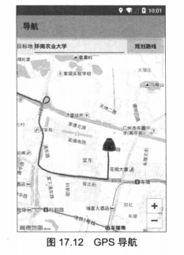

# 17.4GPS导航 #
　　高德查询服务还可以让开发者查询、规划路线。高德查询服务提供了RouteSearch查询类，专门用于查询各种路线。该查询类支持的查询功能由如下方法实现：

- BusRouteResult calculateBusRoute（BusRouteQuery query）：根据指定参数来查询公交路线
- void calculateBusRouteAsyn(BusRouteQuery query):该方法与前一个方法功能类似，只是该方法以异步方式执行查询
- DriveRouteResult calculateDriveRoute(DriveRouteQuery query):根据指定参数来查询驾车路线
- void calculateDriveRouteAsyn(DriveRouteQuery query):该方法与前一个方法功能类似，只是该方法以异步方式执行查询
- WalkRouteResult calculateWalkRoute(WalkRouteQuery query):根据指定参数来查询步行路线
- void calculateWalkRouteAsyn(WalkRouteQuery query):该方法与前一个方法功能类似，只是该方法以异步方式执行查询。

　　与前面各种xxxSearch类相似的是，RouteSearch查询的数据同样来自网络，因此在Android应用中调用这些查询方法，需要使用异步方式进行查询。为了使用RouteSearch执行异步查询，程序还需要为RouteSearch指定一个查询监听器（实现了RouteSearch.OnRouteSearchListener接口的对象）

　　在最简单的情况下，程序只要通过RouteSearch查询、规划路线，然后实时地显示用户的当前位置，并提示用户是否正在规划路线上行驶，这样就可以实现一个最简单的导航软件了。

　　使用RouteSearch获取导航路线只要如下3步。
1. 创建RouteSearch对象，并为该对象设置对应的监听器。
2. 根据要查询路线类型的不同，分别创建对应的xxxQuery对象（比如查询公交路线，需要创建BusRouteQuery:查询步行路线，创建WalkRouteQuery:查询驾车路线，创建DriveRouteQuery），这些xxxQuery中封装了相应的路线信息，比如起点、终点、途经点、绕行区域等。
3. 调用RouteSearch对象的方法执行查询。

　　当程序通过重写RouteSearch监听器的方法获取查询返回的路线之后，该规划路线的本质其实就是地图上的多条线段，因此程序只要通过AMap的addPolyline()把这些规划路线绘制上去即可。

　　先的示例示范了如何开发一个简单的GPS导航软件，该导航软件主要实现了两个功能：①通过RouteSearch查询、规划行车路线；②根据GPS信号显示用户的当前行驶位置。

　　该程序的界面设计文件比较简单，只是包含一个用于输入目的地的文本框和高德的MapView，此处不再给出界面设计文件。先是该程序的Activity类代码。

　　**程序清单：codes\17\17.4\Navigation\app\src\main\java\org\crazyit\map\MainActivity.java**

    public class MainActivity extends Activity implements View.OnClickListener
	, OnGeocodeSearchListener, OnRouteSearchListener
    {
	private MapView mapView;
	private AMap aMap;
	private LocationManager locMgr;
	GeocodeSearch search;
	RouteSearch routeSearch;
	private EditText targetAddressEt;
	private Button navBn;

	@Override
	protected void onCreate(Bundle savedInstanceState) {
		super.onCreate(savedInstanceState);
		setContentView(R.layout.main);
		targetAddressEt = (EditText) findViewById(R.id.address);
		mapView = (MapView) findViewById(R.id.map);
		// 必须回调MapView的onCreate()方法
		mapView.onCreate(savedInstanceState);
		navBn = (Button) findViewById(R.id.nav);
		navBn.setOnClickListener(this);
		init();
		// 创建GeocodeSearch对象
		search = new GeocodeSearch(this);
		search.setOnGeocodeSearchListener(this);
		routeSearch = new RouteSearch(this);
		routeSearch.setRouteSearchListener(this);
		locMgr = (LocationManager) getSystemService(
			Context.LOCATION_SERVICE);
		// 通过监听器监听GPS提供的定位信息的改变
		locMgr.requestLocationUpdates(LocationManager.GPS_PROVIDER,
			300, 8, new LocationListener()
			{
				@Override
				public void onLocationChanged(Location location)
				{
					// 使用GPS提供的定位信息来更新位置
					updatePosition(location);
				}

				@Override
				public void onStatusChanged(String provider
						, int status, Bundle extras)
				{
				}

				@Override
				public void onProviderEnabled(String provider)
				{
					// 使用GPS提供的定位信息来更新位置
					updatePosition(locMgr.getLastKnownLocation(provider));
				}

				@Override
				public void onProviderDisabled(String provider)
				{
				}
			});
	}

	// 初始化AMap对象
	private void init() {
		if (aMap == null) {
			aMap = mapView.getMap();
			// 创建一个设置放大级别的CameraUpdate
			CameraUpdate cu = CameraUpdateFactory.zoomTo(16);
			// 设置地图的默认放大级别
			aMap.moveCamera(cu);
		}
	}

	private void updatePosition(Location location)
	{
		LatLng pos = new LatLng(location.getLatitude(), location.getLongitude());
		// 创建一个设置经纬度的CameraUpdate
		CameraUpdate cu = CameraUpdateFactory.changeLatLng(pos);
		// 更新地图的显示区域
		aMap.moveCamera(cu);
		// 清除所有Marker等覆盖物
		aMap.clear();
		MarkerOptions markerOptions = new MarkerOptions()
			.position(pos)
			// 设置使用自定义图标
			.icon(BitmapDescriptorFactory.fromResource(R.drawable.car))
			.draggable(true);
		// 添加Marker
		aMap.addMarker(markerOptions);
	}

	@Override
	protected void onResume() {
		super.onResume();
		// 必须回调MapView的onResume()方法
		mapView.onResume();
	}
	@Override
	protected void onPause() {
		super.onPause();
		// 必须回调MapView的onPause()方法
		mapView.onPause();
	}
	@Override
	protected void onSaveInstanceState(Bundle outState) {
		super.onSaveInstanceState(outState);
		// 必须回调MapView的onSaveInstanceState()方法
		mapView.onSaveInstanceState(outState);
	}
	@Override
	protected void onDestroy() {
		super.onDestroy();
		// 必须回调MapView的onDestroy()方法
		mapView.onDestroy();
	}

	@Override
	public void onClick(View v)
	{
		String address = targetAddressEt.getText().toString().trim();
		if (address.equals(""))
		{
			Toast.makeText(this, "请输入有效的地址"
					, Toast.LENGTH_LONG).show();
		}
		else
		{
			GeocodeQuery query = new GeocodeQuery(address, "广州");
			// 根据地址执行异步查询
			search.getFromLocationNameAsyn(query);
		}
	}

	@Override
	public void onRegeocodeSearched(RegeocodeResult
		regeocodeResult, int i){}
	@Override
	public void onGeocodeSearched(GeocodeResult geocodeResult, int i)
	{
		GeocodeAddress addr = geocodeResult.getGeocodeAddressList().get(0);
		// 获取目标前的经纬度
		LatLonPoint latlng = addr.getLatLonPoint();
		// 获取用户当前的位置
		Location loc = locMgr.getLastKnownLocation(
			LocationManager.GPS_PROVIDER);
		// 创建路线规划的起始点
		RouteSearch.FromAndTo ft = new RouteSearch.FromAndTo(
			new LatLonPoint(loc.getLatitude(), loc.getLongitude()), latlng);
		// 创建自驾车的查询条件
		RouteSearch.DriveRouteQuery driveRouteQuery = new RouteSearch
			.DriveRouteQuery(ft // 定义道路规划的起始点
				, RouteSearch.DrivingDefault
				, null  // 该参数指定必须经过的多个点
				, null  // 该参数指定必须避开的多个区域
				, null  // 该参数指定必须避开的道路
			);
		routeSearch.calculateDriveRouteAsyn(driveRouteQuery);
	}

	@Override
	public void onBusRouteSearched(BusRouteResult
		busRouteResult, int i){}

	@Override
	public void onDriveRouteSearched(DriveRouteResult driveRouteResult, int i)
	{
		// 获取系统规划第一条路线（实际应用中可提供多条路线供用户选择）
		DrivePath drivePath = driveRouteResult.getPaths().get(0);
		// 获取该规划路线所包含的多条路段
		List<DriveStep> steps = drivePath.getSteps();
		for(DriveStep step: steps)
		{
			// 获取组成该路段的多个点
			List<LatLonPoint> points = step.getPolyline();
			List<LatLng> latLngs = new ArrayList<>();
			for(LatLonPoint point : points)
			{
				latLngs.add(new LatLng(point.getLatitude()
					, point.getLongitude()));
			}
			// 创建一个PolylineOptions（用于向地图添加多线段）
			PolylineOptions ployOptions = new PolylineOptions()
				// 添加多个点
				.addAll(latLngs)
				.color(0xffff0000)
				.width(8);
			aMap.addPolyline(ployOptions);
		}
	}

	@Override
	public void onWalkRouteSearched(WalkRouteResult
		walkRouteResult, int i){}
    }

　　上面程序中的第一段粗体字代码分别创建了GeocodeSearch和RouteSearch对象，并为这两个对象设置了查询监听器。其中GeocodeSearch用于对用户输入的目的地执行地址解析；而RouteSearch则用于查询、规划行车路线。

　　当该Activity加载完成后，程序将会通过LocationManager的方法不间断地获取GPS信息，获取GPS信息后，程序调用①号方法将用户的实时位置绘制在地图上。

　　当用户按下应用界面上的“规划路线”按钮时，程序将会通过GeocodeSearch的getFromLocationNameAsyn()方法执行异步地址解析，因此当解析完成后程序将会自动激发②号方法，该方法中先获取了地址解析时所获得的经度、纬度，然后创建了一个DriveRouteQuery对象（代表驾车路线查询），最后调用RouteSearch的方法执行异步查询即可，如该方法中的粗体代码所示。

　　但RouteSearch查询、规划路线完成时，程序将会自动激发③号方法，通过该方法的参数即可获取RouteSearch查询返回的多条规划路线。但此处为了简化程序，直接使用了第一条规划路线，然后程序通过AMap的addPoltline()方法将规划路线底层封装的多条线段绘制在地图上，这样就可向用户显示规划路线了。

　　运行该程序，在“目的地”文本框中输入广州的某个地名，按下“规划路线”按钮即可看到如图17.12所示效果。

 

　　**注意:**运行该程序时一定要打开模拟器的GPS支持；否则程序将会因为无法获取GPS信号而出错。