#电子优惠券系统

##Node.JS介绍
###1.简介
* 看到Node.js这个名字，初学者可能会误以为这是一个Javascript应用，事实上，Node.js采用C++语言编写而成，是一个Javascript的运行环境。为什么采用C++语言呢？据Node.js创始人Ryan Dahl回忆，他最初希望采用Ruby来写Node.js，但是后来发现Ruby虚拟机的性能不能满足他的要求，后来他尝试采用V8引擎，所以选择了C++语言。既然不是Javascript应用，为何叫.js呢？因为Node.js是一个Javascript的运行环境。提到Javascript，大家首先想到的是日常使用的浏览器，现代浏览器包含了各种组件，包括渲染引擎、Javascript引擎等，其中Javascript引擎负责解释执行网页中的Javascript代码。作为Web前端最重要的语言之一，Javascript一直是前端工程师的专利。不过，Node.js是一个后端的Javascript运行环境（支持的系统包括linux、Windows），这意味着你可以编写系统级或者服务器端的Javascript代码，交给Node.js来解释执行，简单的命令类似于：node helloworld.js

* Node.js采用了Google Chrome浏览器的V8引擎，性能很好，同时还提供了很多系统级的API，如文件操作、网络编程等。浏览器端的Javascript代码在运行时会受到各种安全性的限制，对客户系统的操作有限。相比之下，Node.js则是一个全面的后台运行时，为Javascript提供了其他语言能够实现的许多功能。

###2.安装配置

* Node.js官网下载地址为https://nodejs.org/en/download。根据你的系统下载合适的安装包，下载后双击该文件，按操作提示安装即可。
将nodejs安装目录添加至系统环境变量。
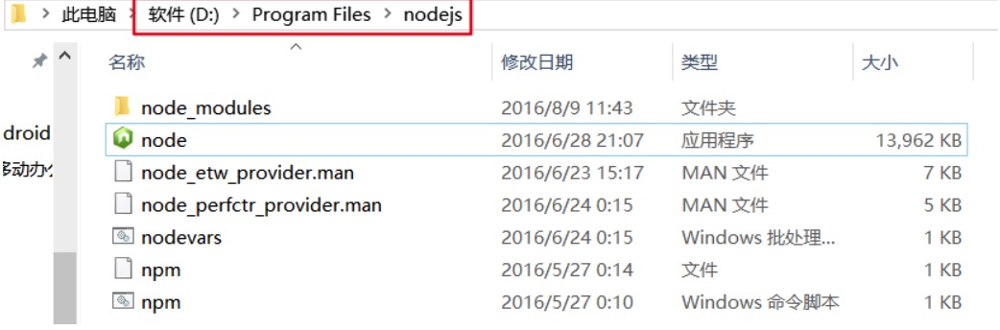

* nodejs环境变量添加示例
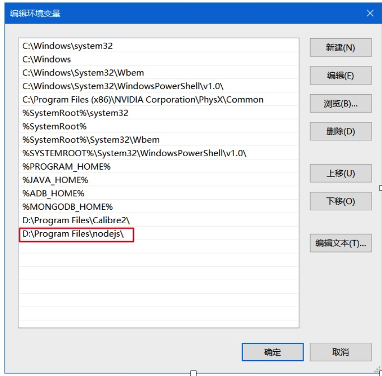

* 打开cmd命令行窗口，输入并执行where mongod命令。若观察到类似下图结果，环境变量配置成功。
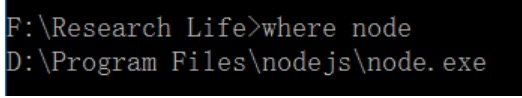

##MongoDB介绍

###简介
* MongoDB 是一个基于分布式文件存储的数据库。由 C++ 语言编写。旨在为 WEB 应用提供可扩展的高性能数据存储解决方案。MongoDB 是一个介于关系数据库和非关系数据库之间的产品，是非关系数据库当中功能最丰富，最像关系数据库的。

###安装配置
* MongoDB官网下载地址为http://www.mongodb.org/downloads。根据你的系统下载合适的安装包，下载后双击该文件，按操作提示安装即可。安装过程中，你可以通过点击 "Custom(自定义)" 按钮来设置你的安装目录，如下图所示。
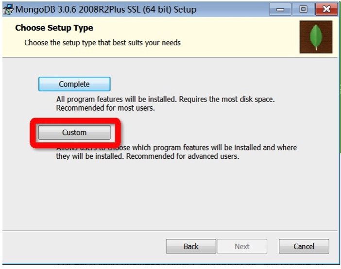

* 安装MongoDB，将MongoDB安装目录下的bin目录路径添加至系统环境变量。
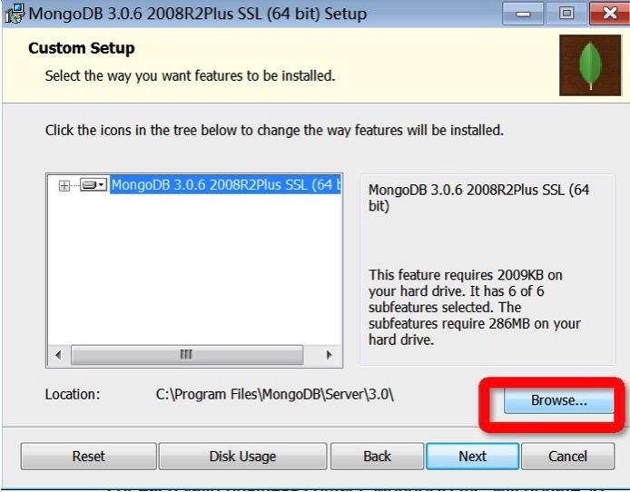

* MongoDB bin目录
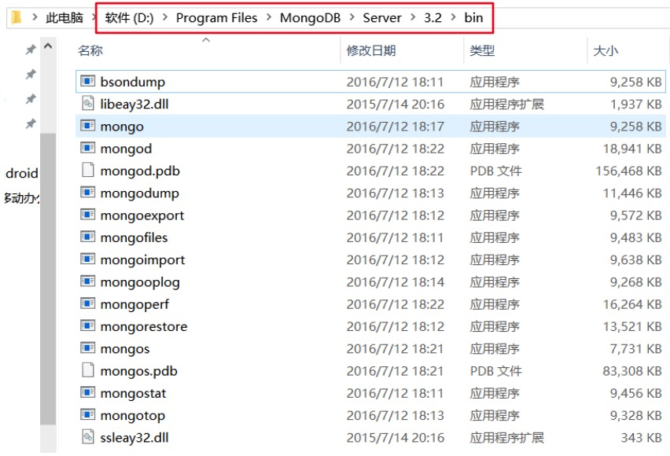

* MongoDB环境变量添加示例
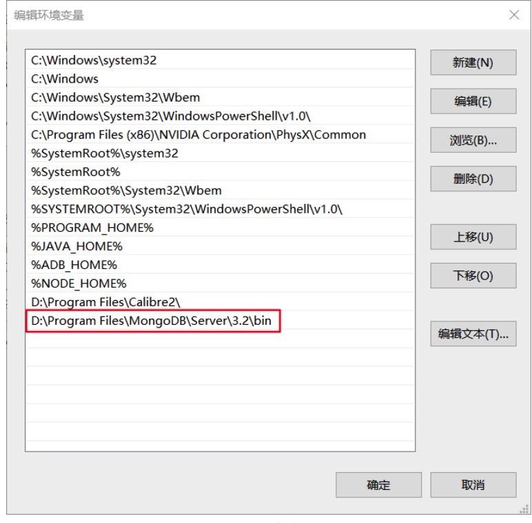

* 打开cmd命令行窗口，输入并执行where mongod命令。若观察到类似下图结果，环境变量配置成功。
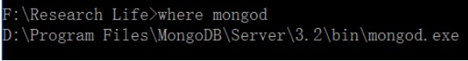

* 建立一个数据目录，MongoDB将数据目录存储在该目录下。但是这个数据目录不会主动创建，因此我们需要创建它。例如我们在D盘下新建一个data文件夹作为数据目录。
再次打开cmd命令行窗口，输入并执行mongod –dbpath d:/data。(d:/data即上文创建的空数据目录)，MongoDB服务启动，可观察到以下输出信息。MongoDB服务监听的为27017端口，在浏览器中输入localhost:27017并访问，可观察到下图信息。
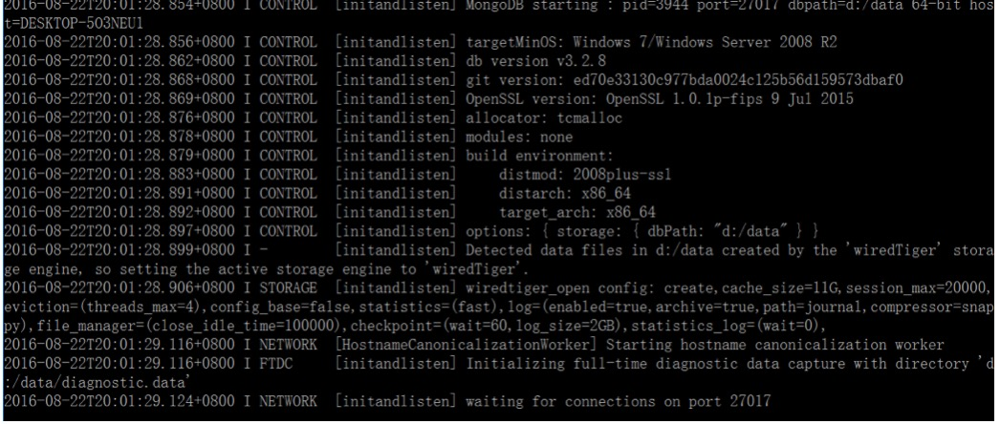

* 访问27017端口

##案例概述
* 客户端采用Android技术开发，服务端采用node.js技术搭建，服务端的数据存储包括JSON文件、图片文件、MongoDB数据库。
客户端通过http post方法向服务端请求数据，服务端根据请求参数返回相应的JSON数据，客户端解析该JSON数据然后做相应处理。
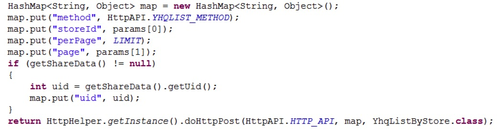

##服务端
* 在该案例中，我们用到三个node.js的额外模块。它们分别是：express，是基于node.js的Web应用开发框架，用于快速构建网站；body-parser，express的中间件，用于解析客户端请求的body中的内容；mongoose,用于高效操作MongoDB数据库的一种一种对象模型工具。
服务端项目的目录如下图所示。其中，data目录内是存储各种静态数据的JSON文件，images目录内是各种优惠券、商家、活动的图片，node_modules目录内是express、body-parser、mongoose这三个模块。app.js是服务端的主代码文件。
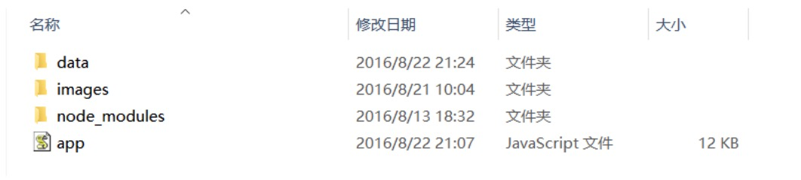

* app.js使用express框架，监听8888端口；它通过express.static设置images目录为静态，可被直接访问；通过使用body-parser中间件解析req.body；在接收任意post请求的回调方法中根据post请求的method参数做相应处理或者返回相应JSON数据。
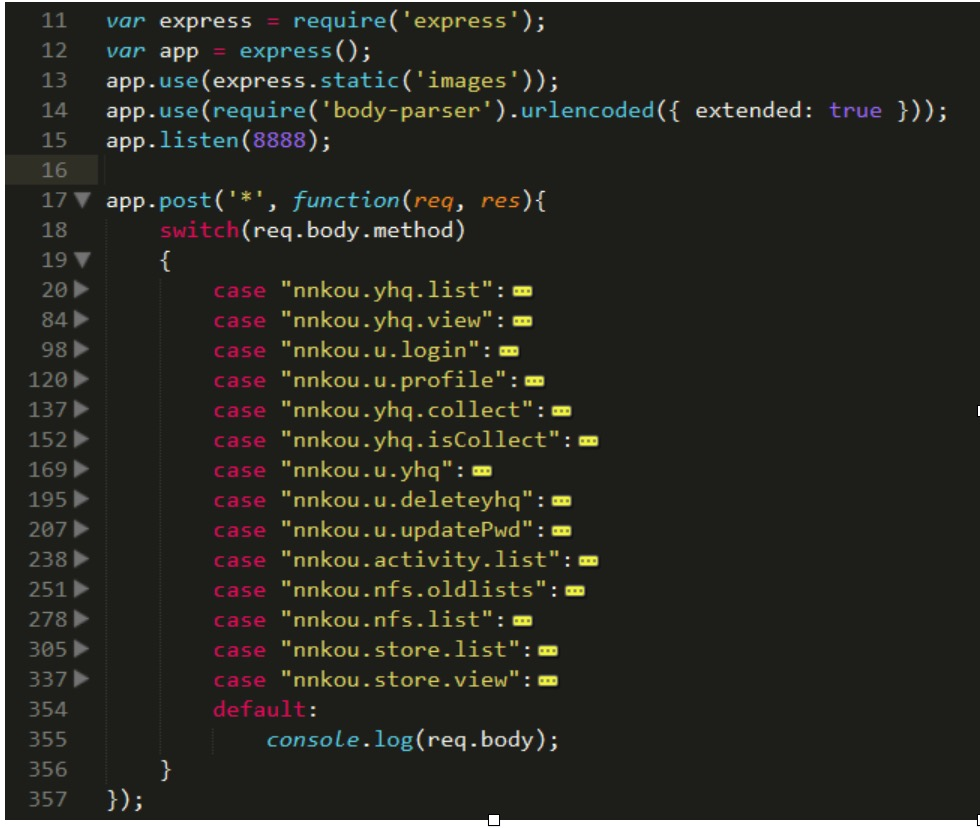

* app.js的如下部分通过mongoose构建“优惠券收藏表”的schema、model，并进一步通过获取的collectModel进行增、删、查等操作。

* 新增收藏
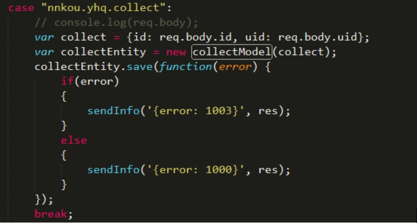

* 删除收藏
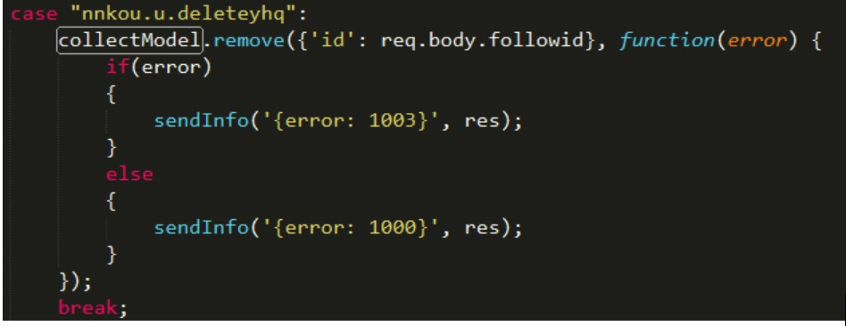

* 查询收藏
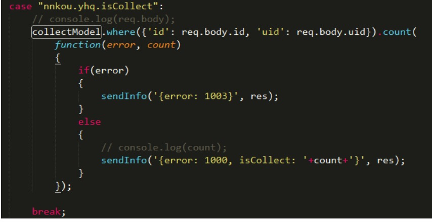

##客户端
* MyPortalActivity为欢迎界面的Activity，它延时3s通过handler启动MainTabActivity，同时销毁自身。
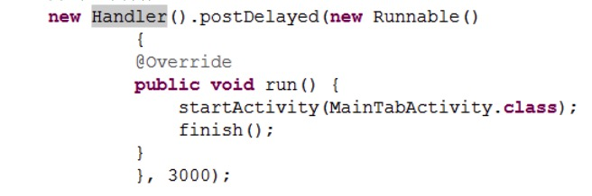

* MainTabActivity为Tab标签的Activity，它主要放置ActivitiesActivity(活动)/YqListActivity(优惠)/IndexActivity(主页)/FreeStoreActivity(免费店)/MyNiukouActivity(我的牛扣)这五个标签页。
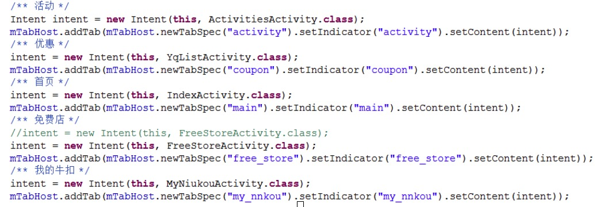

* 除了MainTabActivity继承自BaseTabActivity，项目中的其他Activity均继承自BaseActivity。在BaseActivity中，在onCreated方法中将Activity的初始化工作分为populateUI(填充组件)/bindUI(设置组件)/bindListener(为组件绑定监听器)这三个部分。其它Activity通过在onCreate方法中引用onCreated方法，并重写这三个方法来个性化自身的初始化工作。
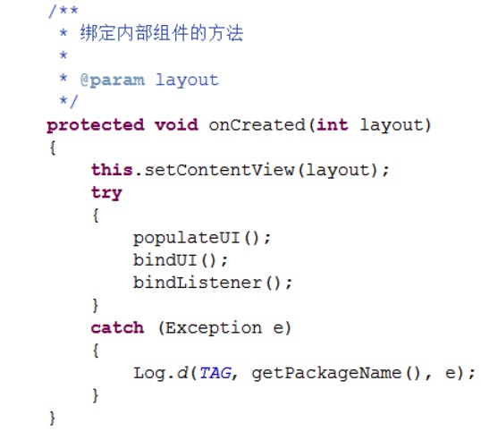

* 其他Activity在onCreate方法中调用onCreated方法
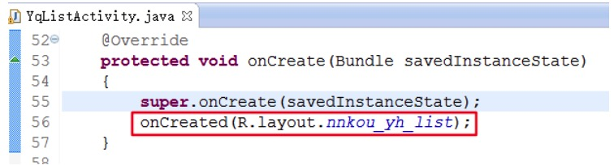

* 项目中大多数Activity均是通过继承AsyncTask创建个性化的异步任务加载数据，比较类似。因此，这里以YqListActivity(优惠标签页)为例讲述这一过程。
YqListActivity在bindUI方法中构造GetYhqListTask示例并execute。GetYhqListTask继承自AsyncTask，它的doInBackground方法传入请求地址、参数表、返回类型通过HttpHelper单例的doHttpPost方法获得YhqListByStore数据实例。
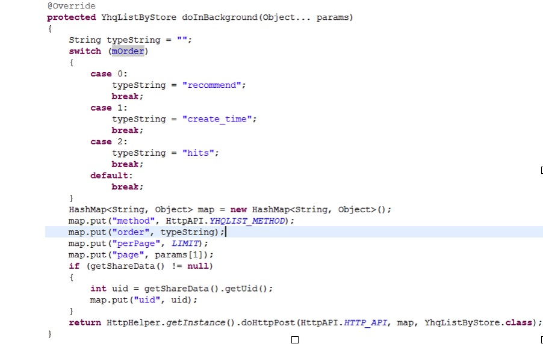

* HttpHelper的doHttpPost方法调用HttpConnectionPool的doHttpRequest方法做具体处理：它向webservice发送带params的post请求，将收到的数据字符串rs通过GsonBuilder转换为clazz指定的对象类型。
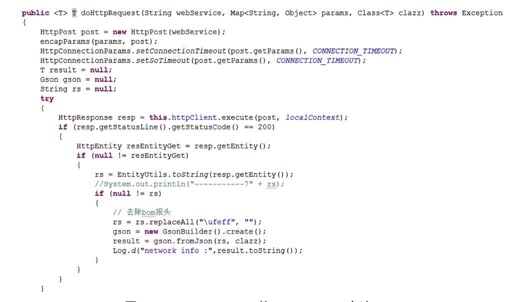

* GetYhqListTask的onPostExecute方法接收doInBackground方法返回的 YhqListByStore对象。它检查YhqListByStore对象的error值，1000为正常，其余代号表示原因各异的异常。之后，onPostExecute方法根据YhqListByStore对象更新UI，YhqList为mYhqListView的适配器mYhqAdapter设置数据，并通知数据集改变。其中，mYhqAdapter的getView方法中定义一个HolderView，将convetView的tag设置为HolderView，当它不为空时重新使用，达到重用的目的，优化listView的加载速度。
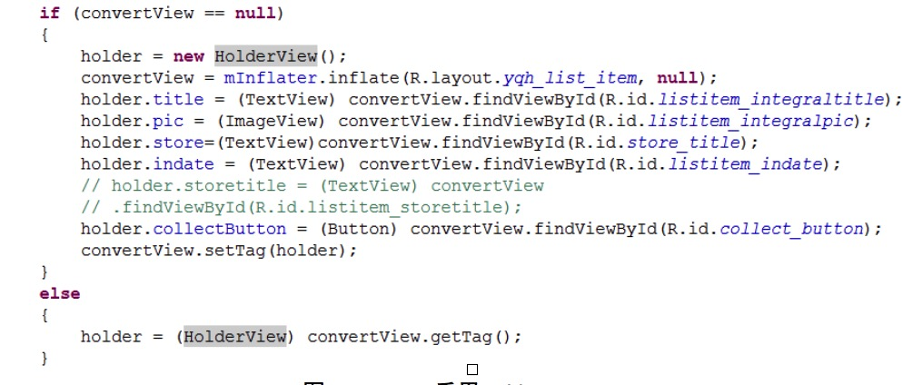

* 其中，优惠券图片的加载采用带缓存的ImageLoader，优化加载体验。
* getView方法中使用ImageLoader
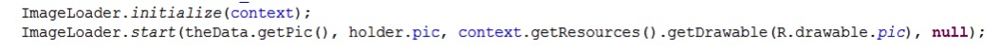

##案例步骤

###启动MongoDB数据库

###启动Nodejs服务端
* 在服务端项目目录下打开cmd命令行窗口，输入并执行node app.js命令启动服务端，光标闪烁。

* 由于images文件夹已被设为静态访问，且images文件夹中有以图片1.jpg,故在浏览器窗口中输入localhost:8888/1.jpg，可观察到某优惠券图片的显示。服务端启动成功。
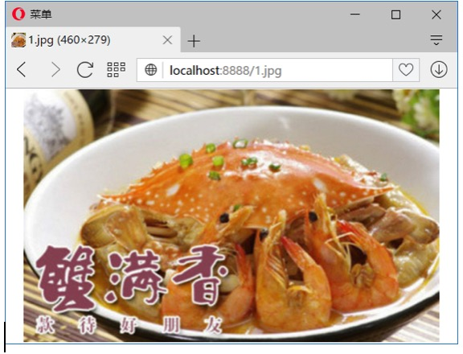

###启动Android客户端
* 使用Android模拟器启动“牛扣优惠券”项目。

###演示
* 欢迎界面

* 首页信息

* 搜索

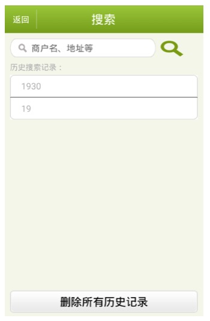

* 商家列表

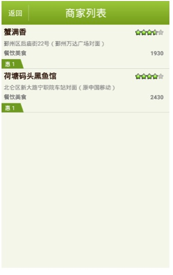

* 活动列表

* 优惠信息

* 优惠券详情页

* 分享到微博

* 免费店

* 登录界面

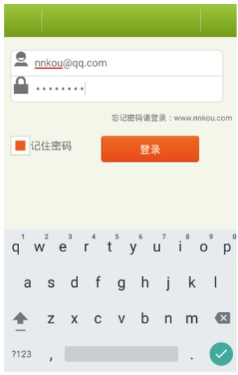

* 个人信息界面

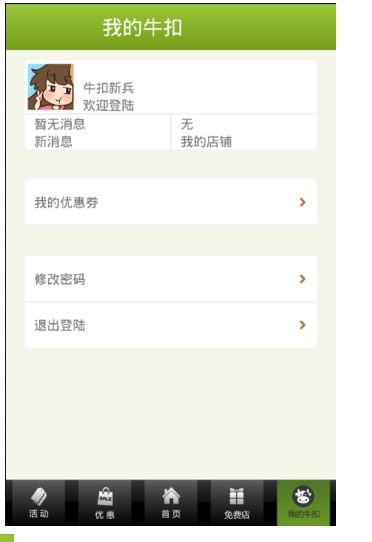

* 收藏优惠券信息

