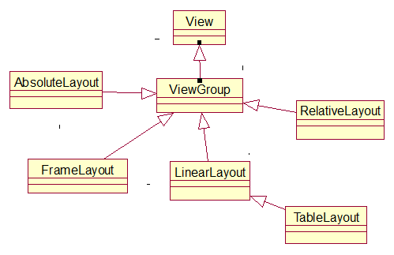
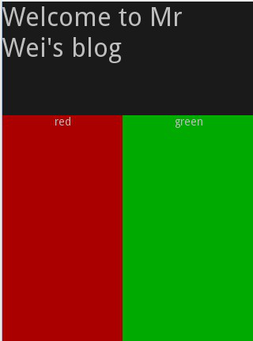
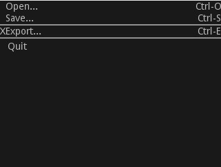
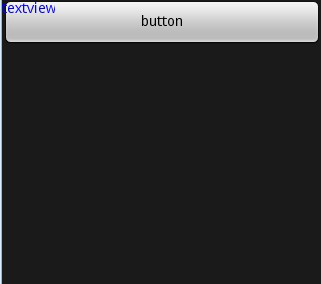
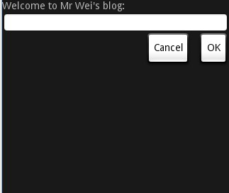
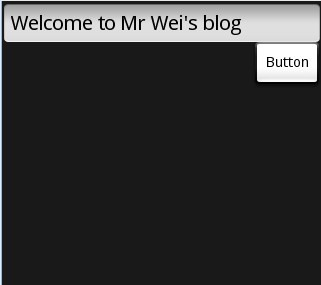

# 布局管理器

---
为了让组件在不同的分辨率、尺寸的手机屏幕上运行良好，Android提供布局管理器来管理组件的分布、大小。Android对用五大布局对象，它们分别是LinearLayout (线性布局) ，TableLayout(表格布局) ，FrameLayout(框架布局) ，RelativeLayout(相对布局) ，AbsoluteLayout(绝对布局) 。

###LinearLayout
* LinearLayout以设置的垂直或水平的属性值，来排列所有的子元素。所有的子元素都被堆放在其它元素之后，因此一个垂直列表的每一行只会有一个元素，而不管他们有多宽，而一个水平列表将会只有一个行高（高度为最高子元素的高度加上边框高度）。LinearLayout保持子元素之间的间隔以及互相对齐（相对一个元素的右对齐、中间对齐或者左对齐）。 实例：codes\02\2.2\LinearLayoutTest
* LinearLayout还支持为单独的子元素指定weight，允许子元素可以填充屏幕上的剩余空间，这也避免了在一个大屏幕中，一串小对象挤成一堆的情况，而是允许他们放大填充空白。子元素指定一个weight 值，剩余的空间就会按这些子元素指定的weight 比例分配给这些子元素。默认的 weight 值为0，意思是需要显示多大的视图就占据多大的屏幕空间。若赋高于零的值，则将父视图中的可用空间分割，数值越小，重要度越高。 

```
<?xml version="1.0" encoding="utf-8"?>  
<LinearLayout xmlns:android="http://schemas.android.com/apk/res/android"  
    android:orientation="vertical"  
    android:layout_width="fill_parent"  
    android:layout_height="fill_parent">  
   <LinearLayout  
    android:orientation="vertical"  
    android:layout_width="fill_parent"  
    android:layout_height="fill_parent"  
    android:layout_weight="2">  
    <TextView  
        android:text="Welcome to Mr Wei's blog"  
        android:textSize="15pt"  
        android:layout_width="fill_parent"  
        android:layout_height="wrap_content"  
     />  
    </LinearLayout>  
<LinearLayout  
    android:orientation="horizontal"  
    android:layout_width="fill_parent"  
    android:layout_height="fill_parent"  
    android:layout_weight="1">  
     
    <TextView  
        android:text="red"  
  
        android:gravity="center_horizontal" //这里字水平居中  
        android:background="#aa0000"  
        android:layout_width="wrap_content"  
        android:layout_height="fill_parent"  
        android:layout_weight="1"/>  
    <TextView  
        android:text="green"  
        android:gravity="center_horizontal "  
        android:background="#00aa00"  
        android:layout_width="wrap_content"  
        android:layout_height="fill_parent"  
        android:layout_weight="1"/>     
    </LinearLayout>  
</LinearLayout> 
```


###TableLayout
* TableLayout 采用行、列的形式管理UI组件。一个TableLayout 由许多的TableRow 组成，每个TableRow 都会定义一个 row ，每个 row 拥有0个或多个的cell ，每个cell 拥有一个View 对象，表格由列和行组成许多的单元格，表格允许单元格为空，单元格不能跨列，这与HTML 中的不一样。 TableLayout 容器不会显示row 、cloumns 或cell 的边框线。
* 实例：codes\02\2.2\TableLayoutTest

```
<?xml version="1.0" encoding="utf-8"?>  
<TableLayout xmlns:android="http://schemas.android.com/apk/res/android"  
    android:layout_width="fill_parent" android:layout_height="fill_parent"  
    android:stretchColumns="1">  
    <TableRow>  
        <TextView android:layout_column="1" android:text="Open..." />  
        <TextView android:text="Ctrl-O" android:gravity="right" />  
    </TableRow>  
    <TableRow>  
        <TextView android:layout_column="1" android:text="Save..." />  
        <TextView android:text="Ctrl-S" android:gravity="right" />  
    </TableRow>  
    <View android:layout_height="2dip" android:background="#FF909090" /> 
     <TableRow>  
        <TextView android:text="X" />  
        <TextView android:text="Export..." />  
        <TextView android:text="Ctrl-E" android:gravity="right " />  
    </TableRow>  
    <View android:layout_height="2dip" android:background="#FF909090" />  
    <TableRow>  
        <TextView android:layout_column="1" android:text="Quit"  
            android:padding="3dip" />  
    </TableRow>  
</TableLayout>

```

###FrameLayout

* FrameLayout是最简单的一个布局对象，它被定制屏幕上的一个空白备用区域，可以在其中填充一个单一对象，比如要发布的图片。所有的子元素将会固定在屏幕的左上角。
* 不能为FrameLayout中的一个子元素指定一个位置，后一个子元素将会直接在前一个子元素之上进行覆盖填充，把它们部分或全部挡住（除非后一个子元素是透明的）。 
* 实例：codes\02\2.2\FrameLayoutTest

```
<?xml version="1.0" encoding="utf-8"?>  
<FrameLayout xmlns:android="http://schemas.android.com/apk/res/android"  
    android:layout_width="fill_parent"  
    android:layout_height="fill_parent"  >  
 <!-- 我们在这里加了一个Button按钮 -->  
<Button  
    android:text="button"  
    android:layout_width="fill_parent"  
    android:layout_height="wrap_content"  />  
<TextView  
    android:text="textview"  
    android:textColor="#0000ff"  
    android:layout_width="wrap_content"  
    android:layout_height="wrap_content"  />  
</FrameLayout>   

```

###RelativeLayout
* RelativeLayout 允许子元素指定他们相对于其它元素或父元素的位置(通过ID 指定)。因此，可以以左右对齐，或上下对齐，或置于屏幕中央的形式来排列两个元素。

* 元素按顺序排列，因此如果第一个元素在屏幕的中央，那么相对于这个元素的其它元素将以屏幕中央的相对位置来排列。如果使用XML来指定这个layout，在定义它之前，被关联的元素必须定义。
* 实例：codes\02\2.2\RelativeLayoutTest

```
<?xml version="1.0" encoding="utf-8"?>  
<RelativeLayout xmlns:android="http://schemas.android.com/apk/res/android"  
    android:layout_width="fill_parent"  
    android:layout_height="fill_parent">  
    <TextView  
        android:id="@+id/label"  
        android:layout_width="fill_parent"  
        android:layout_height="wrap_content"  
        android:text="Welcome to Mr Wei's blog:"/>  
    <EditText  
        android:id="@+id/entry"  
        android:layout_width="fill_parent"  
        android:layout_height="wrap_content"  
        android:layout_below="@id/label"/>  
        <Button  
        android:id="@+id/ok"  
        android:layout_width="wrap_content"  
        android:layout_height="wrap_content"  
        android:layout_below="@id/entry"  
        android:layout_alignParentRight="true"  
        android:layout_marginLeft="10dip"  
        android:text="OK" />  
    <Button  
        android:layout_width="wrap_content"  
        android:layout_height="wrap_content"  
        android:layout_toLeftOf="@id/ok"  
        android:layout_alignTop="@id/ok"  
        android:text="Cancel" />  
</RelativeLayout>   

```

###AbsoluteLayout
* AbsoluteLayout可以指定子元素的确切x、y坐标值，并显示在屏幕上。(0, 0)为左上角，当向下或向右移动时，坐标值将变大。
* AbsoluteLayout 没有页边框，允许元素之间互相重叠。通常不推荐使用 AbsoluteLayout，除非有正当理由要使用它，因为它使界面代码太过刚性，以至于在不同的设备上可能不能很好地工作。
* 实例：codes\02\2.2\AbsoluteLayoutTest

```
 <?xml version="1.0" encoding="utf-8"?>  
<AbsoluteLayout xmlns:android="http://schemas.android.com/apk/res/android"  
    android:orientation="vertical"  
    android:layout_width="fill_parent"  
    android:layout_height="fill_parent"  >  
<EditText  
    android:text="Welcome to Mr Wei's blog"  
    android:layout_width="fill_parent"  
    android:layout_height="wrap_content"  />  
<Button  
    android:layout_x="250px"   
    android:layout_y="40px"   
    android:layout_width="70px"   
    android:layout_height="wrap_content"  
    android:text="Button"  />  
</AbsoluteLayout>  

```



