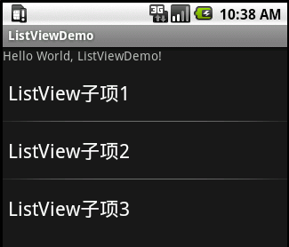
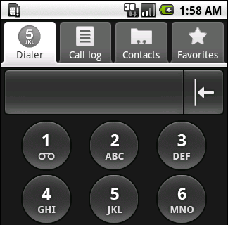
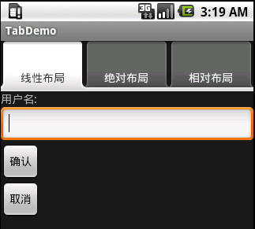
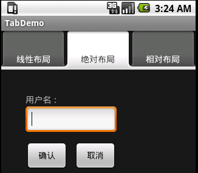

# 高级界面组件

---

##Spinner
* Spinner是一种能够从多个选项中选一选项的控件，类似于桌面程序的组合框（ComboBox），但没有组合框的下拉菜单，而是使用浮动菜单为用户提供选择
* SpinnerDemo在XML文件中的代码：

```
<TextView  android:id="@+id/TextView01"
    	android:layout_width="fill_parent" 
    	android:layout_height="wrap_content" 
    	android:text="@string/hello"/>
5     <Spinner android:id="@+id/Spinner01" 
	android:layout_width="300dip" 
	android:layout_height="wrap_content">
</Spinner>


```
*第5行使用<Spinner>标签声明了一个Spinner控件
第5行代码中指定了该控件的宽度为300dip
*
* 在SpinnerDemo.java文件中，定义一个ArrayAdapter适配器，在ArrayAdapter中添加需要在Spinner中可以选择的内容，需要在代码中引入android.widget.ArrayAdapter和android.widget.Spinner

```
Spinner spinner = (Spinner) findViewById(R.id.Spinner01);   
List<String> list  = new ArrayList<String>();
list .add("Spinner子项1");
list .add("Spinner子项2");
list .add("Spinner子项3");
ArrayAdapter<String> adapter = new ArrayAdapter<String>(this, 		android.R.layout.simple_spinner_item, list );
adapter.setDropDownViewResource(android.R.layout.simple_spinner_dropdown_item);
spinner.setAdapter(adapter);

```

*第2行代码建立了一个字符串数组列表（ArrayList），这种数组列表可以根据需要进行增减，<String>表示数组列表中保存的是字符串类型的数据*

*在代码的第3、4、6行中，使用add()函数分别向数组列表中添加3个字符串*

*第6行代码建立了一个ArrayAdapter的数组适配器，数组适配器能够将界面控件和底层数据绑定在一起*

*第7行代码设定了Spinner的浮动菜单的显示方式，其中，android.R.layout.simple_spinner_dropdown_item是Android系统内置的一种浮动菜单*

*第8行代码实现绑定过程，所有ArrayList中的数据，将显示在Spinner的浮动菜单中*

##ListView
* ListView是一种用于垂直显示的列表控件，如果显示内容过多，则会出现垂直滚动条
* ListView能够通过适配器将数据和自身绑定，在有限的屏幕上提供大量内容供用户选择，所以是经常使用的用户界面控件
* ListView支持点击事件处理，用户可以用少量的代码实现复杂的选择功能
* 建立一个“ListViewDemo”程序，包含四个控件，从上至下分别为TextView01、ListView01、 ListView02和 ListView03

ListiewDemo在XML文件中的代码：

```
<TextView  android:id="@+id/TextView01" 
		android:layout_width="fill_parent" 
		android:layout_height="wrap_content" 
		android:text="@string/hello" />
	<ListView android:id="@+id/ListView01" 
		android:layout_width="wrap_content" 
		android:layout_height="wrap_content">
	</ListView>

```
在ListViewDemo.java文件中，首先需要为ListView创建适配器，并添加ListView中所显示的内容：

```
final TextView textView = (TextView)findViewById(R.id.TextView01);
ListView listView = (ListView)findViewById(R.id.ListView01);
List<String> list  = new ArrayList<String>();
list.add("ListView子项1");
list.add("ListView子项2");
list.add("ListView子项3");
ArrayAdapter<String> adapter = new ArrayAdapter<String>(this,			android.R.layout.simple_list_item_1, list );
listView.setAdapter(adapter);

```
* 
*第2行代码通过ID引用了XML文件中声明的ListView*

* 
*第7行代码声明了适配器ArrayAdapter，第三个参数list说明适配器的数据源为数组列表*

* 
*第8行代码将ListView和适配器绑定*

下面的代码声明了ListView子项的点击事件监听器，用以确定用户在ListView中，选择的是哪一个子项：

```
AdapterView.OnItemClickListener listViewListener = new			AdapterView.OnItemClickListener(){
	@Override
	public void onItemClick(AdapterView<?> arg0, View arg1, int arg2, long arg3) { 
		String msg =””;
		textView.setText(msg);
	}};
listView.setOnItemClickListener(listViewListener);

```
* *第1行的AdapterView.OnItemClickListener是ListView子项的点击事件监听器，同样是一个接口，需要实现onItemClick()函数。在ListView子项被选择后，onItemClick()函数将被调用*
* *第3行的onItemClick()函数中一共有四个参数，参数0表示适配器控件，就是ListView；参数1表示适配器内部的控件，是ListView中的子项；参数2表示适配器内部的控件，也就是子项的位置；参数3表示子项的行号*
* *第7行代码是ListView指定刚刚声明的监听器*



##TabHost
* Tab标签页是界面设计时经常使用的界面控件，可以实现多个分页之间的快速切换，每个分页可以显示不同的内容
* 下图是Android系统内置的Tab标签页，点击“呼出/接听键”后出现，用于电话呼出和查看拨号记录、联系人


* Tab标签页的使用
 * 首先要设计所有的分页的界面布局
 * 在分页设计完成后，使用代码建立Tab标签页，并给每个分页添加标识和标题
 * 最后确定每个分页所显示的界面布局
 
* 每个分页建立一个XML文件，用以编辑和保存分页的界面布局，使用的方法与设计普通用户界面没有什么区别
* 建立一个“TabDemo”程序，包含三个XML文件，分别为tab1.xml、tab2.xml和tab3.xml，这3个文件分别使用线性布局、相对布局和绝对布局，并将布局的ID分别定义为layout01、layout02和layout03


 tab1.xml文件代码
 
 ```
 <?xml version="1.0" encoding="utf-8"?>
<LinearLayout android:id = "@+id/layout01"
  ……
  ……
</LinearLayout>

 ```
 tab2.xml文件代码
 
 ```
 <?xml version="1.0" encoding="utf-8"?>
<AbsoluteLayout android:id="@+id/layout02"
  ……
  ……
</AbsoluteLayout>

 ```
 tab3.xml文件代码
 
 ```
 <?xml version="1.0" encoding="utf-8"?>
<RelativeLayout android:id="@+id/layout03" 
  ……
  ……
</RelativeLayout>

 ```
  在TabDemo.java文件中键入下面的代码，创建Tab标签页，并建立子页与界面布局直接的关联关系
  
  ```
  package edu.hrbeu.TabDemo;
 
import android.app.TabActivity;
import android.os.Bundle;
import android.widget.TabHost;
import android.view.LayoutInflater;
 
8     public class TabDemo extends TabActivity {
	@Override
public void onCreate(Bundle savedInstanceState) {
		super.onCreate(savedInstanceState);        
12		TabHost tabHost = getTabHost();
		LayoutInflater.from(this).inflate(R.layout.tab1, 				tabHost.getTabContentView(),true);
		LayoutInflater.from(this).inflate(R.layout.tab2, 				tabHost.getTabContentView(),true);
		LayoutInflater.from(this).inflate(R.layout.tab3, 				tabHost.getTabContentView(),true);
16		tabHost.addTab(tabHost.newTabSpec("TAB1")
17			.setIndicator("线性布局").setContent(R.id.layout01));
		tabHost.addTab(tabHost.newTabSpec("TAB2")
			.setIndicator("绝对布局").setContent(R.id.layout02));
		tabHost.addTab(tabHost.newTabSpec("TAB3")
			.setIndicator("相对布局").setContent(R.id.layout03));
            }
 }

  ```
 * *第8行代码的声明TabDemo类继承与TabActivity，与以往继承Activity不同，TabActivity支持内嵌多个Activity或View*
 
 * *第12行代码通过getTabHost()函数获得了Tab标签页的容器，用以承载可以点击的Tab标签和分页的界面布局。*

 * *第13行代码通过LayoutInflater将tab1.xml文件中的布局转换为Tab标签页可以使用的View对象*
 * *第16行代码使用addTab()函数添加了第1个分页，tabHost.newTabSpec("TAB1")表明在第12行代码中建立的tabHost上，添加一个标识为TAB1的Tab分页*
 * *第17行代码使用setIndicator()函数设定分页显示的标题，使用setContent()函数设定分页所关联的界面布局*

TabDemo示例的运行结果如图：

* 在使用Tab标签页时，可以将不同分页的界面布局保存在不同的XML文件中，也可以将所有分页的布局保存在同一个XML文件中
 * 第一种方法有利于在开发环境中进行可视化设计，并且不同分页的界面布局在不同的文件中更加易于管理
 * 第二种方法则可以产生较少的XML文件，同时编码时的代码也会更加简洁


