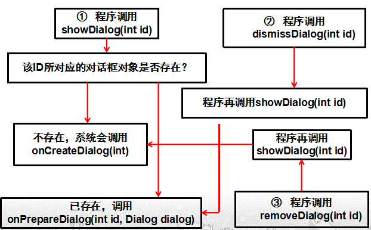
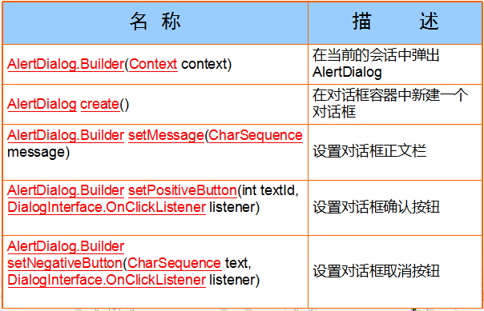

# 对话框
---
* 在图形用户界面中，对话框是一种特殊的视窗, 用来在用户界面中向用户显示信息，或者在需要的时候获得用户的响应。之所以称之为“对话框”是因为它们使计算机和用户之间构成了一个对话——或者是通知用户一些信息，或者是请求用户的输入，或者两者皆有。
* Android系统支持四种对话框
 * 提示对话框（AlertDialog）
 * 进度对话框（ProgressDialog）
 * 日期选择对话框（DatePickerDialog）
 * 时间选择对话框（TimePickerDialog）

* Android主要是面向手持式设备的，因此， 简约型设计理念影响了Android的图形接口设计，Android中的对话框没有Windows中那么多的灵活性。
* Android中的对话框是一个半透明的浮动窗口，它会部分地遮挡当前的Activity。
* 在Android系统中，对话框不能移动，其位置总是居中的，在结束一个对话框前，用户不能操作对话框下面的任何窗口，除非按HOME键返回桌面。这种设计尽管有些呆板，但却也可以说是简约，对于掌上设备而言，似乎够用了。
* Activity内部有一个对话框容器，对话框一旦被创建并被加入到该容器后，对话框对象就一直保存，直到对话框对象被移除。因此，在创建对话框的时候，如果定义一个全局对话框对象，将其引用到新建的对话框，那么在整个Activity的生命周期内都可以使用该对象。
* 对话框的创建和消亡如图所示：

1.程序调用showDialog(int id)：系统会判断参数ID所指定的对话框是否存在，因为Activity内部有一个对话框容器，保存着该Activity内的全部对话框对象。

 * 如果该对话框存在，系统会直接回调onPrepareDialog（int id, Dialog dialog）函数，可以重写该函数用于动态改变对话框中要显示的内容。
 * 如果该对话框不存在，系统会调用onCreateDialog(int)函数，程序员一般需要重写该函数，用以初始化一个对话框。该函数的返回值为所创建的对话框的引用，可以把这个引用保存到一个全局变量中，从而在整个Activity的生命周期中随时设置对话框的元素。同时，系统会把新创建的对话框对象保存到内部的对话框容器中。
 
 2.程序调用dismissDialog(int id)：它的功能是让对话框离开，从而看不见。但该对话框对象还存在于内部的对话框容器中，只是不显示而已，而不是真正意义上的删除。如果程序接下来再调用showDialog(int id)，那么系统会直接调用onPrepareDialog(int id, Dialog dialog)显示对话框。

  3.程序调用removeDialog(int id)：该方法的作用是从对话框容器中清除指定ID的对话框对象，因此，当程序接下来再调用showDialog(int id)时，系统会调用onCreateDialog(int)。在程序设计时，除非确认不再使用对话框对象，否则不要调用removeDialog(int id)，以便节约系统开销。

###提示对话框（AlertDialog）
提示对话框主要用于“是”、“否”、“列表选择”等类型的提示。

* 初次使用对话框时可以创建AlertDialog.Builder类的对象实例，然后通过AlertDialog.Builder类的show方法显示对话框，或通过Builder类的create方法返回AlertDialog对象，再通过AlertDialog类的show方法显示对话框。

* 由于提示对话框的构造方法被声明为protected方法，因此，不能直接使用new关键字来创建AlertDialog的对象实例。为了创建AlertDialog对象，需要使用Builder类，该类是在AlertDialog中定义的一个内嵌类创建AlertDialog.Builder类的对象实例，然后通过AlertDialog.Builder类的show方法显示对话框，或通过Builder类的create方法返回AlertDialog对象，再通过AlertDialog类的show方法显示对话框。
* 如果只是简单显示一个对话框，这个对话框并不起任何作用。在对话框上既没有文字，也没有按钮，而且负责显示对话框的Activity会失去焦点，除非按手机上的取消键，否则无法关闭这个对话框。为了给对话框加上文字和按钮，可以在调用show方法之前，调用AlertDialog.Builder类中的其它方法为对话框设置更多信息，例如：setTitle方法设置对话框标题，setIcon方法设置对话框左上角显示的图标。
* 提示对话框能够同时显示按钮、文字和图标。
* 使用提示对话框创建的按钮最多只能有3个。
（图片。。。。）

###简单列表对话框
* 通过AlertDialog.Builder类的setItems方法可以创建简单的列表对话框。实际上，这种对话框相当于将ListView放在对话框上，然后在ListView中添加若干文本。
* 列表对话框是垂直的列表型对话框
 * 支持单选框和复选框
 * 

