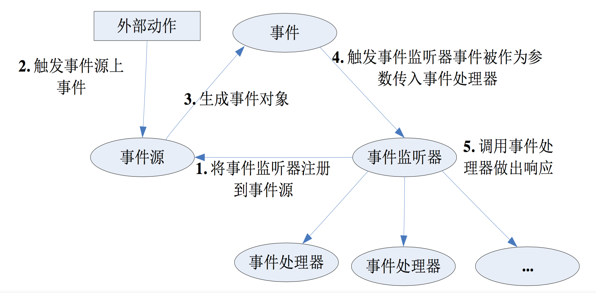

# 基于监听的事件处理
---
## 监听的处理模型
* 基于监听的事件处理是一种“面向对象”的事件处理，处理方式与Java的AWT、Swing的处理方式几乎完全相同主要涉及如下三类对象。
 * EventSource(事件源)：事件发生的场所，通常就是各个组件，例如窗口、按钮、菜单等。
 * Event(事件)：事件封装了界面组件上发生的特定事情，通常是一次用户操作，如果程序需要获得界面组件上所发生事件的相关信息，一般通过Event对象来取得 。
 * EventListener(事件监听器)：负责监听事件源所发生的事件，并对各种事件作出相应的响应。

* Android的事件处理机制是一种委派式事件处理方式：普通组件(事件源)将整个事件处理委托给特定的对象(事件监听器)；当该事件源发生指定的事件时，就通知委托的事件监听器，由事件监听器来处理这个事件。
* 每个组件均可以针对特定的事件指定一个事件监听器，每个事件监听器也可监听一个或多个事件源。同时也可以让一类事件使用同一个事件监听器来处理。如图所示为事件处理流程示意图。

* 基于监听的事件处理模型的编程步骤如下:
 * 获取普通界面组件(事件源)，也就是被监听的对象。
 * 实现事件监听器类，该监听器类是一个特殊的Java类,必须实现一个XxxListener接口。
 * 调用事件源的setXxxListener方法将事件监听器对象注册给普通组件。
* 当事件源上发生指定事件时，Android会触发事件监听器，由事件监听器调用相应的方法(事件处理器)来处理事件。

## 时间和事件监听器

* 基于监听的事件处理模型涉及三个成员：事件源、事件和事件监听器，其中事件源最容易创建，任意界面组件都可作为事件源；事件的产生无须程序员关心，它是有系统自动创建，实现事件监听器是整个事件处理的核心
* 但对于键盘事件、触摸屏事件等，此时程序需要获取事件发生的详细信息。例如，键盘事件需要获取是哪个键出发的事件；触摸屏事件需要获取事件发生的位置等，对于这种包含更多信息的事件，Android同样会将事件信息封装成XxxEvent对象，并把该对象作为参数传入事件处理器。
* 下面以一个简单的控制飞机移动例子来介绍键盘事件监听。为了实现该程序，先开发一个自定义的View，该View类的代码如下。

```
public class PlaneView extends View
{
	public float currentX;
	public float currentY;
	Bitmap plane;
	public PlaneView(Context context)
	{
		super(context);
		// 定义飞机图片
		plane = BitmapFactory.decodeResource(context.getResources(),
			R.drawable.plane);
		setFocusable(true);
	}
	@Override
	public void onDraw(Canvas canvas)
	{
		super.onDraw(canvas);
		// 创建画笔
		Paint p = new Paint();
		// 绘制飞机
		canvas.drawBitmap(plane, currentX, currentY, p);
	}
}
```
* 该游戏不需要界面布局，直接使用PlaneView最为Activity显示的内容，并诶该Plane View增加键盘事件监听器即可，下面是该程序的Activity代码。
```
public class MainActivity extends Activity
{
	// 定义飞机的移动速度
	private int speed = 10;
	@Override
	public void onCreate(Bundle savedInstanceState)
	{
		super.onCreate(savedInstanceState);
		// 去掉窗口标题
		requestWindowFeature(Window.FEATURE_NO_TITLE);
		// 全屏显示
		getWindow().setFlags(WindowManager.LayoutParams.FLAG_FULLSCREEN,
				WindowManager.LayoutParams.FLAG_FULLSCREEN);
		// 创建PlaneView组件
		final PlaneView planeView = new PlaneView(this);
		setContentView(planeView);
		planeView.setBackgroundResource(R.drawable.back);
		// 获取窗口管理器
		WindowManager windowManager = getWindowManager();
		Display display = windowManager.getDefaultDisplay();
		DisplayMetrics metrics = new DisplayMetrics();
		// 获得屏幕宽和高
		display.getMetrics(metrics);
		// 设置飞机的初始位置
		planeView.currentX = metrics.widthPixels / 2;
		planeView.currentY = metrics.heightPixels - 100;
		// 为planeView组件的键盘事件绑定监听器
		planeView.setOnKeyListener(new OnKeyListener()
		{
			@Override
			public boolean onKey(View source, int keyCode, KeyEvent event)
			{
				// 获取由哪个键触发的事件
				switch (event.getKeyCode())
				{
					// 控制飞机下移
					case KeyEvent.KEYCODE_S:
						planeView.currentY += speed;
						break;
					// 控制飞机上移
					case KeyEvent.KEYCODE_W:
						planeView.currentY -= speed;
						break;
					// 控制飞机左移
					case KeyEvent.KEYCODE_A:
						planeView.currentX -= speed;
						break;
					// 控制飞机右移
					case KeyEvent.KEYCODE_D:
						planeView.currentX += speed;
						break;
				}
				// 通知planeView组件重绘
				planeView.invalidate();
				return true;
			}
		});
	}
}
```
* 通过上面实例不难看出，事件监听器就是实现了特定接口的Java类实例，通常有如下几种实现事件监听器的形式：
 * 内部类形式：将事件监听器定义为当前类的内部类
 * 外部类形式：将事件监听器定义为一个外部类
 * Activity本身作为事件监听器类：让Activity本身实现监听器接口，并实现事件处理方法
 * 匿名内部类形式：使用匿名内部类创建事件监听器对象

## 外部类作为事件监听器类

* 使用外部类定义事件监听器类的形式比较少见，主要因为：
 * 事件监听器通常属于特定的GUI界面，定义成外部类不利于提高程序的内聚性。
 * 外部类行驶的事件监听器不能自由访问创建GUI界面的类中的组建，编程不够简洁。
* *但如果某个事件监听器确实需要被多个GUI界面所共享，而且主要是完成某种业务逻辑的实现，则可以考虑使用外部类形式来定义事件监听器类。*

## Activity本身作为事件监听器类

* 这种形式使用Activity本身作为监听器类，可以直接在Activity类中定义事件处理器的方法。这种形式非常简洁，但有两个缺点：
 * 这种形式可能造成程序结构混乱，Activity的主要职责应该是完成界面初始化工作，但此时还需要包含事件处理器的方法，从而造成混乱。
 * 如果Activity界面类需要实现监听器借口，让人感觉比较怪异。

## 匿名内部类作为事件监听器类
* 大部分时候，事件处理器都没有什么复用价值，因此大部分事件监听器只是临时使用一次，所以使用匿名内部类形式的事件监听器更适合。实际上，这种形式是目前使用最广泛的事件监听器形式。

## 直接绑定到标签
* Android还有一种更加简单的绑定事件监听器的方式，直接在界面布局文件中为指定标签绑定事件处理方法。对于很多Android界面组件而言，它们都支持如onClick、onLongClick等属性，这种属性的属性值就是一个形如xxx(View source)的方法名。例如如下界面布局文件

```
<?xml version="1.0" encoding="utf-8"?>
<LinearLayout xmlns:android="http://schemas.android.com/apk/res/android"
	android:orientation="vertical"
	android:layout_width="match_parent"
	android:layout_height="match_parent"
	android:gravity="center_horizontal">
	<EditText
		android:id="@+id/show"
		android:layout_width="match_parent"
		android:layout_height="wrap_content"
		android:editable="false"
		android:cursorVisible="false"/>
	<!-- 在标签中为按钮绑定事件处理方法 -->
	<Button
		android:layout_width="wrap_content"
		android:layout_height="wrap_content"
		android:text="单击我"
		android:onClick="clickHandler"/>
</LinearLayout>

```
* 上面程序为Button按钮绑定了一个clickHanlder事件处理方法，这就一位着开发者需要在该界面布局对应的Activity中定义一个void clickHanlder(View source)方法，该方法将会负责处理该按钮上的单击事件。下面是该界面布局对应的Java代码。

```
public class MainActivity extends Activity
{
	@Override
	public void onCreate(Bundle savedInstanceState)
	{
		super.onCreate(savedInstanceState);
		setContentView(R.layout.main);
	}
	// 定义一个事件处理方法
	// 其中source参数代表事件源
	public void clickHandler(View source)
	{
		EditText show = (EditText) findViewById(R.id.show);
		show.setText("bn按钮被单击了");
	}
}

```
* 上面程序中定义了一个clickHanlder(View source)方法，当程序按钮被单击时明将会激发并处理单击事件。