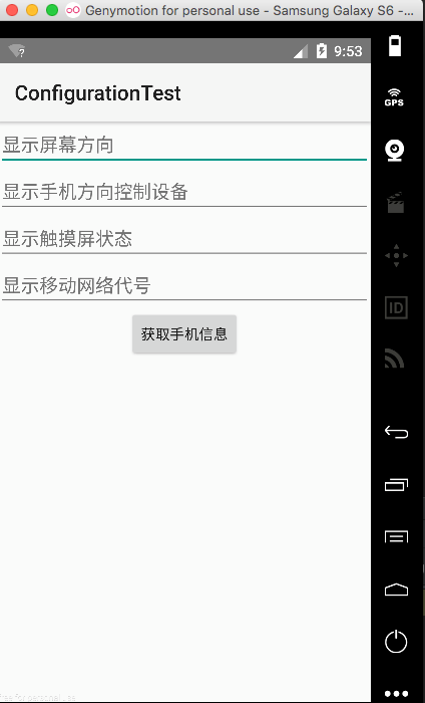
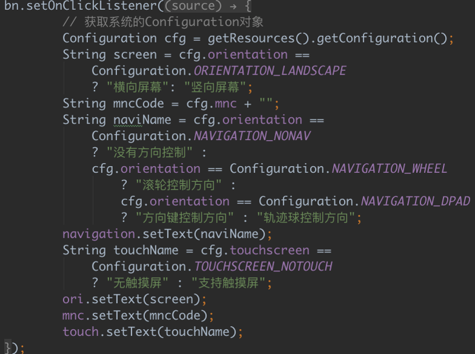
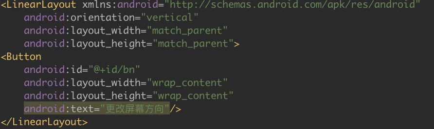
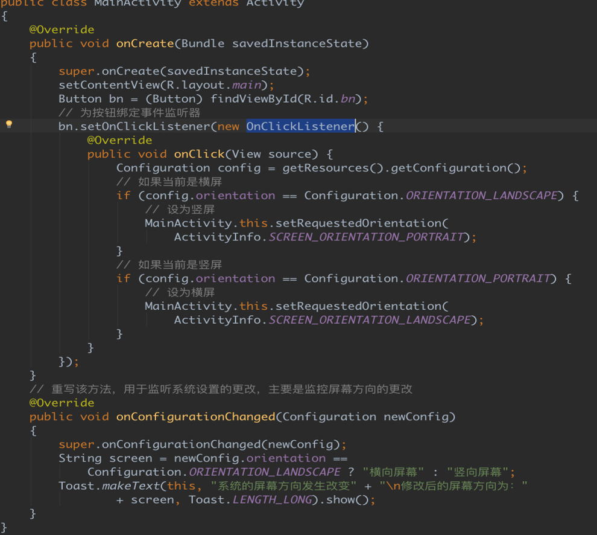
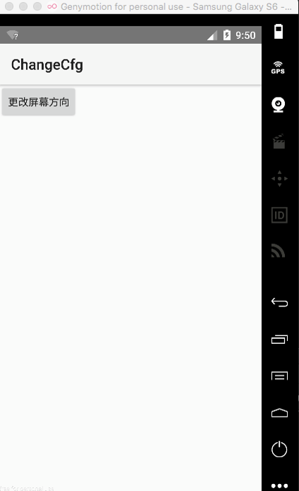
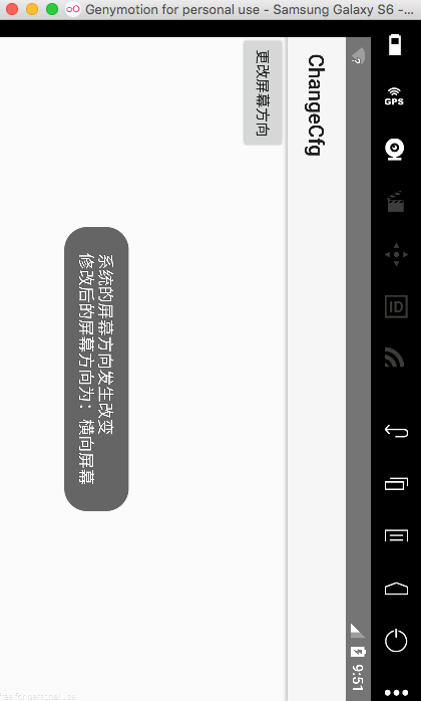

# 响应系统设置的事件

---

​	在开发Android应用时，有时候可能需要让应用程序随系统设置而进行调整，比如判断屏幕方向、判断系统方向的导航设备等。除此之外，有时还需要让应用程序监听系统设置的更改，对系统设置的更改做出响应。

**Configuration类的简介**

*  Configuration类专门用于描述手机设备上的配置信息，该类包含了很多种信息，比如系统字体大小、orientation、输入设备类型等等。

*  程序可调用Activity的如下方法来获取系统的Configuration对象：

   ```
   Configuration cfg = getResources().getConfiguration();
   ```

*  Configuration对象提供了以下方法来获取系统的配置信息。

   *  public float fontScale: 获取当前用户设置的字体的缩放因子。

   *  public int keyboard: 获取当前设备的键盘类型。

   *  public int keyboardhidden: 该属性返回一个boolean值用于标识当前的键盘是否可用。

   *  public Localde localde: 用户选择的location信息。

   *  public int mcc: 获取移动信号的国家码。

   *  public int mnc: 获取移动信号的网络码。

   *  public int orientation: 获取系统屏幕的方位。

   *  public int touchscreen: 获取系统触摸屏的触摸方式。

   *  实例获取系统设备状态（codes\03\3.4\ConfigurationTest）

       

       

       

   *  如果程序要监听系统设置的更改，则可以考虑重写Activity的onConfigurationChanged方法，该方法是一个基于回调的时间处理方法。当系统设置发生更改时，该方法会被自动触发。

   *  为了在程序中动态地更改系统设置，我们可调用的Activity的setRequestOrientation(int)方法来修改屏幕的方向。

   *  实例 监听系统设置的更改（codes\03\3.4\ChangeCfg）

        

       

       

       

      ​