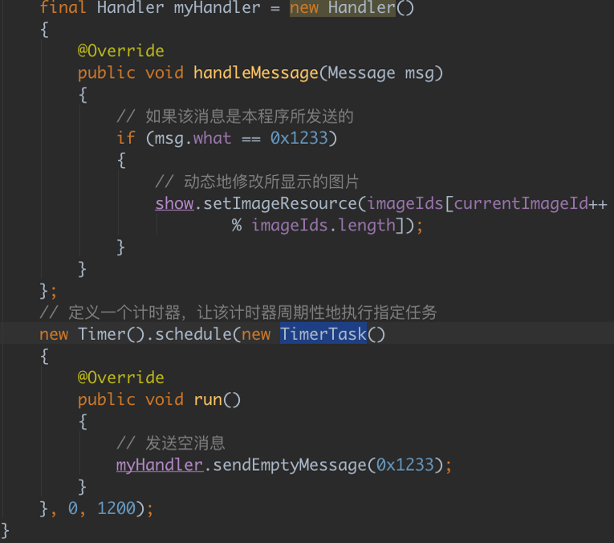
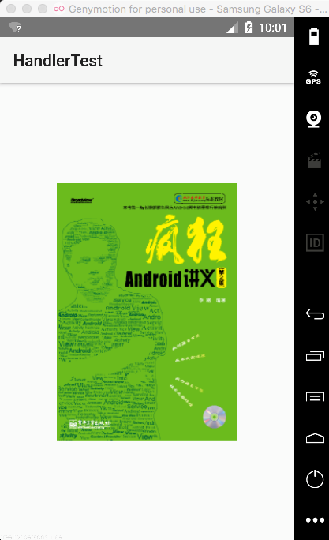
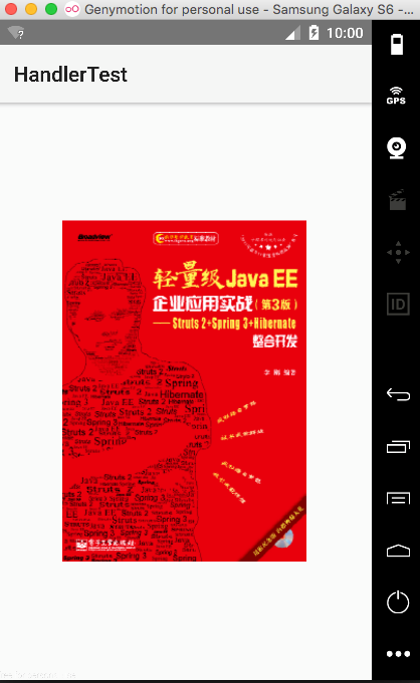
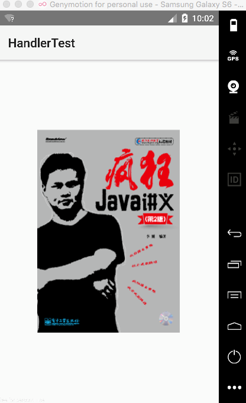
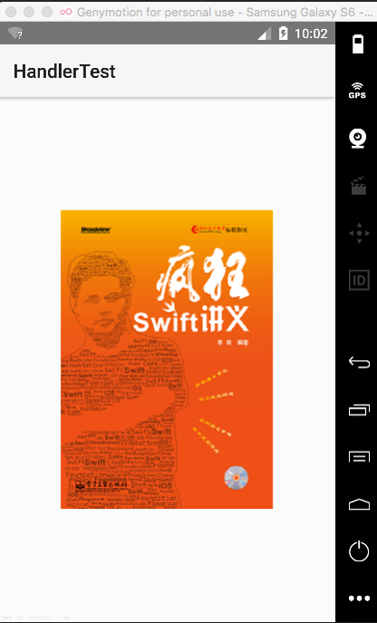

# Handler消息传递机制

---

*  在Android平台中，新启动的线程是无法访问Activity里的Widget的，当然也不能将运行状态外送出来，这就需要有Handler机制进行消息的传递了，Handler类位于android.os包下。

*  Handler类的主要作用有两个：

   *  在新启动的线程中发送信息；
   *  在主线程中获取、处理信息。

*  Handler类的常用方法如下：

   *  void handlerMessage(Message msg): 子类对象通过该方法接收信息，该方法用于被重写。
   *  final boolean hasMessage(int what): 监测消息队列中是否还有what值的消息。
   *  final boolean hasMessage(int what, Object object): 监测消息队列中是否包含对象是object且属性是what值的消息。
   *  多个重载的Message obtainMessage(): 获取消息。
   *  final boolean sendEmptyMessage(int what): 发送一个只含有what值的消息。
   *  final boolean sendMessage(Message msg): 发送消息到Handler，通过handlerMessage方法接收。
      *  final boolean sendMessageDelayed(Message msg, long delayMillis): 指定多少毫秒之后发送消息。 

*  实例Handler使用（codes\03\3.4\HandlerTest）

    

    

    

    

    

   ​