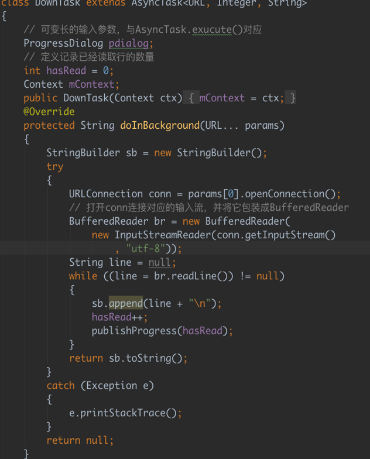
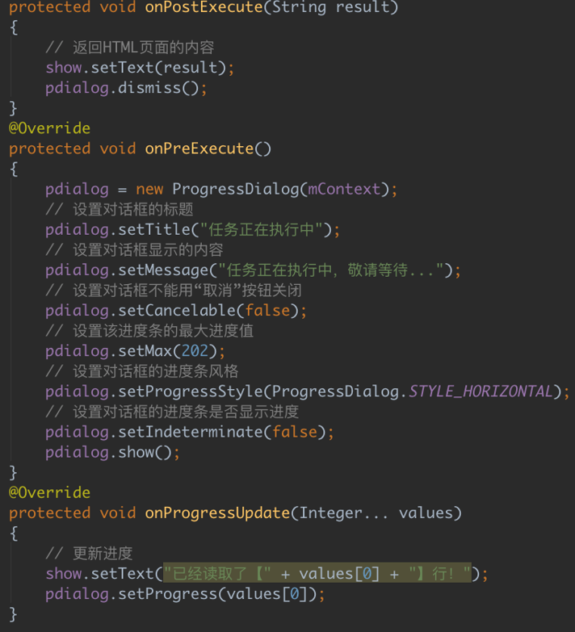

# 异步任务

---

*  Android的UI线程主要负责处理用户的按键事件、用户触屏事件及屏幕绘图事件等，因此开发者的其他操作不应该，也不能阻塞UI线程；否则将会出现ANR（AndroidNot Responding）异常。

*  为了避免UI线程失去响应的问题，Android建议将耗时操作放在新线程中完成，但有时新线程也需要更新UI组件，为了解决新线程不能更新UI组件的问题，Android提供了轻量级的AsyncTask，它适用于简单的异步处理，不需要借助线程和Handler即可实现。

*  AsyncTask<Params,Progress, Result>是一个抽象类，通常用于被继承，继承AsyncTask时需要指定如下三个泛型参数：

   *  Params：启动任务执行的输入参数的类型
   *  Progress：后台任务完成的进度值的类型
   *  Result：后台执行任务完成后返回结果的类型

*  使用AsyncTask只要如下三步即可：

   1. 创建AsyncTask的子类，并为三个泛型参数指定类型，如果某个参数不需要指定类型，则可将它制定为void

   2. 根据需要，实现AsyncTask的如下方法：

      *  doInBackground(Params....): 重写该方法就是后台线程要完成该完成的任务。该方法可以调用publishProgress(Progress...values)方法更新任务的执行进度
      *  onProgressUpdate(Progress...values): 在doInBackground方法中调用publishProgress(Progress...values)将会触发该方法
      *  onPreExecute()该方法将在执行后台耗时操作前被调用
      *  onPostExecute()当doInBackground()完成后，系统会自动调用该方法  

   3. 调用AsyncTask子类的实例的execute(Params...values)开始执行耗时操作

      *  下面看具体实例（codes03\3.6\AsyncTaskTest）

          

          

      ​

      ​

      ​

      ​

   ​

   ​