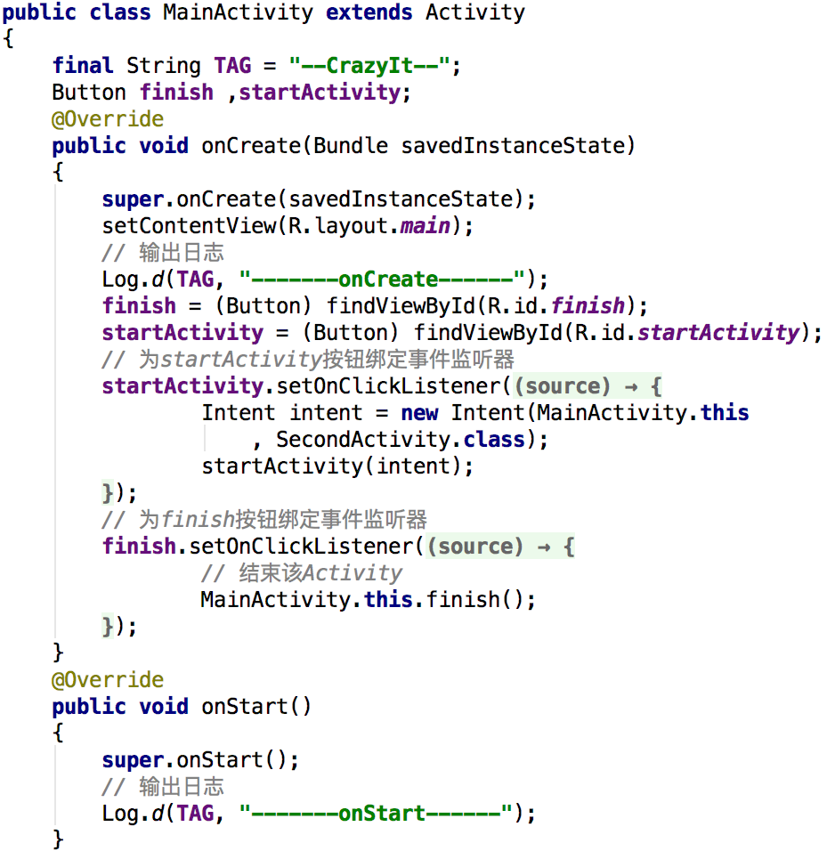
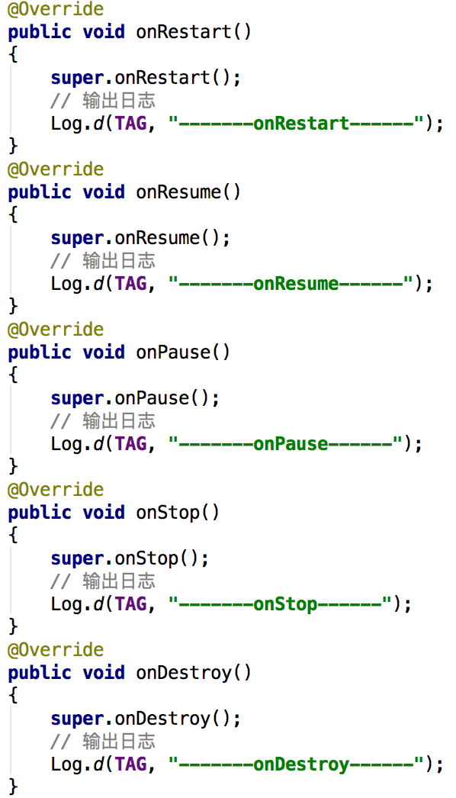
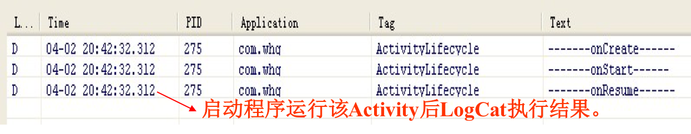
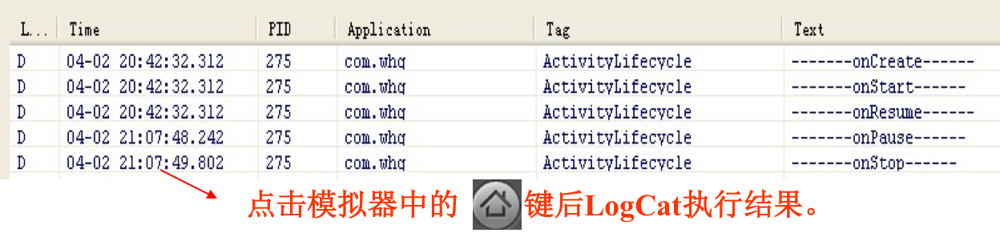
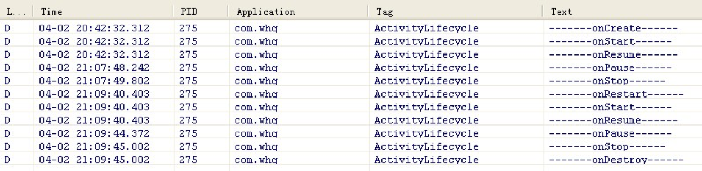

# 4.3Activity生命周期与加载模式

* 当Activity处于Android应用中运行时，它的活动状态由Android以Activity栈的形式管理。当前活动的Activity位于栈顶随着不同应用的运行，每个Activity都有可能从活动状态转入到非活动状态，也可以从非活动状态转入到活动状态。
### Activity大致会经过如下四个状态
* 运行状态：当前Activity位于前台，用户可见，可以获得焦点
* 暂停状态：其他Activity位于前台，该Activity依然可见，只是不能获得焦点。
* 停止状态：该Activity不可见，失去焦点。
* 销毁状态：该Activity结束，或Activity所在进程结束。
### Activity生命周期及相关回调方法如下图所示

###在Activity的生命周期中，如下方法会被系统回调
* onCreate(Bundle savedStasus)：创建Activity时被回调。
* onStart()：启动Activity时被回调。
* onRestart()：重新启动Activity时被回调。
* onResume ()：恢复Activity时被回调。
* onPause()：暂停Activity时被回调。
* onStop()：停止Activity时被回调。
* onDestroy()：销毁Activity时被回调。

###例：Activity的生命周期（codes\04\4.3\Lifecycle）

##Activity的四种加载模式
###4种Activity的启动模式：
* standard：标准启动模式，每次激活Activity时都会创建Activity，并放入任务栈中。
* singleTop：如果在任务的栈顶正好存在该Activity的实例， 就重用该实例，否则就会创建新的实例并放入栈顶(即使栈中已经存在该Activity实例，只要不在栈顶，都会创建实例)。
* singleTask：如果在栈中已经有该Activity的实例，就重用该实例(会调用实例的 onNewIntent() )。重用时，会让该实例回到栈顶，因此在它上面的实例将会被移出栈。如果栈中不存在该实例，将会创建新的实例放入栈中。
* singleInstance：在一个新栈中创建该Activity的实例，并让多个应用共享该栈中的该Activity实例。一旦该模式的Activity实例已经存在于某个栈中，任何应用再激活该Activity时都会重用该栈中的实例( 会调用实例的 onNewIntent() )。其效果相当于多个应用共享一个应用，不管谁激活该 Activity 都会进入同一个应用中。

* 设置启动模式的位置在 AndroidManifest.xml 文件中 Activity 元素的 android:launchMode 属性

* 相关的代码中也有一些标志可以使用，比如我们想只启用一个实例，则可以使用 Intent.FLAG_ACTIVITY_REORDER_TO_FRONT 标志，这个标志表示：如果这个activity已经启动了，就不产生新的activity，而只是把这个activity实例加到栈顶来就可以了。
Intent intent = new Intent();
intent.setAction("Action01");
intent.addFlags(Intent.FLAG_ACTIVITY_REORDER_TO_FRONT); 
startActivity(intent);

