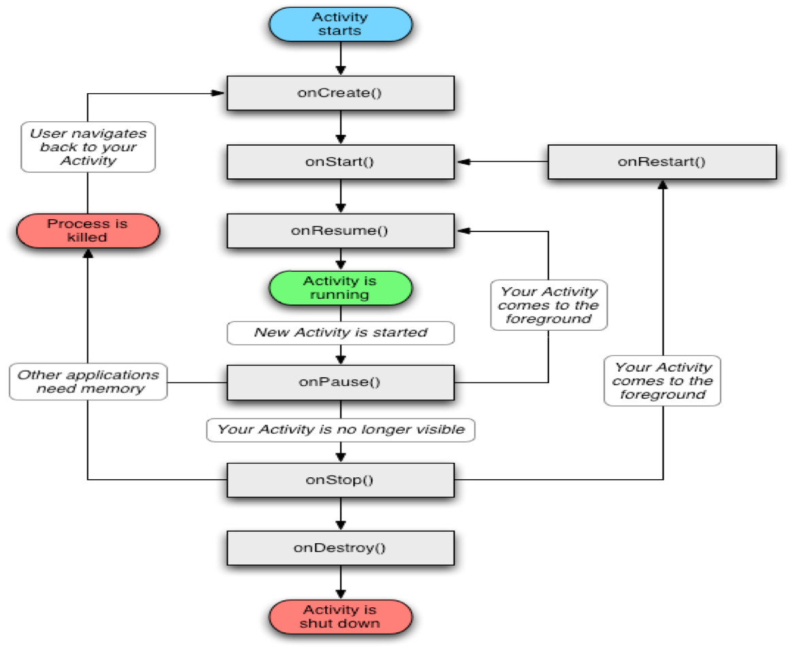

# 4.3Activity生命周期与加载模式

* 当Activity处于Android应用中运行时，它的活动状态由Android以Activity栈的形式管理。当前活动的Activity位于栈顶随着不同应用的运行，每个Activity都有可能从活动状态转入到非活动状态，也可以从非活动状态转入到活动状态。
### Activity大致会经过如下四个状态
* 运行状态：当前Activity位于前台，用户可见，可以获得焦点
* 暂停状态：其他Activity位于前台，该Activity依然可见，只是不能获得焦点。
* 停止状态：该Activity不可见，失去焦点。
* 销毁状态：该Activity结束，或Activity所在进程结束。
### Activity生命周期及相关回调方法如下图所示

###在Activity的生命周期中，如下方法会被系统回调
* onCreate(Bundle savedStasus)：创建Activity时被回调。
* onStart()：启动Activity时被回调。
* onRestart()：重新启动Activity时被回调。
* onResume ()：恢复Activity时被回调。
* onPause()：暂停Activity时被回调。
* onStop()：停止Activity时被回调。
* onDestroy()：销毁Activity时被回调。

###例：Activity的生命周期（codes\04\4.3\Lifecycle）

