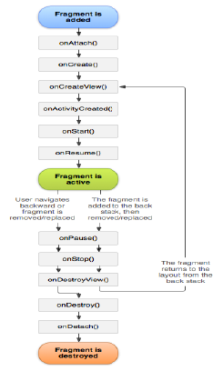
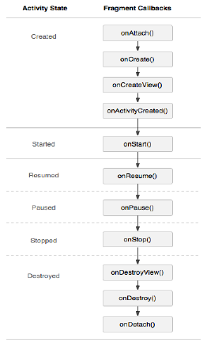

# 4.5Fragment的生命周期
---
* Fragment的生命周期，和Activity生命周期很像。事实上，如果你准备将一个现成的Android应用转换到使用Fragment，可能只需简单地将代码从Activity的回调方法分别移动到Fragment的回调方法。
* 和Activity一样，Fragment可以存在4种状态：
	1. 运行状态: Fragment在运行中的Activity中可见。
	2. 暂停状态: 其他Activity位于前台，该Fragment依然可见，只是不能获得焦点。
	3. 停止状态: 该Fragment不可见，失去焦点。
	4. 销毁状态: 该Fragment被完全删除，或该Fragment所在的Activity被结束。

* 和Activity一样，可以使用Bundle保持Fragment的状态，如果你需要在Activity被重新创建的时候恢复Fragment；可以在Fragment的 onSaveInstanceState() 期间保存状态，然后在 onCreate()、onCreateView() 或 onActivityCreated() 期间恢复它。
* Activity和Fragment的生命周期最显著的差异是各自如何在它的后台堆栈中储存。默认情况下，Activity在停止后，它会被放到一个由系统管理的用于保存Activity的back stack（因此用户可以使用BACK按键导航回退）。但是，当你在一个事务期间移除Fragment时，只有显式调用addToBackStack()请求保存实例，才会被放到一个由宿主Activity管理的back stack。

## **与Activity生命周期的协调工作**
* 宿主Activity的生命周期，直接影响到Fragment的生命周期，以致每一个Activity的生命周期的回调行为都会引起每一个Fragment中类似的回调。  

* 为了执行例如创建和销毁Fragment的UI的动作，相比Activity Fragment有一些额外的生命周期回调方法，它们是处理与Activity交互的唯一渠道。这些额外的回调方法是：
  * onAttach()：当Fragment被绑定到Activity时被调用(Activity会被传入)。
  * onCreateView()：每次创建、绘制该Fragment的View组件时回调该方法。
  * onActivityCreated()：当Activity的onCreate()方法返回时被调用。
  * onDestroyView()：销毁该Fragment时被回调。该方法只会被回调一次。
  * onDetach()：当Fragment从Activity解除关联时被调用。