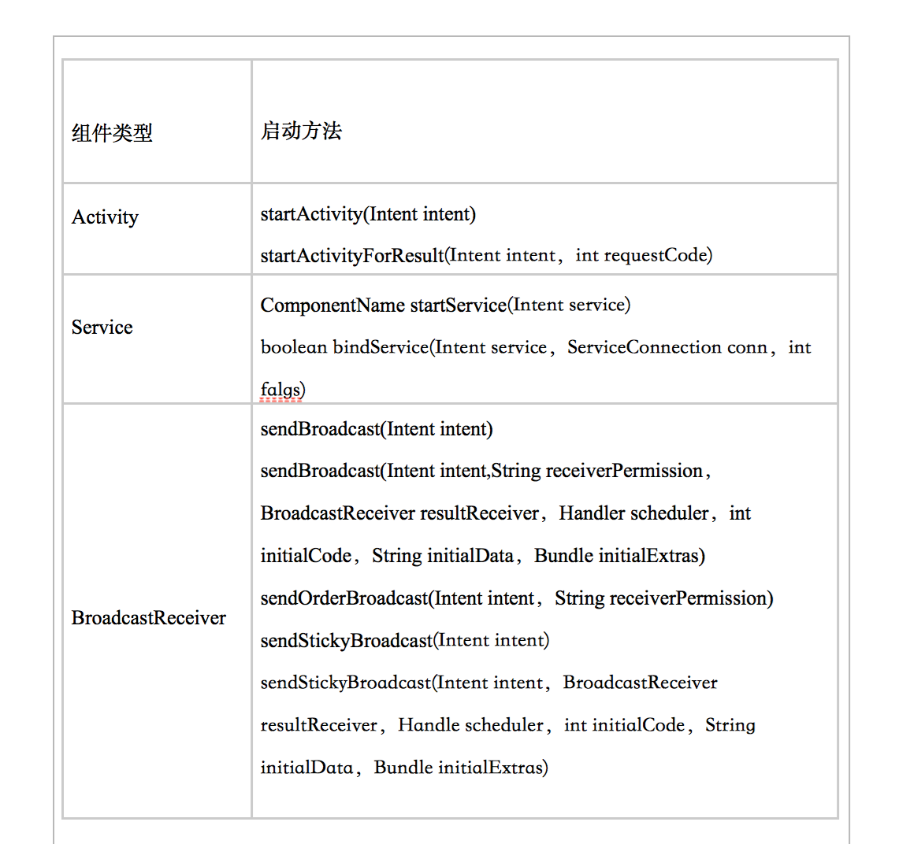

# Intent对象详解
---
* 前面介绍Activity已经多次使用了Intent，相信读者对Intent对象已经有了一个初步的认识，下面将对Intent对象进行更全面的介绍。
* Android的应用程序包括三种重要的组件：Activity、Service、BroadcastReceiver，应用程序采用了一致的方法来启动它门——都是依靠Intent来启动的，Intent就封装了程序想要启动程序的意图。不仅如此，Intent还可以用于被启动组件交换信息。

*下表显示了使用Intent启动不同组件的方法。

* 上一章我们已经见到了如何使用Intent来启动Activity的示例，至于使用Intent来启动另外两种组件，本书后面章节中会有相关示例，此处暂不深入介绍。
* Intent对象大致包含Component、Action、Category、Data、Type、Extra和Flag这7种属性，其中Comopent用于明确指定需要启动的目标组件，而Extra则用于“携带”需要交换的数据。
* 下面详细介绍Intent对象各属性的作用。

