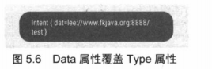
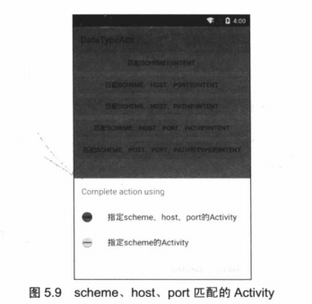
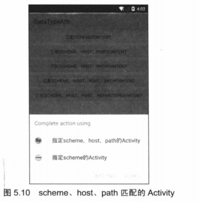
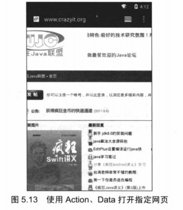

# Intent属性及Intent-filter配置
---
* Intent代表了Android应用的启动“意图”，Android应用将会根据Intent来启动指定组件，至于到底启动哪个组件，则取决于Intent的各属性。下面将详细介绍Intent的各属性值，以及Android如何根据不同属性值来启动相应的组件。

##Component属性
* Intent的Component属性需要接受一个ComponentName对象，ComponentName对象包含如下几个构造器。
* ComponentName（String pkg，String cls）：创建pkg所在包下的cls类所对应的组件
* ComponentName（Context pkg，String cls）：创建pkg所对应的包下的cls类所对应的组件。
* ComponentName（Context pkg，Class<?>cls）：创建pkg所对应的包下的cls类所对应的组件。

* 上面几个构造器的本质是相同的，这说明创建一个ComponentName需要指定包名和类名——这就可以唯一地确定一个组件类，这样应用程序即可根据给的的组件类去启动特定的组件。
* 除此之外，Intent还包含了如下三个方法。
* setClass（Context packageContext，String className）：设置该Intent将要启动的组件对应的类名。
* setClassName（Content packageContext，String className）：设置该Intent将要启动的组件对应的类名。
* setClassName（String packageName，String className）：设置该Intent将要启动的组件对应的类名。

* 指定Component属性的Intent已经明确了它将要启动哪个组件，因此这种Intent也被称为显示Intent，没有指定Component属性的Intent被称为隐式Intent——隐式Intent没有明确指定要启动哪个组件，应用将会根据Intent指定的规则去启动符合条件的组件，但具体是哪个组件则不确定。
* 下面的示例程序示范了如何通过显示Intent（指定了Component属性）来启动另外一个Activity。该程序的界面布局很简单，界面中只有一个按钮，用户单机该按钮将会启动第二个Activity。此处不再给出该程序的界面布局文件。该程序的Java代码如下。

```
public class MainActivity extends Activity
{
@Override
public void onCreate(Bundle savedInstanceState)
{
super.onCreate(savedInstanceState);
setContentView(R.layout.main);
Button bn = (Button) findViewById(R.id.bn);
// 为bn按钮绑定事件监听器
bn.setOnClickListener(new OnClickListener()
{
@Override
public void onClick(View arg0)
{
// 创建一个ComponentName对象
ComponentName comp = new ComponentName(MainActivity.this,
SecondActivity.class);
Intent intent = new Intent();
// 为Intent设置Component属性
intent.setComponent(comp);
startActivity(intent);
}
});
}
}
```
* 上面程序中的三行粗体字代码用于创建ComponentName对象，并将该对象设置成Intent对象的Component属性，这样应用程序即可根据该Intent的“意图”去启动指定组件。

##Action、Category属性与intent-filter配置
##action
* 是用户定义的字符串
* 用于描述一个 Android 应用程序组件
* 一个 Intent Filter 可以包含多个 Action。在  AndroidManifest.xml 的 Activity 定义时可以在其 <intent-filter >节点指定一个 Action 列表用于标示 Activity 所能接受的“动作”，例如：

```
<intent-filter > 
<action android:name="android.intent.action.MAIN" /> 
<action android:name="com.zy.myaction" /> 
……
</intent-filter>
```
* action使用android:name属性指定要为之服务的action的名称
* 如果启动Activity采用如下方法使用Intent 对象
* Intent intent =new Intent(); 
intent.setAction("com.wust.myaction"); 
* 则所有的Action列表中包含了“com.wust.myaction”的 Activity 都将会匹配成功

* 下面通过一个简单的示例来示范Action属性（就是普通字符串）的作用。下面程序的第一个Activity非常简单，它只包括一个普通按钮，当用户单机该按钮时，程序会“跳转”到第二个Activity——但第一个Activity指定跳转的Intent时，并不以“硬编码”的方式指定要跳转的目标Activity，而是为Intent指定Action属性。此处不给出界面布局的代码，第一个Activity的Java代码如下：

```
public class MainActivity extends Activity
{
public final static String CRAZYIT_ACTION =
"org.crazyit.intent.action.CRAZYIT_ACTION";
@Override
public void onCreate(Bundle savedInstanceState)
{
super.onCreate(savedInstanceState);
setContentView(R.layout.main);
Button bn = (Button) findViewById(R.id.bn);
// 为bn按钮绑定事件监听器
bn.setOnClickListener(new OnClickListener()
{
@Override
public void onClick(View arg0)
{
// 创建Intent对象
Intent intent = new Intent();
// 为Intent设置Action属性（属性值就是一个普通字符串）
intent.setAction(MainActivity.CRAZYIT_ACTION);
startActivity(intent);
}
});
}
}
```

##Category
* Category
* 字符串，包含了处理该Intent的组件的种类信息
* 为执行动作的附加信息，起着对action的补充说明作用
* 一个Intent对象可以有多个category
* Android系统中定义了category 常量
* 对category的操作
* addCategory() 添加一个category
* removeCategory()删除一个category()
* getCategorys()获取所有的category()
* category类别匹配
* 使用android:category属性指定应该在哪种环境下为动作提供服务
* 每个Intent Filter标签可以包含多个category标签
* 可以自行指定category或者Android系统提供的标准值
* <intent-filter >节点中可以为组件定义一个Category 类别列表
* 当 Intent 中包含这个列表的所有项目时 Category 类别匹配才会成功

* 接下来的示例程序将会示范Category属性的用法。该程序的第一个Activity的代码如下。

```

public class MainActivity extends Activity
{
// 定义一个Action常量
final static String CRAZYIT_ACTION =
"org.crazyit.intent.action.CRAZYIT_ACTION";
// 定义一个Category常量
final static String CRAZYIT_CATEGORY =
"org.crazyit.intent.category.CRAZYIT_CATEGORY";
@Override
public void onCreate(Bundle savedInstanceState)
{
super.onCreate(savedInstanceState);
setContentView(R.layout.main);
Button bn = (Button) findViewById(R.id.bn);
bn.setOnClickListener(new OnClickListener()
{
@Override
public void onClick(View arg0)
{
Intent intent = new Intent();
// 设置Action属性
intent.setAction(MainActivity.CRAZYIT_ACTION);
// 添加Category属性
intent.addCategory(MainActivity.CRAZYIT_CATEGORY);
startActivity(intent);
}
});
}
}

```
*下面是程序要启动的目标Action所对应的配置代码。

```
<activity android:name=".SecondActivity"
android:label="@string/app_name">
<intent-filter>
<!-- 指定该Activity能响应action为指定字符串的Intent -->
<action android:name="org.crazyit.intent.action.CRAZYIT_ACTION" />
<!-- 指定该Activity能响应category为指定字符串的Intent -->
<category android:name="org.crazyit.intent.category.CRAZYIT_CATEGORY" />
<!-- 指定该Activity能响应category为android.intent.category.DEFAULT的Intent -->
<category android:name="android.intent.category.DEFAULT" />
</intent-filter>
</activity>
```
* 上面配置Activity时也指定该Activity的实现类为SecondActivity，该实现类的代码如下：

```
public class SecondActivity extends Activity
{
@Override
public void onCreate(Bundle savedInstanceState)
{
super.onCreate(savedInstanceState);
setContentView(R.layout.second);
EditText show = (EditText) findViewById(R.id.show);
// 获取该Activity对应的Intent的Action属性
String action = getIntent().getAction();
// 显示Action属性
show.setText("Action为：" + action);
EditText cate = (EditText) findViewById(R.id.cate);
// 获取该Activity对应的Intent的Category属性
Set<String> cates = getIntent().getCategories();
// 显示Category属性
cate.setText("Category属性为：" + cates);
}
}
```
* 上面的程序也很简单，它只是在启动时把启动该Activity的Intent的Action、Category属性值分别显示在不同的文本框内。

##指定Action、Category调用系统Activity
* Intent代表了启动某个程序组件的“意图”，实际上Intent对象不仅可以启动本应用内程序组件，也可以启动Android系统的其他应用的程序组件，包括系统自带的程序组件——只要权限允许。


###实例：查看并获取联系人电话
---
* 这个实例将会在程序中提供一个按钮，用户单机该按钮时会显示系统的联系人列表，当用户单机指定联系人之后，程序将会显示该联系人的名字、电话。
* 这个程序非常有用，比如我们要开发一个发送短信的程序，当用户编写短信完成之后，可能需要浏览联系人列表，并从联系人列表中选出短信接收人，那就可以用到该程序了。
* 该程序的界面布局代码如下

```
<?xml version="1.0" encoding="utf-8"?>
<LinearLayout xmlns:android="http://schemas.android.com/apk/res/android"
android:orientation="vertical"
android:layout_width="match_parent"
android:layout_height="match_parent"
android:gravity="center_horizontal">
<!-- 显示联系人姓名的文本框 -->
<EditText
android:id="@+id/show"
android:layout_width="match_parent"
android:layout_height="wrap_content"
android:editable="false"
android:cursorVisible="false"/>
<!-- 显示联系人的电话的文本框 -->
<EditText
android:id="@+id/phone"
android:layout_width="match_parent"
android:layout_height="wrap_content"
android:editable="false"
android:cursorVisible="false"/>
<Button
android:id="@+id/bn"
android:layout_width="wrap_content"
android:layout_height="wrap_content"
android:text="查看联系人"/>
</LinearLayout>
```
* 上面的界面布局中包含了两个文本框、一个按钮，其中按钮用于浏览系统的联系人列表并选择其中的联系人。两个文本框分别用于显示联系人的名字和电话号码。
* 该程序的Java代码如下：

```
public class MainActivity extends Activity
{
final int PICK_CONTACT = 0;
@Override
public void onCreate(Bundle savedInstanceState)
{
super.onCreate(savedInstanceState);
setContentView(R.layout.main);
Button bn = (Button) findViewById(R.id.bn);
// 为bn按钮绑定事件监听器
bn.setOnClickListener(new OnClickListener()
{
@Override
public void onClick(View arg0)
{
// 创建Intent
Intent intent = new Intent();
// 设置Intent的Action属性
intent.setAction(Intent.ACTION_GET_CONTENT);
// 设置Intent的Type属性
intent.setType("vnd.android.cursor.item/phone");
// 启动Activity，并希望获取该Activity的结果
startActivityForResult(intent, PICK_CONTACT);
}
});
}
@Override
public void onActivityResult(int requestCode
, int resultCode, Intent data)
{
super.onActivityResult(requestCode, resultCode, data);
switch (requestCode)
{
case (PICK_CONTACT):
if (resultCode == Activity.RESULT_OK)
{
// 获取返回的数据
Uri contactData = data.getData();
CursorLoader cursorLoader = new CursorLoader(this
, contactData, null, null, null, null);
// 查询联系人信息
Cursor cursor = cursorLoader.loadInBackground();
// 如果查询到指定的联系人
if (cursor.moveToFirst())
{
String contactId = cursor.getString(cursor
.getColumnIndex(
ContactsContract.Contacts._ID));
// 获取联系人的名字
String name = cursor.getString(cursor
.getColumnIndexOrThrow(
ContactsContract.Contacts.DISPLAY_NAME));
String phoneNumber = "此联系人暂未输入电话号码";
//根据联系人查询该联系人的详细信息
Cursor phones = getContentResolver().query(
ContactsContract.CommonDataKinds.
Phone.CONTENT_URI, null,
ContactsContract.CommonDataKinds.Phone. 												CONTACT_ID
+ " = " + contactId, null, null);
if (phones.moveToFirst())
{
//取出电话号码
phoneNumber = phones
.getString(phones
.getColumnIndex(ContactsContract
.CommonDataKinds.Phone.NUMBER));
}
// 关闭游标
phones.close();
EditText show =(EditText)findViewById(R.id.show);
//显示联系人的名称
show.setText(name);
EditText phone =(EditText)findViewById(R.id.phone);
//显示联系人的电话号码
phone.setText(phoneNumber);
}
// 关闭游标
cursor.close();
}
break;
}
}
}
```
* 上面的Intent对象除了设置Action属性之外，还设置了Type属性，关于Intent的Type属性的作用，等下将会进行更加详细的介绍。

###实例：返回系统Home桌面
---
*本实例将会提供一个按钮，当用户单击该按钮时，系统将会返回Home桌面，就像单击模拟器右边的按钮一样。这也需要通过Intent来实现，程序为Intent设置合适的Action、Category属性，并根据该Intent来启动Activity即可返回Home桌面。该实例程序如下：

```
public class MainActivity extends Activity
{
@Override
public void onCreate(Bundle savedInstanceState)
{
super.onCreate(savedInstanceState);
setContentView(R.layout.main);
Button bn = (Button) findViewById(R.id.bn);
bn.setOnClickListener(new OnClickListener()
{
@Override
public void onClick(View v)
{
// 创建Intent对象
Intent intent = new Intent();
// 为Intent设置Action、Category属性
intent.setAction(Intent.ACTION_MAIN);
intent.addCategory(Intent.CATEGORY_HOME);
startActivity(intent);
}
});
}
}
```
* 上面程序代码设置了Intent的Action属性值为android.intent.action.MAIN字符串、Category属性值为android.intent.category.HOME字符串，满足该Intent的Activity其实就是Android系统的HOME桌面。因此，运行上面的程序时单机“返回桌面”按钮，即可返回Home桌面。

##Data,Type属性与intent-filter配置
Data属性通常用于向Action属性提供操作的数据。Data属性接受一个Uri对象，一个Uri对象通常通过如下形式的字符串来表示：
```
content://com.android.contacts/contacts/1
tel:123
```
Uri字符串总满足如下格式：
```
scheme://host:port/path
```
例如上面给出的content://com.android.contacts/contacts/1
其中content是scheme部分，com.android.contacts是host部分，port部分被省略了，/contacts/1是path部分。
Type属性用于指定该Data属性所制定Uri对应的MIME类型，这种MIME类型可以是任何自定义的MIME类型，只要符合abc/xyz格式的字符串即可。
Data属性与Type属性的关系比较微妙，这两个属性会相互覆盖，例如：

*  如果Intent先设置Data属性，后设置Type属性，那么Type属性将会覆盖Data属性。
*  如果Intent先设置Type属性，后设置Data属性，那么Data属性将会覆盖Type属性。
*  如果希望Intent既有Data属性，也有Type属性，则应该调用Intent的setDataAndType()方法。
*  
下面的示例演示了Intent的Data属性与Type属性相互覆盖的情形，该示例的界面布局文件很简单，只是定义了三个按钮，并为三个按钮绑定了事件处理函数。
下面是该示例的Activity代码
```
public class MainActivity extends Activity
{
	@Override
	public void onCreate(Bundle savedInstanceState)
	{
		super.onCreate(savedInstanceState);
		setContentView(R.layout.main);
	}
	public void overrideType(View source)
	{
		Intent intent = new Intent();
		// 先为Intent设置Type属性
		intent.setType("abc/xyz");
		// 再为Intent设置Data属性，覆盖Type属性
		intent.setData(Uri.parse("lee://www.fkjava.org:8888/test"));
		Toast.makeText(this, intent.toString(), Toast.LENGTH_LONG).show();
	}
	public void overrideData(View source)
	{
		Intent intent = new Intent();
		// 先为Intent设置Data属性
		intent.setData(Uri.parse("lee://www.fkjava.org:8888/mypath"));
		// 再为Intent设置Type属性，覆盖Data属性
		intent.setType("abc/xyz");
		Toast.makeText(this, intent.toString(), Toast.LENGTH_LONG).show();
	}
	public void dataAndType(View source)
	{
		Intent intent = new Intent();
		// 同时设置Intent的Data、Type属性
		intent.setDataAndType(Uri.parse("lee://www.fkjava.org:8888/mypath"),
				"abc/xyz");
		Toast.makeText(this, intent.toString(), Toast.LENGTH_LONG).show();
	}
}


```
上面的三个时间监听方法为Intent设置了Data，Type属性，第一个事件监听方法先设置了Type属性，在设置了Data属性，这将导致Data属性覆盖Type属性，单击按钮激发该事件监听方法，将可以看到如图5.6的Toast输出。
如图5.6可以看出，此时的Intent只有Data属性，Type属性被覆盖了。

第二个事件监听方法先设置了Data属性，在设置了Type属性，这将导致Type属性覆盖Data属性，单击按钮激发该事件监听方法，将可以看到如图5.7所示的输出。


第三个事件监听方法同时设置了Data，TYpe属性，这样该Intent中才会同时具有Data，Type属性。
在AndroidManifest.xml文件中为组件声明Data，Type属性都通过<data.../>元素，<data.../>元素的格式如下：
```
<data android:mimeType=""
android:scheme=""
android:host=""
android:port=""
android:path=""
android:pathPrefix=""
android:pathPattern=""
>
```

上面的<data.../>元素支持如下属性。

* mineType：用于声明该组件所能匹配的Intent的Type属性。
* scheme:用于声明该组件所能匹配的Intent的Data属性的scheme部分。
* host:用于声明该组件所能匹配的Intent的Data属性的host部分。
* port：用于声明该组件所能匹配的Intent的Data属性的port部分。
* path：用于声明该组件所能匹配的Intent的Data属性的path部分。
* pathPrefix：用于声明该组件所能匹配的Intent的Data属性的path前缀。
* pathPattern：用于声明该组件所能匹配的Intent的Data属性的path字符串模板。

Intent的Type属性也用于指定该Intent的要求，对应组件中<intent-filter.../>元素的<data.../>子元素的mimeType属性必须与此相同，才能启动组件。
Intent的Data属性则略有差异，程序员为Intent指定Data属性时，Data属性的Uri对象实际上可分为scheme，host，port和path部分，此时并不要求被启动组建的<intent-filter../>子元素的android:scheme,android:host,android:port,android:path完全满足。
Data属性的“匹配”过程则有些差别，它会线检查<intent-filter.../>里的<data.../>子元素然后：

* 如果目标组件的<data.../>子元素只指定了android:scheme属性，那么只要Intent的Data属性的scheme部分与android：scheme属性值相同，即可启动组件。
* 如果组建的<data.../>子元素只指定了android:scheme,android:host属性，那么只要Intent的Data属性的scheme，host部分与android：scheme，android：host属性值相同，即可启动该组件。
* 如果目标组建的<data.../>子元素指定了android：scheme，android：host，android：port属性，那么只要Intent的Data属性的scheme，host，port部分与android：scheme，android：host属性值相同，即可启动该组件。
* 如果目标组件的<data.../>子元素只指定了android：scheme，android:host，android：path属性，那么只要Intent的Data属性的scheme，host，path部分与android：scheme，android：host，android：path属性值相同，即可启动该组件。
* 如果目标组件的<data.../>子元素指定了android：scheme，android：host，android：port，android：path属性，那么就要求Intent的Data属性的scheme，host，port，path部分依次与android：scheme，android:host，android：port，android：path属性值相同才可启动该组件。
下面示例测试了Intent的Data属性与<data.../>元素配置的关系，该示例依次配置了如下5个Activity。
```
<?xml version="1.0" encoding="UTF-8"?>

-<manifest package="org.crazyit.intent" xmlns:android="http://schemas.android.com/apk/res/android">


-<application android:theme="@style/AppTheme" android:label="@string/app_name" android:icon="@drawable/ic_launcher" android:allowBackup="true">


-<activity android:label="@string/app_name" android:name=".MainActivity">


-<intent-filter>

<action android:name="android.intent.action.MAIN"/>

<category android:name="android.intent.category.LAUNCHER"/>

</intent-filter>

</activity>


-<activity android:label="指定scheme的Activity" android:icon="@drawable/ic_scheme" android:name=".SchemeActivity">


-<intent-filter>

<action android:name="xx"/>

<category android:name="android.intent.category.DEFAULT"/>

<!-- 只要Intent的Data属性的scheme是lee，即可启动该Activity -->


<data android:scheme="lee"/>

</intent-filter>

</activity>


-<activity android:label="指定scheme、host、port的Activity" android:icon="@drawable/ic_host" android:name=".SchemeHostPortActivity">


-<intent-filter>

<action android:name="xx"/>

<category android:name="android.intent.category.DEFAULT"/>

<!-- 只要Intent的Data属性的scheme是lee，且host是www.fkjava.org port是8888即可启动该Activity -->


<data android:scheme="lee" android:port="8888" android:host="www.fkjava.org"/>

</intent-filter>

</activity>


-<activity android:label="指定scheme、host、path的Activity" android:icon="@drawable/ic_sp" android:name=".SchemeHostPathActivity">


-<intent-filter>

<action android:name="xx"/>

<category android:name="android.intent.category.DEFAULT"/>

<!-- 只要Intent的Data属性的scheme是lee，且host是www.fkjava.org path是/mypath，即可启动该Activity -->


<data android:scheme="lee" android:host="www.fkjava.org" android:path="/mypath"/>

</intent-filter>

</activity>


-<activity android:label="指定scheme、host、port、path的Activity" android:icon="@drawable/ic_path" android:name=".SchemeHostPortPathActivity">


-<intent-filter>

<action android:name="xx"/>

<category android:name="android.intent.category.DEFAULT"/>

<!-- 需要Intent的Data属性的scheme是lee，且host是www.fkjava.org port是8888，且path是/mypath，才可启动该Activity -->


<data android:scheme="lee" android:port="8888" android:host="www.fkjava.org" android:path="/mypath"/>

</intent-filter>

</activity>


-<activity android:label="指定scheme、host、port、path、type的Activity" android:icon="@drawable/ic_type" android:name=".SchemeHostPortPathTypeActivity">


-<intent-filter>

<action android:name="xx"/>

<category android:name="android.intent.category.DEFAULT"/>

<!-- 需要Intent的Data属性的scheme是lee，且host是www.fkjava.org port是8888，且path是/mypath 且type是abc/xyz，才可启动该Activity -->


<data android:scheme="lee" android:port="8888" android:host="www.fkjava.org" android:path="/mypath" android:mimeType="abc/xyz"/>

</intent-filter>

</activity>

</application>

</manifest>
```

上面的配置文件中配置了5个Activity，这5个Activity的实现类都非常简单，它们界面上显示一个TextView,并不显示其他内容。关于这5个Activity的<data.../>子元素配置说明如下。

* 第一个Activity：只要Intent的Data属性的scheme是lee，即可启动该Activity。
* 第二个Acitivity：只要Intent的Data属性的scheme是lee，且host是www.fkjava.org,port是8888，即可启动该Acitivity。
* 第三个Acitivity:只要Intent的Data属性的scheme是lee，且host是www.fkjava.org,path是/mypath，即可启动该Activity
* 第四个是Acitivity：需要Intent的Data属性的scheme是lee，且host是www.fkjava.org,port是/mypath，即可启动该Activity
* 第五个Acitivity：需要Intent的Data属性的scheme是lee，且host是www.fkjava.org,port是8888，path是/mypath，type是abc/xyz，才可启动该Activity。
下面是第一个启动Activity的方法。
```
public void scheme(View source){
	Intent intent =new Intent();
	//只设置Intent的Data属性
	intent.setData(Uri.parse("lee://www.crazyit.org:1234/test"))
	startActivity(intent);
}
```
上面intent的Data属性，只有scheme为lee，也就是只有第一个Activity符合条件，因此通过该方法启动Activity时，将可以看到启动如图5.8


下面是第二个启动Activity的方法
```
public void schemeHostPort(View source){
	Intent intent =new Intent();
	//只设置Intent的Data属性
	intent.setData(Uri.parse("lee://www.crazyit.org:8888/test"))
	startActivity(intent);
}
```
上面Intent的Data属性，scheme是lee，因此第一个Activity符合条件；
且该Intent的Data属性的host为www.fkjava.org,port为8888，因此第二个Activity也符合条件。通过该方法启动Activity时，将可以看到启动如图5.9所示的选择Activity界面。

下面是第三个启动Activity的方法。
```
public void schemeHostPath(View source){
	Intent intent =new Intent();
	//只设置Intent的Data属性
	intent.setData(Uri.parse("lee://www.fkjava.org:1234/mypath"));
	setActivity(intent);
}
```
上面Intent的Data属性，scheme是lee，因此第一个Activity符合条件；
且该Intent的Data属性的host为www.fkjava.org,path为/mypath，因此第三个Activity也符合条件。通过该方法启动Activity时将可以看到启动如图5.10所示的选择Activity界面。

下面是第四个启动Activity的方法。
```
public void schemeHostPortPath(View source){
	Intent intent=new Intent();
	//只设置Intent的Data属性
	inten.setData(Uri.parse("lee://www.fkjava.org:8888/mypath"));
	startActivity(intent);
}
```
上面Intent的Data属性，scheme是lee，因此第一个Activity符合条件；
且该Intent的Data属性的host为www.fkjava.org,port为8888，因此第二个Activity也符合条件。该Intent的Data属性的host为www.fkjava.org,path为/mypath，因此第四个Activity也符合条件。
通过该方法启动Activity时，将可以看到启动如图5.11所示的选择Activity界面。
下面是第五个启动Activity的方法。
```
public void schemeHostPortPath(View source){
	Intent intent=new Intent();
	//只设置Intent的Data,Type属性
	inten.setData(Uri.parse("lee://www.fkjava.org:8888/mypath"),"abc/xyz");
	startActivity(intent);
}
```
上面的Intent不仅指定了Data属性，也指定了Type属性，此时符合条件的只有第五个Activity。通过该方法启动Activity时，将可以看到启动如图5.12所示的Activity。

###实例：使用Acton，Data属性启动系统Activity
一旦为Intent同时指定了Action，Data属性，Android就可根据指定的数据类型来启动特定的应用程序，并对之id那个数据执行相应的操作。
下面是几个Action，Data属性的组合。

* ACTION_VIEW content://com.android.contacts/contacts/1:显示标识为1的联系人的信息
* ACTION_EDIT contnet://com.android.contacts/contacts/1:编辑标识为1的联系人的信息
* ACTION_DIAL content://com.android.contacts/contacts/1:显示向标识为1的联系人拨号界面
* ACTION_VIEW tel:123：显示向指定号码123拨号的界面
* ACTION_DIAL tel：123：显示向指定号码124拨号的界面
* ACTION_VIEW content：//contacts/people/:显示所有联系人列表的信息，通过这种组合可以非常方便地查看系统联系人。
本实例程序示范通过同时为Intent指定Action，Data属性来启动特定程序并操作相应的数据。下面程序的界面非常简单，包含三个按钮，其中一个按钮用于浏览指定网页；一个按钮用于编辑指定联系人信息；另一个按钮用于呼叫指定号码。
```
public class MainActivity extends Activity
{
	@Override
	public void onCreate(Bundle savedInstanceState)
	{
		super.onCreate(savedInstanceState);
		setContentView(R.layout.main);
		Button bn = (Button) findViewById(R.id.bn);
		// 为bn按钮添加一个监听器
		bn.setOnClickListener(new OnClickListener()
		{
			@Override
			public void onClick(View v)
			{
				// 创建Intent
				Intent intent = new Intent();
				String data = "http://www.crazyit.org";
				// 根据指定字符串解析出Uri对象
				Uri uri = Uri.parse(data);
				// 为Intent设置Action属性
				intent.setAction(Intent.ACTION_VIEW);
				// 设置Data属性
				intent.setData(uri);
				startActivity(intent);
			}
		});
		Button edit = (Button) findViewById(R.id.edit);
		// 为edit按钮添加一个监听器
		edit.setOnClickListener(new OnClickListener()
		{
			@Override
			public void onClick(View v)
			{
				// 创建Intent
				Intent intent = new Intent();
				// 为Intent设置Action属性（动作为：编辑）
				intent.setAction(Intent.ACTION_EDIT);
				String data = "content://com.android.contacts/contacts/1";
				// 根据指定字符串解析出Uri对象
				Uri uri = Uri.parse(data);
				// 设置Data属性
				intent.setData(uri);
				startActivity(intent);
			}
		});
		Button call = (Button) findViewById(R.id.call);
		// 为call按钮添加一个监听器
		call.setOnClickListener(new OnClickListener()
		{
			@Override
			public void onClick(View v)
			{
				// 创建Intent
				Intent intent = new Intent();
				// 为Intent设置Action属性（动作为：拨号）
				intent.setAction(Intent.ACTION_DIAL);
				String data = "tel:13800138000";
				// 根据指定字符串解析出Uri对象
				Uri uri = Uri.parse(data);
				// 设置Data属性
				intent.setData(uri);
				startActivity(intent);
			}
		});
	}
}
```
运行上面的程序，单击第一个按钮，该按钮单击时启动Intent(Action=Intent.ACTION_VIEW,Data=http://www.crazyit.com)对应的Activity，将看到打开www.crazyit.org的界面，如图5.13所示。


单击第二个按钮，该按钮单击时启动Intent(Action=Intent.ACTION_EDIT,Data=content://com.android.contacts/contacts/1)对应的Activity，将看到编辑标识为1的联系人界面，如图5.14所示。

单击第三个按钮，该按钮单击时启动Intent(Action=Intent.ACITON_DAIL,Data=tel:13800138000)对应的Activity，将看到程序向13800138000拨号的界面，如图5.15所示。

##Extra属性
Intent的Extra属性通常用于在多个Action之间进行数据交换，Intent的Extra属性值应该是一个Bundle对象，Bundle对象就像一个Map对象，它可以存入多个key-value对，这样就可以通过Intent在不同Activity之间进行数据交换。关于Extra属性的用法前面已有示例，此处不再赘述。
###Flag属性
Intent的Flag属性用于为该Intent添加一些额外的控制旗标，Intent可调用addFlag()方法来添加控制旗标。
除此之外，Intent还包含了如下常用的Flag旗标。

* FLAG_ACTIVITY_BROUGHT_TO_FRONT:如果通过该Flag启动的Activity已经存在，下次再次启动时，将只是把该Activity带到前台。例如，现在Activity栈中有AcitivityA，此时以该旗标启动Acitivity B（即Activity B 是以FLAG_ACTIVITY_BROUGHT_TO_FRONT旗标启动的），然后再Activity B中启动Activity C,D，如果此时在Activity D中再启动Activity B，将直接把Activity栈中的Acitivity B带到前台。此时Acitivity栈中的情形是Activity A,C,D,B。
* FLAG_ACTIVITY_CLEAR_TOP:该Flag相当于加载模式中的singleTask，通过这种Flag穷的那个的Activity，将会把要启动的Activity之上的Activity全部弹出Activity栈。例如，Activity栈中包含A,B,C,D四个Activity，如果采用该Flag从Acitivity D跳转到Activity B，那么此时Acitivity栈中只包含A,B两个Activity。
* FLAG_ACTIVITY_NEW_TASK:默认的启动旗标，该旗标控制重新创建一个新的Activity。
* FLAG_ACTIVITY_NO_ANIMATION:该旗标控制启动Activity时不使用过渡动画。
* FLAG_ACTIVITY_NO_HISTORY:该旗标控制被启动的Activity将不会保留在Activity栈中。例如，Activity栈中原来有A,B,C三个Activity，此时在Activity C中以该Flag启动Activity D，Activity D 再启动Activity E，此时Activity栈中只有A,B,C,E四个Activity，Activity D不会保留在Activity栈中。
* FLAG_ACTIVITY_REORDER_TO_FRONT:该Flag控制如果当前已有Activity，则直接将该Activity带到前台。例如，现在Activity 栈中有A,B,C,D四个A抽屉vity，如果使用FLAG_ACTIVITY——RECORDER_TO_FRONT旗标来启动ACTIVITY B，那么启动后的Activity栈中情形为A,C,D,B
* FLAG_ACTIVITY_SINGLE_TOP:该Flag相当于加载模式中的singleTOP模式。例如，原来Activity栈中有A,B,C,D四个Activity，在Activity D中再次启动Activity D，Activity栈中依然还是A,B,C，D四个Activity。
Android为Intent提供了大量的Flag，每个Flag都有其特定的功能，具体请参考关于Intent的API文档。