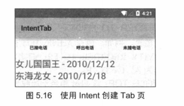

# 5.3使用Intent创建Tab页面
前面已经介绍了如何使用TabActivity来创建Activity布局，前面添加Tab页时使用了TabHost.TabSpec提供的如下方法。

* setContent(int viewld):直接指定View组件设置成Tab页的Content。实际上TabHost.TabSpec还提供了如下方法。
* setContent(Intent intent):直接将指定Intent对应的Activity设置成Tab页的Contnent。
例如如下Activity代码

```
public class MainActivity extends TabActivity
{
	@Override
	public void onCreate(Bundle savedInstanceState)
	{
		super.onCreate(savedInstanceState);
		setContentView(R.layout.main);
		// 获取该Activity里面的TabHost组件
		TabHost tabHost = getTabHost();
		// 使用Intent添加第一个Tab页面
		tabHost.addTab(tabHost
			.newTabSpec("tab1")
			.setIndicator("已接电话",
				getResources().getDrawable(R.drawable.ic_launcher))
			.setContent(new Intent(this, BeCalledActivity.class)));
		// 使用Intent添加第二个Tab页面
		tabHost.addTab(tabHost.newTabSpec("tab1")
			.setIndicator("呼出电话")
			.setContent(new Intent(this, CalledActivity.class)));
		// 使用Intent添加第三个Tab页面
		tabHost.addTab(tabHost.newTabSpec("tab1")
			.setIndicator("未接电话")
			.setContent(new Intent(this, NoCallActivity.class)));
	}
}


```

上面程序中的三行粗体代码用于为TabHost.TabSpec设置Content，三行粗体字代码分别传入三个Intent对象，这意味着该TabHost将直接以三个Activity类作为Tab页。上面的程序还需要BecalledActivity,CalledActivity,NocallActivity三个Activity类，不过三个Activity都很简单，故此处不再给出。运行上面的程序，将看到如图5.16所示的界面。


