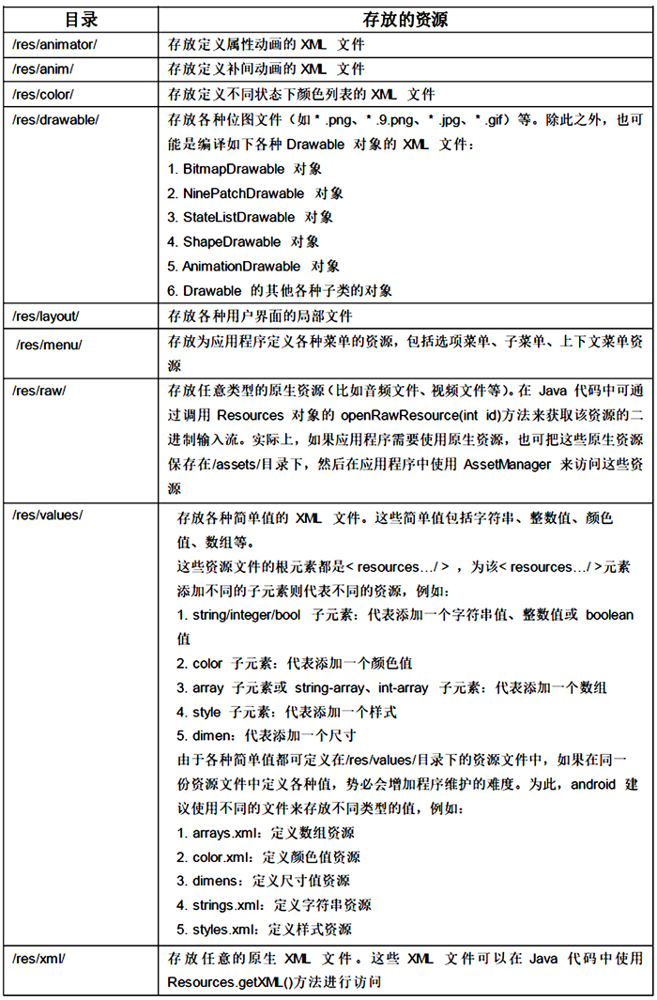

# 6.1资源的类型及存储方式
---
##资源的类型
* android 应用资源可分为两大类：  
* 1.无法通过 R 资源清单类访问的原生资源，保存在 assets 目录下。   
* 2.可通过 R 资源清单类访问的资源，保存在 res 目录下。大部分时候提到 android 应用资源时，往往都是指位于 /res/ 目录下的应用资源，android SDK 会在编译该应用时在 R 类中为它们创建对应的索引项。
##资源的存储方式
* android 要求在 res 目录下用不同的子目录来保存不同的应用资源。具体如下表显示。  

##使用资源
* 在 android 应用中使用资源可分为 Java 代码和 XML 文件中使用资源，其中 Java 代码用于为 android 应用定义四大组件，而 XML 文件则用于为 android 应用定义各种资源。  
* **1.在Java中使用资源清单项**  
* 由于 android SDK 会在编译应用时在 R 类中为/res/目录下所有资源创建索引项，因此在 Java 代码中访问资源主要通过 R 类来完成。其完整的语法格式为：  
```  
[< package_name >.]R.< resource_type >.< resource_name >
```  
其中package_name为包名；resource_type为R类中代表不同类型的子类，如string就是字符串资源类；resource_name表示资源名。
* **2.在Java中访问实际资源** 
* R 资源清单类为所有的资源都定义了一个资源清单项，但这个清单项只是一个 int 类型的值，并不是实际的资源对象。在大部分情况下，android 应用的 API 允许直接使用 int 类型资源清单项代替应用资源。
* 但有些时候，程序也需要使用实际的 android 资源，为了通过资源清单项来获取实际资源，可以借助于 android 提供的 Resources 类。
* Resources 主要提供了如下两类方法。  
1.getXxx(int id)：根据资源清单 ID 来获取实际资源。   
2.getAssets()：获取访问/assets/目录下资源的 AssetManager 对象。  
示例代码如下：
<pre> 
// 直接调用 Activity 的 getResource()方法来获取 Resources 对象		      
Resources res = getResources()；    
// 获取字符串资源  		
String mainTitle = res.getText(R.string.main_title)  
// 获取 Drawable 资源  
Drawable log = res.getDrawable(R.drawable.log)；  
// 获取数组资源  
int[] arr = res.getIntArray(R.array.books)；
</pre> 
* **3.在XML文件中使用资源** 
* 当定义 XML 资源文件时，其中的 XML 元素可能需要指定不同的值，这些值就可设置为已定义的资源项，在 XML 代码中使用资源的完整语法格式为：  
```  
[< package_name >:]< resource_type >/< resource_name >
```  
其中package_name为包名；resource_type为R类中代表不同类型的子类，如string就是字符串资源类；resource_name表示资源名。  


