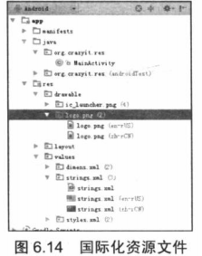

# 国际化和资源自适应

### 为 android 应用提供国际化资源

- android 应用使用 res/values 目录下的资源文件来保存程序中用到的字符串消息，为了给这些消息提供不同语言、国家的版本，开发者需要为 values 目录添加几个不同的语言国家版本。不同 values 文件夹的命名方式为：


```
values-语言代码-r 国家代码
```

- 例如希望下面的应用支持简体中文、美式英文两种环境，则需要在 res 目录下添加 values-zh-rCN、values-en-rUS 两个目录。


- 如果希望应用程序的图片也能随语言、国家环境改变，那么还需要为 drawable 目录添加几个不同的语言国家版本。不同 drawable 文件夹的命名方式为：


```
drawable-语言代码-r 国家代码
```

- **温馨提示**：如果还需要为 drawable 目录按分辨率提供文件夹，则可以在后面追加分辨率后缀，例如 drawable-zh-rCN-mdpi、drawable-zh-rCN-hdpi、drawable-zh-rCN-xhdpi、drawable-en-rUS-mdpi、drawable-en-rUS-hdpi、drawable-en-rUS-xhdpi 等。


- 下面的程序分别为 values 目录、drawable 目录创建了简体中文、美式英文两个版本。 

- 在 res/drawable-zh-rCN-mdpi、res/drawabl-en-rUS-mdpi 目录下分别添加 logo.png 图片，这两个图片并不相同，一个是简体中文环境的图片，一个是美式英语环境的图片，如图6-14所示。

  ​                                   	


- 在 res/values-en-rUS、res/values-zh-rCN 目录下分别创建 string.xml 文件。


- res/values-en-rUS 目录下的 string.xml 文件内容如下：


```xml
<resources>
  <string name="ok">OK</string>
  <string name="cancel">Cancel</string>
  <string name="msg">Hello , Android!</string>
</resources>
```
- res/values-zh-rCN 目录下的 string.xml 文件内容如下：


    <?xml version="1.0" encoding="utf-8"?>
    <resources>
      <string name="ok">确定</string>
      <string name="cancel">取消</string>
      <string name="msg">你好啊，可爱的小机器人！</string>
    </resources>
- 如果 android 是简体中文的环境，就加载 res/values-zh-rCN/strings.xml 文件中得字符串资源、加载 res/drawable-zh-rCN 目录下的 Drawable 资源；如果是美式英语的环境，就加载 res/values-en-rUS/strings.xml 文件中得字符串资源、加载 res/drawable-en-rUS 目录下的 Drawable 资源。


- 在 Java 代码中编码时，程序根据资源 ID 设置字符串内容，而不是以硬编码的方式设置为固定的字符串内容。