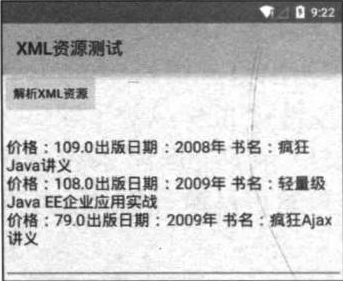
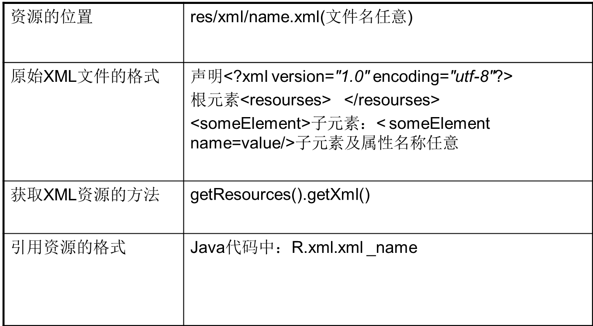

# 6.5XML资源
---
在某些时候，Android应用有一些初始化的配置信息、应用相关的数据资源需要保存，一般推荐使用XML文件来保存它们，这种资源就被称为原始XML资源。下面介绍如何定义、获取原始XML资源。
###定义原始XML资源
原始XML资源一般保存在/res/xml路径下——当使用Android Studio创建Android应用时，/res/目录下并没有包含xml子目录，开发者应该自行手动创建xml子目录。  
接下来Android应该对原始XML资源没有任何特殊的要求，只有它是一份格式良好的XML文档即可。  
一旦成功地定义了原始XML资源，接下来在XML文件中就可通过如下语法格式来访问它：
```
@[<package_name>:]xml/file_name
```
  在Java代码中则按如下语法格式来访问：
```
@[<package_name>:]R.xml.<file_name>
```
为了在Java程序中获取实际的XML文档，可以通过Resources的如下两个方法来实现。

* XmlResourceParser getXml(int id)：获取XML文档，并使用一个XmlPullParser来解析该XML文档，该方法返回一个解析器对象（XmlResourceParser是XmlPullParser的子类）。
* InputStream openRawResource(int id)：获取XML文档对应的输入流。

大部分时候，我们可以直接调用getXml(int id)方法来获取XML文档，并对该文档进行解析。Android默认使用内置的Pull解析器来解析XML文件。  
除了使用Pull解析之外，Java开发者还可使用DOM或SAX对XML文档进行解析。一般的Java应用会使用JAXP API来解析XML文档。对于实际的Java EE项目而言，使用JDOM或dom4j进行解析可能更加简便。  
  
**提示：Pull解析器是一个开源项目，既可以用于Android应用，也可以用于Java EE应用。如果需要在Java EE应用中使用Pull解析器，则需要自行下载并添加Pull解析器的JAR包。不过Android平台已经内置了Pull解析器，而且Android系统本身也使用Pull解析器来解析各种XML文档，因此Android推荐开发者使用Pull解析器来解析XML文档。**
  
Pull解析方式有点类似于SAX解析，它们都采用事件驱动的方式来进行解析。当Pull解析器开始解析之后，开发者可不断地调用Pull解析器的next()方法获取下一个解析事件（开始文档、结束文档、开始标签、结束标签等），当处于某个元素处时，可调用XmlPullParser的getAttributeValue()方法来获取该元素的属性值，也可调用nextText()方法来获取文本节点的值。  
如果开发者希望使用DOM、SAX或其他解析器来解析XML资源，那么可调用openRawResource(int id)方法来获取XML资源对应的输入流，这样即可自行选择解析器来解析该XML资源了。  
  
**提示：使用其他XML解析器需要开发者自行下载并安装解析器的JAR包。关于DOM、SAX、JAXP、dom4j、JDOM的相关知识，或者读者需要获取更多关于XML的知识，请参考疯狂Java体系的《疯狂XML讲义》。**
  
###使用原始XML文件
下面为示例程序添加一个原始的XML文件，将该XML文件放到/res/xml目录下。该XML文件的内容很简单，如下所示。
```
<?xml version="1.0" encoding="UTF-8"?>
<books>
	<book price="109.0" 出版日期="2008年">疯狂Java讲义</book>
	<book price="108.0" 出版日期="2009年">轻量级Java EE企业应用实战</book>
	<book price="79.0" 出版日期="2009年">疯狂Ajax讲义</book>
</books>
```
  接下来就可以在Java程序中获取XML资源，并解析该XML资源中的信息了。Java程序如下。
```
public class MainActivity extends Activity
{
	@Override
	public void onCreate(Bundle savedInstanceState)
	{
		super.onCreate(savedInstanceState);
		setContentView(R.layout.main);
		// 获取bn按钮，并为该按钮绑定事件监听器
		Button bn = (Button) findViewById(R.id.bn);
		bn.setOnClickListener(new OnClickListener()
		{
			@Override
			public void onClick(View arg0)
			{
				// 根据XML资源的ID获取解析该资源的解析器
				// XmlResourceParser是XmlPullParser的子类
				XmlResourceParser xrp = getResources().getXml(R.xml.books);
				try
				{
					StringBuilder sb = new StringBuilder("");
					// 还没有到XML文档的结尾处
					while (xrp.getEventType()
						!= XmlResourceParser.END_DOCUMENT)
					{
						// 如果遇到了开始标签
						if (xrp.getEventType() ==
							XmlResourceParser.START_TAG)
						{
							// 获取该标签的标签名
							String tagName = xrp.getName();
							// 如果遇到book标签
							if (tagName.equals("book"))
							{
								// 根据属性名来获取属性值
								String bookName = xrp
									.getAttributeValue(null, "price");
								sb.append("价格：");
								sb.append(bookName);
								// 根据属性索引来获取属性值
								String bookPrice = xrp
									.getAttributeValue(1);
								sb.append("	出版日期：");
								sb.append(bookPrice);
								sb.append(" 书名：");
								// 获取文本节点的值
								sb.append(xrp.nextText());
							}
							sb.append("\n");
						}
						// 获取解析器的下一个事件
						xrp.next(); // ①
					}
					EditText show = (EditText) findViewById(R.id.show);
					show.setText(sb.toString());
				}
				catch (XmlPullParserException e)
				{
					e.printStackTrace();
				}
				catch (IOException e)
				{
					e.printStackTrace();
				}
			}
		});
	}
}
```
上面程序中的①号粗体字代码用于不断地获取Pull解析的解析事件，程序中的while代码只要解析事件不等于XmlResourceParser.END_DOCUMENT（也就是还没有解析结束），程序就将依照解析下去，通过这种方式即可把整份XML文档的内容解析出来。  
上面的程序包含一个按钮和一个文本框，当用户单机该按钮时，程序将会解析指定XML文档，并把文档中的内容显示出来。运行该程序，然后单机“解析XML资源”按钮，程序显示如图所示的界面。  


###总结：


获得原始XML文件的基本思路是，通过getResources().getXml()获得XML原始文件，得到XmlResourceParser对象，通过该对象来判断是文档的开始还是结尾、是某个标签的开始还是结尾，并通过一些获得属性的方法来遍历XML文件，从而访问XML文件的内容。 