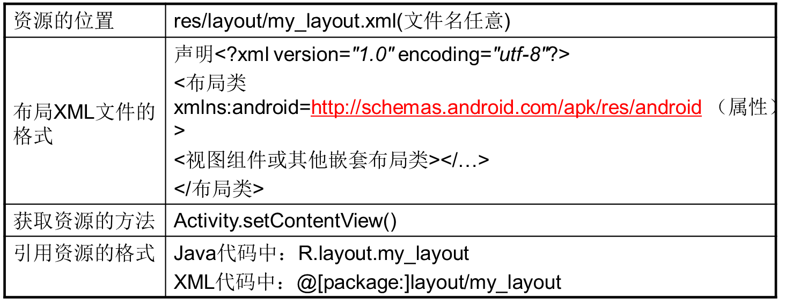

# 6.7 布局资源
---
实际上，从我们学习第一个Android应用开始，已经开始接触Android的Layout资源了，因此此处不会详细介绍Android的Layout资源的知识，只是对Layout资源进行简单的归纳。  
Layout资源文件应放在/res/layout/目录下，Layout资源文件的根元素通常是各种布局管理器，比如LinearLayout、TableLayout、FrameLayout等，接着在该布局管理器中定义各种View组件即可。  
一旦在Android项目中定义了Layout资源，接下来在XML文件中就可以通过如下语法格式来访问它：
```
@[<package_name>:]layout/file_name
```
  在Java代码中则按如下语法格式来访问：
```
@[<package_name>:]R.layout.<file_name>
```

###总结：
布局资源是Android中最常使用的一种资源，Android可以将屏幕中组件的布局方式定义在一个XML文件中，这有点像Web开发中的HTML页面。我们可以调用Activity.setContentView()方法，将布局文件展示在Activity上。Android通过LayoutInflater类将XML文件中的组件解析为可视化的视图组件。布局文件保存在res\layout\文件夹中，文件名称任意。



