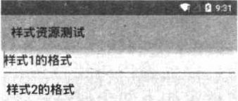

# 6.8样式和主题资源
---
样式和主题资源都用于对Android应用进行“美化”，只有充分利用Android应用的样式和主题资源，开发者就可以开发出各种风格的Android应用。
###样式资源
如果我们经常需要对某个类型的组件指定大致相似的格式，比如字体、颜色、背景色等，如果每次都要为View组件重复指定这些属性，无疑会有大量的工作量，而且不利于项目后期的维护。  
类似于Word，Word也提供了样式来管理格式：一个样式等于一组格式的集合，如果设置某段文本使用某个样式，那么该样式的所有格式将会整体应用于这段文本。Android的样式与此类似，Android样式也包含一组格式，为一个组件设置使用某个样式时，该样式所包含的全部格式就会应用于该组件。  

**提示：一个样式相当于多个格式的集合，其他UI组件通过style属性来指定样式，这就相当于把该样式包含的所有格式同时应用于该UI组件。**

Android的样式资源文件也放在/res/values/目录下，样式资源文件的根元素是<resources.../>元素，该元素内可包含多个<style...>子元素， <style...>子元素定义了一个样式。<style...>元素指定如下两个属性。

* name：指定样式的名称。
* parent：指定该样式所继承的父样式。当继承某个父样式时，该样式将会获得父样式中定义的全部格式。当然，当前样式也可以覆盖父样式中指定的格式。

<style...>元素内可包含多个<item.../>子元素，每个<item.../>子元素，定义一个格式项。  
例如，为应用定义如下样式资源文件。
```
<?xml version="1.0" encoding="UTF-8"?>
<resources>
	<!-- 定义一个样式，指定字体大小、字体颜色 -->
	<style name="style1">
		<item name="android:textSize">20sp</item>
		<item name="android:textColor">#00d</item>
	</style>
	<!-- 定义一个样式，继承前一个颜色 -->
	<style name="style2" parent="@style/style1">
		<item name="android:background">#ee6</item>
		<item name="android:padding">8dp</item>
		<!-- 覆盖父样式中指定的属性 -->
		<item name="android:textColor">#000</item>
	</style>
</resources>
```
上面的样式资源中定义了两个样式，其中第二个样式继承了第一个样式，而且第二个样式中的textColor属性覆盖了父样式中的textColor属性。  
一旦定义了上面的样式资源之后，接下来就可以在XML资源中按如下语法格式来使用样式了：
```
@[<package_name>:]style/file_name
```
下面是该示例中的界面布局文件，该布局文件中包含两个文本框，这两个文本框分别使用两个样式。
```
<?xml version="1.0" encoding="utf-8"?>
<LinearLayout xmlns:android="http://schemas.android.com/apk/res/android"
	android:orientation="vertical"
	android:layout_width="match_parent"
	android:layout_height="match_parent">
	<!-- 指定使用style1的样式 -->
	<EditText
		android:layout_width="match_parent"
		android:layout_height="wrap_content"
		android:text="@string/style1"
		style="@style/style1"/>
	<!-- 指定使用style2的样式 -->
	<EditText
		android:layout_width="match_parent"
		android:layout_height="wrap_content"
		android:text="@string/style2"
		style="@style/style2"/>
</LinearLayout>
```
上面的界面布局文件中并未为两个文本框指定任何格式，只是为它们分别指定了使用style1、style2的样式，这两个样式包含的格式就会应用到这两个文本框。运行上面的程序，将看到如图所示的界面。


###主题资源
与样式资源非常相似，主题资源的XML文件通常也放在/res/values/目录下，主题资源的XML文件同样以<resources.../>元素作为根元素，同样使用<style...>元素来定义主题。  
主题与样式的区别主要体现在：

* 主题不能作用于单个的View组件，主题应该对整个应用中的所有Activity起作用，或对指定的Activity起作用。
* 主题定义的格式应该是改变窗口外观的格式，例如窗口标题、窗口边框等。

###实例：给所有窗口添加边框、背景
下面通过一个实例来介绍主题资源的用法。为了给所有窗口都添加边框、背景，先在/res/values/my_style.xml文件中增加一个主题，定义主题的<style.../>片段如下：
```
<style name="CrazyTheme">
		<item name="android:windowNoTitle">true</item>
		<item name="android:windowFullscreen">true</item>
		<item name="android:windowFrame">@drawable/window_border</item>
		<item name="android:windowBackground">@drawable/star</item>
</style>
```
上面的主题定义中使用了两个Drawable资源，其中的@drawable/star是一张图片；@drawable/window_border是一个ShapeDrawable资源，该资源对应的XML文件代码如下：
```
<?xml version="1.0" encoding="UTF-8"?>
<shape xmlns:android="http://schemas.android.com/apk/res/android"
	   android:shape="rectangle">
	<!-- 设置填充颜色 -->
	<solid android:color="#0fff"/>
	<!-- 设置四周的内边距 -->
	<padding android:left="7dp"
		 android:top="7dp"
		 android:right="7dp"
		 android:bottom="7dp" />
	<!-- 设置边框 -->
	<stroke android:width="10dip" android:color="#f00" />
</shape>
```
定义了上面主题之后，接下来即可在Java代码中使用该主题了，例如如下代码：
```
public class MainActivity extends Activity {

	public void onCreate(Bundle savedInstanceState)
	{
		super.onCreate(savedInstanceState);
		setTheme(R.style.CrazyTheme);
		setContentView(R.layout.main);
	}
}
```
大部分时候，在AndroidManifest.xml文件中对指定应用、指定Activity应用主题更加简单。如果我们想让应用中全部窗口使用该主题，那么只要为<application.../>元素添加android:theme属性即可。属性值是一个主题的名字，如以下代码所示：
```
<application android:theme= "@style/CrazyTheme" >
...
</application>
```
如果你只是想让程序中的某个Activity拥有这个主题，那么可以修改<activity.../>元素，同样通过android:theme指定主题即可。  
本应用在AndroidManifest.xml文件的<application.../>元素中添加了android:theme= "@style/CrazyTheme"属性，运行程序可以看到如图所示界面。


从图中所示的效果可以看出，该窗口没有标题，窗口背景也被改变了，窗口全屏显示……这些都是自定义主题控制的。

**提示：可能会有读者觉得窗口边框弄得这么粗，显得很难看，其实读者可以自行控制。笔者之所以弄得这么粗，是为了让读者看到窗口边框的效果。**

Android中提供了几种内置的主题资源，这些主题通过查询Android.R.style类可以看到。例如前面介绍的对话框风格的窗口，我们只要采用如下代码来定义某个Activity即可。
```
 <activity android:theme= "@android:style/Theme.Dialog" >
 ...
 </activity>
```
与样式类似的是，Android主题同样支持继承。如果开发过程中还想利用某个主题，但是要对它进行局部修改，则可通过继承系统主题来实现自定义主题。例如如下代码片段：
```
<style name="CrazyTheme" parent="@android:style/Theme.Dialog">
...
</style>
```
上面定义的CrazyTheme主题继承了android.R.style.Theme.Dialog主题，那么接下来在该<style.../>元素中添加的<item.../>子元素就可覆盖系统主题的部分属性了。
###Android5.0新增的Material主题
Android5.0新增了Material设计的主题，开发者只要将App的主题设为android:Theme.Material.Xxx（后面的Xxx可能要根据实际选择）即可启用Material主题。  
通过使用Material主题可以让App具有更自然的动态效果和过渡风格，Material Design支持包括以下几个方面。

* 系统自带Material Design主题。
* 允许通过View的setElevation()或setTranslationZ()方法让组件在屏幕上浮起来。
* 当用户点击按钮、复选框和其他可触碰组件时，将会自动显示水波动画。
* 具有Material设计风格的动画和Activity过渡效果。

实际上，前面介绍的绝大部分示例都使用了Material主题，只有第2章极个别的示例为了示范某些特殊组件的用法才改变了应用的主题，读者可以通过前面示例来感受Android5.0的Material主题的效果。
###总结：
* 样式资源可以将需要设置相同属性的属性值提取出来放到单独的文件中，然后再需要用到的地方引用该样式。这样可以保证界面风格的统一，同时也为修改样式带来了方便。这一点和以前的CSS技术相似。
* 样式资源也需要在res/values目录的资源文件中定义。每一个&lt;style&gt;标签表示一个样式，name属性表示样式名，每个样式的属性使用item表示。样式可以继承。通过&lt;style&gt;的parent属性指定父样式资源id。
* 与样式资源类似，主题资源的XML文件也放在res/values下面，使用&lt;resource&gt;作为根元素，使用&lt;style&gt;来定义主题，与样式资源的区别在于，主题不能作用于单个的View，主题可以对整个应用的Activity起作用，或对指定的Activity起作用
* 只能在&lt;application&gt;、&lt;activity&gt;标签利用android:theme属性来设定资源
