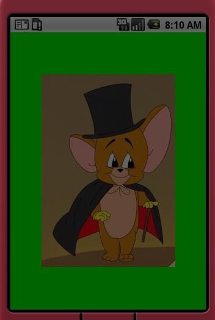
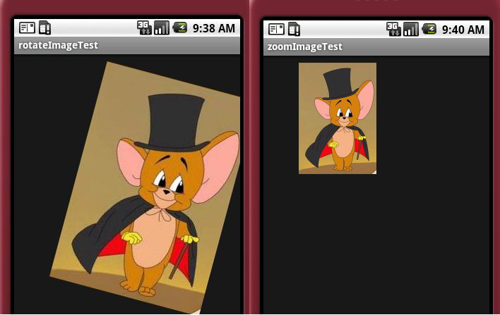
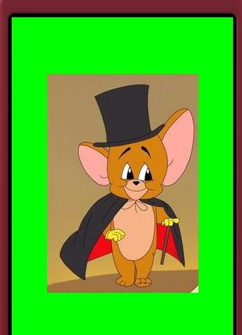

# 7图形与图像处理
---

###Android的图形处理能力非常强大
* 对于2D图形的处理，它没有使用Java中的图形处理类（在java.awt包中，如Graphics、Canvas等类），而是自己弄了一套。
 * android.graphics
 * android.graphics.drawable
 * android.graphics.drawable.shapes
 * android.view.animation

* 3D图形处理。继承了OpenGL的技术。主要的类位于:
 * android.opengl

###Android图形处理主要包括两大类:
* 静态图形处理（已经拥有了这些图片）。一般将这些图形文件作为资源文件添加到项目中即可。然后通过各种Drawable类来处理。
* 动态图形处理。需要用代码不停的绘制。涉及到画布Canvas, 画笔Paint等类。
#####Drawable、Bitmap、Canvas和Paint概念区别
 * Bitmap - 称作位图，一般位图的文件格式后缀为bmp、JPG、GIF等。作为一种逐像素的显示对象执行效率高，但是缺点也很明显存储效率低。我们理解为一种存储对象比较好。
 * Drawable - 作为Android平台下通用的图形对象，它可以装载常用格式的图像，比如GIF、PNG、JPG，当然也支持BMP，当然还提供一些高级的可视化对象，比如渐变、图形等。
 * Canvas - 名为画布，我们可以看作是一种处理过程，使用各种方法来管理Bitmap、Path等，同时它可以配合Matrix矩阵类给图像做旋转、缩放等操作，同时Canvas类还提供了裁剪、选取等操作。
 * Paint - 我们可以把它看做一个画图工具，比如画笔、画刷。他管理了每个画图工具的字体、颜色、样式。
 
###View类开发框架
* 在View类框架中，任何自定义的View类都只需要重写onDraw( )方法来进行界面的显示
* onDraw( )方法不能被直接调用，想要重新加载界面通常有两种方法，一种是在Handler中调用invalidate，另一种是直接在线程中调用postInvalidate( )
* invalidate( )不能直接在工作者线程中进行调用，因为它违背了单线程模型，而android的UI操作并不是线程安全的。而postInvalidate()可以在工作者线程中直接进行调用

###SurfaceView类开发框架
* surfaceView继承自View类，它通过一个新线程来更新画面。因此，SurfaceView更适合需要快速加载UI，或渲染代码阻塞UI线程的时间过长的情形
* SurfaceView封装了一个Surface对象，而不是Canvas，这一点对于那些资源敏感的操作特别有用
* SurfaceView一般通过使用SurfaceHolder类来控制Canvas在其surface上的操作，SurfaceHolder类可以通过getHolder( )来获得
* **SurfaceHolder中的几个重要的方法**
 * lockCanvas( )方法用于锁定画布，这样Surface中就可以指定画布了，之后就可以在画布上进行绘画
 * unlockCanvasAndPost(Canvas canvas)：用于释放处于锁定状态的Canvas
* 当Surface的状态发生改变时，可以通过SurfaceHolder.Callback来获取这些信息
 * SurfaceHolder.Callback有三个重要的方法，surfaceChanged( )、surfaceCreated( )、surfaceDestroyed( )分别在Surface创建、改变、销毁时被调用

###Graphics类开发
######Paint和Color类
* 颜色被表示为封装的数值，这个数值由四个字节组成，分别为alpha、red、green、blue，任何透明性只存储在alpha部分。
* Color类定义了一些方法来创建和转换颜色值。如red( int color)、green(int color)、blue(int color)等方法可以获取一个颜色常量值的红绿蓝分色，而HSVToColor( )、RGBToHSV( )等方法可以在不同颜色空间进行颜色的转换。

######Canvas类介绍
* 要实现一个吸引人的游戏，色彩艳丽的界面设计是必不可少的，这就需要Paint和Canvas配合实现
* 设置Canvas属性的常用方法
 * drawColor( )：用来设置画布背景色，体现在手机上就是手机屏幕背景色
 * clipRect( )：设置裁剪区域，即设置显示区域
 * rotate( )：旋转画布
* Canvas常用的绘制方法
 * drawRect(Rect rect, Paint paint)用于绘制矩形区域
 * drawBitmap(bitmap bitmap, Rect src, Rect dst, Paint paint)用于绘制位图
 * drawPoint(float x, float y, Paint paint)用于画点
 * drawLine(float startX, float startY, float stopX, float stopY, Paint paint)用于画线
 * drawText(String text, float x, float y, Paint paint)用于在某个位置写文本


#####Graphics类开发实例
* Android中显示图像主要有两步，第一步是获取图像资源，第二步调用画布类的drawBitmap方法进行图像显示。
* 以SurfacView为框架在屏幕中央显示一幅图像如图示

* 图像旋转和缩放
 * android中对图像的变换操作有平移、旋转、缩放和倾斜四种，android内的Matrix提供了这四种操作方法
 * Matrix在使用前必须通过reset( )或set( )被初始化。其中对应每种操作都有三种接口setXXX， preXXX，postXXX，在调用这些操作时都可以指定操作中心
 * setXXX将使当前操作覆盖以前的操作，preXXX和postXXX都是顺序叠加操作，区别在于preXXX是将新变换矩阵左乘原来的操作矩阵，而postXXX是将新变换矩阵右乘原来的操作矩阵

* 图像像素操作
 * 对图像像素进行操作主要包括两个过程，第一步首先从图像中获取像素值，第二步对像素值进行处理并保存
 * android中提供了两套操作方法，这些方法都属于Bitmap类，第一套方法针对单像素进行操作，getPixel( )和setPixel( )，第二套为针对批量像素进行操作， getPixels( )和setPixels( )


* 设置全屏和获取屏幕属性
 * 全屏显示，就是将手机上面的电池、信号显示所处的状态栏以及显示程序名称的标题栏隐藏起来：
  **1.requestWindowsFeature(Window.FEATURE_NO_TITLE)可以实现隐藏标题栏**
  **2.getWindows.setFlags(WindowManager.LayoutParams.FLAG_FULLSCREEN,WindowManager.LayoutParams.FLAG_FULLSCREEN)实现了状态栏的隐藏**


* 设置全屏和获取屏幕属性
 * android通过DisplayMetrics类的getWindowManager().getDefaultDisplay().getMetrics()方法来获取分辨率，用法如下：
 
 ```
 DisplayMetrics dm = new DisplayMetrics()  
getWindowManager().getDefaultDisplay().getMetrics(dm) 

 ```


######Shader类介绍
* Shader类来对图形图像进行渲染
* Shader类包含了子类BitmapShader、LinearGradient、RadialGradient、SweepGradient以及ComposeShader
 * BitmapShader主要用于渲染图像，比如使图像显示在某种特定形状边界内
 * LinearGradient用来进行线性梯度渲染，比如使绘制的几何图形产生一种线性过渡的色彩
 * RadialGradient用于进行环形渲染，比如使圆产生环形颜色过渡
 * SweepGradient是扫描渐变，即围绕一个中心点进行扫描渐变，类似于雷达扫描的效果
 * ComposeShader是组合渲染，可以组合上面所述的任意两种渲染效果

######双缓冲技术
* 在游戏开发中，当一幅动画在显示的同时，假如程序又会修改它，这样前面的画面还没有显示完，程序又要求重新绘制，屏幕就会不停闪烁，为了避免闪烁，就必须使用双缓冲技术
* 双缓冲原理是将要处理的图片先在内存中处理完后，再将其显示到屏幕上，这样显示出来的就是一幅完整的图像，不会出现闪烁的现象
* android里实现就是在内存中创建一个与原图大小相同的模拟画布，先将要处理的图像画在模拟画布上，当全部处理结束后，再将整幅图显示在真正的画布上


