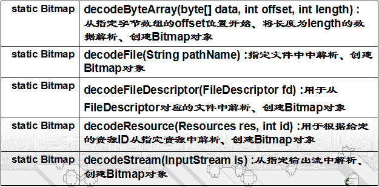

# 7.1使用简单图片
---

###使用Drawable对象
* 产生图片资源：将图片文件拷到res/drawable下。
* 访问图片资源(在第六章学习过):
 * 在xml中  @drawable/文件名
 * 在代码中R.drawable.文件名
* Android SDK提供了一个强大的类Drawable
* SDK的android.graphics.drawable包下面可以看到继承 Drawable类多达十几种：
 * Direct Subclasses：BitmapDrawable, ClipDrawable, ColorDrawable, DrawableContainer, GradientDrawable, InsetDrawable, LayerDrawable, NinePatchDrawable, PictureDrawable, RotateDrawable, ScaleDrawable, ShapeDrawable 
 * Indirect Subclasses ：AnimationDrawable, LevelListDrawable, PaintDrawable, StateListDrawable, TransitionDrawable

* Drawable就是一个可画的对象，其可能是一张位图（BitmapDrawable），也可能是一个图形（ShapeDrawable），还有可能是一个图层（LayerDrawable），我们根据画图的需求，创建相应的可画对象，就可以将这个可画对象当作一块“画布（Canvas）”，在其上面操作可画对象，并最终将这种可画对象显示在画布上，有点类似于“内存画布“。

###Bitmap和BitmapFactory
* 访问/assets/目录下图片资源：
* ImageView组件显示图片的方法：
 * void setImageResource(int resId) ：Sets a drawable as the content of this ImageView
 * void setImageDrawable(Drawable drawable) :Sets a drawable as the content of this ImageView
 * void setImageBitmap(Bitmap bm) :Sets a Bitmap as the content of this ImageView.

* 创建Bitmap对象方法：
 * BitmapFactory（android.graphics.BitmapFactory）：一个工具类，提供了多种方法，这些方法可用于从不同的数据源来解析、创建 Bitmap对象。主要方法如下：

* 回收Bitmap对象方法：
 * 系统不停地解析、创建对象，可能由于前面创建的Bitmap所占用内存还没有回收，而导致程序运行时引发OutOfMemory错误。
 * Android为Bitmap提供了两个方法来判断它是否已会后，以及强制Bitmap回收自己。
 * **Boolean isRecycled()：返回该 Bitmap对象是否已回收**
 * **Void recycle()：强制一个Bitmap对象回收自己**

* Bitmap(android.graphics.Bitmap)提供的创建新的Bitmap方法：
 * static Bitmap  createBitmap(Bitmap source, int x, int y, int width, int height) :从源位图source的指定左边点(x,y)开始，从中挖取一块出来，创建新的Bitmap对象.
 * static Bitmap  createScaledBitmap(Bitmap src, int dstWidth, int dstHeight, boolean filter) :对源位图进行缩放，缩放成宽dstWidth，高dstHeight的新位图。filter如果为true，源图要被过滤。
 * static createBitmap(int width,int height,Bitmap.Config config):创建一个宽width、高height的新位图。
 * static Bitmap  createBitmap(Bitmap source, int x, int y, int width, int height, Matrix m, boolean filter) :从源位图source的指定左边点(x,y)开始，从中挖取一块出来，创建新的Bitmap对象.并按Matrix指定的规则进行变换。

 

 

