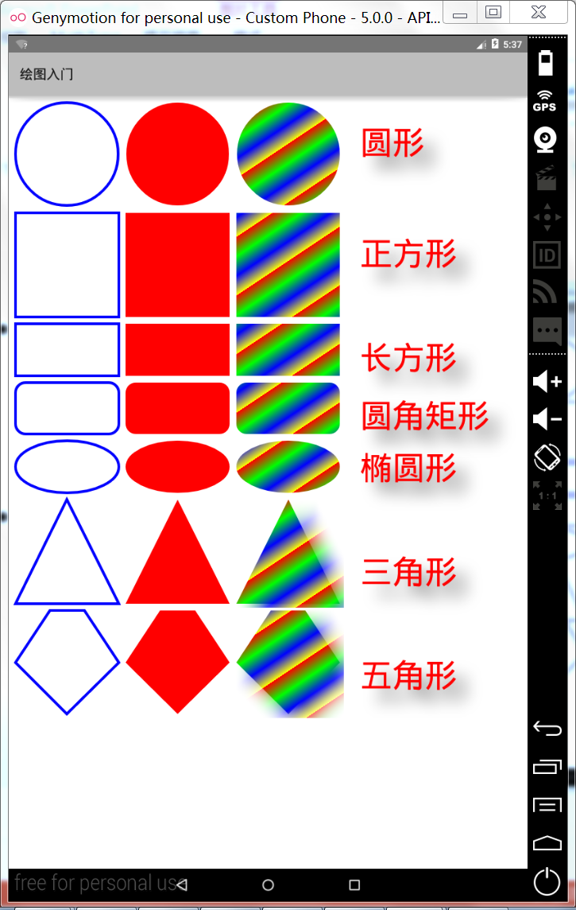
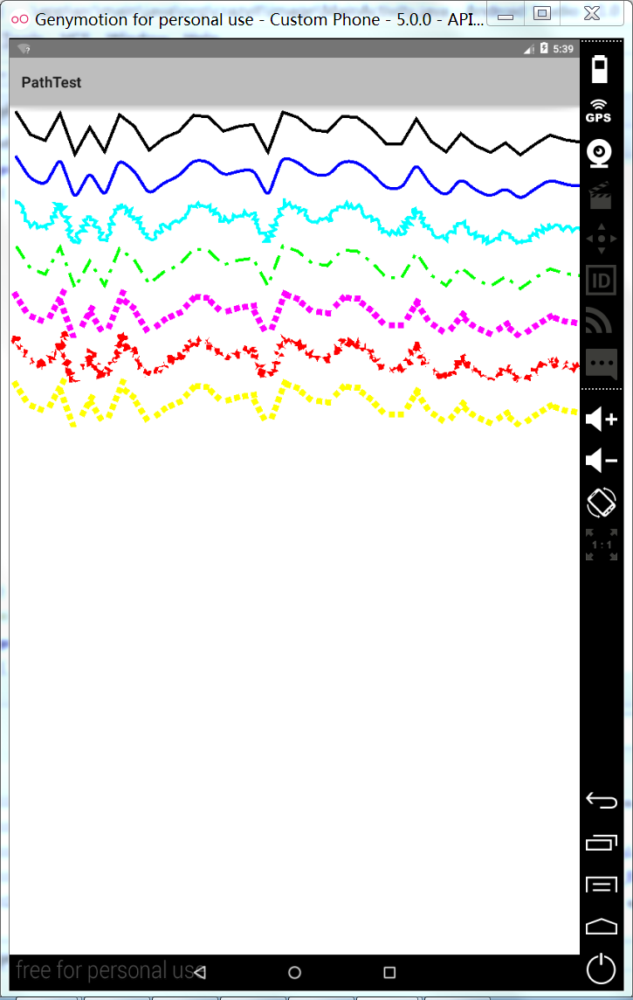
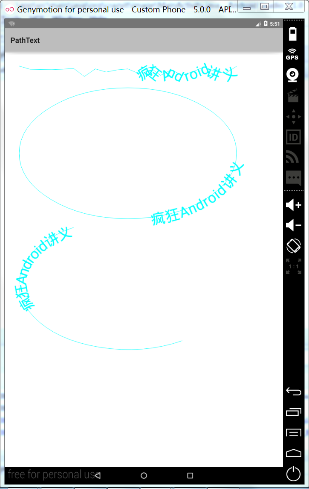

# 7.2绘图
---

###Android绘图基础：Canvas、Paint
* Canvas提供的图形变换方法
 * rotate(float degrees,float px,float py)：对Canvas执行旋转
 * scale(float sx,float sy,float px,float py)：对Canvas执行缩放
 * translate(float dx,float dy)：移动Canvas
* Canvas上的画笔：Paint
####项目实例：CanvasTest
* 自定义View组件，重写onDraw(Canvas canvas)方法，绘制基本的集合图形

* 代码分析
 * Path类:下节详细介绍
 * **LinearGradient()：**
    LinearGradient (float x0, float y0, float x1, float y1, int[] colors, float[] positions, Shader.TileMode tile) 
   
   * *包名：android.graphics.LinearGradient,线性渐变渲染*
   * *基类：Shader类* 
   * *x0, y0：渐变起点坐标x,y位置*
   * *X1,y1：渐变终点坐标x,y位置*
   * *Colors：colors数组中存放沿着渐变线变化的多种颜色*
   * *Positions：如果为null 就沿坡度线均匀分布*
   * *Tile：渲染模式*
*CLAMP MIRROR REPEAT*

###Path类

* 预先在View上将N个点连接成一条“路径”，然后调用Canvas的drawPath(path,paint)即可沿着该路径路径绘制图形。
* 提供PathEffect定义绘制效果，有如下子类：
 * CornerPathEffect
 * DashPathEffect
 * DiscretePathEffect
 * PathDashPathEffect
 * SumPathEffect
 * ComposePathEffect
 ####项目实例1:PathTest
 

 * 代码分析
  * PathEffect是用来控制绘制轮廓(线条)的方式。使用PathEffect，可以改变一个形状的边角的外观并且控制轮廓的外表。
  * CornerPathEffect (float radius)
   * 可以使用圆角来代替尖锐的角从而对基本图形的形状尖锐的边角进行平滑。
   * Radius：圆角半径
  * DashPathEffect(float[] intervals, float phase) ：
   * 创建一个虚线的轮廓(短横线/小圆点)，而不是使用实线。可以指定任意的虚/实线段的重复模式。
   * intervals:表示虚线线段的长度和虚线之间的间隔。数组长度必须是偶数。例如new float[]{10,4,6,3]。这四个值分别表示长线段的长度（10），长线段与短线段之间的距离是4，短线段的长度是6，短线段与长线段之间的举例是3。
   * phase：该参数用于指定路径效果的相位，当该参数不断改变时，绘制效果也略有变化。形成动画效果。（演示当phase=0时的情况）

 * DiscretePathEffect(float segmentLength, float deviation) ：
   * 与DashPathEffect相似，但是添加了随机性。当绘制它的时候，需要指定每一段的长度和与原始路径的偏离度。
   * Chop the path into lines of segmentLength, randomly deviating from the original path by deviation.（将路径划分成指定长度的线段，然后把每条线段随机偏移原来的位置。）
 * PathDashPathEffect (Path shape, float advance, float phase, PathDashPathEffect.Style style) ：
   * shape ：用于绘制虚线对象的Path对象
   * advance：两个虚线图形之间的距离
   * phase：绘制路径的偏移量。如果该参数不断增大会减少，会出现路径向前或向后移动的效果
   * style：表示如何在路径的不同位置放置 Shape所绘制的图形
 * SumPathEffect(PathEffect first, PathEffect second) ：
   * 顺序地在一条路径中添加两种效果，这样每一种效果都可以应用到原始路径中，而且两种结果可以结合起来。
  * ComposePathEffect(PathEffect outerpe, PathEffect innerpe)：
   * 将两种效果组合起来应用，先使用第一种效果，然后在这种效果的基础上应用第二种效果。

 ####项目实例2：PathText
 
 * 代码分析
  * drawTextOnPath(String text,Path path,float hOffset,float vOffset,Paint paint)
   * hOffset：水平偏移量
   * vOffset：垂直偏移量
   
 ###绘制游戏动画
 * 采用双缓冲实现画图板：
  * 项目实例1：本实例实现一个画图板，当用户在触摸屏上移动时，即可在屏幕上绘制任意的图形。
   * HandDraw
  * 项目实例2：本实例开了一个简单的弹球游戏，其中小球和球拍分别以圆形区域和矩形区域代代替，小球开始以随机速度向下运动，遇到边框或球拍时小球反弹；球拍则由用户控制，当用户按下向左、右键时，球拍将会向左右移动。
   * PinBall

 

