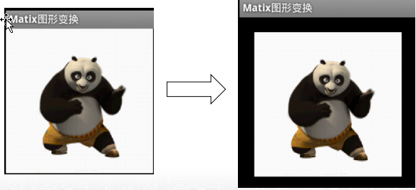
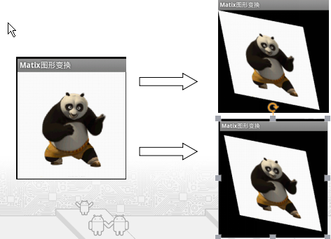
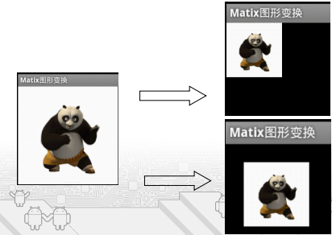
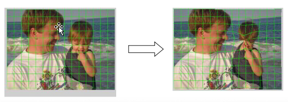
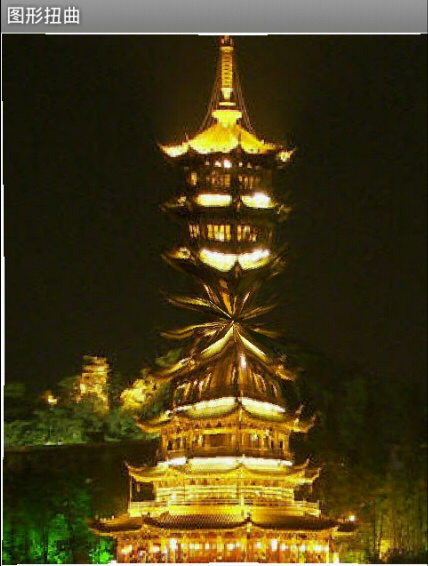
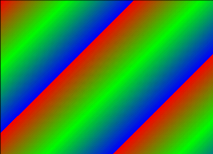
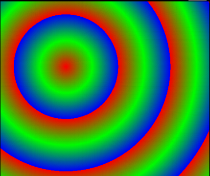
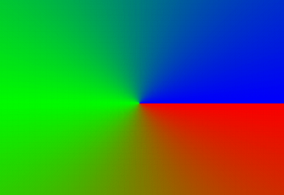
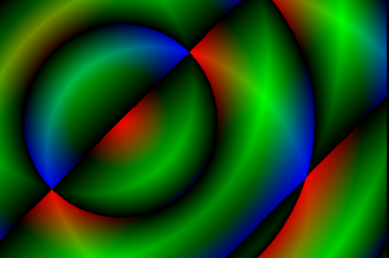

# 7.3图形特效处理
---
###使用Matrix控制变换
* Matrix是Android提供的一个矩阵工具类，它本身并不能对图像或组件进行变换（平移、旋转、缩放、倾斜），但它可与其他API结合起来控制图形、组件的变换。
* 使用Matrix控制图像或组件变换的步骤如下：
 *  获取Matrix对象，该Matrix对象既可新创建，也可直接获取其他对象内封装的Matrix；
 *  调用Matrix的方法进行平移、旋转、缩放、倾斜等；
 *  将程序对Matrix所做的变换应用到指定图像或组件。
* Matrix提供方法如下：
 *  setTranslate(float dx,float dy):控制Matrix坐标平移dx,dy；
 
 * setSkew(float kx,float ky):控制Matrix进行倾斜。Kx,ky为X,Y方向上的倾斜距离
 * setSkew(float kx,float ky,float px,float py):控制Matrix以px,py为轴心进行倾斜。
 

  * setRotate(float degrees)：控制Matrix进行旋转，degrees为控制旋转的角度。
  * setRotate(float degrees,float px,float py)：控制Matrix以px,py为轴心进行旋转.

###使用drawBitmapMesh扭曲图像
* Android通过drawBitmapMesh扭曲图像提供“ 水波荡漾”、“风吹旗帜”效果。

* drawBitmapMesh方法相关参数说明：
 * bitmap：指定需要扭曲的源位图
 * meshWidth：该参数控制在横向方向上把该源位图分成多少格
 * meshHeight：该参数控制在纵向方向上把该源位图分成多少格
 * verts：该参数是一个长度（ meshWidth +1）*（ meshHeight +1）*2的数组，它记录了扭曲后的位图各“顶点”（网格线交点）位置。虽然它是一个一维数组，实际上记录的是(x0,y0) (x1,y1) (x2,y2)….格式的数据，这些数组元素控制对bitmap位图的扭曲
 * 控制verts数组中从第几个数组元素开始才对bitmap进行扭曲。
####项目实例演示
当用户“触摸”图片指定点时，该图片会在这个点被用户“按下去”—就像这张图片铺在“极软的床上”。

当用户“触摸”图片指定点时，该图片会在这个点被用户“按下去”—就像这张图片铺在“极软的床上”。

* 代码分析：
 * 为了实现这个效果，程序要在用户触摸图片的指定点时，动态地改变verts数组里每个元素的位置（控制扭曲后每个顶点的坐标）
 * 程序计算图片上每个顶点与触摸点的距离，顶点与触摸点的距离越小，该顶点向触摸点移动的距离越大

###使用Shader填充图形
* Android中提供了Shader类专门用来渲染图像以及一些几何图形，Shader下面包括几个直接子类：
 * BitmapShader：实现位图平铺的渲染效果
 
* Android中提供了Shader类专门用来渲染图像以及一些几何图形，Shader下面包括几个直接子类：
 * LinearGradient ：使用线性渐变来填充图形
 
 
* Android中提供了Shader类专门用来渲染图像以及一些几何图形，Shader下面包括几个直接子类：
 * RadialGradient ：使用圆性渐变来填充图形
 
* Android中提供了Shader类专门用来渲染图像以及一些几何图形，Shader下面包括几个直接子类：
 *  SweepGradient ：使用角度渐变来填充图形
 
* Android中提供了Shader类专门用来渲染图像以及一些几何图形，Shader下面包括几个直接子类：
 * ComposeShader：则是一个 混合渲染，可以和其它几个子类组合起来使用。

####项目实例演示及代码分析 ShaderTest

