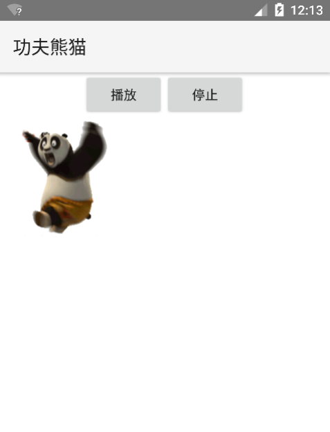

# 7.4逐帧动画
---
逐帧动画按照时间的先后顺序，一次播放排列好的图片。利用人眼“视觉暂留”的原理，给用户造成“动画”的错觉。逐帧动画的原理与放电影的原理完全一样。

### AnimationDrawable与逐帧动画
* 动画资源文件介绍
 * /res/anim/****.xml:资源文件中使用<animation-list…/>元素中使用<item…/>子元素定义动画的全部帧，并指定各帧的持续时间。
* 逐帧动画的简单示例

```
<?xml version="1.0" encoding="utf-8"?>
<!-- 指定动画循环播放 -->
<animation-list xmlns:android="http://schemas.android.com/apk/res/android"android:oneshot="false">
<!-- 添加多个帧 -->
    <item android:drawable="@drawable/fat_po_f01" android:duration="60" />
    <item android:drawable="@drawable/fat_po_f02" android:duration="60" />
    <item android:drawable="@drawable/fat_po_f03" android:duration="60" />
    ...
</animation-list>
```

```
<!--使用ImageView显示动画-->
<ImageView  
	android:id="@+id/anim"
	android:layout_width="wrap_content" 
	android:layout_height="wrap_content" 
	android:background="@anim/fat_po"
	android:scaleType="center"
	/>
```

* 使用使用AnimationDrawable控制动画播放和停止:
* final AnimationDrawable anim = (AnimationDrawable)imageView.getBackground();
* anim.start();
* anim.stop();
* 播放过程：




* 指定点爆炸示例
```
// 重写该方法，控制如果动画播放到最后一帧时，隐藏该View
		@Override
		protected void onDraw(Canvas canvas) // ①
		{
			try
			{
				Field field = AnimationDrawable.class
						.getDeclaredField("mCurFrame");
				field.setAccessible(true);
				// 获取anim动画的当前帧
				int curFrame = field.getInt(anim);
				// 如果已经到了最后一帧
				if (curFrame == anim.getNumberOfFrames() - 1)
				{
					// 让该View隐藏
					setVisibility(View.INVISIBLE);
				}
			}
			catch (Exception e)
			{
			}
			super.onDraw(canvas);
		}
```


