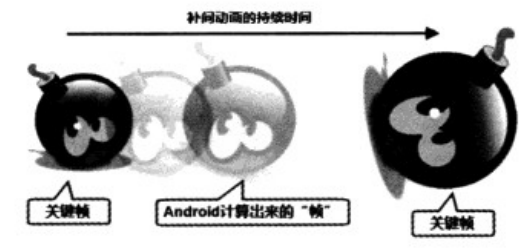
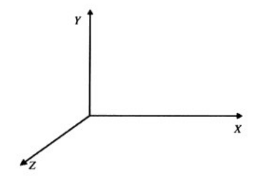
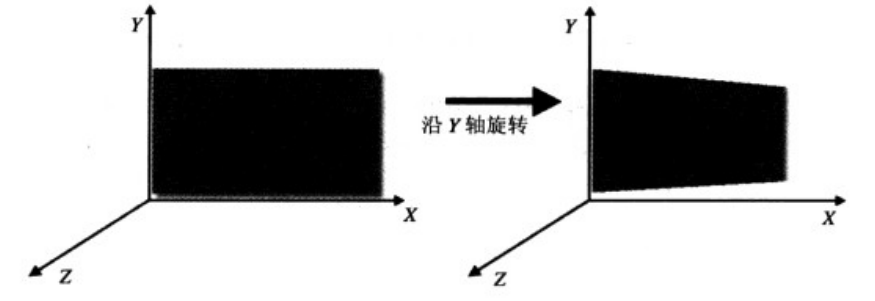

# 7.5补间动画
---

###Tween动画与Interpolator
* 下图可作为补间动画的示意图。
 
* 从上图可以看出，对于补间动画而言，开发者无须“逐一”定义动画过程中的每一帧，他只要定义动画开始、结束的关键帧，并指定动画的持续时间即可。
* 从上图可以看出，补间动画所定义的开始帧、结束帧其实只是一些简单的变化，比如图形大小的缩放、旋转角度的改变等。Andriod使用Animation代表抽象的动画类，它包括如下几个子类：
 * AlphaAnimation：透明度改变的动画。创建该动画时要指定动画开始时的透明度。结束时的透明度和动画持续时间。其中透明度可以从0到1变化。
 * ScaleAnimation：大小缩放的动画。创建该动画时要指定动画开始时的缩放比（以X、Y轴的缩放参数来表示）、结束时的缩放比（以X、Y轴的缩放参数来表示），并指定动画的持续时间。由于缩放时以不同点为中心的缩放效果并不相同，因此指定缩放动画时还要通过pivotX、pivotY来指定缩放中心的坐标。
 * TranslateAnimation：位移变化的动画。创建该动画时只要指定动画开始时的位置（以X、Y坐标来表示）、结束时的位置（以X、Y坐标来表示），并指定动画持续时间即可。
 * RotateAnimation：旋转动画。创建该动画时只要指定动画开始时的旋转角度、结束时的旋转角度，并指定动画持续时间即可。由于旋转时以不同点为中心的旋转效果并不相同，因此指定旋转动画时还要通过pivotX、pivotY来指定缩放中心的坐标。
* 一旦为补间动画指定了三个必要信息，Android就会根据动画的开始帧、结束帧、动画持续时间计算出需要在中间“补入”多少帧，并计算所有补入帧的图形。当用户浏览补间动画时，他眼中看到的依然是“逐帧动画”。
* 为了控制在动画期间需要动态“补入”多少帧，具体在动画运行的哪些时刻补入帧，需要借助于Interpolator。
* Interpolator根据特定算法计算出整个动画所需要动态插入帧的密度和位置。简单地说，Interpolator负责控制动画的变化速度，这就使得基本的动画效果（Alpha、Scale、Translate、Rotate）能以匀速变化、加速、减速、抛物线速度等各种速度变化。
* Interpolator是一个接口，它定义了所有Interpolator都需要实现的方法：floatgetInterpolation(float input)，开发者完全可以通过实现Interpolator来控制动画的变化速度。
* Android为Interpolator提供了如下几个实现类，分别用于实现不同的动画变化速度：
 * LinearInterpolator：动画以均匀速度改变。
 * AccelerateInterpolator：在动画开始的地方改变速度较慢，然后开始加速。
 * AccelerateDecelerateInterpolator：在动画开始、结束的地方改变速度较慢，在中间的时候加速。
 * CycleInterpolator：动画循环播放特定的次数，变化速度按正弦曲线改变。
 * DecelerateInterpolator：在动画开始的地方改变速度较快，然后开始减速。
* 为了在动画资源文件中指定补间动画所使用的Interpolator，定义补间动画的<set.../>元素支持一个android:interpolator属性，该属性的属性值可指定为Android默认支持的Interpolator。
* 例如：
 * @android:anim/linear_interpolator
 * @android:anim/accelerate_interpolator
 * @android:anim/accelerate_decelerate_interpolator
 * ......
* 其实上面的写法很有规律，它们就是把系统提供的Interpolator实现类的类名的驼峰写法改为下划线写法即可。
* 一旦在程序中通过AnimationUtils得到了代表补间动画的Animation之后，接下来就可调用View的startAnimation(Animation anim)方法开始对该View执行动画了。

###位置、大小、旋转度、透明度改变的补间动画
* 虽然Android允许在程序中创建Animation对象，但实际上一般都会采用动画资源文件来定义补间动画。前面已经介绍过定义不见动画资源文件的格式，此处不在赘述。
* 下面以一个示例来介绍补间动画。该示例包括两个动画资源文件，其中中第一个动画资源文件控制图片以旋转的方式缩小。该动画资源文件如下。

```
<?xml version="1.0" encoding="UTF-8"?>
<!-- 指定动画匀速改变 -->
<set xmlns:android="http://schemas.android.com/apk/res/android"
	android:interpolator="@android:anim/linear_interpolator">
	<!-- 定义缩放变换 -->
	<scale android:fromXScale="1.0"  
		android:toXScale="0.01"  
		android:fromYScale="1.0"  
		android:toYScale="0.01"  
		android:pivotX="50%" 
		android:pivotY="50%" 
		android:fillAfter="true" 
		android:duration="3000"/> 
	<!-- 定义透明度的变换 -->
	<alpha 
		android:fromAlpha="1" 
		android:toAlpha="0.05" 
		android:duration="3000"/> 
	<!-- 定义旋转变换 -->
	<rotate 
		android:fromDegrees="0" 
		android:toDegrees="1800" 
		android:pivotX="50%" 
		android:pivotY="50%" 
		android:duration="3000"/>
</set>
```

* 上面的动画资源指定动画匀速变化，同时进行缩放、透明度、旋转三种改变，动画持续时间为3秒。
* 第二个动画资源文件则控制图片以动画的方式恢复回来。该动画资源文件如下。

```
<?xml version="1.0" encoding="UTF-8"?>
<!-- 指定动画匀速改变 -->
<set xmlns:android="http://schemas.android.com/apk/res/android"
	android:interpolator="@android:anim/linear_interpolator"
	android:startOffset="3000">
	<!-- 定义缩放变换 -->
	<scale android:fromXScale="0.01"  
		android:toXScale="1"  
		android:fromYScale="0.01"  
		android:toYScale="1"  
		android:pivotX="50%" 
		android:pivotY="50%" 
		android:fillAfter="true" 
		android:duration="3000"/> 
	<!-- 定义透明度的变换 -->
	<alpha 
		android:fromAlpha="0.05" 
		android:toAlpha="1" 
		android:duration="3000"/> 
	<!-- 定义旋转变换 -->
	<rotate 
		android:fromDegrees="1800" 
		android:toDegrees="0" 
		android:pivotX="50%" 
		android:pivotY="50%" 
		android:duration="3000"/> 
</set>
```

* 定义动画资源之后，接下来就可以利用AnimationUtils工具类来加载指定的动画资源了，加载成功后会返回一个Animation，该对象即可控制图片或视图播放动画。
* 下面的程序将会负责加载动画资源，并使用Animation来控制图片播放动画。

```
public class MainActivity extends Activity
{
	@Override
	public void onCreate(Bundle savedInstanceState)
	{
		super.onCreate(savedInstanceState);
		setContentView(R.layout.main);
		final ImageView flower = (ImageView)
				findViewById(R.id.flower);
		// 加载第一份动画资源
		final Animation anim = AnimationUtils
				.loadAnimation(this, R.anim.anim);
		// 设置动画结束后保留结束状态
		anim.setFillAfter(true);
		// 加载第二份动画资源
		final Animation reverse = AnimationUtils.loadAnimation(this
				, R.anim.reverse);
		// 设置动画结束后保留结束状态
		reverse.setFillAfter(true);
		Button bn = (Button) findViewById(R.id.bn);
		final Handler handler = new Handler()
		{
			@Override
			public void handleMessage(Message msg)
			{
				if (msg.what == 0x123)
				{
					flower.startAnimation(reverse);
				}
			}
		};
		bn.setOnClickListener(new OnClickListener()
		{
			@Override
			public void onClick(View arg0)
			{
				flower.startAnimation(anim);
				// 设置3.5秒后启动第二个动画
				new Timer().schedule(new TimerTask()
				{
					@Override
					public void run()
					{
						handler.sendEmptyMessage(0x123);
					}
				}, 3500);
			}
		});
	}
}
```

* 正如上面代码所看到的，当用户单击程序中的指定按钮时，程序对flower图片播放第一个动画；程序使用定时器设置3.5秒后对flower图片播放第二个动画。运行该程序，单击按钮将看到程序中间的图片先旋转着缩小、变淡，然后旋转着放大，透明度也逐渐恢复正常。

###实例：蝴蝶飞舞
* 本例将会结合逐帧动画和补间动画来开发一个“蝴蝶飞舞”的效果。在这个实例中，蝴蝶飞行时的振翅效果是逐帧动画：蝴蝶飞行时的位置改变是补间动画。
* 先为该实例定义如下动画资源。

```
<?xml version="1.0" encoding="utf-8"?>
<!-- 定义动画循环播放 -->
<animation-list xmlns:android="http://schemas.android.com/apk/res/android"
	android:oneshot="false">
	<item android:drawable="@drawable/butterfly_f01" android:duration="120" />
	<item android:drawable="@drawable/butterfly_f02" android:duration="120" />
	<item android:drawable="@drawable/butterfly_f03" android:duration="120" />
	<item android:drawable="@drawable/butterfly_f04" android:duration="120" />
	<item android:drawable="@drawable/butterfly_f05" android:duration="120" />
	<item android:drawable="@drawable/butterfly_f06" android:duration="120" />																
</animation-list>
```

* 定义了上面的逐帧动画的动画资源后，接下来在程序中使用一个ImageView显示该动画资源，即可看到蝴蝶“振翅”的效果了。由于蝴蝶飞舞主要是位置改变，接下来可以在程序中通过TranslateAniamtion以动画的方式改变ImageView的位置，这样就可以实现“蝴蝶飞舞”的效果了。程序如下。

```
public class MainActivity extends Activity
{
	// 记录蝴蝶ImageView当前的位置
	private float curX = 0;
	private float curY = 30;
	// 记录蝴蝶ImageView下一个位置的坐标
	float nextX = 0;
	float nextY = 0;
	@Override
	public void onCreate(Bundle savedInstanceState)
	{
		super.onCreate(savedInstanceState);
		setContentView(R.layout.main);
		// 获取显示蝴蝶的ImageView组件
		final ImageView imageView = (ImageView)
				findViewById(R.id.butterfly);
		final Handler handler = new Handler()
		{
			@Override
			public void handleMessage(Message msg)
			{
				if (msg.what == 0x123)
				{
					// 横向上一直向右飞
					if (nextX > 320)
					{
						curX = nextX = 0;
					}
					else
					{
						nextX += 8;
					}
					// 纵向上可以随机上下
					nextY = curY + (float) (Math.random() * 10 - 5);
					// 设置显示蝴蝶的ImageView发生位移改变
					TranslateAnimation anim = new TranslateAnimation(
							curX, nextX, curY, nextY);
					curX = nextX;
					curY = nextY;
					anim.setDuration(200);
					// 开始位移动画
					imageView.startAnimation(anim); // ①
				}
			}
		};
		final AnimationDrawable butterfly = (AnimationDrawable)
				imageView.getBackground();
		imageView.setOnClickListener(new OnClickListener()
		{
			@Override
			public void onClick(View v)
			{
				// 开始播放蝴蝶振翅的逐帧动画
				butterfly.start();  // ②
				// 通过定制器控制每0.2秒运行一次TranslateAnimation动画
				new Timer().schedule(new TimerTask()
				{
					@Override
					public void run()
					{
						handler.sendEmptyMessage(0x123);
					}
				}, 0, 200);
			}
		});
	}
}
```

* 上面程序中①号代码位于Handler的消息处理方法内，这样程序每隔0.2秒即对该ImageView执行一次位移动画；程序②号代码则用于播放butterfly动画（蝴蝶振翅效果）。运行上面的程序，单击蝴蝶，即可看到屏幕上有只蝴蝶从左向右飞舞。

###自定义补间动画

* Android提供了Animation作为补间动画抽象基类，并且为该抽象基类提供了AlphaAnimation、RotateAnimation、ScaleAniamtion、TranslateAnimation四个实现类，这四个实现类只是补间动画的四种基本形式:透明度改变、旋转、缩放、位移。在实际项目中可能还需要一些更复杂的动画，比图让图片在“三维”空间内进行旋转动画等，这就需要开发者自己开发补间动画了。
* 自定义补间动画并不难，需要继承Animation,继承Animation时关键是要重写该抽象基类的applyTransformation(float interpolatedTime,Transformation t)方法，该方法中两个参数说明如下。
 * interpolatedTime：代表了动画的时间进行比。不管动画实际的持续时间如何，当动画播放时，该参数总是自动从0变化到1.
 * Transformation：代表了补间动画在不同时刻对图形或组建的变形程度。
* 从上面的介绍可以看出，实现自定义动画的关键在于重写 applyTransformation（）方法时，根据 interpolatedTime时间来动态的计算动画对图片或视图的变形程度。
* Transformation代表了对图片或视图的变形程度，该对象里封装了一个Matrix对象，对它所包装的Matrix进行位移、倾斜、旋转灯变换时，Transformation将会控制对应的图片或视图进行相应的变换。
* 为了控制图片或视图进行三维空间的变换，还需要借助于Android提供的一个Camera,这个Camera并非代表手机的摄像头，而是一个空间变换工具，作用有点类似于Matrix,但功能更强大。
* Camera提供了如下常用的方法。
 * getMatrix(Matrix matrix)：将Camera所做的变换应用到指定的Matrix上。
 * rotateX(float deg)：使目标组件沿X轴旋转。
 * rotateY(float deg)：使目标组件沿Y轴旋转。
 * rotateZ(float deg)：使目标组件沿Z轴旋转。
 * translate(float x,float y,float z)：使目标组件在三维空间里进行位移变换。
 * applyToCanvas(Canvas canvas)：把Camera所做的变换应用到Canvas上。
*从上面的方法可以看出，Camera主要用于支持三维空间的变换，那么手机中的三维空间的坐标系统是怎么的呢？下图显示了手机屏幕上的三维坐标系统。
 
* 当Camera控制图片或View沿X、Y、Z轴旋转时，被旋转的图片或View将会呈现出三维透视的效果。下图显示了一张图片沿着Y轴旋转的效果。
 
* 下面程序将会利用Camera来自定义在三维空间的动画，该程序的自定义动画类的代码如下。

```
public class MyAnimation extends Animation
{
	private float centerX;
	private float centerY;
	// 定义动画的持续事件
	private int duration;
	private Camera camera = new Camera();
	public MyAnimation(float x, float y, int duration)
	{
		this.centerX = x;
		this.centerY = y;
		this.duration = duration;
	}
	@Override
	public void initialize(int width, int height
			, int parentWidth, int parentHeight)
	{
		super.initialize(width, height, parentWidth, parentHeight);
		// 设置动画的持续时间
		setDuration(duration);
		// 设置动画结束后效果保留
		setFillAfter(true);
		setInterpolator(new LinearInterpolator());
	}
	/*
	 * 该方法的interpolatedTime代表了抽象的动画持续时间，不管动画实际持续时间多长，
	 * interpolatedTime参数总是从0（动画开始时）～1（动画结束时）
	 * Transformation参数代表了对目标组件所做的改变.
	 */
	@Override
	protected void applyTransformation(float interpolatedTime
			, Transformation t)
	{
		camera.save();
		// 根据interpolatedTime时间来控制X、Y、Z上的偏移
		camera.translate(100.0f - 100.0f * interpolatedTime,
				150.0f * interpolatedTime - 150,
				80.0f - 80.0f * interpolatedTime);
		// 设置根据interpolatedTime时间在Y轴上旋转不同角度
		camera.rotateY(360 * (interpolatedTime));
		// 设置根据interpolatedTime时间在X轴上旋转不同角度
		camera.rotateX((360 * interpolatedTime));
		// 获取Transformation参数的Matrix对象
		Matrix matrix = t.getMatrix();
		camera.getMatrix(matrix);
		matrix.preTranslate(-centerX, -centerY);
		matrix.postTranslate(centerX, centerY);
		camera.restore();
	}
}
```

* 上面的程序中自定义动画的关键就是camera.rotateY(360 * (interpolatedTime));
camera.rotateX((360 * interpolatedTime));两行代码，这两行代码将会根据动画的进行时间来控制View在X、Y轴上的旋转——这就会具有三维空间内旋转的效果。
* 提供了上面的自定义动画类之后，接下来既可用该自定义的动画类来控制图片，也可控制View组件，因为动画就是通过调用View的startAnimation(Animation anim)来启动的。下面是使用MyAnimation执行动画的程序代码。

```
public class MainActivity extends Activity
{
	@Override
	public void onCreate(Bundle savedInstanceState)
	{
		super.onCreate(savedInstanceState);
		setContentView(R.layout.main);
		// 获取ListView组件
		ListView list = (ListView) findViewById(R.id.list);
		WindowManager windowManager = (WindowManager)
				getSystemService(WINDOW_SERVICE);
		Display display = windowManager.getDefaultDisplay();
		DisplayMetrics metrice = new DisplayMetrics();
		// 获取屏幕的宽和高
		display.getMetrics(metrice);
		// 设置对ListView组件应用动画
		list.setAnimation(new MyAnimation(metrice.xdpi / 2
				, metrice.ydpi / 2, 3500));
	}
}
```

* 上面程序中最后一行代码对ListView使用MyAnimation播放动画，这就意味着程序中ListView将会以三维变化的动画方式出现。
