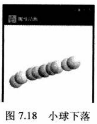
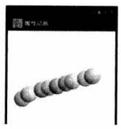

# 7.6 属性动画
---
* 前面介绍Android资源时已经提到了属性动画，从某种角度来看，属性动画是增强版的补间动画，属性动画的强大可以体现在如下方面。
 *  补间动画只能定义两个关键帧在“透明度”、“旋转”、“倾斜”、“位移”4个方面的变化，但属性动画可以定义任何属性的变化。
 *  补间动画只能对UI组件执行动画，但属性动画几乎可以对任何对象执行动画（不管它是否显示在屏幕上）。
* 与补间动画类似的是，属性动画也需要定义如下几个方面的属性。
 *  动画持续时间。该属性的默认值是300毫秒。在属性动画资源文件中通过android:duration属性指定。
 *  动画差值方式。该属性的作用与补间动画中插值属性的作用基本类似。在属性动画资源文件中通过android:interpolator属性指定。
 *  动画重复次数。指定动画重复播放的次数。在属性动画资源文件中通过android:repeatCount属性指定。
 *  重复行为。指定动画播放结束后、重复下次动画时，是从开始帧再次播放到结束帧，还是从结束帧反向播放到开始帧。在属性动画资源文件中通过android:repeatMode属性指定。
 *  动画集。开发者可以将多个属性动画合成一组，既可以让这组属性动画按次序播放，也可以让这组属性动画同时播放。在属性动画资源文件中通过<set..../>元素来组合，该元素的android:ordering属性指定该组动画是按次序播放，还是同时播放。
 *  帧刷新频率。指定每隔多长时间播放一帧。该属性默认值为10毫秒。

## 7.6.1 属性动画的API
* 属性动画共涉及如下API。
 *  Animator：它提供了创建属性动画的基类，基本上不会直接地使用该类。通常该类只用于被继承并重写它的相关方法。
 *  ValueAnimator：属性动画主要的时间引擎，它负责计算各个帧的属性值。它定义了属性动画的绝大部分核心功能，包括计算各帧的相关属性值，负责处理更新事件，按属性值的类型控制计算规则。属性动画主要由两方面组成：1.计算各帧的相关属性值；2.为指定对象设置这些计算后的值。ValueAnimator只负责第一方面的内容，因此程序员必须根据ValueAnimator计算并监听值更新来更新对象的相关属性值。
 *  ObjectAnimator：它是ValueAnimator子类，允许程序员对指定对象的属性执行动画。实际应用中，ObjectAnimator使用起来更加简单，因此更加常用。在少数场景下，由于ObjectAnimator存在一些限制，可能需要考虑使用ValueAnimator。
 *  AnimatorSet：它是Animator的子类，用于组合多个Animator，并制定多个Animator是按次序播放，还是同时播放。

* 除此之外，属性动画还需要利用一个Evaluator（计算器），该工具控制属性动画如何计算属性值。Android提供了如下Evaluator。
 *  IntEvaluator：用于计算int类型属性值的计算器。
 *  FloatEvaluator：用于计算float类型属性值的计算器。
 *  ArgbEvaluator：用于计算以十六进制形式表示的颜色值的计算器。
 *  TypeEvaluator：它是计算器接口，开发者可以通过实现该接口来实现自定义计算器。如果需要对int，float或者颜色值以外类型的属性执行属性动画，可能需要实现TypeEvaluator接口来实现定义计算器。

### 1. 使用ValueAnimator创建动画
* 使用ValueAnimator动画可按如下4个步骤。
 *  调用ValueAnimator的ofInt()、ofFloat()或ofObject()静态方法创建ValueAnimator实例。
 *  调用ValueAnimator的setXxx()设置动画持续时间、插值方式、重复次数等。
 *  调用ValueAnimator的start()方法启动动画。
 *  为ValueAnimator注册AnimatorUpdateListener监听器，在该监听器中可以监听ValueAnimator计算出来的值的改变，并将这些值应用到指定对象。
* 例如如下代码片段：
```

ValueAnimator animation = ValueAnimator.ofFloat(0f, 1f);
animation.setDuration(1000);
animation.start();

```

* 上面的例子实现了1000ms内，值从0～1的变化。
* 除此之外，开发者也可以提供一个自定义的Evaluator计算器，例如如下代码：

```

ValueAnimator animation = ValueAnimator.ofObject(new MyTypeEvaluator(), startVal, endVal)
aniamtion.setDuration(1000);
animation.start();

```

* 上面的代码片段中，ValueAnimator仅仅是计算动画过程中变化的值，并没有把这些计算出来的值应用到任何对象上，因此也不会显示任何动画。
* 如果希望使用ValueAnimator创建动画，还需要注册一个监听器：AnimatorUpdateListener，该监听器负责更新对象的属性值。在实现这个监听器的时候，可以通过getAnimatedValue()的方法来获取当前帧的值，并将该计算出来的值应用到指定对象上。当该对象的属性持续改变时，该对象也就呈现出动画效果。

### 2. 使用ObjectAnimator创建动画
* ObjectAnimator继承了ValueAnimator，因此它可以直接将ValueAnimator在动画过程中计算出来的值应用到指定属性上（ValueAnimator则需要注册一个监听器来完成这个工作）。因此使用ObjectAnimator就不需要注册AnimatorUpadateListener监听器。
* 使用ObjectAnimator的ofInt()、ofFloat()或ofObject()静态方法创建ObjectAnimator时，需要指定具体的对象，以及对象的属性名。例如如下代码片段：

```
ObjectAnimator anim = ObjectAnimator.ofFloat(foo, "alpha", 0f, 1f);
anim.setDuration(1000);
anim.start();
```

* 与ValueAnimator不同的是，使用ObjectAnimator有如下几个注意点。
 *  要为该对象对应的属性提供setter方法，如上例中需要为foo对象提供setAlpha(float value)方法。
 *  如果调用ObjectAnimator的ofInt()、ofFloat()或ofObject()工厂方法时values...参数只提供了一个值（本来要提供开始值和结束值），那么该值会被认为是结束值。那么该对象应该为该属性提供一个getter方法，该getter方法的返回值将被作为开始值。
 *  如果动画的对象是View，为了能显示动画效果，可能还需要在onAnimationUpdate()事件监听方法中调用View.invalidate()方法来刷新屏幕的显示，比如对Drawable对象的color属性执行动画。但View定义的setter方法，如setAlpha()和setTranslationX()等方法，都会自动地调用invalidate()方法，因此不需要额外地调用invalidate()方法。


## 7.6.2 使用属性动画

* 属性动画既可作用于UI组件，也可作用于普通的对象（即使它没有在UI界面上绘制出来）。
* 定义属性动画有如下两种方式。 
 *  使用ValueAnimator或ObjectAnimator的静态工厂方法来创建动画。
 *  使用资源文件来定义动画。
* 使用属性动画的步骤如下：
 * 1. 创建ValueAnimator或ObjectAnimator对象——既可从XML资源文件加载该动画资源，也可直接调用ValueAnimator或ObjectAnimator的静态工厂方法来创建动画。
 * 2. 根据需要为Animator对象设置属性。
 * 3. 如果需要监听Animator的动画开始事件、动画结束事件、动画重复事件、动画值改变事件，并根据事件提供响应处理代码，应该为Aniamtor对象设置事件监听器。
 * 4. 如果有多个动画需要按次序或同时播放，应使用AnimatorSet组合这些动画。
 * 5. 调用Animator对象的start()方法启动动画。
* 下面的实例示范了如何利用属性动画来控制“小球”掉落动画，该实例会监听用户在屏幕上的“触屏”时间，程序会在屏幕的触摸点绘志一个小球，并用动画控制该小球向下掉落。
* 该实例的界面布局文件非常简单，界面布局文件中只有一个LinearLayout，因此此处不在给出界面布局文件。下面是该实例的Acivity代码。

```

public class AnimatorTest extends Activity
{
  // 定义小球的大小的常量
  static final float BALL_SIZE = 50f;
  // 定义小球从屏幕上方下落到屏幕底端的总时间
  static final float FULL_SIZE = 1000;
  @Override
  public void onCreate(Bundle savedInstaceState)
  {
    super.onCreate(savedInstanceState);
    setContentView(R.layout.main);
    LinearLayout container = (LinearLayout)findViewById(R.id.contaner);
    // 设置该窗口显示MyAnimationView组件
    container.addView(new MyAnimationView(this));
  }
  public class MyAnimationView extends View implements AnimatorUpdateListener
  {
    public final ArrayList<ShapeHolder> balls = new ArrayList<ShapeHolder>();
    public MyAnimationView(Context context)
    {
      super(context);
      setBackgroundColor(Color.WHITE);
    }
    @Override
    public boolean onTouchEvent(MotionEvent event)
    {
      // 如果触碰事件不是按下、移动事件
      if (event.getAction() != MotionEvent.ACTION_DOWN && event.getAction() != MotionEvent.ACTION_MOVE)
      {
        return false;
      }
      // 在事件发生点添加一个小球(用一个圆形代替)
      ShapeHolder newBall = addBall(event.getX(), event.getY());
      // 计算小球下落动画开始时的y坐标
      float startY = newBall.getY();
      // 计算小球下落动画结束时的y坐标(落到屏幕最下方,就是屏幕高度减去小球高度)
      float endY = getHeight() - BALL_SIZE;
      // 获取屏幕高度
      float height = getHeight();
      // 触摸点的y坐标
      float eventY = event.getY();
      // 计算动画的持续时间
      int duration = (int) (FULL_TIME * ((height - eventY) / height));
      // 定义小球"落下"的动画:让newBall对象的y属性从事件发生点变化到屏幕最下方
      ValueAnimator fallAnim = ObjectAnimator.ofFloat(newBall, "y",
          startY, endY);
      // 设置fallAnim动画的持续时间
      fallAnim.setDuration(duration);
      // 设置fallAnim动画的插值方式:加速插值
      fallAnim.setInterpolator(new AccelerateInterpolator());
      // 为fallAnim动画添加监听器
      // 当ValueAnimator的属性值发生改变时,将会激发该监听器的事件监听方法
      fallAnim.addUpdateListener(this);
      // 定义对newBall对象的alpha属性执行从1到0的动画(即定义渐隐动画)
      ObjectAnimator fadeAnim = ObjectAnimator.ofFloat(newBall, "alpha",
          1f, 0f);
      // 设置动画持续时间
      fadeAnim.setDuration(250);
      // 为fadeAnim动画添加监听器
      fadeAnim.addListener(new AnimatorListener() {
        // 动画结束时
        @Override
        public void onAnimationEnd(Animator animation) {
          // 动画结束时,将该动画关联的ShapeHolder删除
          balls.remove(((ObjectAnimator) animation).getTarget());
        }

        @Override
        public void onAnimationCancel(Animator animation) {
        }

        @Override
        public void onAnimationStart(Animator animation) {
        }

        @Override
        public void onAnimationRepeat(Animator animation) {
        }
      });
      // 为fadeAnim动画添加监听器
      // 当ValueAnimator的属性值发生改变时,将会激发该监听器的事件监听方法
      fadeAnim.addUpdateListener(this);
      // 定义一个AnimatorSet来组合动画
      AnimatorSet animatorSet = new AnimatorSet();
      // 指定在播放fadeAnim动画之前,先播放bouncer动画
      animatorSet.play(fallAnim).before(fadeAnim);
      // 开始播放动画
      animatorSet.start();
      return true;
    }

    private ShapeHolder addBall(float x, float y) {
      // 创建一个圆
      OvalShape ovalShape = new OvalShape();
      // 设置该椭圆的宽高
      ovalShape.resize(BALL_SIZE, BALL_SIZE);
      // 将圆包装成Drawable对象

      ShapeDrawable drawable = new ShapeDrawable(ovalShape);
      // 建立一个ShapeHolder对象
      ShapeHolder holder = new ShapeHolder(drawable);
      // 设置ShapeHolder的x,y坐标
      holder.setX(x);
      holder.setY(y);

      int red = (int) (Math.random() * 255);
      int green = (int) (Math.random() * 255);
      int blue = (int) (Math.random() * 255);
      // 将red, green, blue三个随机数合成ARGB颜色
      int colors = 0xff000000 + red << 16 | green << 8 | blue;
      // 获取drawable上关联的画笔
      Paint paint = drawable.getPaint();
      // 将red, green, blue三个随机数除以4得到商值组合成ARGB颜色
      int darkColors = 0xff000000 | red / 4 << 16 | green / 4 << 8 | blue
          / 4;
      // 创建圆形渐变
      RadialGradient gradient = new RadialGradient(37.5f, 12.5f,
          BALL_SIZE, colors, darkColors, Shader.TileMode.CLAMP);
      paint.setShader(gradient);
      // 为ShapeHolder设置Paint画笔
      holder.setPaint(paint);
      balls.add(holder);
      return holder;
    }

    @Override
    protected void onDraw(Canvas canvas) {
      super.onDraw(canvas);
      // 遍历balls集合中的每个ShapeHolder元素
      for (ShapeHolder holder : balls) {
        // 保存canvas当前坐标系统
        canvas.save();
        // 坐标变换:将画布坐标系统平移到shapeHolder的X,Y坐标处
        canvas.translate(holder.getX(), holder.getY());
        // 将holder持有的圆形绘制到canvas上
        holder.getShapeDrawable().draw(canvas);
        // 恢复Canvas坐标系统
        canvas.restore();
      }
    }

    @Override
    public void onAnimationUpdate(ValueAnimator animation) {
      // 指定重绘该界面
      this.invalidate();
    }

  }
  
}

```

* 这里说明一下计算颜色值的代码:
```
int colors = 0xff000000 + red << 16 | green << 8 | blue;
```
* 解释如下:
 *  0xff000000: 代表了透明度为ff,也就是完全不透明.
 *  red: 代表了一个0~255(00~ff)的随机整数,但这个整数要添加0xff000000中加粗的两个"位"上,也就是要将red的值左移(16位,对应为十六进制数的4位),这就是red<<16的原因.
 *  green: 代表了一个0~255(00~ff)的随机整数,但这个整数要添加0xff000000中加粗的两个"位"上,也就是要将green的值左移(8位,对应为十六进制数的2位),这就是green<<8的原因.
 *  blue:代表了一个0~255(00~ff)的随机整数,但这个整数要添加0xff000000中加粗的两个"位"上,因此blue值就不需要位移了.
* 将red, green, blue 位移后的结果加起来就得到了实际的颜色值,但为了更好地计算性能,本代码直接使用按位或(|)来累加这些值.
* 运行该程序，用户在屏幕上拖动手指时可以看到如图7.18所示小球下落的动画。


### 实例：大珠小珠落玉盘
* 下面的例子是对上一个例子的改进,主要是为小球增加了几个动画,控制小球锣刀底端时小球被压扁,小球会再次弹起,这样就可以开发出"大珠小珠落玉盘"的弹起动画.

```
public class MainActivity extends Activity {
  /** 定义小球的大小的常量 */
  private static final float BALL_SIZE = 50F;
  /** 定义小球从屏幕上放下落到屏幕底端的时间 */
  private static final float FULL_TIME = 1000;

  @Override
  protected void onCreate(Bundle savedInstanceState) {
    super.onCreate(savedInstanceState);
    setContentView(R.layout.activity_main);
    LinearLayout container = (LinearLayout) findViewById(R.id.linear_layout);
    // 设置该窗口显示MyAnimationView组件
    container.addView(new MyAnimationView(this));
  }

  public class MyAnimationView extends View implements AnimatorUpdateListener {
    /** 圆球的数据集 */
    public final ArrayList<ShapeHolder> balls = new ArrayList<ShapeHolder>();

    public MyAnimationView(Context context) {
      this(context, null);
    }

    public MyAnimationView(Context context, AttributeSet attrs) {
      this(context, attrs, 0);
    }

    public MyAnimationView(Context context, AttributeSet attrs,
        int defStyleAttr) {
      super(context, attrs, defStyleAttr);
      setBackgroundColor(Color.WHITE);
      
    }

    @Override
    public boolean onTouchEvent(MotionEvent event) {
      // 如果触碰事件不是按下,移动事件
      if (event.getAction() != MotionEvent.ACTION_DOWN
          && event.getAction() != MotionEvent.ACTION_MOVE) {
        return false;
      }
      // 在事件发生点添加一个小球(用一个圆形代替)
      ShapeHolder newBall = addBall(event.getX(), event.getY());
      // 计算小球下落动画开始时的y坐标
      float startY = newBall.getY();
      // 计算小球下落动画结束时的y坐标(落到屏幕最下方,就是屏幕高度减去小球高度)
      float endY = getHeight() - BALL_SIZE;
      // 获取屏幕高度
      float height = getHeight();
      // 触摸点的y坐标
      float eventY = event.getY();
      // 计算动画的持续时间
      int duration = (int) (FULL_TIME * ((height - eventY) / height));
      // 定义小球"落下"的动画:让newBall对象的y属性从事件发生点变化到屏幕最下方
      ValueAnimator fallAnim = ObjectAnimator.ofFloat(newBall, "y",
          startY, endY);
      // 设置fallAnim动画的持续时间
      fallAnim.setDuration(duration);
      // 设置fallAnim动画的插值方式:加速插值
      fallAnim.setInterpolator(new AccelerateInterpolator());
      // 为fallAnim动画添加监听器
      // 当ValueAnimator的属性值发生改变时,将会激发该监听器的事件监听方法
      fallAnim.addUpdateListener(this);
      //-------------------
      //定义小球"压扁"的动画:该动画控制小球的X坐标"向左移"半个球
      ValueAnimator squashAnim1 = ObjectAnimator.ofFloat(newBall, "x", newBall.getX(), newBall.getX() - BALL_SIZE / 2);
      //设置squashAnim1动画的持续时间
      squashAnim1.setDuration(duration / 4);
      //设置squashAnim1动画的重复次数
      squashAnim1.setRepeatCount(1);
      //设置squashAnim1动画的重复方式
      squashAnim1.setRepeatMode(ValueAnimator.REVERSE);
      //设置squashAnim1动画的插值方式:减速插值
      squashAnim1.setInterpolator(new DecelerateInterpolator());
      // 当ValueAnimator的属性值发生改变时,将会激发该监听器的事件监听方法
      squashAnim1.addUpdateListener(this);
      //定义小球"压扁"的动画:该动画控制小球的宽度加倍
      ValueAnimator squashAnim2 = ObjectAnimator.ofFloat(newBall, "width", newBall.getWidth(), newBall.getWidth() + BALL_SIZE);
      //设置squashAnim2动画的持续时间
      squashAnim2.setDuration(duration / 4);
      //设置squashAnim2动画的重复次数
      squashAnim2.setRepeatCount(1);
      //设置squashAnim2动画的重复方式
      squashAnim2.setRepeatMode(ValueAnimator.REVERSE);
      //设置squashAnim2动画的插值方式:减速插值
      squashAnim2.setInterpolator(new DecelerateInterpolator());
      // 当ValueAnimator的属性值发生改变时,将会激发该监听器的事件监听方法
      squashAnim2.addUpdateListener(this);
      //定义小球"拉伸"的动画:该动画控制小球的Y坐标"向下移"半个球
      ObjectAnimator stretchAnim1 = ObjectAnimator.ofFloat(newBall, "y", endY, endY + BALL_SIZE / 2);
      //设置stretchAnim1动画的持续时间
      stretchAnim1.setDuration(duration / 4);
      //设置stretchAnim1动画的重复次数
      stretchAnim1.setRepeatCount(1);
      //设置stretchAnim1动画的重复方式
      stretchAnim1.setRepeatMode(ValueAnimator.REVERSE);
      //设置stretchAnim1动画的插值方式:减速插值
      stretchAnim1.setInterpolator(new DecelerateInterpolator());
      // 当ObjectAnimator的属性值发生改变时,将会激发该监听器的事件监听方法
      stretchAnim1.addUpdateListener(this);
      //定义小球"拉伸"的动画:该动画控制小球的高度减半
      ValueAnimator stretchAnim2 = ObjectAnimator.ofFloat(newBall, "height", newBall.getHeight(), newBall.getHeight() - BALL_SIZE / 2);
      //设置stretchAnim2动画的持续时间
      stretchAnim2.setDuration(duration / 4);
      //设置stretchAnim2动画的重复次数
      stretchAnim2.setRepeatCount(1);
      //设置stretchAnim2动画的重复方式
      stretchAnim2.setRepeatMode(ValueAnimator.REVERSE);
      //设置stretchAnim2动画的插值方式:减速插值
      stretchAnim2.setInterpolator(new DecelerateInterpolator());
      // 当ValueAnimator的属性值发生改变时,将会激发该监听器的事件监听方法
      stretchAnim2.addUpdateListener(this);
      //定义小球"弹起"的动画
      ObjectAnimator bounceBackAnim = ObjectAnimator.ofFloat(newBall, "y", endY, startY);
      //设置bounceBackAnim动画持续时间
      bounceBackAnim.setDuration(duration);
      //设置bounceBackAnim动画的插值方式:减速插值
      bounceBackAnim.setInterpolator(new DecelerateInterpolator());
      // 当ObjectAnimator的属性值发生改变时,将会激发该监听器的事件监听方法
      bounceBackAnim.addUpdateListener(this);
      //使用AnimatorSet按顺序播放"掉落/压扁&拉伸/弹起动画"
      AnimatorSet bouncer = new AnimatorSet();
      //定义在squashAnim1动画之前播放fallAnim下落动画
      bouncer.play(fallAnim).before(squashAnim1);
      //由于小球在"屏幕"下方弹起时,小球要被压扁
      //即:宽度加倍.X坐标左移半个球的距离;高度减半,Y坐标下移半个球的距离
      //因此此处指定播放squashAnim1动画的同时
      bouncer.play(squashAnim1).with(squashAnim2);
      bouncer.play(squashAnim1).with(stretchAnim1);
      bouncer.play(squashAnim1).with(stretchAnim2);
      //还播放stretchAnim2动画之后,播放bounceBackAnim弹起动画
      bouncer.play(bounceBackAnim).after(stretchAnim2);
      //-----------------------------
      // 定义对newBall对象的alpha属性执行从1到0的动画(即定义渐隐动画)
      ObjectAnimator fadeAnim = ObjectAnimator.ofFloat(newBall, "alpha",
          1f, 0f);
      // 设置动画持续时间
      fadeAnim.setDuration(250);
      // 为fadeAnim动画添加监听器
      fadeAnim.addListener(new AnimatorListener() {
        // 动画结束时
        @Override
        public void onAnimationEnd(Animator animation) {
          // 动画结束时,将该动画关联的ShapeHolder删除
          balls.remove(((ObjectAnimator) animation).getTarget());
        }

        @Override
        public void onAnimationCancel(Animator animation) {
        }

        @Override
        public void onAnimationStart(Animator animation) {
        }

        @Override
        public void onAnimationRepeat(Animator animation) {
        }
      });
      // 为fadeAnim动画添加监听器
      // 当ValueAnimator的属性值发生改变时,将会激发该监听器的事件监听方法
      fadeAnim.addUpdateListener(this);
      // 再次定义一个AnimatorSet来组合动画
      AnimatorSet animatorSet = new AnimatorSet();
      // 指定在播放fadeAnim动画之前,先播放bouncer动画
      animatorSet.play(bouncer).before(fadeAnim);
      // 开始播放动画
      animatorSet.start();
      return true;
    }

    private ShapeHolder addBall(float x, float y) {
      // 创建一个圆
      OvalShape ovalShape = new OvalShape();
      // 设置该椭圆的宽高
      ovalShape.resize(BALL_SIZE, BALL_SIZE);
      // 将圆包装成Drawable对象
      ShapeDrawable drawable = new ShapeDrawable(ovalShape);
      // 建立一个ShapeHolder对象
      ShapeHolder holder = new ShapeHolder(drawable);
      // 设置ShapeHolder的x,y坐标
      holder.setX(x);
      holder.setY(y);

      int red = (int) (Math.random() * 255);
      int green = (int) (Math.random() * 255);
      int blue = (int) (Math.random() * 255);
      // 将red, green, blue三个随机数合成ARGB颜色
      int colors = 0xff000000 + red << 16 | green << 8 | blue;
      // 获取drawable上关联的画笔
      Paint paint = drawable.getPaint();
      // 将red, green, blue三个随机数除以4得到商值组合成ARGB颜色
      int darkColors = 0xff000000 | red / 4 << 16 | green / 4 << 8 | blue
          / 4;
      // 创建圆形渐变
      RadialGradient gradient = new RadialGradient(37.5f, 12.5f,
          BALL_SIZE, colors, darkColors, Shader.TileMode.CLAMP);
      paint.setShader(gradient);
      // 为ShapeHolder设置Paint画笔
      holder.setPaint(paint);
      balls.add(holder);
      return holder;
    }

    @Override
    protected void onDraw(Canvas canvas) {
      super.onDraw(canvas);
      // 遍历balls集合中的每个ShapeHolder元素
      for (ShapeHolder holder : balls) {
        // 保存canvas当前坐标系统
        canvas.save();
        // 坐标变换:将画布坐标系统平移到shapeHolder的X,Y坐标处
        canvas.translate(holder.getX(), holder.getY());
        // 将holder持有的圆形绘制到canvas上
        holder.getShapeDrawable().draw(canvas);
        // 恢复Canvas坐标系统
        canvas.restore();
      }
    }

    @Override
    public void onAnimationUpdate(ValueAnimator animation) {
      // 指定重绘该界面
      this.invalidate();
    }

  }
}
```

* 该实例的ShapeHolder需要对width、height增加动画，因此该ShapeHolder需要增加对width、height的setter和getter方法。下面是该实例中ShapeHolder的代码。
```
public class ShapeHolder {
  // X坐标
  private float x = 0;
  // Y坐标
  private float y = 0;
  // 组件宽度
  private float width = 0;
  // 组件高度
  private float height = 0;

  private ShapeDrawable shapeDrawable;
  // 色值
  private int color;
  private RadialGradient radialGradient;
  // 透明度
  private float alpha = 1f;
  // 画笔
  private Paint paint;

  public ShapeHolder(ShapeDrawable shapeDrawable) {
    this.shapeDrawable = shapeDrawable;
  }

  public float getX() {
    return x;
  }

  public void setX(float x) {
    this.x = x;
  }

  public float getY() {
    return y;
  }

  public void setY(float y) {
    this.y = y;
  }

  public float getWidth() {
    return width;
  }

  public void setWidth(float width) {
    this.width = width;
  }

  public float getHeight() {
    return height;
  }

  public void setHeight(float height) {
    this.height = height;
  }

  public ShapeDrawable getShapeDrawable() {
    return shapeDrawable;
  }

  public void setShapeDrawable(ShapeDrawable shapeDrawable) {
    this.shapeDrawable = shapeDrawable;
  }

}
```
* 运行该实例，可以看到小球在底端压扁并弹起的动画，如图7.19所示。



