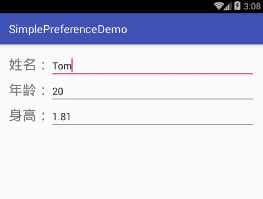
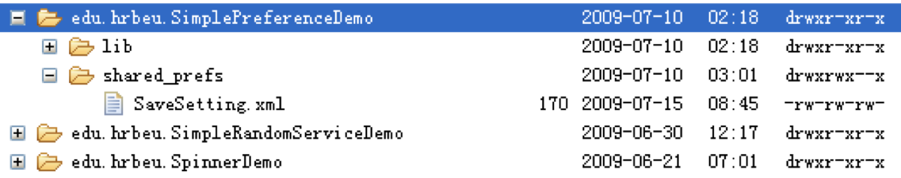

# 8.1使用SharedPreferences
---
* 有些时候，应用程序有少量的数据需要保存，而且这些数据的格式很简单，都是普通的字符串、标量类型的值等，比如应用程序的各种配置信息（如是否打开音效、是否使用振动效果等）、小游戏的玩家积分等，对于这种数据，Android提供了Sharedpreferences进行保存。

**8.1.1 SharedPreferences 与 Editor 简介**

SharedPreferences是一种轻量级的数据保存方式，通过SharedPreferences可以将NVP（Name/ValuePair，名称/值对）保存在Android的文件系统中，而且SharedPreferences完全屏蔽了对文件系统的操作过程。开发人员仅是通过调用SharedPreferences对NVP进行保存和读取。

> * boolean contains(String key):判断SharedPreferences是否包含特定key的数据。
> * abtract Map`<String,?>`getAll(): 获取SharedPreferences是否包含特定key的数据。
> * boolean getXxx(String key,xxx defValue): 获取SharedPreferences数据里指定key对应的value。

SharedPreferences不仅能够保存数据，还能够实现不同应用程序间的数据共享。SharedPreferences支持三种访问模式:

> * 私有（MODE_PRIVATE）：仅有创建程序有权限对其进行读取或写入
> * 全局读（MODE_WORLD_READABLE）：不仅创建程序可以对其进行读取或写入，其他应用程序也读取操作的权限，但没有写入操作的权限
> * 全局写（MODE_WORLD_WRITEABLE）：创建程序和其他程序都可以对其进行读写操作

定义SharedPreferences的名称，这个名称与在Android文件系统中保存的文件同名。因此，只要具有相同的SharedPreferences名称的NVP内容，都会保存在同一个文件中。
```java
public static final String PREFERENCE_NAME = "SaveSetting";
```
为了可以使用SharedPreferences，需要将访问模式和SharedPreferences名称作为参数，传递到getSharedPreferences()函数，并获取到SharedPreferences对象
```java
SharedPreferences sharedPreferences = getSharedPreferences(PREFERENCE_NAME, MODE);
```
SharedPreferences接口本身没有提供写入数据的能力，所以在获取到SharedPreferences对象后，则可以通过SharedPreferences.Editor类对SharedPreferences进行修改，最后调用commit()函数保存修改内容。
SharedPreferences广泛支持各种基本数据类型，包括整型、布尔型、浮点型和长型等等。
```java
SharedPreferences.Editor editor = sharedPreferences.edit();
editor.putString("Name", "Tom");
editor.putInt("Age", 20);
editor.putFloat("Height", );
editor.commit();
```
如果需要从已经保存的SharedPreferences中读取数据，同样是调用getSharedPreferences()函数，并在函数的第1个参数中指明需要访问的SharedPreferences名称，最后通过get<Type>()函数获取保存在SharedPreferences中的NVP。
```java
SharedPreferences sharedPreferences = getSharedPreferences(PREFERENCE_NAME, MODE);
String name = sharedPreferences.getString("Name","Default Name");
int age = sharedPreferences.getInt("Age", 20);
float height = sharedPreferences.getFloat("Height",);
```
get<Type>()函数的第1个参数是NVP的名称，第2个参数是在无法获取到数值的时候使用的缺省值。

**8.1.2 示例**
通过SimplePreferenceDemo示例介绍具体说明SharedPreferences的文件保存位置和保存格式。

下图是SimplePreferenceDemo示例的用户界面，用户在界面上的输入的信息，将通过SharedPreferences在Activity关闭时进行保存。当应用程序重新开启时，保存在SharedPreferences的信息将被读取出来，并重新呈现在用户界面上。



SimplePreferenceDemo示例运行后，通过FileExplorer查看/data/data下的数据，Android为每个应用程序建立了与包同名的目录，用来保存应用程序产生的数据，这些数据包括文件、SharedPreferences文件和数据库等。SharedPreferences文件就保存在/data/data/<package name>/shared_prefs目录下。

在本示例中，shared_prefs目录下生成了一个名为SaveSetting.xml的文件:


SaveSetting.xml文件是以XML格式保存的信息，内容如图如下:
```xml
<?xml version='1.0' encoding='utf-8' standalone='yes' ?>
<map>
	<float name="Height" value="1.81" />
	<string name="Name">Tom</string>
	<int name="Age" value="20" />
</map>
```

SimplePreferenceDemo示例在onStart()函数中调用loadSharedPreferences()函数，读取保存在SharedPreferences中的姓名、年龄和身高信息，并显示在用户界面上。
当Activity关闭时，在onStop()函数调用saveSharedPreferences()，保存界面上的信息。
SimplePreferenceDemo.java的完整代码：
```java
package edu.zju.SimplePreferenceDemo;
 
import android.app.Activity;
import android.content.Context;
import android.content.SharedPreferences;
import android.os.Bundle;
import android.widget.EditText;
public class SimplePreferenceDemo extends Activity {
	
	private EditText nameText;
	private EditText ageText;
	private EditText heightText;
	public static final String PREFERENCE_NAME = "SaveSetting";
	public static int MODE = Context.MODE_WORLD_READABLE + Context.MODE_WORLD_WRITEABLE;
	
	@Override
	public void onCreate(Bundle savedInstanceState) {
		super.onCreate(savedInstanceState);
		setContentView(R.layout.main);
		nameText = (EditText)findViewById(R.id.name);
		ageText = (EditText)findViewById(R.id.age);
		heightText = (EditText)findViewById(R.id.height);
	}

          @Override
	public void onStart(){
		super.onStart();
		loadSharedPreferences();
	}
	@Override
	public void onStop(){
		super.onStop();	
		saveSharedPreferences();
	}
    
	private void loadSharedPreferences(){
	  SharedPreferences sharedPreferences = getSharedPreferences(PREFERENCE_NAME, MODE);
		String name = sharedPreferences.getString("Name","Tom");
		int age = sharedPreferences.getInt("Age", 20);
		float height = sharedPreferences.getFloat("Height",);
                             nameText.setText(name);
		ageText.setText(String.valueOf(age));
		heightText.setText(String.valueOf(height));    	
	}
    
    private void saveSharedPreferences(){
	SharedPreferences sharedPreferences = getSharedPreferences(PREFERENCE_NAME, MODE);
		SharedPreferences.Editor editor = sharedPreferences.edit();
		    
		editor.putString("Name", nameText.getText().toString());
		editor.putInt("Age", Integer.parseInt(ageText.getText().toString()));
		editor.putFloat("Height", Float.parseFloat(heightText.getText().toString()));
		editor.commit();
	}
}

```

下面给出SharePreferenceDemo示例的核心代码:
```java
public static final String PREFERENCE_PACKAGE = "edu.zju.SimplePreferenceDemo";
public static final String PREFERENCE_NAME = "SaveSetting";
public static int MODE = Context.MODE_WORLD_READABLE + Context.MODE_WORLD_WRITEABLE;
 
public void onCreate(Bundle savedInstanceState) {
	Context c = null;
	try {
	c = this.createPackageContext(PREFERENCE_PACKAGE, Context.CONTEXT_IGNORE_SECURITY);
	} catch (NameNotFoundException e) {
		e.printStackTrace();
	}
	SharedPreferences sharedPreferences = c.getSharedPreferences(PREFERENCE_NAME, MODE);
           String name = sharedPreferences.getString("Name","Tom");
	int age = sharedPreferences.getInt("Age", 20);
	float height = sharedPreferences.getFloat("Height",);
  }

```
> * 第8行代码调用了createPackageContext()获取到了SimplePreferenceDemo示例的Context
> * 第8行代码第1个参数是SimplePreferenceDemo的包名称，在代码第1行进行了定义
> * 第2个参数Context.CONTEXT_IGNORE_SECURIT表示忽略所有可能产生的安全问题。这段代码可能引发异常，因此必须防止在try/catch中
> * 在代码第12行，通过Context得到了SimplePreferenceDemo示例的SharedPreferences对象，同样在getSharedPreferences()函数中，需要将正确的SharedPreferences名称传递给函数

__访问其他应用程序的SharedPreferences必须满足三个条件:__
1.共享者需要将SharedPreferences的访问模式设置为全局读或全局写
2.访问者需要知道共享者的包名称和SharedPreferences的名称，以通过Context获得SharedPreferences对象
3.访问者需要确切知道每个数据的名称和数据类型，用以正确读取数据


