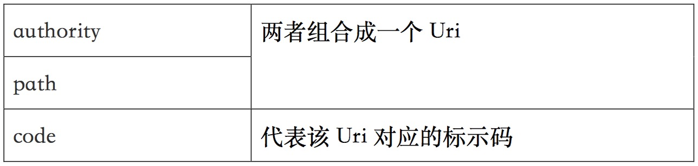

#实现ContentProvider
##创建ContentProvider的步骤

* 定义一个ContentProvider的子类，该子类需要实现增、删、改、查等方法。
* 在AndroidManifest.xml文件中注册该ContentProvider。

注册ContentProvider时需要为它绑定一个URL：
向Android系统中注册ContentProvider只要在<application.../>元素下添加如下子元素：

```
<providerandroid:name=“.DictProvider”android:authorities=“org.lxj.provider.dictprovider”/>
```

//其中name属性指定ContentProvider类，authorities就相当于为该ContentProvider指定域名。
开发ContentProvider所实现的方法都需要一个Uri参数，该参数决定了对哪个Uri执行数据操作。
Android提供UriMacher工具类，Uri工具类主要提供如下两个方法：

```
void addURI(String anthority, String path, int code)
```

用于向UriMatcjer对象注册Uri
其中的参数说明：

代表该Uri对应的标示码
int match(Uri uri)
根据前面注册的Uri来判定Uri对应的表示码，找不到匹配的表示码，返回-1。


